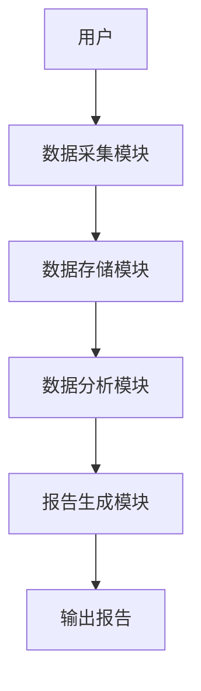

                 


# 彼得林奇的实地调研技巧

## 关键词：彼得林奇，实地调研，投资技巧，财务分析，行业分析，管理层评估

## 摘要：本文深入分析了彼得·林奇的实地调研技巧，探讨了其核心概念、方法框架、系统架构及实际应用。文章从背景介绍、核心要素、算法原理、数学模型、系统分析、项目实战等多维度展开，详细阐述了彼得林奇如何通过系统性调研做出明智投资决策，并提供了丰富的案例和代码示例。

---

## 第一部分: 背景介绍

### 第1章: 实地调研的基本概念

#### 1.1 实地调研的定义与特点
实地调研是一种通过亲临现场收集数据和信息的方法，具有直观性、深度性和动态性等特点。它不同于传统的数据分析，更注重实际观察和与相关人员的互动。

#### 1.2 彼得林奇的背景与调研方法
彼得·林奇是著名的基金经理，以其对企业实地调研的重视而闻名。他的调研方法结合了定量分析和定性判断，尤其注重与企业管理层的直接沟通。

#### 1.3 彼得林奇调研方法的独特性
彼得林奇的调研方法独特之处在于其系统性、全面性和深度性。他不仅关注财务数据，还注重企业环境、竞争态势和管理层素质。

---

### 第2章: 彼得林奇调研技巧的核心要素

#### 2.1 企业基本面分析
企业基本面分析包括对企业财务状况、盈利能力和发展潜力的全面评估。

##### 2.1.1 财务状况分析
重点分析企业的资产负债表、利润表和现金流量表，关注关键财务指标如ROE（净资产收益率）和毛利率。

##### 2.1.2 盈利能力分析
通过分析净利润、毛利率和ROE等指标，评估企业的盈利能力及其可持续性。

##### 2.1.3 发展潜力分析
研究企业的市场占有率、产品创新能力和行业地位，判断企业的成长潜力。

#### 2.2 行业分析与竞争环境
行业分析包括对行业发展趋势、竞争格局和市场容量的研究，帮助企业更好地把握市场机会。

##### 2.2.1 行业现状与趋势
分析行业当前的市场规模、增长速度和未来趋势，判断行业的周期性特征。

##### 2.2.2 企业竞争优势分析
评估企业在行业中的竞争优势，如成本优势、技术优势和品牌优势。

##### 2.2.3 行业风险与机会
识别行业中的潜在风险和机会，为企业制定战略提供依据。

#### 2.3 管理层评估
管理层评估是彼得林奇调研方法的重要组成部分，重点关注管理层的素质、决策能力和诚信度。

##### 2.3.1 管理层背景与经验
了解管理层的教育背景、工作经验和行业认知，判断其专业能力。

##### 2.3.2 管理层的战略规划与执行力
评估管理层制定的战略是否合理，以及其执行能力是否到位。

##### 2.3.3 管理层与股东的利益一致性
考察管理层的激励机制和利益与股东的契合度，确保管理层行为与股东利益一致。

---

### 第3章: 彼得林奇调研方法的系统性框架

#### 3.1 调研前的准备工作
##### 3.1.1 调研目标与计划制定
明确调研目标，制定详细的调研计划，包括调研时间、地点和人员安排。

##### 3.1.2 资料收集与初步分析
收集企业的财务报表、行业报告和竞争对手信息，进行初步的数据分析。

##### 3.1.3 调研工具与方法选择
选择适合的调研工具，如问卷调查、实地考察和访谈，确保数据收集的有效性。

#### 3.2 调研过程中的关键步骤
##### 3.2.1 现场考察与数据收集
亲临企业现场，观察企业的生产流程、库存管理和员工状况，获取一手数据。

##### 3.2.2 与管理层的深度访谈
与企业管理层进行深入交流，了解企业的经营状况、战略规划和未来发展方向。

##### 3.2.3 与行业专家的交流
咨询行业专家，获取行业动态和市场趋势，丰富调研信息。

#### 3.3 调研后的分析与决策
##### 3.3.1 数据整理与分析
整理收集到的数据，进行深入分析，识别关键问题和机会。

##### 3.3.2 调研结果的综合评估
综合分析财务数据、行业信息和管理层访谈结果，评估企业的投资价值。

##### 3.3.3 投资决策的制定与调整
根据调研结果，制定投资策略，并根据市场变化和企业动态及时调整。

---

## 第二部分: 核心概念与联系

### 第4章: 调研要素的核心原理

#### 4.1 企业分析的核心要素
企业分析的核心要素包括财务状况、盈利能力和发展潜力，这些要素共同决定了企业的投资价值。

##### 4.1.1 财务数据的核心指标
- **ROE（净资产收益率）**：公式为 $ROE = \frac{\text{净利润}}{\text{股东权益}}$，反映了企业的盈利能力。
- **毛利率**：公式为 $毛利率 = \frac{\text{营业收入} - \text{营业成本}}{\text{营业收入}}$，衡量企业的定价策略和成本控制能力。

##### 4.1.2 企业成长性与盈利能力
成长性分析包括对企业收入增长率和净利润增长率的评估，盈利能力分析则关注企业的利润率和ROE。

##### 4.1.3 企业竞争优势与护城河
竞争优势包括成本优势、技术优势和品牌优势，护城河则体现在专利、市场准入壁垒和客户忠诚度等方面。

#### 4.2 管理层评估的关键维度
##### 4.2.1 管理层的背景与经验
- 教育背景：如是否具备相关专业学位。
- 工作经验：是否有丰富的行业经验。
- 行业认知：是否深入了解行业动态。

##### 4.2.2 管理层的战略规划与执行力
- 战略规划：是否制定了明确的短期和长期目标。
- 执行能力：管理层是否能够有效执行战略计划。

##### 4.2.3 管理层的诚信与道德
- 诚信度：管理层是否遵守职业道德，是否存在财务造假等行为。
- 利益一致性：管理层的激励机制是否与股东利益一致。

---

## 第三部分: 算法原理

### 第5章: 算法原理与代码实现

#### 5.1 财务指标分析算法
##### 5.1.1 净利润计算
净利润 = 收入 - 成本 - 费用

##### 5.1.2 毛利率计算
毛利率 = (收入 - 成本) / 收入

##### 5.1.3 ROE计算
ROE = 净利润 / 股东权益

#### 5.2 代码实现
```python
import pandas as pd

# 假设财务数据存储在dataframe中
data = pd.read_csv('financial_data.csv')

# 计算ROE
roe = data['净利润'] / data['股东权益']
data['ROE'] = roe

# 计算毛利率
data['毛利率'] = (data['营业收入'] - data['营业成本']) / data['营业收入']

# 打印结果
print(data[['ROE', '毛利率']].head())
```

---

## 第四部分: 数学模型

### 第6章: 数学模型与公式

#### 6.1 ROE计算公式
$$ROE = \frac{\text{净利润}}{\text{股东权益}}$$

#### 6.2 毛利率计算公式
$$毛利率 = \frac{\text{营业收入} - \text{营业成本}}{\text{营业收入}}$$

---

## 第五部分: 系统分析与架构设计

### 第7章: 系统分析与架构设计

#### 7.1 问题场景介绍
本文构建一个基于彼得林奇调研方法的企业分析系统，旨在通过系统化的方法对企业进行全方位评估。

#### 7.2 系统功能设计
##### 7.2.1 数据采集模块
- 收集企业的财务数据、行业报告和管理层访谈记录。
- 数据格式：CSV格式。

##### 7.2.2 数据分析模块
- 计算关键财务指标如ROE和毛利率。
- 生成分析报告。

##### 7.2.3 报告生成模块
- 输出企业评估报告，包括财务分析、行业分析和管理层评估。

#### 7.3 系统架构设计


---

## 第六部分: 项目实战

### 第8章: 项目实战与案例分析

#### 8.1 环境安装
- 安装Python和Pandas库。

#### 8.2 核心实现代码
```python
import pandas as pd

# 读取数据
data = pd.read_csv('financial_data.csv')

# 计算ROE和毛利率
data['ROE'] = data['净利润'] / data['股东权益']
data['毛利率'] = (data['营业收入'] - data['营业成本']) / data['营业收入']

# 可视化结果
import matplotlib.pyplot as plt

data[['ROE', '毛利率']].plot(kind='bar')
plt.show()
```

#### 8.3 案例分析
以某制造企业为例，分析其财务状况、行业地位和管理层素质，评估其投资价值。

---

## 第七部分: 总结与展望

### 第9章: 总结与展望

#### 9.1 最佳实践 tips
- 在进行实地调研前，做好充分的准备工作。
- 与企业管理层保持深入沟通，了解企业的实际情况。
- 结合定量分析和定性判断，全面评估企业的投资价值。

#### 9.2 小结
彼得林奇的实地调研技巧为我们提供了一套系统性的投资分析方法，通过对企业基本面、行业环境和管理层的全面评估，帮助投资者做出明智的投资决策。

#### 9.3 注意事项
- 数据来源的可靠性是关键，需确保数据的准确性和完整性。
- 在与企业管理层沟通时，需保持客观和中立，避免受到管理层的影响。

#### 9.4 拓展阅读
推荐阅读彼得·林奇的《投资最重要的事情》和《彼得·林奇的投资 secrets》。

---

通过本文的详细分析，读者可以全面了解彼得林奇的实地调研技巧，并将其应用于实际投资分析中。

