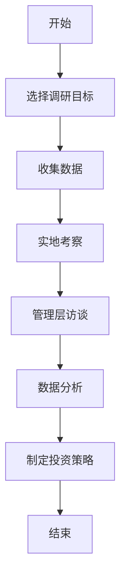
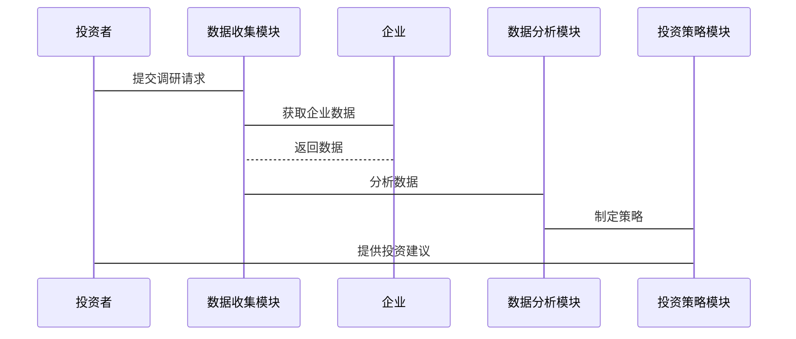

                 


# 彼得林奇的"实地调研"投资方法

## 关键词：彼得林奇，实地调研，投资方法，价值投资，投资策略

## 摘要：  
本文系统地阐述了彼得林奇的实地调研投资方法，从其核心理念到具体实施步骤，再到实际案例分析，全面解析了这一方法的精髓。通过结合技术分析和实地调研，本文深入探讨了如何通过这一方法实现精准的投资决策，并提供了丰富的实战经验和最佳实践。

---

## 第一章：投资理念与实地调研的背景

### 1.1 彼得林奇的投资理念  
彼得林奇作为全球最著名的基金经理之一，他的投资理念以“价值投资”为核心，强调通过深入研究和实地调研来发现被市场低估的优质企业。  
#### 1.1.1 价值投资的定义与核心思想  
价值投资是一种以低于公平价格买入优质资产的投资策略。其核心思想在于寻找市场中被低估的投资标的，并长期持有，等待其价值回归。  
$$\text{价值投资的核心公式：投资价值} = \text{内在价值} - \text{市场价格}$$  

#### 1.1.2 彼得林奇的投资风格与成功案例  
彼得林奇以其独特的投资风格闻名，他善于通过实地调研发现企业的潜在价值。他的成功案例包括对麦当劳、喜诗糖果等公司的投资，这些公司在他的管理下实现了超额收益。  

#### 1.1.3 实地调研在投资中的重要性  
实地调研是彼得林奇投资方法的核心，它帮助投资者更全面地了解企业的经营状况、管理层能力和行业地位。  

### 1.2 实地调研的定义与特点  
#### 1.2.1 实地调研的定义  
实地调研是指投资者通过亲临企业现场，与管理层、员工以及客户进行交流，结合财务数据和行业趋势，对企业进行深入分析的过程。  

#### 1.2.2 实地调研的核心特点  
- **全面性**：覆盖企业从管理层到生产一线的各个层面。  
- **真实性**：通过面对面交流获取第一手信息。  
- **动态性**：能够及时发现企业的变化和潜在风险。  

#### 1.2.3 实地调研与传统投资分析的区别  
传统投资分析主要依赖于财务报表和市场数据，而实地调研则更注重对企业经营环境和管理层能力的考察。  

### 1.3 实地调研的投资背景  
#### 1.3.1 当前投资环境的复杂性  
随着市场的日益复杂化，仅依赖财务数据和市场信息的投资方法难以应对不确定性。实地调研成为弥补这一缺陷的重要手段。  

#### 1.3.2 实地调研在信息不对称中的作用  
在信息不对称的市场中，实地调研能够帮助投资者获取更多有价值的信息，从而降低投资风险。  

#### 1.3.3 投资者行为与市场波动的关系  
投资者的行为往往受到市场情绪的影响，而实地调研能够帮助投资者保持理性，避免盲目跟风。  

---

## 第二章：实地调研的核心方法与步骤

### 2.1 实地调研的核心方法  
#### 2.1.1 宏观分析与微观分析的结合  
- **宏观分析**：关注行业趋势、经济周期和政策环境。  
- **微观分析**：关注企业的财务状况、管理能力和竞争优势。  

#### 2.1.2 定性分析与定量分析的平衡  
- **定性分析**：通过访谈和观察评估企业文化和管理层能力。  
- **定量分析**：通过财务数据和行业指标量化企业价值。  

#### 2.1.3 行业分析与公司分析的结合  
- **行业分析**：了解行业的竞争格局和发展趋势。  
- **公司分析**：评估公司在行业中的地位和竞争优势。  

### 2.2 实地调研的具体步骤  
#### 2.2.1 确定调研目标与范围  
- **目标确定**：明确调研的目的和范围，例如评估某公司的财务健康状况。  
- **范围确定**：确定调研的地理范围和时间范围。  

#### 2.2.2 收集与整理基础数据  
- **数据收集**：通过公开报告、行业报告和新闻媒体获取初步信息。  
- **数据整理**：对收集到的数据进行分类整理，为实地调研做准备。  

#### 2.2.3 实地考察与管理层访谈  
- **实地考察**：亲临企业现场，观察企业的生产流程和管理状况。  
- **管理层访谈**：与公司高管、财务负责人和销售人员进行深入交流，获取关键信息。  

#### 2.2.4 数据分析与投资决策  
- **数据分析**：结合实地调研获取的数据，评估企业的投资价值。  
- **投资决策**：根据分析结果制定投资策略，例如买入、卖出或持有。  

---

## 第三章：实地调研的关键要素与工具

### 3.1 实地调研的关键要素  
#### 3.1.1 公司基本面分析  
- **财务状况**：关注收入、利润和现金流等关键指标。  
- **管理能力**：评估管理层的决策能力和企业战略。  

#### 3.1.2 行业趋势分析  
- **行业周期**：分析行业所处的周期阶段（增长期、成熟期、衰退期）。  
- **竞争格局**：评估行业内的主要竞争者及其市场份额。  

#### 3.1.3 竞争环境分析  
- **竞争优势**：分析企业的核心竞争力，例如技术优势、成本优势等。  
- **潜在风险**：识别行业中的潜在风险，例如政策变化或技术革新。  

#### 3.1.4 财务状况评估  
- **财务报表分析**：通过利润表、资产负债表和现金流量表评估企业的财务健康状况。  
- **财务比率分析**：计算关键财务比率，例如ROE（净资产收益率）和毛利率。  

### 3.2 实地调研的工具与方法  
#### 3.2.1 财务报表分析工具  
- **利润表分析**：评估企业的盈利能力。  
- **资产负债表分析**：评估企业的资产结构和负债情况。  

#### 3.2.2 行业数据分析工具  
- **行业报告**：通过行业报告获取行业趋势和市场数据。  
- **市场调研工具**：例如问卷调查和焦点小组讨论。  

#### 3.2.3 竞争对手分析工具  
- **SWOT分析**：评估企业在行业中的优势和劣势。  
- **市场份额分析**：通过市场份额数据评估企业的市场地位。  

#### 3.2.4 管理层评估工具  
- **管理层访谈**：通过与管理层的交流评估其能力和战略。  
- **管理风格分析**：评估企业的管理风格是否稳健或激进。  

---

## 第四章：实地调研的流程与实施策略

### 4.1 实地调研的流程  
#### 4.1.1 确定调研目标  
- **目标确定**：明确调研的目的，例如评估某公司的投资价值。  
- **范围确定**：确定调研的时间和地理范围。  

#### 4.1.2 制定调研计划  
- **时间安排**：制定详细的调研时间表，包括实地考察和访谈安排。  
- **资源分配**：分配调研所需的资源，例如人员、资金和设备。  

#### 4.1.3 实施调研活动  
- **实地考察**：亲临企业现场，观察企业的生产流程和管理状况。  
- **访谈安排**：与公司高管、财务负责人和销售人员进行深入交流。  

#### 4.1.4 分析调研结果  
- **数据整理**：对收集到的数据进行分类整理，形成初步分析结果。  
- **结果评估**：结合定量和定性分析，评估企业的投资价值。  

#### 4.1.5 制定投资策略  
- **策略制定**：根据分析结果制定买入、卖出或持有的投资策略。  
- **风险控制**：评估投资风险，制定相应的风险管理措施。  

### 4.2 实地调研的实施策略  
#### 4.2.1 信息收集的多样性与准确性  
- **信息来源多样化**：通过多种渠道收集信息，例如公开报告、行业报告和实地考察。  
- **信息验证**：通过交叉验证确保信息的准确性。  

#### 4.2.2 数据分析的深度与广度  
- **深度分析**：对关键数据进行深入分析，例如财务数据和管理层访谈记录。  
- **广度分析**：覆盖企业的各个层面，例如生产、销售和管理。  

#### 4.2.3 投资决策的科学性与灵活性  
- **科学决策**：基于实地调研结果制定投资策略，避免主观臆断。  
- **灵活调整**：根据市场变化和企业动态及时调整投资策略。  

---

## 第五章：实地调研的算法与数学模型

### 5.1 实地调研的算法原理  
实地调研是一种基于经验和观察的投资方法，其核心在于通过实地考察和访谈获取信息，结合定量分析和定性分析做出投资决策。  
#### 5.1.1 决策树分析  
决策树是一种常用的分析工具，可以帮助投资者在不同情况下做出最优决策。  

**决策树流程图（Mermaid）：**  


#### 5.1.2 数学模型的应用  
- **ROE计算公式**：$$\text{ROE} = \frac{\text{净利润}}{\text{净资产}}$$  
- **毛利率计算公式**：$$\text{毛利率} = \frac{\text{营业收入} - \text{营业成本}}{\text{营业收入}}$$  

### 5.2 实地调研的数学模型实现  
#### 5.2.1 代码实现  
以下代码用于计算企业的ROE和毛利率：  
```python  
def calculate_roe(net_profit, equity):  
    return net_profit / equity  

def calculate_gross_margin(revenue, cost_of_goods_sold):  
    return (revenue - cost_of_goods_sold) / revenue  

# 示例数据  
net_profit = 100  
equity = 500  
revenue = 1000  
cost_of_goods_sold = 600  

# 计算ROE和毛利率  
roe = calculate_roe(net_profit, equity)  
gross_margin = calculate_gross_margin(revenue, cost_of_goods_sold)  

print(f"ROE: {roe:.2f}")  
print(f"毛利率: {gross_margin:.2f}")  
```  

#### 5.2.2 模型结果分析  
通过上述代码，我们可以计算企业的ROE和毛利率，从而评估其财务健康状况。例如，假设某企业ROE为15%，毛利率为30%，这表明其具有较强的盈利能力。  

---

## 第六章：实地调研的系统分析与架构设计

### 6.1 系统分析  
#### 6.1.1 问题场景介绍  
投资者需要通过实地调研系统获取企业的相关信息，以便做出投资决策。  

#### 6.1.2 项目介绍  
本系统旨在通过整合实地调研数据和定量分析工具，帮助投资者实现高效的投资决策。  

### 6.2 系统功能设计  
#### 6.2.1 领域模型（Mermaid 类图）：  


#### 6.2.2 系统架构设计（Mermaid 架构图）：  


#### 6.2.3 系统接口设计  
- **数据接口**：与企业财务系统对接，获取实时数据。  
- **用户接口**：为投资者提供直观的分析结果和投资建议。  

#### 6.2.4 系统交互（Mermaid 序列图）：  


---

## 第七章：实地调研的项目实战

### 7.1 项目环境安装  
#### 7.1.1 系统环境  
- 操作系统：Windows/Mac/Linux  
- 开发工具：Python、Jupyter Notebook、Mermaid

