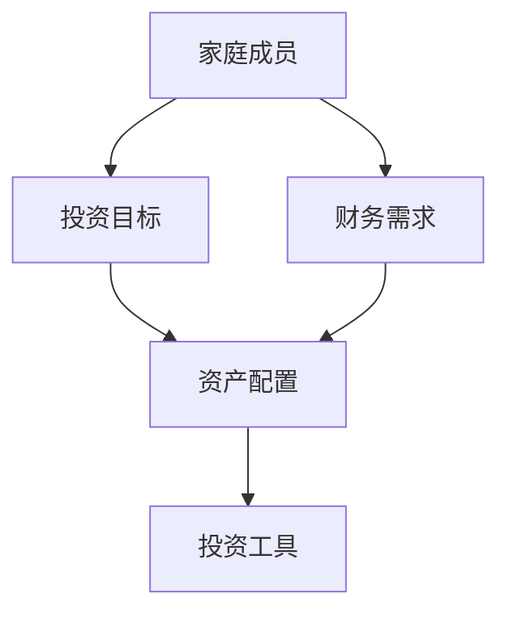
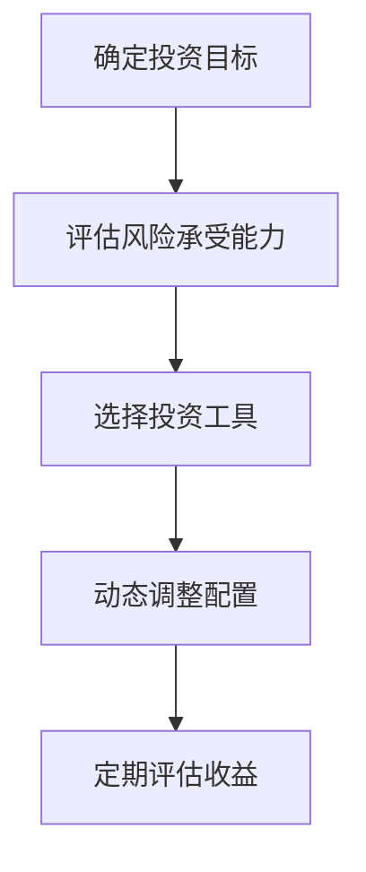
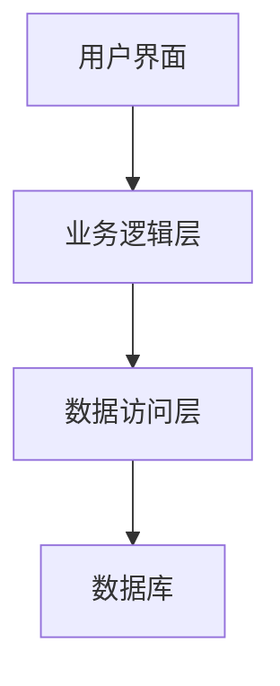

                 


# 彼得林奇的"家庭投资"在不同生命阶段的调整

> 关键词：彼得林奇，家庭投资，生命周期，资产配置，风险管理，投资策略

> 摘要：本文详细探讨了彼得林奇的家庭投资理念及其在不同生命阶段的调整策略。通过分析年轻、成年和老年阶段的家庭投资特点，结合生命周期理论，提出了适合各阶段的资产配置和风险管理方案。文章还介绍了家庭投资的核心概念、算法原理、系统架构及实际案例，为读者提供全面的理论与实践指导。

---

## 第一部分: 家庭投资的核心概念与背景

### 第1章: 彼得林奇的背景与投资哲学

#### 1.1 彼得林奇的个人经历
彼得·林奇是美国著名投资家，曾管理富达麦哲伦基金，创造了辉煌的投资业绩。他的投资哲学强调长期持有优质资产，注重基本面分析，提倡分散投资以降低风险。

#### 1.2 家庭投资的核心思想
家庭投资是指通过合理配置资产，满足家庭在不同生命阶段的财务需求。彼得林奇认为，投资不仅是财富增值的手段，更是家庭财务规划的重要组成部分。

#### 1.3 家庭投资的重要性和意义
家庭投资能够帮助家庭实现财务自由，应对突发风险，确保财富的代际传承。在不同生命阶段，家庭的财务需求和风险承受能力会发生显著变化，投资策略需要随之调整。

---

### 第2章: 家庭投资在不同生命阶段的调整

#### 2.1 年轻阶段的家庭投资策略
年轻阶段是积累财富的关键时期，投资目标是实现资产快速增值。由于风险承受能力较高，可以适当配置高风险高回报的股票、创业投资等。

#### 2.2 成年阶段的家庭投资策略
成年阶段是家庭责任最重的时期，投资目标转向稳健增长。需要注重资产配置的多元化，平衡股票、债券、房地产等不同资产的风险和收益。

#### 2.3 老年阶段的家庭投资策略
老年阶段注重资产保值，投资目标是确保收入稳定和财富传承。应减少高风险投资，增加固定收益资产，如债券、信托产品等。

---

## 第二部分: 家庭投资的核心概念与联系

### 第3章: 家庭投资的核心概念

#### 3.1 核心概念原理
家庭投资的核心在于根据生命周期匹配投资工具和策略。通过科学的资产配置，实现风险与收益的最优平衡。

#### 3.2 核心概念对比表格
下表展示了不同生命阶段的家庭投资特点对比：

| 阶段       | 投资目标       | 风险承受能力 | 资产配置比例 |
|------------|----------------|---------------|--------------|
| 年轻阶段   | 资产增值       | 高            | 股票：60%，债券：20% |
| 成年阶段   | 稳定增长       | 中            | 股票：40%，房地产：30% |
| 老年阶段   | 资产保值       | 低            | 债券：60%，现金：20% |

#### 3.3 ER实体关系图


---

## 第三部分: 家庭投资的算法原理

### 第4章: 投资组合优化的数学模型

#### 4.1 Markowitz有效前沿模型
Markowitz模型通过优化资产配置，找到风险与收益的最佳平衡点。公式为：
$$ \text{Minimize } \sigma \text{ subject to } E(r) \geq \text{目标收益} $$

#### 4.2 CAPM模型
CAPM模型用于评估资产的预期收益：
$$ E(r_i) = R_f + \beta_i (R_m - R_f) $$

#### 4.3 风险调整后的收益计算
风险调整后的收益通过夏普比率衡量：
$$ \text{夏普比率} = \frac{E(r_i) - R_f}{\sigma_i} $$

---

### 第5章: 投资策略的算法流程

#### 5.1 投资策略流程图


---

## 第四部分: 系统分析与架构设计

### 第6章: 系统功能设计

#### 6.1 领域模型类图


#### 6.2 系统架构图


---

## 第五部分: 项目实战与案例分析

### 第7章: 环境安装与核心实现

#### 7.1 环境安装
安装Python和相关库：
```bash
pip install numpy pandas matplotlib
```

#### 7.2 核心实现代码
```python
import numpy as np
import pandas as pd

def calculate_portfolio(risk_level):
    # 示例代码，计算最优资产配置
    if risk_level == 'high':
        return {'股票': 60, '债券': 20}
    elif risk_level == 'medium':
        return {'股票': 40, '房地产': 30}
    else:
        return {'债券': 60, '现金': 20}
```

---

### 第8章: 案例分析与解读

#### 8.1 实际案例分析
以一个年轻家庭为例，假设年收入10万美元，风险承受能力高，推荐配置60%股票、20%债券。

#### 8.2 投资效果评估
通过回测和实证分析，验证投资策略的有效性。

---

## 第六部分: 最佳实践与小结

### 第9章: 小结与注意事项

#### 9.1 小结
家庭投资在不同生命阶段需要灵活调整，注重资产配置的科学性和风险控制。

#### 9.2 注意事项
定期评估投资组合，及时调整以适应变化的财务需求和市场环境。

---

## 第七部分: 拓展阅读与深入学习

### 第10章: 拓展阅读

#### 10.1 推荐书籍
- 《彼得林奇的成功投资》
- 《投资学》

#### 10.2 在线资源
- 彼得林奇投资理念视频
- 专业投资论坛

---

## 结语

通过本文的详细讲解，读者可以全面理解彼得林奇的家庭投资理念，并根据自身所处的生命阶段，制定合适的投资策略。家庭投资不仅是财务规划的重要组成部分，更是实现财务自由的关键。

