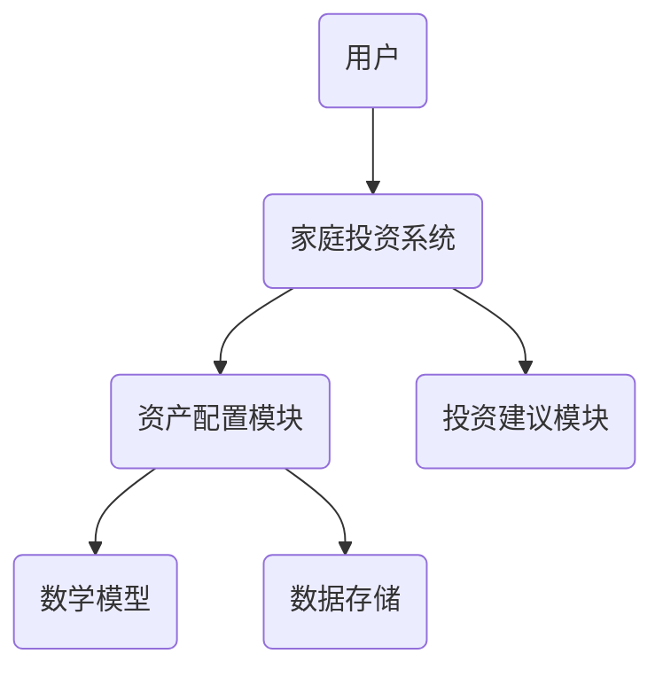

                 


# 彼得林奇的"家庭投资"在不同经济周期的资产配置

## 关键词：家庭投资、彼得林奇、经济周期、资产配置、投资策略

## 摘要

本文深入分析了彼得林奇的家庭投资理念及其在不同经济周期下的资产配置策略。通过结合现代投资组合理论和实际案例，探讨了如何在不同经济环境下优化资产配置，以实现长期稳定的收益。

---

# 第1章 彼得林奇与家庭投资简介

## 1.1 彼得林奇的生平与投资理念

### 1.1.1 彼得林奇的生平简介

彼得·林奇（Peter Lynch）是美国著名投资家，曾任富达投资集团麦哲伦基金的经理。他以长期投资和价值投资的理念闻名，强调分散投资和长期持有优质资产。

### 1.1.2 彼得林奇的投资哲学

彼得林奇的核心投资理念包括：
1. **长期投资**：避免频繁交易，长期持有优质资产。
2. **分散投资**：通过分散投资降低风险，避免将所有资金投入单一资产。
3. **价值投资**：寻找被市场低估的优质股票，长期持有。

### 1.1.3 彼得林奇与家庭投资的关联

彼得林奇的家庭投资理念强调普通投资者也可以通过合理配置资产实现财富增值。他主张家庭投资应注重分散性和长期性，避免盲目跟风。

---

## 1.2 家庭投资的基本概念

### 1.2.1 家庭投资的定义

家庭投资是指个人或家庭通过配置不同类型的资产（如股票、债券、房地产等）来实现财富增值和风险分散的过程。

### 1.2.2 家庭投资的核心要素

1. **投资目标**：明确投资目的，如资产保值、增值或追求高收益。
2. **风险承受能力**：根据家庭的财务状况和风险偏好确定投资策略。
3. **资产配置**：合理分配不同类型资产的比例，以优化收益和风险。

### 1.2.3 家庭投资的目标与风险

- **目标**：实现资产保值增值，提高生活质量。
- **风险**：市场波动、经济周期变化、政策风险等。

---

# 第2章 不同经济周期的资产配置策略

## 2.1 经济周期的基本类型

### 2.1.1 经济周期的定义

经济周期是指经济活动的波动，通常分为四个阶段：扩张期、衰退期、萧条期和复苏期。

### 2.1.2 扩张期的资产配置

- **特征**：经济增长快，通货膨胀率上升。
- **策略**：增加股票和房地产配置，减少债券比例。

### 2.1.3 衰退期的资产配置

- **特征**：经济增长放缓，失业率上升。
- **策略**：增加债券和现金比例，减少股票配置。

### 2.1.4 稳定期的资产配置

- **特征**：经济稳定，通货膨胀率低。
- **策略**：均衡配置股票、债券和现金。

---

## 2.2 经济周期对资产配置的影响

### 2.2.1 经济周期与资产价格的关系

- **扩张期**：股票和房地产价格上涨。
- **衰退期**：债券和现金更安全。

### 2.2.2 不同经济周期下的资产表现

| 经济周期 | 股票表现 | 债券表现 | 现金表现 |
|----------|----------|----------|----------|
| 扩张期   | 上涨     | 下跌     | 稳定     |
| 衰退期   | 下跌     | 上涨     | 稳定     |
| 稳定期   | 平稳     | 平稳     | 稳定     |

### 2.2.3 经济周期对家庭投资策略的影响

- **扩张期**：高风险高回报，适合激进型投资者。
- **衰退期**：低风险低回报，适合保守型投资者。

---

# 第3章 彼得林奇的家庭投资策略

## 3.1 彼得林奇的家庭投资理念

### 3.1.1 长期投资的重要性

彼得林奇强调长期投资，认为短期波动不影响长期收益。

### 3.1.2 分散投资的风险

通过分散投资不同类型的资产，降低单一资产的风险。

### 3.1.3 价值投资的核心

寻找被市场低估的资产，长期持有，等待价值回归。

---

## 3.2 家庭投资的资产配置模型

### 3.2.1 资产配置的基本原则

- **分散性原则**：避免将所有资金投入单一资产。
- **长期性原则**：长期持有优质资产。
- **风险匹配原则**：根据风险承受能力调整资产比例。

### 3.2.2 不同资产类别的权重分配

| 资产类别 | 权重比例 |
|----------|----------|
| 股票     | 40%-60%  |
| 债券     | 20%-30%  |
| 现金     | 10%-20%  |
| 房地产   | 10%-20%  |

### 3.2.3 经济周期对资产配置的影响

- **扩张期**：增加股票和房地产权重。
- **衰退期**：增加债券和现金权重。

---

# 第4章 家庭投资的数学模型与算法

## 4.1 资产配置的数学模型

### 4.1.1 现代投资组合理论（MPT）

MPT由哈里·马科维茨提出，通过优化资产配置降低风险。

### 4.1.2 马科维茨的有效前沿模型

有效前沿是所有可能的投资组合中风险最低的组合。

### 4.1.3 资产配置的优化算法

- **均值-方差优化模型**：通过数学公式优化资产配置。

---

## 4.2 资产配置的算法实现

### 4.2.1 均值-方差优化模型

数学公式：

$$ \text{Minimize } \sigma^2 \text{ subject to } \mu \cdot w = \text{target return} $$

其中，\( \sigma^2 \) 为方差，\( \mu \) 为预期收益，\( w \) 为权重向量。

### 4.2.2 Python代码实现

```python
import numpy as np
import pandas as pd

# 假设我们有两组资产，股票和债券
assets = ['股票', '债券']
returns = [0.1, 0.05]
volatility = [0.2, 0.1]

# 计算协方差矩阵
cov_matrix = np.array([[0.04, 0.02],
                        [0.02, 0.01]])

# 使用numpy求解最优权重
def optimize_portfolio(returns, cov_matrix):
    n = len(returns)
    # 系数矩阵
    A = np.zeros((n, n))
    A[:, 0] = 1
    # 右侧向量
    b = np.array([1.0])
    # 约束条件：权重之和为1
    C = np.zeros(n)
    C[0] = 1
    d = np.array([0.0])
    
    # 求解
    res = np.linalg.lstsq(np.c_[np.ones(n), returns], np.ones(n), rcond=None)
    w = res[0]
    return w

weights = optimize_portfolio(returns, cov_matrix)
print("股票权重：", weights[1], "债券权重：", weights[0])
```

---

# 第5章 系统分析与架构设计方案

## 5.1 系统功能设计

### 5.1.1 领域模型


### 5.1.2 系统架构设计



---

## 5.2 系统交互设计

### 5.2.1 系统交互流程

```mermaid
sequenceDiagram
    participant 用户
    participant 家庭投资系统
    participant 资产配置模块
    participant 投资建议模块
    用户->家庭投资系统：输入风险偏好和资金规模
    家庭投资系统->资产配置模块：计算最优资产配置
    资产配置模块->家庭投资系统：返回资产配置结果
    家庭投资系统->投资建议模块：生成投资建议
    投资建议模块->用户：提供投资建议
```

---

# 第6章 项目实战

## 6.1 环境安装

### 6.1.1 Python环境安装

安装Python和必要的库：

```bash
pip install numpy pandas matplotlib
```

## 6.2 核心实现源代码

### 6.2.1 资产配置代码

```python
import numpy as np
import pandas as pd

def calculate_weights(returns, cov_matrix):
    # 使用数学优化方法计算权重
    n = len(returns)
    C = np.zeros(n)
    C[0] = 1
    A = np.c_[np.ones(n), returns]
    b = np.array([1.0])
    
    # 求解最小二乘问题
    res = np.linalg.lstsq(A, b, rcond=None)
    w = res[0]
    return w[1:]

# 示例数据
returns = [0.1, 0.05]
cov_matrix = np.array([[0.04, 0.02],
                        [0.02, 0.01]])

weights = calculate_weights(returns, cov_matrix)
print("股票权重：", weights[0], "债券权重：", weights[1])
```

---

## 6.3 案例分析

### 6.3.1 经济衰退期的资产配置

在经济衰退期，债券和现金应占较大比例。例如：

- 股票：20%
- 债券：50%
- 现金：30%

---

# 第7章 最佳实践

## 7.1 小结

彼得林奇的家庭投资理念强调长期、分散和价值投资。在不同经济周期下，合理的资产配置是实现财富稳定增长的关键。

## 7.2 注意事项

1. 定期调整资产配置。
2. 避免过度交易。
3. 根据自身风险承受能力制定策略。

## 7.3 拓展阅读

- 《彼得林奇的成功投资》
- 现代投资组合理论相关书籍

---

# 总结

通过本文的分析，读者可以深入了解彼得林奇的家庭投资理念，并学会在不同经济周期下优化资产配置，以实现长期稳定的财富增长。

