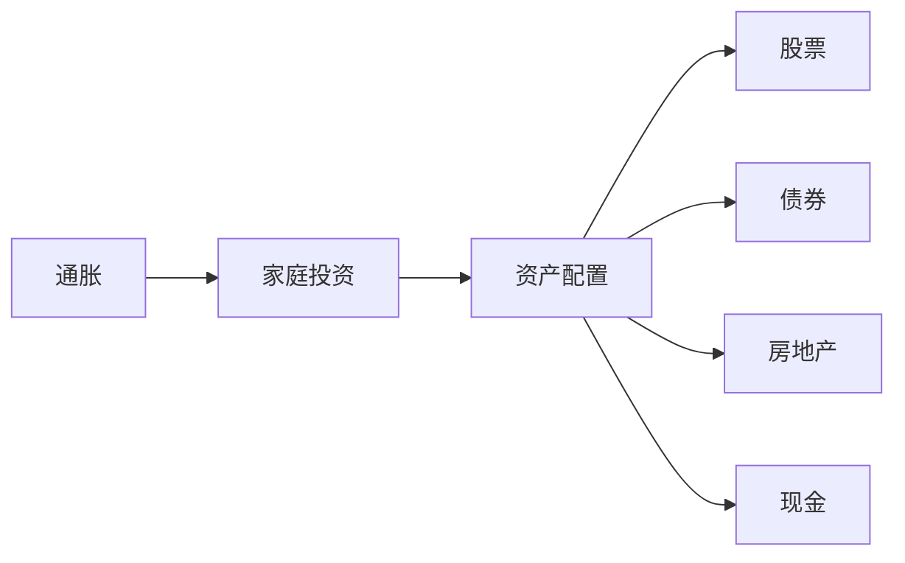

                 


# 彼得林奇的"家庭投资"在通胀加速期的资产配置策略

## 关键词：资产配置，通胀，家庭投资，彼得林奇，投资策略

## 摘要：本文深入分析了彼得林奇的家庭投资策略在通胀加速期的适用性，探讨了通胀对不同资产类别的影响，提出了基于现代投资组合理论的资产配置优化算法，并通过实际案例展示了如何通过系统架构设计和项目实现来应对通胀加速期的资产配置挑战。文章最后总结了最佳实践，为读者提供了实用的投资指导。

---

## 第一部分: 背景介绍

### 第1章: 通胀加速期的资产配置背景

#### 1.1 通胀的定义与特征
- **1.1.1 通货膨胀的定义**
  - 通货膨胀是指物价总水平在一段时间内持续上涨，货币购买力下降的经济现象。
  - 通胀率通常用消费者价格指数（CPI）或生产者价格指数（PPI）来衡量。

- **1.1.2 通胀对经济的影响**
  - 对个人消费的影响：实际购买力下降，生活成本增加。
  - 对企业的影响：生产成本上升，利润率可能下降。
  - 对金融市场的传导效应：债券收益率上升，股票估值可能受压。

- **1.1.3 通胀加速期的特征**
  - 通胀率显著高于长期平均水平。
  - 经济不确定性增加，市场波动性加剧。

#### 1.2 资产配置的核心概念
- **1.2.1 资产配置的定义**
  - 资产配置是指将资金分配到不同资产类别（如股票、债券、房地产等）以实现投资目标的过程。
  - 资产配置的目标通常是平衡风险与收益，追求长期价值最大化。

- **1.2.2 资产配置的目标**
  - 实现投资收益的最大化。
  - 控制风险，避免重大损失。
  - 适应不同的经济环境（如通胀加速期）。

- **1.2.3 资产配置的边界与外延**
  - 资产配置的边界：资金的分配比例和风险承受能力。
  - 资产配置的外延：动态调整策略，应对经济环境变化。

#### 1.3 彼得林奇的家庭投资策略
- **1.3.1 家庭投资的定义**
  - 家庭投资是指个人或家庭单位进行的财务投资，通常以保值增值为目标。
  - 家庭投资强调分散化和风险控制。

- **1.3.2 家庭投资的特点**
  - 投资目标：注重长期稳健收益。
  - 投资期限：通常较长，但可以根据市场环境调整。
  - 资金规模：相对较小，注重灵活性和易操作性。

- **1.3.3 家庭投资与传统投资的区别**
  - **投资目标**：家庭投资更注重保值和风险控制，而机构投资更注重收益最大化。
  - **资金规模**：家庭投资资金规模较小，灵活性高；机构投资资金规模大，流动性要求低。
  - **风险承受能力**：家庭投资风险承受能力有限，注重稳定性；机构投资风险承受能力强，可以承担更多波动。

#### 1.4 通胀加速期的家庭投资机会
- **1.4.1 通胀加速期的投资机会**
  - 债务类投资：通胀上升时，债务类资产（如债券）的收益率可能上升。
  - 实物资产：房地产、黄金等实物资产在通胀上升时通常表现较好。
  - 高收益股票：具备较强定价能力的企业在通胀上升时可能表现优异。

- **1.4.2 家庭投资在通胀加速期的潜力**
  - 通过分散化投资，平衡通胀带来的负面影响。
  - 通过长期持有优质资产，抵御通胀侵蚀。

- **1.4.3 家庭投资在通胀加速期的风险**
  - 资产贬值风险：通胀可能导致货币购买力下降，资产的实际价值可能缩水。
  - 市场波动风险：通胀加速期市场波动较大，可能导致投资损失。
  - 利率风险：通胀上升可能导致利率上升，影响债券等固定收益类资产的价格。

#### 1.5 本章小结
- 通胀加速期是家庭投资需要特别关注的时期。
- 家庭投资需要灵活调整资产配置策略，以应对通胀带来的挑战和机会。

---

## 第二部分: 核心概念与联系

### 第2章: 家庭投资与通胀的关系

#### 2.1 家庭投资的核心要素
- **2.1.1 资产类别**
  - 股票、债券、房地产、现金等。

- **2.1.2 投资目标**
  - 长期保值、稳定收益、风险可控。

- **2.1.3 风险承受能力**
  - 家庭投资通常风险承受能力有限，注重稳健投资。

#### 2.2 通胀对家庭投资的影响
- **2.2.1 通胀对股票的影响**
  - 物价上涨可能导致企业成本上升，影响盈利能力。
  - 但具备较强定价能力的企业可能通过提价来转嫁成本，从而保持盈利能力。

- **2.2.2 通胀对债券的影响**
  - 债券收益率可能上升，但债券价格通常会下跌。
  - 短期债券受通胀影响较小，长期债券波动较大。

- **2.2.3 通胀对房地产的影响**
  - 房地产通常被视为抗通胀资产，价格可能上涨。
  - 但高通胀可能导致按揭成本上升，影响购房能力。

#### 2.3 家庭投资与通胀的关系图



---

## 第三部分: 算法原理讲解

### 第3章: 资产配置的数学模型

#### 3.1 现代投资组合理论
- **3.1.1 均值-方差优化**
  - 通过优化投资组合的预期收益和风险，找到最优资产配置。
  - 数学公式：$$\text{Minimize } \sigma^2 \text{ subject to } \mu \geq \text{目标收益}$$

- **3.1.2 马科维茨的有效前沿**
  - 有效前沿是指在给定风险下，预期收益最高的投资组合的集合。

#### 3.2 资产配置的数学公式
- **3.2.1 投资组合的预期收益公式**
  - $$E(r_p) = \sum w_i E(r_i)$$
  - 其中，\(w_i\) 是资产 \(i\) 的权重，\(E(r_i)\) 是资产 \(i\) 的预期收益率。

- **3.2.2 投资组合的风险公式**
  - $$\sigma_p^2 = \sum w_i^2 \sigma_i^2 + 2 \sum_{i \neq j} w_i w_j \sigma_{ij}$$
  - 其中，\(\sigma_i^2\) 是资产 \(i\) 的方差，\(\sigma_{ij}\) 是资产 \(i\) 和 \(j\) 的协方差。

#### 3.3 算法实现
- **3.3.1 使用Python实现投资组合优化**
  ```python
  import numpy as np
  from scipy.optimize import minimize

  # 示例数据：资产的预期收益和协方差矩阵
  mu = np.array([0.1, 0.08, 0.12])
  sigma = np.array([[0.16, 0.05, 0.02],
                    [0.05, 0.06, 0.01],
                    [0.02, 0.01, 0.08]])

  # 定义优化函数
  def portfolio_optimization(weights):
      return np.dot(weights, mu)  # 最大化预期收益

  # 约束条件：权重之和为1，且权重非负
  constraints = ({'type': 'eq', 'fun': lambda w: sum(w) - 1},
                 {'type': 'ineq', 'fun': lambda w: w})

  # 使用SLSQP求解
  result = minimize(lambda w: -portfolio_optimization(w), 
                    np.array([1/3, 1/3, 1/3]), 
                    method='SLSQP', 
                    constraints=constraints)

  print("最优权重：", result.x)
  ```

- **3.3.2 使用Mermaid绘制算法流程图**
  ```mermaid
  graph LR
      A[开始] --> B[输入预期收益和协方差矩阵]
      B --> C[定义优化目标函数]
      C --> D[定义约束条件]
      D --> E[使用SLSQP求解]
      E --> F[输出最优权重]
      F --> G[结束]
  ```

---

## 第四部分: 系统分析与架构设计方案

### 第4章: 家庭投资系统的架构设计

#### 4.1 系统功能模块
- **4.1.1 数据收集模块**
  - 从金融市场获取实时数据，包括股票价格、债券收益率等。

- **4.1.2 数据分析模块**
  - 计算资产的预期收益和协方差矩阵。
  - 应用现代投资组合理论进行优化。

- **4.1.3 资产配置模块**
  - 根据优化结果生成资产配置建议。
  - 输出最优权重和预期收益。

#### 4.2 系统架构设计
- **4.2.1 系统功能设计**
  - **领域模型**：使用Mermaid类图展示系统功能模块之间的关系。
    ```mermaid
    classDiagram
        class 数据收集模块 {
            + 数据源：金融市场API
            + 方法：获取实时数据
        }
        class 数据分析模块 {
            + 方法：计算预期收益和协方差矩阵
        }
        class 资产配置模块 {
            + 方法：生成资产配置建议
        }
        数据收集模块 --> 数据分析模块
        数据分析模块 --> 资产配置模块
    ```

- **系统架构设计**：使用Mermaid架构图展示系统的整体结构。
  ```mermaid
  graph LR
      A[用户] --> B[数据收集模块]
      B --> C[数据分析模块]
      C --> D[资产配置模块]
      D --> A
  ```

- **系统接口设计**
  - 用户接口：通过命令行或图形界面输入参数。
  - 数据接口：与金融市场API对接，获取实时数据。

- **系统交互设计**：使用Mermaid序列图展示用户与系统的交互。
  ```mermaid
  sequenceDiagram
      participant 用户
      participant 系统
      用户 -> 系统: 输入参数
      系统 -> 用户: 返回优化结果
  ```

---

## 第五部分: 项目实战

### 第5章: 通胀加速期的资产配置实战

#### 5.1 环境安装
- 安装Python和必要的库：
  - `pip install numpy scipy matplotlib`

#### 5.2 核心代码实现
- **5.2.1 数据分析代码**
  ```python
  import numpy as np
  from scipy.optimize import minimize

  # 示例数据：资产的预期收益和协方差矩阵
  mu = np.array([0.1, 0.08, 0.12])
  sigma = np.array([[0.16, 0.05, 0.02],
                    [0.05, 0.06, 0.01],
                    [0.02, 0.01, 0.08]])

  # 定义优化函数
  def portfolio_optimization(weights):
      return np.dot(weights, mu)  # 最大化预期收益

  # 约束条件：权重之和为1，且权重非负
  constraints = ({'type': 'eq', 'fun': lambda w: sum(w) - 1},
                 {'type': 'ineq', 'fun': lambda w: w})

  # 使用SLSQP求解
  result = minimize(lambda w: -portfolio_optimization(w), 
                    np.array([1/3, 1/3, 1/3]), 
                    method='SLSQP', 
                    constraints=constraints)

  print("最优权重：", result.x)
  ```

- **5.2.2 可视化代码**
  ```python
  import matplotlib.pyplot as plt

  plt.scatter(weights, returns, label='投资组合')
  plt.xlabel('权重')
  plt.ylabel('预期收益')
  plt.legend()
  plt.show()
  ```

#### 5.3 实际案例分析
- **案例背景**
  - 假设通胀率上升，市场波动加剧。
  - 家庭投资目标：保值为主，适当追求收益。

- **案例分析**
  - 通过优化算法，得出最优资产配置建议。
  - 分析不同资产类别的表现，评估通胀对投资组合的影响。

#### 5.4 总结
- 通过实战分析，验证算法的有效性。
- 总结通胀加速期的资产配置策略。

---

## 第六部分: 最佳实践

### 第6章: 家庭投资的最佳实践

#### 6.1 小结
- 通胀加速期需要灵活调整资产配置策略。
- 现代投资组合理论为家庭投资提供了科学的指导。

#### 6.2 注意事项
- 资产配置需要根据家庭的实际情况进行调整。
- 定期评估和优化投资组合，以适应市场变化。

#### 6.3 扩展阅读
- 推荐阅读彼得林奇的《彼得林奇的成功投资》。
- 参考现代投资组合理论的相关文献。

---

通过以上结构和内容的详细分析，本文为读者提供了从理论到实践的完整指导，帮助读者在通胀加速期实现稳健的家庭投资。

