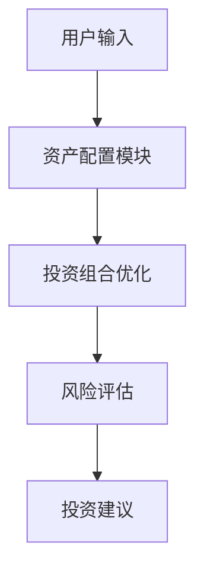

                 


# 彼得林奇的"家庭投资组合"在不同人生阶段的调整

## 关键词：彼得林奇，投资组合，家庭理财，资产配置，投资策略

## 摘要：本文深入分析了彼得林奇的家庭投资组合理念，探讨了在不同人生阶段如何调整投资策略以实现财富最大化。通过数学建模和系统设计，详细讲解了投资组合优化的原理和实现方法，并结合实际案例进行分析。文章最后总结了投资组合管理的最佳实践和注意事项。

---

# {{此处是文章标题}}

> 关键词：{{此处列出文章的5-7个核心关键词}}

> 摘要：{{此处给出文章的核心内容和主题思想}}

                 

---

# 彼得林奇的"家庭投资组合"在不同人生阶段的调整

---

## 第一章：引言

### 1.1 彼得林奇与家庭投资组合概述

彼得·林奇是美国著名的基金经理，以其长期投资和价值投资的理念闻名。他的投资策略强调长期持有优质资产，避免频繁交易。在家庭理财中，林奇提倡根据家庭成员的需求和生命周期阶段调整投资组合。例如，在单身阶段，投资者可能倾向于高风险高收益的策略；而在家庭形成阶段，投资者可能需要更稳健的资产配置。

### 1.2 家庭投资组合的核心概念

家庭投资组合是指根据家庭的财务状况、风险承受能力和生命周期阶段，将资金分配到不同类型的资产中，以实现财富最大化。本文将从以下几个方面展开讨论：

- 投资目标的设定
- 资产配置的基本原则
- 不同人生阶段的投资策略

---

## 第二章：家庭投资组合的核心概念

### 2.1 资产配置的分类

资产配置是投资组合的核心，通常包括以下几类资产：

- **股票**：风险较高，收益潜力大。
- **债券**：相对稳健，收益较为固定。
- **现金**：流动性高，适合应对短期需求。
- **房地产**：实物资产，分散风险。
- **其他资产**：如黄金、私募基金等。

### 2.2 投资组合的生命周期

家庭投资组合的生命周期与家庭成员的需求密切相关。以下是不同人生阶段的资产配置策略：

- **单身阶段**：高风险资产（如股票）占比高，追求高收益。
- **家庭形成阶段**：增加债券和房地产配置，平衡风险与收益。
- **成熟阶段**：注重资产保值和传承，减少高风险资产。

---

## 第三章：家庭投资组合的数学模型与算法原理

### 3.1 投资组合优化的数学模型

投资组合优化的核心目标是最大化收益，同时最小化风险。常用的目标函数和约束条件如下：

#### 3.1.1 目标函数
最大化投资组合的期望收益：
$$\max \sum_{i=1}^{n} w_i \cdot E[r_i]$$

其中：
- $w_i$ 是资产 $i$ 的权重
- $E[r_i]$ 是资产 $i$ 的期望收益

#### 3.1.2 约束条件
- 投资组合的权重总和为1：
  $$\sum_{i=1}^{n} w_i = 1$$
- 最大风险承受能力：
  $$\sum_{i=1}^{n} w_i^2 \cdot \sigma_i^2 \leq \text{风险容忍度}$$

### 3.2 风险与收益的数学表达

#### 3.2.1 风险的度量
投资组合的总风险可以用方差来衡量：
$$\text{总风险} = \sum_{i=1}^{n} \sum_{j=1}^{n} w_i w_j \cdot \text{Cov}(r_i, r_j)$$

其中，$\text{Cov}(r_i, r_j)$ 是资产 $i$ 和 $j$ 的协方差。

#### 3.2.2 投资组合的夏普比率
夏普比率衡量了投资组合的风险调整后收益：
$$\text{夏普比率} = \frac{\text{投资组合收益} - \text{无风险利率}}{\text{投资组合的标准差}}$$

---

## 第四章：家庭投资组合的系统分析与架构设计

### 4.1 系统功能模块划分

家庭投资组合管理系统可以分为以下几个功能模块：

1. **资产信息输入模块**：用户输入家庭资产状况、收入水平和风险偏好。
2. **投资组合优化模块**：基于数学模型计算最优资产配置。
3. **风险评估与调整模块**：根据市场变化动态调整投资组合。

### 4.2 系统架构图



---

## 第五章：家庭投资组合的项目实战

### 5.1 环境安装

#### 5.1.1 Python 环境配置
- 安装 Python 和必要的开发工具。
- 使用 Anaconda 或虚拟环境管理依赖项。

#### 5.1.2 第三方库安装
- 使用 pip 安装以下库：
  ```bash
  pip install numpy pandas matplotlib scikit-learn
  ```

### 5.2 核心代码实现

#### 5.2.1 数据处理与可视化

```python
import numpy as np
import pandas as pd
import matplotlib.pyplot as plt
import seaborn as sns

# 示例数据：假设三种资产的收益率
returns = pd.DataFrame({
    '股票': [0.1, 0.05, -0.02],
    '债券': [0.02, 0.03, 0.04],
    '现金': [0, 0, 0]
})

# 计算投资组合的期望收益和风险
weights = np.array([0.5, 0.3, 0.2])
expected_return = np.sum(weights * returns.mean())
portfolio_variance = np.dot(weights.T, np.dot(returns.cov(), weights))

print(f"期望收益：{expected_return:.2%}")
print(f"风险（方差）：{portfolio_variance:.2%}")

# 可视化投资组合的风险-收益曲线
plt.figure(figsize=(10, 6))
sns.set_style("whitegrid")
sns.histplot(returns['股票'], kde=True, label='股票')
sns.histplot(returns['债券'], kde=True, label='债券')
plt.xlabel('收益率')
plt.ylabel('概率密度')
plt.title('投资组合资产收益率分布')
plt.legend()
plt.show()
```

#### 5.2.2 投资组合优化

```python
from sklearn.covariance import LedoitWolf
import numpy as np

def compute_portfolio_optimization(returns):
    cov = LedoitWolf().fit(returns).covariance_
    n = returns.shape[1]
    weights = np.array([1/n]*n)
    return weights

# 示例优化结果
optimal_weights = compute_portfolio_optimization(returns)
print("最优权重：", optimal_weights)
```

---

## 第六章：最佳实践与注意事项

### 6.1 不同人生阶段的调整策略

- **单身阶段**：高风险资产（股票）占比50%-70%。
- **家庭形成阶段**：债券和房地产占比增加至30%-40%。
- **成熟阶段**：减少高风险资产，增加现金和保本资产。

### 6.2 投资组合管理的常见误区

- 过度关注短期收益。
- 忽视市场波动和经济周期。
- 无法坚持长期投资策略。

### 6.3 小结

彼得林奇的家庭投资组合理念强调根据人生阶段动态调整资产配置。通过数学建模和系统设计，我们可以更好地实现投资目标和风险控制。

---

## 第七章：拓展阅读

- 彼得·林奇的《击败华尔街》
- 现代投资组合理论（MPT）
- 量化投资与算法交易

---

通过以上内容，我们全面分析了彼得林奇的家庭投资组合理念，并结合数学建模和系统设计，为读者提供了一套科学的投资策略调整方法。希望本文能够帮助读者更好地理解和应用这些投资理念。

