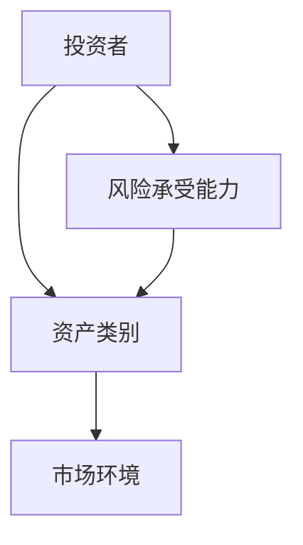

                 


# 彼得林奇的"家庭投资组合"在全球资产配置中的应用

## 关键词：
- 彼得林奇
- 家庭投资组合
- 全球资产配置
- 投资策略
- 金融市场
- 数学模型
- 系统架构

## 摘要：
本文深入探讨了彼得·林奇的家庭投资组合理念，并将其应用于全球资产配置中。通过分析其核心概念、算法原理、数学模型和系统架构，结合实际案例和最佳实践，为投资者提供科学的投资策略。

---

## 第一部分: 背景介绍

### 第1章: 彼得林奇的背景与投资理念

#### 1.1 彼得林奇的生平简介
- **1.1.1 早期经历**：彼得·林奇出生于美国波士顿，早年经历为他后来的投资理念打下了基础。
- **1.1.2 投资成就**：作为富达麦哲伦基金的经理，他创造了卓越的投资业绩。
- **1.1.3 投资哲学**：强调长期投资、分散风险和价值投资。

#### 1.2 家庭投资组合的核心理念
- **1.2.1 定义**：家庭投资组合是一种适合个人或家庭的分散投资策略。
- **1.2.2 特点**：注重长期收益、风险控制和资产多样化。
- **1.2.3 与机构投资的区别**：家庭投资组合更灵活，目标更明确。

#### 1.3 全球化背景下的应用
- **1.3.1 全球化投资的必要性**：分散风险、捕捉全球机会。
- **1.3.2 家庭投资组合的扩展**：将资产分配到不同国家和市场。
- **1.3.3 风险与机会**：全球化带来更高的风险和潜在收益。

---

## 第二部分: 家庭投资组合的核心概念与联系

### 第2章: 家庭投资组合的核心要素

#### 2.1 家庭投资组合的构成要素
- **2.1.1 资产类别划分**：股票、债券、现金等。
- **2.1.2 资产配置比例**：根据风险承受能力确定比例。
- **2.1.3 投资期限与风险承受能力**：短期与长期投资策略。

#### 2.2 核心概念对比分析
- **2.2.1 股票与债券对比**：股票高风险高回报，债券相对稳定。
- **2.2.2 不同市场环境下的表现**：牛市与熊市策略调整。
- **2.2.3 动态调整**：根据市场变化及时调整资产配置。

#### 2.3 ER实体关系图


---

## 第三部分: 家庭投资组合的算法原理

### 第3章: 家庭投资组合的算法实现

#### 3.1 资产分配模型
- **步骤1：评估市场环境**
- **步骤2：确定资产类别**
- **步骤3：计算配置比例**

#### 3.2 风险评估算法
- **步骤1：计算资产波动性**
- **步骤2：评估市场风险**
- **步骤3：调整配置比例**

#### 3.3 动态调整机制
- **步骤1：定期评估表现**
- **步骤2：调整资产配置**
- **步骤3：监控市场变化**

### 第4章: 数学模型与公式

#### 4.1 投资组合优化模型
- **均值-方差优化模型**：
$$\text{Minimize } \sigma^2 \text{ subject to } \mathbf{w}^T\mathbf{r} = \text{target return}$$
其中，$\mathbf{w}$是权重向量，$\mathbf{r}$是收益向量，$\sigma^2$是风险。

#### 4.2 风险评估公式
- **夏普比率**：
$$\text{夏普比率} = \frac{E[r] - r_f}{\sigma}$$
其中，$E[r]$是预期收益，$r_f$是无风险利率，$\sigma$是收益的标准差。

---

## 第四部分: 系统分析与架构设计

### 第5章: 系统分析与架构设计

#### 5.1 问题场景介绍
- **全球经济波动**：影响投资组合的收益与风险。
- **资产配置优化**：如何在全球市场中实现最优配置。

#### 5.2 系统功能设计
- **数据采集模块**：收集全球市场数据。
- **分析引擎**：计算资产配置比例。
- **优化模块**：调整投资组合。

#### 5.3 系统架构图


---

## 第五部分: 项目实战

### 第6章: 项目实战

#### 6.1 环境安装
- **工具安装**：安装Python、Pandas、Matplotlib等库。
- **数据源获取**：从Yahoo Finance获取市场数据。

#### 6.2 核心实现代码
```python
import pandas as pd
import numpy as np

# 数据加载
data = pd.read_csv('global_market.csv')

# 计算最优配置比例
def optimize_portfolio(data):
    # 计算协方差矩阵
    cov_matrix = data.cov()
    # 计算收益向量
    returns = data.mean()
    # 使用均值-方差优化
    weights = np.linalg.solve(cov_matrix, returns)
    weights = weights / weights.sum()
    return weights

# 调整配置
weights = optimize_portfolio(data)
```

#### 6.3 实际案例分析
- **案例分析**：假设投资组合包括美国、欧洲、亚洲的股票和债券。
- **结果解读**：根据市场变化调整配置比例。

---

## 第六部分: 最佳实践

### 第7章: 最佳实践

#### 7.1 小结
- 家庭投资组合通过分散化降低风险，全球化投资捕捉更多机会。

#### 7.2 注意事项
- 定期评估和调整投资组合。
- 考虑市场波动和经济周期的影响。

#### 7.3 拓展阅读
- 推荐书籍：《彼得·林奇的成功投资》。

---

## 结语
通过本文的分析，读者可以理解彼得·林奇的家庭投资组合理念，并将其应用于全球资产配置中。结合数学模型和系统设计，投资者可以制定科学的投资策略，实现长期稳健的收益。

