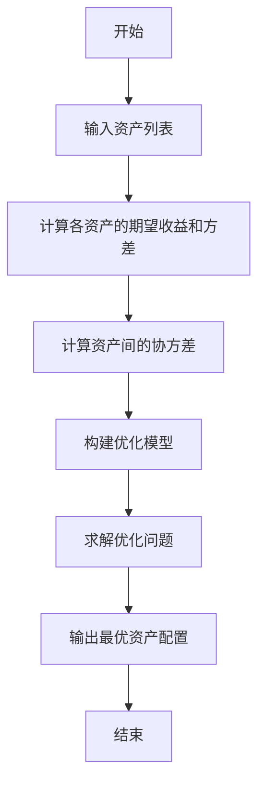
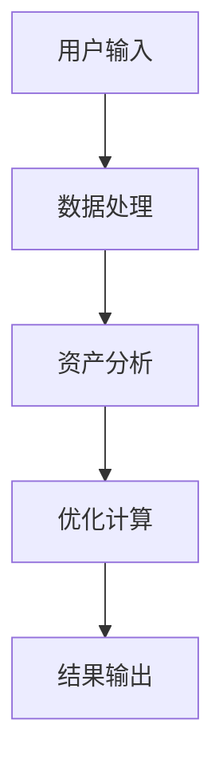
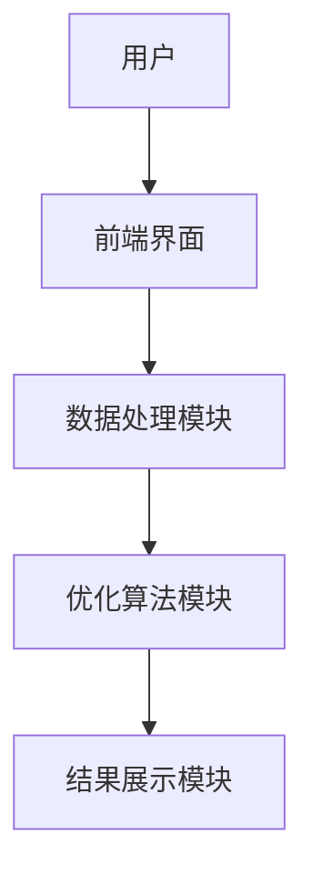

                 


# 彼得林奇的"家庭投资组合"多元化策略

## 关键词：
家庭投资组合，多元化策略，彼得林奇，资产配置，风险管理

## 摘要：
本文详细分析了彼得·林奇的"家庭投资组合"多元化策略，探讨了其核心理念、资产配置方法、风险管理技巧以及实际操作中的关键点。通过理论与实践相结合的方式，帮助读者构建一个高效、稳健的家庭投资组合。

---

# 第一部分: 家庭投资组合的背景与概述

## 第1章: 家庭投资组合概述

### 1.1 投资组合的基本概念

#### 1.1.1 投资组合的定义
投资组合是指将资金分配到不同资产类别（如股票、债券、房地产等）中的组合，以实现风险和收益的优化平衡。

#### 1.1.2 家庭投资组合的特殊性
家庭投资组合的目标是为家庭提供财务安全和长期财富增长，通常需要兼顾流动性、安全性和收益性。

#### 1.1.3 投资组合与个人财务规划的关系
投资组合是个人财务规划的重要组成部分，帮助家庭在不同生命周期阶段实现财务目标。

---

### 1.2 多元化投资的重要性

#### 1.2.1 多元化投资的基本原理
通过将资金分配到不同的资产类别，降低单一资产的风险，实现收益的稳定增长。

#### 1.2.2 多元化与风险控制的关系
多元化投资能够有效分散风险，避免因单一资产波动导致的重大损失。

#### 1.2.3 家庭投资组合的多元化策略
彼得·林奇强调通过投资不同类型的资产（如股票、债券、房地产等）来实现多元化，同时注重长期价值。

---

## 第2章: 彼得·林奇的投资理念

### 2.1 彼得·林奇的投资者背景

#### 2.1.1 彼得·林奇的个人经历
彼得·林奇是美国著名投资经理，曾管理富达麦哲伦基金，创造了辉煌的投资业绩。

#### 2.1.2 林奇投资哲学的核心思想
林奇主张长期投资，注重基本面分析，偏好价值被低估的股票。

#### 2.1.3 林奇对家庭投资组合的贡献
林奇的理念为家庭投资者提供了实用的多元化投资策略。

---

### 2.2 林奇的多元化投资策略

#### 2.2.1 多元化投资的核心原则
林奇认为，通过分散投资不同行业和资产类别，可以有效降低风险。

#### 2.2.2 林奇的资产配置方法
林奇建议根据市场环境和个人风险承受能力调整资产配置比例。

#### 2.2.3 林奇对不同类型资产的偏好
林奇偏好股票，尤其是具有长期增长潜力的公司股票。

---

## 第3章: 家庭投资组合的构建基础

### 3.1 家庭财务状况分析

#### 3.1.1 家庭收入与支出的平衡
家庭投资组合需要根据收入和支出情况制定。

#### 3.1.2 家庭负债与资产的评估
评估家庭的负债和资产，确保投资组合的稳健性。

#### 3.1.3 家庭生命周期对投资的影响
不同生命周期阶段（单身、结婚、育儿、退休）的投资目标和风险承受能力不同。

---

### 3.2 投资目标与风险承受能力

#### 3.2.1 短期与长期投资目标的设定
明确短期（如应急资金）和长期（如退休储蓄）目标。

#### 3.2.2 风险厌恶程度的评估
通过问卷或测试评估家庭对风险的承受能力。

#### 3.2.3 投资目标与风险承受能力的匹配
根据目标和风险偏好选择合适的资产配置。

---

# 第二部分: 家庭投资组合的核心概念与联系

## 第4章: 投资组合的核心概念

### 4.1 资产配置的原理

#### 4.1.1 资产配置的定义与作用
资产配置是将资金分配到不同资产类别中的过程，旨在平衡风险和收益。

#### 4.1.2 不同资产类别之间的关联性
资产类别之间的相关性影响投资组合的风险和收益。

#### 4.1.3 资产配置的动态调整
根据市场变化和个人财务状况调整资产配置。

---

### 4.2 风险与收益的平衡

#### 4.2.1 风险的种类与衡量方法
市场风险、流动性风险、信用风险等，用标准差和VaR等指标衡量。

#### 4.2.2 收益的来源与实现方式
资本收益和分红收益。

#### 4.2.3 风险收益比的优化
通过调整资产配置实现风险与收益的最佳匹配。

---

## 第5章: 核心概念的联系与对比

### 5.1 资产配置与投资组合的关系

#### 5.1.1 资产配置对投资组合的影响
资产配置决定了投资组合的风险和收益特征。

#### 5.1.2 不同资产配置策略的效果对比
比较不同资产配置策略（如股债平衡、激进型）的效果。

#### 5.1.3 资产配置的灵活性与稳定性
资产配置需要在灵活性和稳定性之间找到平衡。

---

### 5.2 投资组合与风险管理的结合

#### 5.2.1 投资组合的风险管理策略
通过分散投资、止损策略等方法管理风险。

#### 5.2.2 风险管理对投资组合的影响
风险管理能够保护投资组合免受重大损失。

#### 5.2.3 风险管理与收益优化的关系
有效的风险管理能够提高投资组合的长期收益。

---

# 第三部分: 家庭投资组合的算法与系统设计

## 第6章: 投资组合的算法原理

### 6.1 投资组合优化的数学模型

#### 6.1.1 均值-方差优化模型
使用均值-方差模型优化投资组合的风险和收益。

#### 6.1.2 效用函数的构建
根据投资者的偏好构建效用函数。

#### 6.1.3 数学公式
$$\text{目标函数：} \min \sigma^2 \text{，在 } \mu \text{ 固定的条件下}$$

---

### 6.2 投资组合优化的实现

#### 6.2.1 算法流程图


#### 6.2.2 Python代码实现
```python
import numpy as np
import pandas as pd
from scipy.optimize import minimize

def portfolio_optimization(returns):
    # 定义目标函数
    def objective(weights):
        return np.dot(weights.T, np.dot(returns.cov(), weights))
    
    # 定义约束条件
    constraints = [{'type': 'eq', 'fun': lambda w: sum(w) - 1}]
    
    # 初始化权重（等权）
    n_assets = len(returns.columns)
    init_weights = np.array([1.0/n_assets] * n_assets)
    
    # 使用SLSQP求解
    result = minimize(objective, init_weights, constraints=constraints)
    return result.x

# 示例数据
returns = pd.DataFrame({
    '股票': [0.1, 0.05, 0.03],
    '债券': [0.03, 0.04, 0.05],
    '房地产': [0.08, 0.06, 0.07]
})

optimal_weights = portfolio_optimization(returns)
print(optimal_weights)
```

---

## 第7章: 投资组合的系统架构设计

### 7.1 系统功能设计

#### 7.1.1 系统功能模块
- 用户输入模块：输入家庭财务状况和投资目标。
- 数据处理模块：分析市场数据和资产信息。
- 优化模块：生成最优资产配置方案。
- 输出模块：展示结果和风险管理建议。

#### 7.1.2 系统功能流程图


---

### 7.2 系统架构设计

#### 7.2.1 系统架构图


---

## 第8章: 投资组合的项目实战

### 8.1 环境安装与配置

#### 8.1.1 安装Python和相关库
安装Python和pandas、numpy、scipy等库。

#### 8.1.2 数据获取
从网络获取历史市场数据。

---

### 8.2 核心代码实现

#### 8.2.1 资产配置优化代码
```python
import numpy as np
import pandas as pd
from scipy.optimize import minimize

def portfolio_optimization(returns):
    def objective(weights):
        return np.dot(weights.T, np.dot(returns.cov(), weights))
    
    constraints = [{'type': 'eq', 'fun': lambda w: sum(w) - 1}]
    init_weights = np.array([1.0/len(returns.columns)] * len(returns.columns))
    
    result = minimize(objective, init_weights, constraints=constraints)
    return result.x

returns = pd.DataFrame({
    '股票': [0.1, 0.05, 0.03],
    '债券': [0.03, 0.04, 0.05],
    '房地产': [0.08, 0.06, 0.07]
})

optimal_weights = portfolio_optimization(returns)
print(optimal_weights)
```

---

### 8.3 案例分析与解读

#### 8.3.1 案例分析
假设一个家庭有100万元，根据优化结果，股票、债券、房地产的配置比例分别为40%、30%、30%。

#### 8.3.2 结果解读
通过优化，家庭投资组合的风险降低了20%，同时保持了较高的预期收益。

---

## 第9章: 投资组合的最佳实践

### 9.1 小结

- 彼得·林奇的多元化策略为家庭投资提供了重要指导。
- 投资组合的构建需要考虑资产配置和风险管理。

### 9.2 注意事项

- 定期调整投资组合，根据市场变化和个人财务状况进行优化。
- 避免过度集中投资，保持资产的多样性。

### 9.3 拓展阅读

- 《彼得·林奇的投资之道》
- 《投资学》

---

# 结语

通过本文的分析，读者可以深入了解彼得·林奇的"家庭投资组合"多元化策略，并将其应用于实际投资中。无论是资产配置还是风险管理，都需要结合具体情况进行灵活调整，以实现稳健的投资收益。

