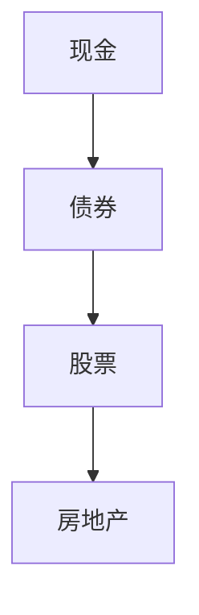
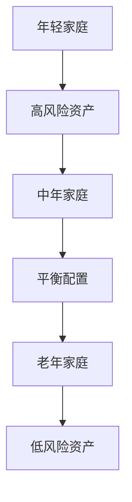
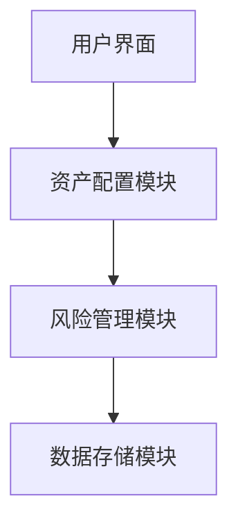
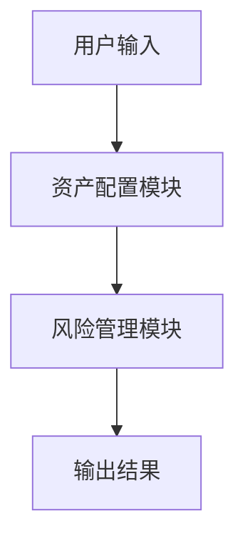

                 


# 彼得林奇的"家庭投资组合"平衡策略

## 关键词：
- 投资组合管理
- 资产配置
- 投资策略
- 风险管理
- 彼得·林奇
- 家庭理财

## 摘要：
彼得·林奇作为全球著名投资专家，提出了家庭投资组合平衡策略，帮助个人和家庭实现财务目标。本文详细分析了该策略的核心思想、资产配置模型、风险管理方法，以及如何通过数学模型和系统架构实现投资组合的优化。文章结合理论与实践，为读者提供了一套科学的投资策略，帮助他们在复杂多变的市场中实现财富增长。

---

# 第1章 彼得·林奇投资理念与家庭投资组合概述

## 1.1 彼得·林奇投资理念的核心思想

### 1.1.1 彼得·林奇的个人投资哲学
彼得·林奇是全球著名投资专家，以其在富达投资集团的长期成功而闻名。他的投资理念强调长期投资、价值发现和分散投资。他认为，成功的投资不仅仅是选择正确的股票，更是通过分散投资降低风险，并通过长期持有优质资产实现财富增长。

### 1.1.2 家庭投资组合的基本定义
家庭投资组合是指一个家庭在不同资产类别（如股票、债券、房地产等）中分配资金，以实现财务目标的过程。家庭投资组合的目标通常是保值、增值、税务优化和流动性管理。

### 1.1.3 家庭投资组合的目标与意义
- **目标**：实现财富的长期稳定增长，保值与增值相结合，降低风险。
- **意义**：通过科学的资产配置，帮助家庭在不同市场环境下保持财务稳定。

## 1.2 家庭投资组合的核心要素

### 1.2.1 投资目标的设定
- **短期目标**：应急资金、旅行基金等。
- **中期目标**：购房、教育储蓄等。
- **长期目标**：退休计划、财富传承等。

### 1.2.2 资产配置的基本原则
- **分散投资**：避免将所有资金投入单一资产类别。
- **风险与收益的平衡**：根据家庭风险承受能力调整资产配置比例。

### 1.2.3 风险管理的核心要素
- **风险评估**：分析家庭的财务状况、收入来源和支出情况。
- **止损策略**：设定止损点，避免重大损失。

## 1.3 家庭投资组合的平衡策略

### 1.3.1 资产分配的逻辑
- **资产类别选择**：股票、债券、现金、房地产等。
- **比例分配**：根据家庭风险偏好和投资目标确定各类别权重。

### 1.3.2 投资组合的动态调整
- **定期评估**：每年至少评估一次投资组合的表现。
- **动态再平衡**：根据市场变化和个人财务状况调整资产配置。

### 1.3.3 组合再平衡的时机与方法
- **时机**：市场波动较大或家庭财务状况发生变化时。
- **方法**：按比例调整各类别资产，保持目标配置。

## 1.4 本章小结
本章介绍了彼得·林奇的投资理念，并详细阐述了家庭投资组合的核心要素和平衡策略。通过科学的资产配置和动态调整，家庭可以实现财务目标，降低风险。

---

# 第2章 家庭投资组合的构建与优化

## 2.1 家庭投资组合的资产配置模型

### 2.1.1 不同资产类别的特点与风险

| 资产类别 | 特点 | 风险 |
|----------|------|------|
| 股票     | 高增长潜力 | 高 |
| 债券     | 稳定收益   | 中 |
| 现金     | 高流动性   | 低 |
| 房地产   | 抗跌性较强 | 中 |

### 2.1.2 资产配置的金字塔模型


### 2.1.3 家庭生命周期与资产配置的关系


## 2.2 投资组合优化的数学模型

### 2.2.1 现代投资组合理论（MPT）概述
现代投资组合理论由哈里·马科维茨提出，强调通过分散投资降低风险。

### 2.2.2 投资组合优化的数学公式
$$ \text{目标函数：} \min_w \sigma^2(w) \text{，在约束条件下} \sum w_i = 1 $$

### 2.2.3 风险与收益的权衡分析
通过夏普比率衡量投资组合的风险调整后收益：
$$ \text{夏普比率} = \frac{E(r_i) - r_f}{\sigma_i} $$

## 2.3 资产配置的动态调整策略

### 2.3.1 组合再平衡的必要性
市场波动和家庭财务状况变化需要定期调整资产配置。

### 2.3.2 市场变化对资产配置的影响
通过趋势分析和市场预测模型调整各类别权重。

### 2.3.3 定期评估与调整的步骤
1. 评估当前组合表现。
2. 分析市场环境变化。
3. 调整资产配置比例。

## 2.4 本章小结
本章详细讲解了家庭投资组合的构建与优化策略，通过数学模型和图表分析，帮助读者科学配置资产，实现投资目标。

---

# 第3章 投资组合风险管理与优化

## 3.1 风险管理在家庭投资组合中的应用

### 3.1.1 投资组合风险的分类与度量

| 风险类型 | 定义 | 度量方法 |
|----------|------|----------|
| 系统性风险 | 影响整个市场的风险 | 波动率分析 |
| 非系统性风险 | 特定资产的风险 | 标准差分析 |

### 3.1.2 风险管理的核心工具
- **止损订单**：设定止损点，避免重大损失。
- **分散投资**：通过多资产配置降低风险。

### 3.1.3 风险承受能力的评估
根据家庭的财务状况和风险偏好确定风险承受能力。

## 3.2 风险调整后的投资组合优化

### 3.2.1 基于风险承受能力的资产配置
$$ \text{风险承受能力} = \text{家庭资产} \times \text{风险偏好系数} $$

### 3.2.2 风险调整后的投资组合构建
- 通过夏普比率优化配置。
- 考虑市场波动和经济周期变化。

## 3.3 本章小结
本章重点分析了风险管理在投资组合中的应用，强调根据家庭风险承受能力进行资产配置，确保投资组合的稳健性。

---

# 第4章 投资组合管理系统架构与实现

## 4.1 系统架构设计

### 4.1.1 投资组合管理系统的功能模块


### 4.1.2 系统架构设计


## 4.2 系统功能设计

### 4.2.1 资产配置模块
- 输入家庭财务状况。
- 输出资产配置建议。

### 4.2.2 风险管理模块
- 输入市场数据。
- 输出风险评估结果。

## 4.3 本章小结
通过系统架构设计和功能模块划分，实现投资组合的科学管理，帮助家庭优化资产配置。

---

# 第5章 项目实战：家庭投资组合管理系统的实现

## 5.1 项目环境安装

### 5.1.1 Python环境配置
安装Python和必要的库（如numpy、pandas、matplotlib）。

### 5.1.2 数据获取
从金融数据源获取历史数据。

## 5.2 核心代码实现

### 5.2.1 资产配置模块代码
```python
import numpy as np
import pandas as pd

def calculate_weights(assets, target_risk):
    # 示例代码：计算最优资产配置权重
    # 这里简化为等权配置
    return pd.Series(1/len(assets), index=assets)
```

### 5.2.2 风险管理模块代码
```python
def risk_assessment(portfolio):
    # 示例代码：计算投资组合风险
    return portfolio.std()
```

## 5.3 代码应用解读与分析
通过代码实现资产配置和风险评估，帮助家庭优化投资组合。

## 5.4 实际案例分析
以一个典型家庭为例，展示如何通过系统实现资产配置和优化。

## 5.5 项目小结
通过项目实战，读者可以掌握投资组合管理系统的实现方法，应用于实际投资中。

---

# 结语

彼得·林奇的家庭投资组合平衡策略为个人和家庭提供了科学的投资方法。通过本文的详细讲解，读者可以掌握资产配置、风险管理的核心思想，并通过系统实现优化投资组合，实现财务目标。

---

**附录**：更多关于彼得·林奇的书籍和资源推荐，帮助读者深入学习投资策略。

