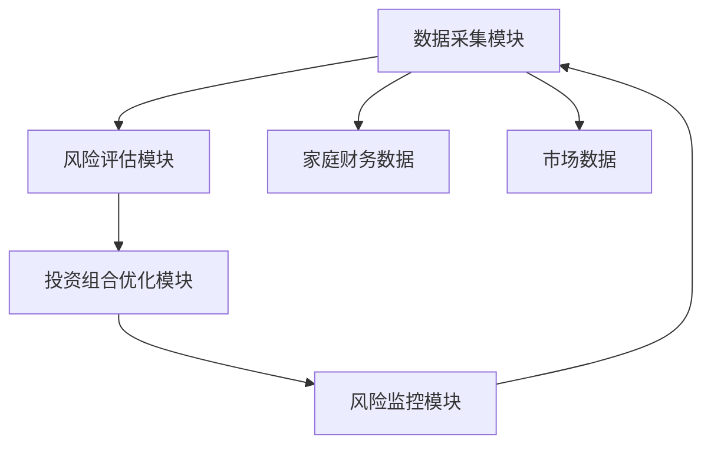

                 


# 彼得林奇的"家庭投资"风险控制方法

## 关键词：家庭投资，风险控制，彼得林奇，投资策略，资产配置，风险管理

## 摘要：本文深入探讨了彼得林奇的家庭投资风险控制方法，从核心概念、算法原理到系统架构，结合实际案例，详细讲解了如何通过科学的资产配置和风险管理实现家庭投资的稳健收益。文章内容涵盖风险控制的数学模型、系统设计、项目实战等，为家庭投资者提供了实用的指导和建议。

---

# 第一部分: 家庭投资与风险控制背景

## 第1章: 家庭投资的基本概念

### 1.1 家庭投资的定义与特点

#### 1.1.1 家庭投资的定义
家庭投资是指家庭通过将部分资产投入金融或实体市场，以实现资产保值、增值的过程。与机构投资相比，家庭投资通常具有资金规模较小、目标多样化、风险承受能力有限等特点。

#### 1.1.2 家庭投资的核心特点
- **资金规模较小**：家庭投资的资金通常来自家庭储蓄，规模有限，难以像机构投资者那样分散投资。
- **目标多样化**：家庭投资可能同时追求资产增值、教育基金储备、退休计划等多重目标。
- **风险承受能力有限**：家庭对风险的承受能力通常较低，尤其是当家庭中有未成年子女时，保本和稳健收益更为重要。

#### 1.1.3 家庭投资与机构投资的区别
- 投资目标：家庭投资注重长期稳健，机构投资注重短期收益。
- 资金规模：家庭投资资金有限，机构投资资金庞大。
- 风险承受：家庭投资风险承受能力较低，机构投资可以分散风险。

### 1.2 家庭投资的风险来源

#### 1.2.1 市场风险
市场风险是指由于市场波动导致资产价格下跌的风险。例如，股市下跌可能导致股票投资损失。

#### 1.2.2 利率风险
利率风险是指由于利率变化导致债券等固定收益类资产价格波动的风险。例如，利率上升可能导致债券价格下跌。

#### 1.2.3 通货膨胀风险
通货膨胀风险是指由于通货膨胀导致货币购买力下降的风险。例如，通胀可能导致实际收益为负。

#### 1.2.4 流动性风险
流动性风险是指难以在短时间内以合理价格变现资产的风险。例如，房地产投资可能在市场低迷时难以迅速出售。

### 1.3 家庭投资风险控制的重要性

#### 1.3.1 投资失败的常见原因
- 未分散投资：将所有资金投入单一资产，风险过高。
- 过度杠杆：使用高杠杆投资，放大亏损。
- 忽视风险：追求高收益而忽视潜在风险。

#### 1.3.2 风险控制在家庭投资中的作用
- 保护本金：确保在市场波动中不会遭受重大损失。
- 稳定收益：通过分散投资实现长期稳健回报。
- 降低压力：避免因市场波动导致的家庭财务危机。

#### 1.3.3 风险控制与收益的平衡
- 风险与收益成正比：收益越高，风险通常越大。
- 个性化投资：根据家庭的财务状况和风险承受能力制定投资策略。
- 长期视角：避免短期波动干扰，注重长期收益。

## 第2章: 彼得林奇的投资理念

### 2.1 彼得林奇的个人投资风格

#### 2.1.1 价值投资的核心理念
价值投资强调购买被市场低估的资产，长期持有，等待价值回归。彼得林奇认为，投资的目的是寻找那些具有持续盈利能力和良好管理的公司。

#### 2.1.2 长期投资的重要性
彼得林奇倡导长期投资，避免频繁交易。他认为，短期市场波动无法预测，而长期趋势可以通过基本面分析把握。

#### 2.1.3 股票估值的基本方法
- 市盈率（P/E）：评估股票价格是否合理。
- 市净率（P/B）：衡量股票价格与账面价值的关系。
- 股息率：评估股票的分红能力。

### 2.2 彼得林奇的家庭投资策略

#### 2.2.1 家庭资产配置的原则
- 分散投资：将资金分配到不同资产类别（如股票、债券、房地产等）以降低风险。
- 定期调整：根据市场变化和个人财务状况，定期优化投资组合。
- 保守为主：注重稳健收益，避免高风险投资。

#### 2.2.2 家庭投资组合的构建
- 股票：占总投资的40%-50%，选择基本面良好的公司。
- 债券：占总投资的30%-40%，用于分散风险。
- 现金储备：占总投资的10%-20%，用于应急和把握投资机会。

#### 2.2.3 家庭投资中的分散化策略
- 资产类别分散：股票、债券、房地产等多种资产。
- 行业分散：投资不同行业的股票，避免单一行业风险。
- 地区分散：投资国内外资产，分散地域风险。

### 2.3 彼得林奇的风险控制方法

#### 2.3.1 风险识别与评估
- 定期审视投资组合：检查资产配置是否合理。
- 监测市场波动：关注宏观经济和市场趋势。

#### 2.3.2 风险规避与对冲
- 选择低风险资产：如债券、货币市场基金等。
- 使用期权对冲：通过买入认沽期权保护投资组合。

#### 2.3.3 风险承受能力的评估
- 评估家庭的财务状况：确定可承受的最大损失。
- 确定投资目标：根据风险承受能力设定收益目标。

---

## 第三部分: 家庭投资风险控制的核心概念

## 第3章: 家庭投资风险控制的原理

### 3.1 风险控制的基本原理

#### 3.1.1 风险与收益的权衡
- 高收益意味着高风险：收益与风险成正比。
- 风险控制：通过分散化和对冲降低风险。

#### 3.1.2 风险的分类与层次
- 系统性风险：市场整体波动带来的风险。
- 非系统性风险：特定资产或行业带来的风险。

#### 3.1.3 风险控制的系统性方法
- 风险识别：识别潜在风险。
- 风险评估：量化风险的影响。
- 风险应对：制定应对策略。

### 3.2 彼得林奇风险控制的核心要素

#### 3.2.1 资产配置的科学性
- 资产配置是风险控制的基础：合理的资产分配可以降低整体风险。
- 定期调整配置：根据市场变化和个人财务状况进行调整。

#### 3.2.2 投资组合的多样性
- 多样化投资：避免单一资产风险。
- 行业和地区的分散：降低特定风险。

#### 3.2.3 风险对冲的有效性
- 使用金融衍生品：如期权、期货对冲风险。
- 选择低相关性资产：降低组合的整体波动性。

### 3.3 风险控制的数学模型

#### 3.3.1 风险-收益 trade-off 分析
通过夏普比率衡量投资组合的风险调整后收益：
$$ 夏普比率 = \frac{E[r_p] - r_f}{\sigma_p} $$
其中，$E[r_p]$是投资组合的期望收益，$r_f$是无风险利率，$\sigma_p$是投资组合的波动率。

#### 3.3.2 风险调整后的收益模型
通过CAPM模型评估资产的预期收益：
$$ E[r_i] = r_f + \beta_i (E[r_m] - r_f) $$
其中，$\beta_i$是资产的贝塔系数，衡量资产的系统性风险。

#### 3.3.3 风险分散化的效果评估
通过投资组合的方差衡量风险：
$$ \sigma_p^2 = \sum_{i=1}^n w_i^2 \sigma_i^2 + 2 \sum_{i < j} w_i w_j \text{Cov}(i,j) $$
其中，$w_i$是资产i的权重，$\sigma_i^2$是资产i的方差，$\text{Cov}(i,j)$是资产i和j的协方差。

## 第4章: 家庭投资风险控制的系统架构

### 4.1 家庭投资风险控制系统概述

#### 4.1.1 系统的目标与范围
- 目标：通过系统化的方法控制投资风险，实现稳健收益。
- 范围：涵盖资产配置、风险评估、投资组合优化和风险监控。

#### 4.1.2 系统的组成模块
- 数据采集模块：收集市场数据和家庭财务数据。
- 风险评估模块：量化投资组合的风险。
- 投资组合优化模块：优化资产配置。
- 风险监控模块：实时监控投资组合的风险。

#### 4.1.3 系统的输入输出
- 输入：市场数据、家庭财务状况、投资目标。
- 输出：优化后的资产配置方案、风险评估报告。

### 4.2 家庭投资风险控制的流程设计

#### 4.2.1 投资目标设定
- 确定投资目标：如保值、增值、教育基金等。
- 评估财务状况：确定可投资资金和风险承受能力。

#### 4.2.2 风险评估与分析
- 识别潜在风险：如市场波动、通货膨胀等。
- 量化风险影响：通过数学模型评估风险。

#### 4.2.3 投资组合优化
- 分散化投资：优化资产配置，降低整体风险。
- 调整策略：根据市场变化和个人目标调整投资组合。

#### 4.2.4 风险监控与调整
- 定期审查：评估投资组合的表现和风险。
- 及时调整：根据市场变化和个人目标调整投资组合。

### 4.3 系统架构的 Mermaid 图



---

## 第四部分: 项目实战与最佳实践

## 第5章: 项目实战：家庭投资风险控制系统的实现

### 5.1 环境安装与配置

#### 5.1.1 安装Python环境
- 使用Anaconda安装Python 3.x。
- 安装必要的库：numpy、pandas、scipy、matplotlib、sklearn。

#### 5.1.2 数据采集
- 从Yahoo Finance获取市场数据。
- 使用pandas进行数据清洗和预处理。

### 5.2 系统核心实现源代码

#### 5.2.1 风险评估模块

```python
import numpy as np
import pandas as pd

def calculate_variance_returns(returns):
    return np.var(returns)

def calculate_sharpe_ratio(returns, risk_free_rate):
    return (np.mean(returns) - risk_free_rate) / np.std(returns)
```

#### 5.2.2 投资组合优化模块

```python
from scipy.optimize import minimize

def optimize_portfolio(returns, weights):
    # 定义目标函数：最小化风险（方差）
    def objective(weights, returns):
        return (weights.T @ returns @ weights)  # 方差

    # 约束条件：权重之和为1
    constraints = [{'type': 'eq', 'fun': lambda w: sum(w) - 1}]

    result = minimize(objective, weights, args=(returns,), method='SLSQP', constraints=constraints)
    return result.x
```

#### 5.2.3 风险监控模块

```python
import matplotlib.pyplot as plt

def plot_portfolio_returns(portfolio_returns, benchmark_returns):
    plt.figure(figsize=(10, 6))
    plt.plot(portfolio_returns, label='Portfolio Returns')
    plt.plot(benchmark_returns, label='Benchmark Returns')
    plt.xlabel('Time')
    plt.ylabel('Returns')
    plt.legend()
    plt.show()
```

### 5.3 实际案例分析

#### 5.3.1 案例背景
假设一个家庭有100万元可投资资金，目标是通过投资实现年化5%的收益，风险承受能力为中等。

#### 5.3.2 数据准备
从Yahoo Finance获取过去5年的市场数据，包括股票、债券和房地产信托基金（REITs）的收益率。

#### 5.3.3 风险评估
使用夏普比率评估不同资产类别的风险调整后收益。

#### 5.3.4 投资组合优化
通过优化算法确定最优资产配置，如股票40%、债券30%、REITs 30%。

#### 5.3.5 风险监控
定期审查投资组合的表现，根据市场变化进行调整。

### 5.4 项目小结

#### 5.4.1 项目成果
- 实现了一个家庭投资风险控制系统。
- 提供了科学的资产配置建议。

#### 5.4.2 经验总结
- 数据的准确性和及时性对风险评估至关重要。
- 定期审查和调整是保持投资组合健康的关键。

---

## 第五部分: 最佳实践与总结

## 第6章: 最佳实践与注意事项

### 6.1 投资前的准备

#### 6.1.1 设定明确的投资目标
- 短期目标：如应急资金。
- 长期目标：如退休计划。

#### 6.1.2 评估自身的风险承受能力
- 了解自己的财务状况和心理承受能力。

#### 6.1.3 制定详细的投资计划
- 明确投资策略和时间表。

### 6.2 投资中的注意事项

#### 6.2.1 避免情绪化投资
- 不要因市场波动而做出冲动决策。

#### 6.2.2 定期审视投资组合
- 至少每年审查一次资产配置。

#### 6.2.3 保持适度的杠杆
- 避免过度使用杠杆，增加财务压力。

### 6.3 风险管理的技巧

#### 6.3.1 分散投资
- 通过多种资产类别降低风险。

#### 6.3.2 使用对冲工具
- 期权、保险等工具可以有效对冲风险。

#### 6.3.3 保持灵活性
- 根据市场变化和个人目标及时调整策略。

## 第7章: 小结与展望

### 7.1 小结
本文详细介绍了彼得林奇的家庭投资风险控制方法，从理论到实践，结合数学模型和系统设计，为家庭投资者提供了科学的指导。

### 7.2 未来展望
随着金融市场的复杂化，家庭投资风险控制需要更加智能化和个性化。未来可以结合人工智能技术，开发更精准的风险评估和优化系统。

---

## 参考文献
1. 彼得·林奇著《彼得林奇的成功投资》
2. 《投资学》（教材）
3. 相关金融研究论文

