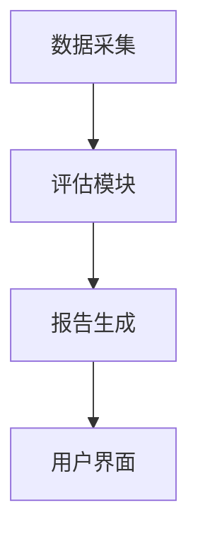
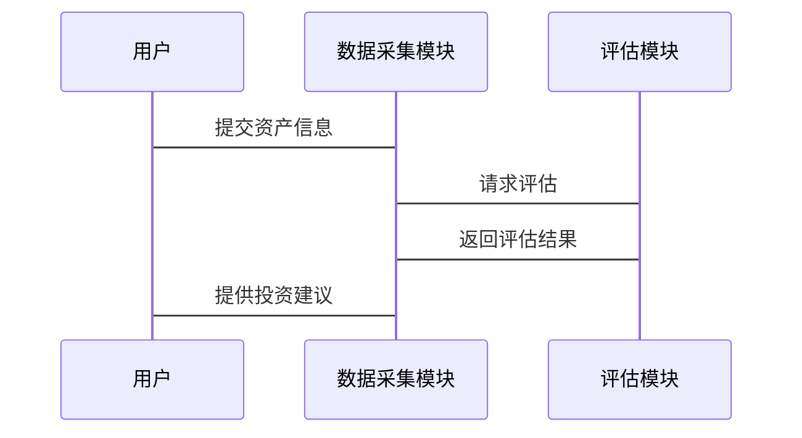
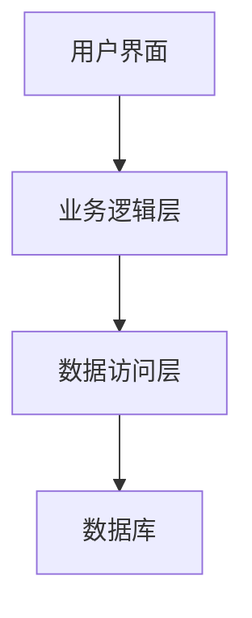
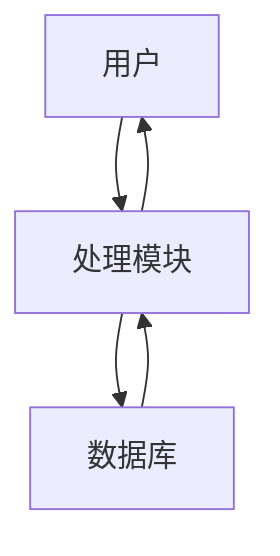

                 


# 彼得林奇的"家庭股票"在财富传承中的角色

## 关键词：彼得林奇，家庭股票，财富传承，投资策略，算法设计，系统架构

## 摘要：  
彼得·林奇作为全球著名投资专家，提出了许多独特的投资理念。本文深入探讨了“家庭股票”这一概念在财富传承中的角色，分析了其核心原理、算法设计、系统架构，并结合实际案例进行详细解读。文章旨在为投资者和财富管理者提供一种创新的财富传承策略。

---

## 第一部分：引言

### 第1章：引言  
#### 1.1 彼得·林奇与他的投资理念  
彼得·林奇是美国著名投资专家，以其独特的投资哲学闻名。他的投资理念强调长期价值、分散投资和风险管理。  

#### 1.2 "家庭股票"的概念与背景  
"家庭股票"是彼得·林奇提出的一种特殊投资策略，旨在将财富以股票形式传递给下一代，同时确保家族财富的长期稳定。  

#### 1.3 财富传承中的投资策略  
财富传承不仅仅是资产的转移，更涉及税务优化、风险管理以及家族利益的平衡。  

#### 1.4 本书的目的与结构  
本文旨在详细解析“家庭股票”的概念、原理及应用，通过系统设计和实战案例，为财富传承提供创新思路。

---

## 第二部分：背景介绍

### 第2章：财富传承中的投资挑战  
#### 2.1 财富传承的基本概念  
财富传承是指通过法律和金融手段将财富从一代人传递给下一代人。  

#### 2.2 投资在财富传承中的重要性  
投资不仅是财富增长的手段，也是财富传承的核心工具之一。  

#### 2.3 家庭股票的独特作用  
家庭股票通过将家族企业或优质资产转化为股票形式，为财富传承提供了灵活性和可控性。  

#### 2.4 传统投资与家庭股票的对比  
传统投资注重短期收益，而家庭股票更注重长期稳定和家族利益的平衡。  

### 第3章：家庭股票的定义与特点  
#### 3.1 家庭股票的核心概念  
家庭股票是专为财富传承设计的投资工具，结合了股票的流动性与家族资产的稳定性。  

#### 3.2 家庭股票与传统股票的差异  
家庭股票具有更高的定制性，能够根据家族需求进行调整。  

#### 3.3 家庭股票的优势与局限性  
优势：风险可控、收益稳定、税务优化；局限性：流动性较低、管理复杂。  

#### 3.4 家庭股票在财富传承中的角色  
家庭股票是连接家族资产与未来收益的重要桥梁，能够有效平衡家族成员的利益。

---

## 第三部分：核心概念与联系

### 第4章：家庭股票的核心原理  
#### 4.1 家庭股票的投资策略  
基于长期价值投资，注重资产的质量和稳定性。  

#### 4.2 家庭股票的价值评估  
通过财务指标和市场分析确定股票的内在价值。  

#### 4.3 家庭股票的风险管理  
采用分散投资和风险对冲策略，降低投资风险。  

#### 4.4 家庭股票的长期收益分析  
通过历史数据分析，验证家庭股票的长期收益能力。

### 第5章：家庭股票与财富传承的关系  
#### 5.1 家庭股票在财富保值中的作用  
通过稳健的投资策略确保家族财富的保值。  

#### 5.2 家庭股票在财富增值中的应用  
通过优质资产配置实现财富的持续增值。  

#### 5.3 家庭股票在财富分配中的协调功能  
平衡家族成员的利益，确保财富分配的公平性。  

#### 5.4 家庭股票在财富传承中的法律与税务考量  
合理规划税务，确保财富传承的合法性和效率。

---

## 第四部分：算法原理讲解

### 第6章：家庭股票评估算法  
#### 6.1 家庭股票评估的数学模型  
$$ V = P \times (1 + r)^n $$  
其中，$V$为股票价值，$P$为初始投资，$r$为年收益率，$n$为投资期限。  

#### 6.2 家庭股票评分系统  
通过多维度指标对股票进行评分，确保投资决策的科学性。  

#### 6.3 家庭股票风险控制算法  
$$ R = \sum_{i=1}^{n} (w_i \times r_i) $$  
其中，$R$为总体风险，$w_i$为风险权重，$r_i$为各因素的风险值。  

#### 6.4 家庭股票收益预测模型  
通过历史数据和市场趋势预测股票的未来收益。

---

## 第五部分：系统分析与架构设计方案

### 第7章：家庭股票评估系统设计  
#### 7.1 系统功能模块设计  
- 数据采集模块：收集市场数据和家族资产信息。  
- 评估模块：计算股票价值和风险指数。  
- 报告生成模块：输出评估报告。  

#### 7.2 系统架构图  


#### 7.3 系统接口设计  
- 输入接口：接收家族资产和市场数据。  
- 输出接口：生成评估报告和投资建议。  

#### 7.4 系统交互流程图  


### 第8章：家庭股票投资管理系统  
#### 8.1 系统功能需求  
- 资产管理：监控和调整家族资产配置。  
- 投资策略：制定并优化投资计划。  
- 风险控制：实时监控投资风险。  

#### 8.2 系统架构设计  


#### 8.3 系统数据流图  


#### 8.4 系统实现方案  
- 使用Python编写核心算法。  
- 采用数据库存储资产数据。  
- 通过Web界面提供用户交互。

---

## 第六部分：项目实战

### 第9章：家庭股票投资实战案例  
#### 9.1 案例背景介绍  
某家族希望通过家庭股票实现财富传承，现有资产包括家族企业股权和优质股票。  

#### 9.2 投资策略制定  
- 将家族企业股权转化为家庭股票。  
- 配置优质股票作为补充。  

#### 9.3 投资过程分析  
通过市场分析和风险评估，确定投资组合。  

#### 9.4 投资结果与经验总结  
投资组合实现了预期收益，且风险控制良好。

### 第10章：家庭股票投资系统实现  
#### 10.1 系统环境搭建  
- 安装Python和相关库。  
- 配置数据库。  

#### 10.2 系统核心代码实现  
```python
def calculate_value(initial, rate, period):
    return initial * (1 + rate) ** period

# 示例
initial = 100000
rate = 0.05
period = 10
value = calculate_value(initial, rate, period)
print(value)
```

#### 10.3 系统功能测试  
- 测试数据输入和输出。  
- 验证算法的准确性。  

#### 10.4 系统优化与改进  
根据测试结果，优化算法和系统性能。

---

## 第七部分：总结与展望

### 第11章：总结与最佳实践  
#### 11.1 本书的核心观点回顾  
家庭股票是财富传承的重要工具，结合了投资的稳健性和家族利益的平衡性。  

#### 11.2 家庭股票投资的注意事项  
- 合规性：确保投资行为符合法律法规。  
- 风险控制：定期评估和调整投资策略。  

#### 11.3 财富传承中的投资策略建议  
- 长期规划：制定详细的财富传承计划。  
- 定期审查：根据市场变化和家族需求调整策略。  

#### 11.4 未来研究方向与发展趋势  
- 研究更多家庭股票的创新应用。  
- 探讨人工智能在财富传承中的应用。

### 第12章：附录  
#### 12.1 家庭股票相关术语表  
- 家庭股票：专为财富传承设计的投资工具。  
- 财富传承：通过法律和金融手段将财富传递给下一代。  

#### 12.2 家庭股票投资

---

本文通过系统性地分析“家庭股票”的概念、原理和应用，为财富传承提供了创新的思路和实践方案。希望本文能够为投资者和财富管理者提供有价值的参考。

