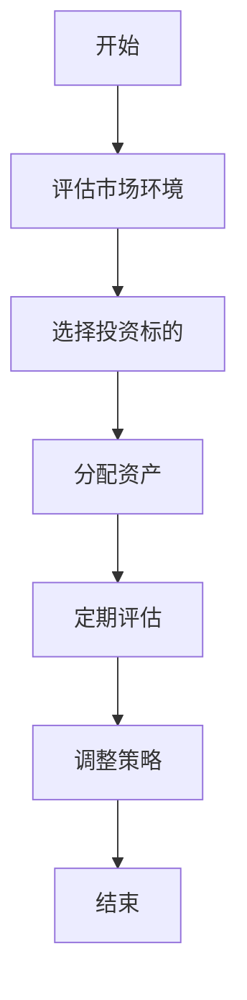
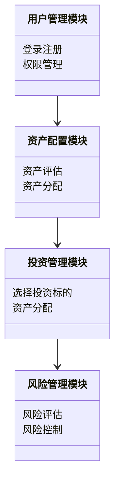

                 


# 彼得林奇的"家庭股票"在跨代财富传承中的作用

> 关键词：家庭股票，财富传承，彼得·林奇，投资策略，跨代传承

> 摘要：本文深入探讨了彼得·林奇的“家庭股票”概念在跨代财富传承中的作用，通过分析其核心原理、算法模型、系统架构及实际案例，揭示了这一创新投资策略在财富保值与增值中的独特价值。文章结合技术语言与投资理念，为读者提供了从理论到实践的全面解析。

---

## 第一部分: 背景介绍

### 第1章: 家庭股票与跨代财富传承概述

#### 1.1 家庭股票的核心概念

##### 1.1.1 家庭股票的定义与特点

家庭股票是一种将家族资产视为可投资的“股票”，通过长期、分散的投资策略实现财富的保值与增值。其核心在于将家族财富注入资本市场，通过专业化的投资管理，确保财富的代际传承。

##### 1.1.2 跨代财富传承的背景与问题

随着家族财富的积累，传统继承方式（如直接分配现金或资产）常面临以下问题：
- **资产贬值风险**：通货膨胀和市场波动可能导致财富缩水。
- **分配不均**：家族成员间利益冲突可能导致分配不公。
- **激励不足**：后代缺乏财富创造的动力，易导致家族企业或财富的衰退。

##### 1.1.3 家庭股票在财富传承中的作用

家庭股票通过将财富转化为长期投资资产，解决了传统传承方式的痛点：
- **保值增值**：通过资本市场实现财富的长期增长。
- **利益平衡**：确保家族成员利益均衡，避免内部冲突。
- **激励机制**：通过参与投资收益分配，激发后代的积极性。

#### 1.2 家庭股票与传统财富传承方式的对比

##### 1.2.1 传统财富传承方式的局限性

传统方式主要依赖遗嘱或直接分配，存在以下问题：
- 财富分配的公平性难以保障。
- 家族成员缺乏参与感，可能导致对财富的不尊重。
- 财富的流动性差，难以应对紧急情况。

##### 1.2.2 家庭股票的优势与创新

家庭股票的优势在于：
- **资产流动性**：通过股票形式实现财富的灵活配置。
- **收益共享**：家族成员共同享有投资收益，增强凝聚力。
- **专业管理**：通过专业机构进行投资管理，降低风险。

##### 1.2.3 家庭股票的适用场景与边界

家庭股票适用于：
- 财富积累阶段的家族。
- 家族企业希望实现长期发展的企业。
- 希望通过投资实现财富保值的高净值家庭。

### 第2章: 彼得·林奇的"家庭股票"理论

#### 2.1 彼得·林奇的投资者背景

##### 2.1.1 彼得·林奇的生平简介

彼得·林奇（Peter Lynch）是美国著名投资家，曾任富达投资集团的共同基金经理。他以独特的选股方法和长期的投资业绩闻名。

##### 2.1.2 彼得·林奇的投资理念

林奇强调长期投资、分散投资和价值投资。他认为，投资者应关注企业的基本面，寻找具有竞争优势的企业进行投资。

##### 2.1.3 彼得·林奇对财富传承的思考

林奇认为，财富传承的关键在于将财富转化为能够持续创造价值的资产，而股票投资是实现这一目标的有效方式。

#### 2.2 "家庭股票"的核心思想

##### 2.2.1 家庭股票的定义与内涵

家庭股票是将家族财富以股票形式持有，通过长期投资实现财富的保值与增值。

##### 2.2.2 家庭股票的运作机制

家庭股票的运作机制包括：
- 家族成员共同持有股票，通过专业机构进行管理。
- 定期评估投资组合，调整资产配置。
- 通过分红或增值收益分配财富。

##### 2.2.3 家庭股票的长期价值

家庭股票的长期价值在于：
- 通过长期投资实现财富的稳定增长。
- 通过股票形式实现财富的分散配置。
- 通过分红收益实现财富的可持续分配。

#### 2.3 家庭股票与家族企业传承的关系

##### 2.3.1 家庭股票在家族企业中的应用

家庭股票可以用于家族企业的股权管理，确保家族成员的权益。

##### 2.3.2 家庭股票与家族财富保护

通过股票形式实现财富的分散配置，降低单一投资的风险。

##### 2.3.3 家庭股票与家族治理的结合

家庭股票的管理需要家族治理的支持，确保投资决策的科学性。

---

## 第二部分: 核心概念与联系

### 第3章: 家庭股票的核心原理

#### 3.1 家庭股票的资产配置原理

##### 3.1.1 资产配置的基本原则

资产配置应遵循以下原则：
- 分散投资，降低风险。
- 长期持有，避免短期波动。
- 定期评估，动态调整。

##### 3.1.2 家庭股票的资产分配模型

家庭股票的资产分配模型包括：
- 根据家族成员的需求分配资产。
- 根据市场情况调整资产配置。

##### 3.1.3 资产配置的动态调整机制

资产配置需要根据市场变化和家族需求进行动态调整。

#### 3.2 家庭股票的风险管理机制

##### 3.2.1 风险识别与评估

风险管理的第一步是识别潜在风险并进行评估。

##### 3.2.2 风险分散策略

通过分散投资降低风险。

##### 3.2.3 风险控制的执行机制

建立风险管理机制，确保投资安全。

---

### 第4章: 家庭股票与家族财富传承的关系

#### 4.1 家庭股票在财富传承中的功能

##### 4.1.1 财富保值与增值

通过股票投资实现财富的长期增长。

##### 4.1.2 财富分配的公平性

确保家族成员的权益公平分配。

##### 4.1.3 财富传承的连续性

通过长期投资实现财富的持续传承。

#### 4.2 家庭股票与家族治理的结合

##### 4.2.1 家族治理的内涵与外延

家族治理包括家族成员的权益管理、投资决策等。

##### 4.2.2 家庭股票与家族治理的关系

家庭股票需要家族治理的支持。

##### 4.2.3 家庭股票在家族治理中的作用

通过家庭股票实现家族财富的有效管理。

---

### 第5章: 家庭股票的数学模型与公式

#### 5.1 家庭股票的资产分配公式

$$ 资产分配比例 = \frac{家庭成员的财富需求}{家庭总财富} $$

#### 5.2 家庭股票的风险评估模型

$$ 风险指数 = \sum_{i=1}^{n} (概率_i \times 影响度_i) $$

---

## 第三部分: 算法原理与技术实现

### 第6章: 家庭股票的算法原理

#### 6.1 算法原理的数学模型

$$ 投资收益 = \sum_{i=1}^{n} (投资_i \times 收益率_i) $$

#### 6.2 算法流程图



---

## 第四部分: 系统分析与架构设计

### 第7章: 家庭股票的系统架构

#### 7.1 项目介绍

家庭股票管理系统是一个用于管理家族财富的投资平台。

#### 7.2 系统功能设计

- 用户管理模块
- 资产配置模块
- 投资管理模块
- 风险管理模块

#### 7.3 系统架构图



---

## 第五部分: 项目实战

### 第8章: 家庭股票的项目实现

#### 8.1 环境安装

安装Python和相关库，如pandas、numpy。

#### 8.2 核心代码实现

```python
def calculate_asset_allocation(family_wealth, member_needs):
    allocation = {}
    for member in member_needs:
        allocation[member] = (family_wealth * member_needs[member]) / 100
    return allocation
```

#### 8.3 代码应用解读

上述代码实现资产的分配计算，确保每个家庭成员的财富需求得到满足。

---

## 第六部分: 最佳实践

### 第9章: 家庭股票的实践总结

#### 9.1 小结

家庭股票是一种有效的财富传承方式，通过长期投资实现财富的保值与增值。

#### 9.2 注意事项

- 定期评估和调整投资策略。
- 确保家族成员的权益公平分配。

#### 9.3 拓展阅读

推荐阅读彼得·林奇的相关著作，深入了解家庭股票的理论与实践。

---

通过以上结构，我们可以全面理解彼得·林奇的“家庭股票”在跨代财富传承中的作用，并通过技术语言与投资理念的结合，为读者提供从理论到实践的深度解析。

