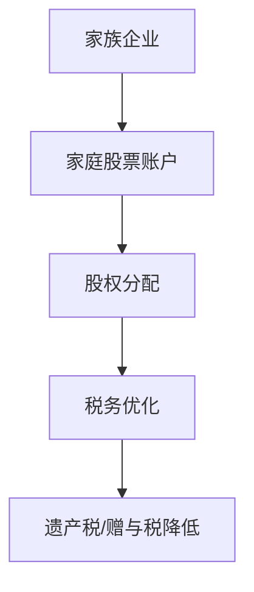
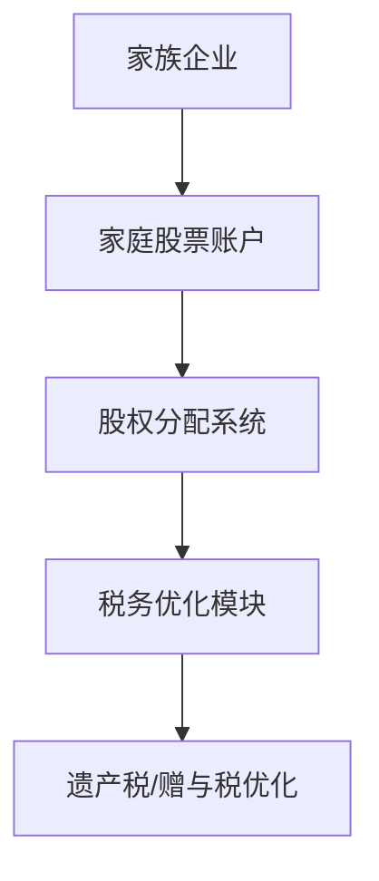
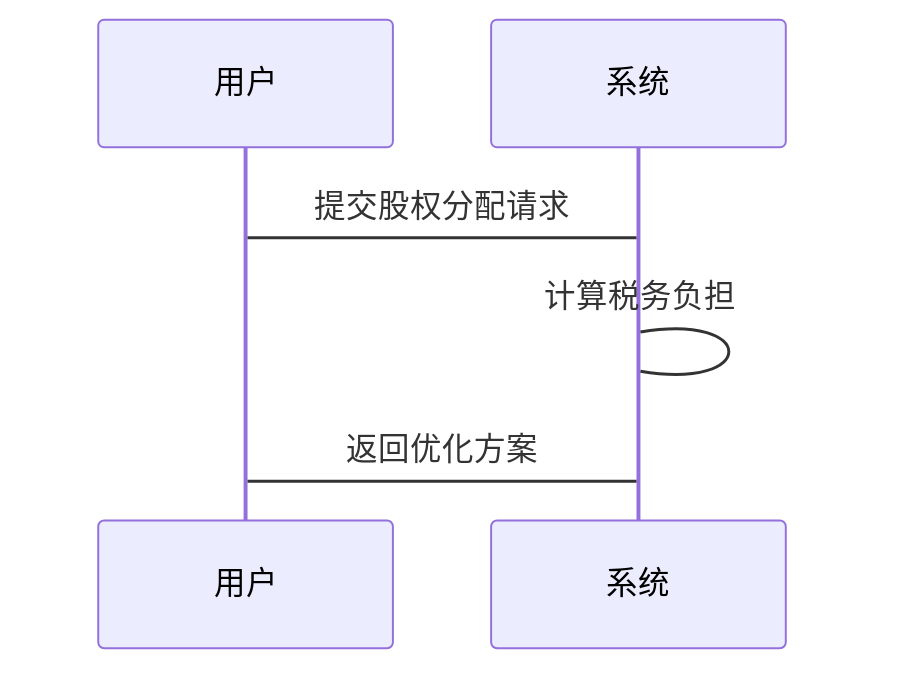
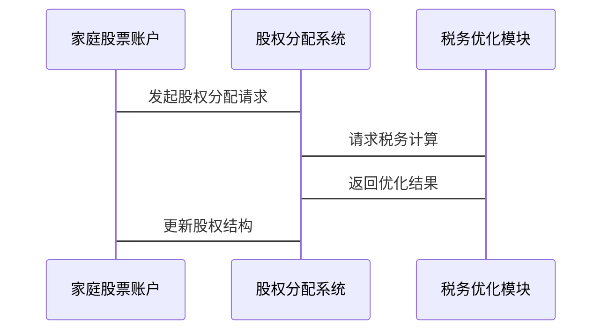

                 


# 彼得林奇的"家庭股票"在跨代财富传承中的税务优化

## 关键词：家庭股票，跨代财富传承，税务优化，彼得林奇，遗产税，赠与税，财富管理

## 摘要：本文详细探讨彼得林奇提出的“家庭股票”概念在跨代财富传承中的税务优化策略。通过分析家庭股票的特点、优势及其在税务规划中的应用，结合实际案例，阐述如何利用家庭股票结构进行有效的税务优化，确保财富的顺利传承，同时降低税务负担。

---

# 第1章 背景介绍

## 1.1 跨代财富传承的背景与重要性

### 1.1.1 跨代财富传承的定义

跨代财富传承是指将财富从一代人传递给下一代人，通常涉及家族企业、资产和资金的转移。这一过程需要考虑税务、法律和家庭关系等多个方面。

### 1.1.2 跨代财富传承的重要性

随着家族财富的积累，如何有效传承财富成为一个重要课题。跨代财富传承不仅关乎财富的延续，还涉及家族企业的稳定发展和税务负担的最小化。

### 1.1.3 跨代财富传承中的常见问题

- 税务负担：遗产税、赠与税等可能大幅侵蚀财富。
- 资产分割：如何公平分配资产给各个继承人。
- 家族企业管理：如何确保企业传承过程中不中断。

## 1.2 家庭股票的概念与特点

### 1.2.1 定义与特点

家庭股票是一种特殊类型的股票，用于家族内部的财富传承。它具有以下特点：
- 专属性：仅限于家族成员持有。
- 税务优化：通过合理设计，减少税务负担。
- 灵活性：可以根据家族需求调整股权结构。

### 1.2.2 家庭股票的优势

- 税务优化：通过赠与或继承的方式，合理规划税务负担。
- 资产隔离：保护家族资产，避免因继承问题引发纠纷。
- 持续性：确保家族企业或资产的长期稳定。

### 1.2.3 家庭股票与其他财富传承工具的对比

| 工具       | 优点                           | 缺点                             |
|------------|--------------------------------|----------------------------------|
| 遗嘱       | 简单易行，直接指定继承人         | 税务负担重，可能引发继承纠纷     |
| 信托       | 灵活，可指定用途和受益人           | 成立和维护成本较高                 |
| 家庭股票   | 税务优化，资产隔离，灵活性高       | 设计复杂，需要专业团队支持         |

---

# 第2章 家庭股票的税务优化原理

## 2.1 税务优化的核心策略

### 2.1.1 赠与税的优化

赠与税是跨代财富传承中的一个重要税种。通过合理规划赠与行为，可以有效降低赠与税的负担。

### 2.1.2 遗产税的优化

遗产税的计算与资产的估值密切相关。通过将资产转化为家庭股票，可以降低遗产税的计算基数。

### 2.1.3 综合优化策略

- 将资产逐步转化为家庭股票，分阶段进行赠与。
- 合理分配股权，确保各继承人的利益平衡。

## 2.2 家庭股票的税务结构设计

### 2.2.1 税务结构图

以下是一个简单的家庭股票税务结构图：



### 2.2.2 税务结构的优化点

- 通过家庭股票账户集中管理资产，减少多次赠与带来的税务负担。
- 合理分配股权，确保各继承人利益均衡，同时降低遗产税的计算基数。

---

# 第3章 家庭股票的系统分析与架构设计

## 3.1 系统功能设计

### 3.1.1 家庭股票账户的建立

- 确定家庭股票的发行主体和受益人。
- 设定股权分配规则。

### 3.1.2 资产配置与管理

- 将家族资产逐步转化为家庭股票。
- 定期调整资产配置，确保资产保值增值。

### 3.1.3 税务规划与优化

- 制定税务规划方案，合理分配赠与和继承的比例。
- 监测税务政策变化，及时调整优化策略。

## 3.2 系统架构设计

### 3.2.1 系统架构图



### 3.2.2 系统模块划分

- 家庭股票账户管理模块：负责账户的建立和维护。
- 股权分配系统：制定和执行股权分配规则。
- 税务优化模块：计算和调整税务负担。

## 3.3 系统交互设计

### 3.3.1 用户与系统的交互流程



### 3.3.2 系统内部的交互流程



---

# 第4章 家庭股票的实施与实战

## 4.1 项目实战

### 4.1.1 环境安装

- 配合专业律师和税务顾问，建立家庭股票账户。
- 确定股权分配规则和税务优化策略。

### 4.1.2 核心代码实现

以下是一个简化的核心代码示例：

```python
# 家庭股票账户管理代码示例
class FamilyStockAccount:
    def __init__(self, initial_assets):
        self.assets = initial_assets
        self.shareholders = []
    
    def add_shareholder(self, shareholder):
        self.shareholders.append(shareholder)
    
    def calculate_tax(self, tax_rate):
        total_tax = sum(asset * tax_rate for asset in self.assets)
        return total_tax

# 股权分配系统代码示例
class EquityDistributionSystem:
    def __init__(self, family_stock_account):
        self.account = family_stock_account
    
    def distribute_equity(self, shareholders, allocation_ratio):
        for shareholder in shareholders:
            self.account.assets.append(shareholder * allocation_ratio)
```

### 4.1.3 案例分析

假设一个家族企业拥有1000万美元资产，计划将80%的资产转化为家庭股票，分配给两位子女。股权分配比例为各40%。

```python
# 初始化家庭股票账户
initial_assets = 10000000
family_stock = FamilyStockAccount(initial_assets)

# 分配股权
shareholders = [0.4, 0.4]
allocator = EquityDistributionSystem(family_stock)
allocator.distribute_equity(shareholders, 0.8)

# 计算税务
tax_rate = 0.1
total_tax = family_stock.calculate_tax(tax_rate)
print(f"Total tax: ${total_tax}")
```

---

# 第5章 最佳实践与总结

## 5.1 最佳实践

- **及早规划**：尽早开始家庭股票账户的建立和税务规划。
- **专业团队**：与律师、税务顾问等专业人员合作，确保方案的合法性。
- **定期审查**：定期审查和调整税务优化策略，适应政策变化。

## 5.2 小结

通过合理设计家庭股票账户，结合税务优化策略，可以有效降低跨代财富传承中的税务负担，确保财富的顺利传承。彼得林奇的家庭股票理念为家族财富管理提供了新的思路。

## 5.3 注意事项

- 家庭股票的设计和实施需要遵守相关法律法规。
- 税务政策可能会变化，需要定期审查和调整策略。
- 股权分配需公平合理，避免引发内部矛盾。

## 5.4 拓展阅读

- 彼得林奇的其他投资理念。
- 其他财富传承工具的比较分析。

---

通过以上结构，本文系统地分析了彼得林奇的“家庭股票”在跨代财富传承中的税务优化策略，结合实际案例和系统设计，为读者提供了全面的指导和启示。

