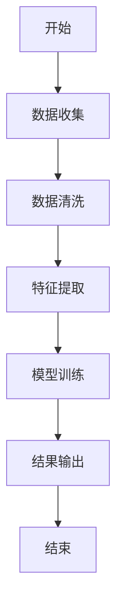
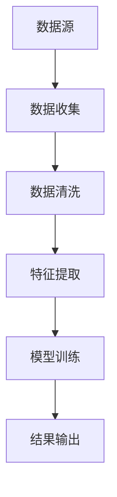

                 


# 彼得林奇的"家庭股票"投资法则

## 关键词：家庭股票投资，彼得林奇，投资法则，股票筛选算法，风险管理，投资策略

## 摘要：
本文深入探讨了彼得林奇的家庭股票投资法则，分析了其核心理念、算法原理和系统架构。通过背景介绍、核心概念、算法流程图、数学模型、系统架构图等多维度的详细讲解，帮助读者理解如何在家庭理财中应用这些投资法则。文章还通过实战案例，展示了如何使用Python代码实现股票筛选算法，并提供了最佳实践和注意事项。

---

## 第一部分: 家庭股票投资的背景与重要性

### 第1章: 家庭股票投资的背景与重要性

#### 1.1 家庭股票投资的背景
- **现代家庭的财务需求**  
  随着经济的发展，家庭财务管理变得越来越复杂。股票作为一种高收益的投资工具，成为许多家庭实现财务自由的重要手段。  
- **股票投资在家庭理财中的地位**  
  股票投资不仅能够为家庭提供额外的收入来源，还能帮助家庭实现资产的保值和增值。  
- **家庭股票投资的潜在优势**  
  通过合理的股票配置，家庭可以在长期获得稳定的收益，同时分散投资风险。

#### 1.2 彼得林奇投资法则的核心理念
- **彼得林奇的投资哲学**  
  彼得林奇强调长期投资和价值投资，认为股票的价值最终会反映其内在价值。  
- **家庭股票投资的长期性**  
  家庭股票投资应以长期增值为目标，避免频繁交易和短期波动的影响。  
- **投资中的风险管理**  
  家庭在进行股票投资时，必须注重风险管理，合理配置资产，以降低投资风险。

---

## 第二部分: 家庭股票投资的核心概念与联系

### 第2章: 家庭股票投资的核心概念与联系

#### 2.1 家庭股票投资的核心概念
- **股票的基本定义与分类**  
  股票是公司所有权的凭证，分为普通股和优先股。普通股具有投票权，优先股则享有优先分红权。  
- **家庭财务规划中的股票配置**  
  在家庭财务规划中，股票通常占资产配置的重要部分，具体比例取决于家庭的财务状况和风险承受能力。  
- **家庭股票投资的目标设定**  
  家庭股票投资的目标通常包括资产增值、收入稳定和风险分散。

#### 2.2 核心概念之间的关系
- **投资目标与资产配置的关系**  
  投资目标决定了资产配置的比例，例如，高风险偏好者可以配置更多股票，而低风险偏好者则配置更多债券。  
- **风险偏好与股票选择的关联**  
  风险偏好影响股票选择，风险厌恶型投资者倾向于选择低波动率的股票，而风险寻求型投资者则选择高波动率的股票。  
- **时间 horizon 与投资策略的匹配**  
  长期投资者可以承受更大的波动率，而短期投资者则需要更加谨慎。

---

### 第3章: 家庭股票投资的算法原理

#### 3.1 股票筛选算法
- **基于基本面的股票筛选**  
  基本面分析包括对公司财务状况的分析，如市盈率（P/E）、市净率（P/B）等指标。  
- **基于技术面的股票筛选**  
  技术面分析包括对股票价格和成交量的分析，如移动平均线、MACD等指标。  
- **综合筛选算法的实现**  
  综合筛选算法结合了基本面和技术面分析，通过多个指标的综合评分来筛选优质股票。

#### 3.2 算法流程图


---

### 第4章: 家庭股票投资的数学模型与公式

#### 4.1 常用数学模型
- **市盈率（P/E）计算公式**  
  $$ P/E = \frac{股票价格}{每股收益} $$
- **市净率（P/B）计算公式**  
  $$ P/B = \frac{股票价格}{每股净资产} $$
- **股息率计算公式**  
  $$ Dividend Yield = \frac{每股股息}{股票价格} $$

---

## 第三部分: 家庭股票投资的系统分析与架构设计方案

### 第5章: 家庭股票投资的系统分析与架构设计方案

#### 5.1 项目介绍
- **项目背景**  
  本项目旨在通过算法实现彼得林奇的家庭股票投资法则，帮助家庭投资者实现资产的长期增值。  
- **项目目标**  
  开发一个基于Python的股票筛选系统，能够根据基本面和技术面指标筛选优质股票。

#### 5.2 系统功能设计
- **数据收集模块**  
  从多个数据源获取股票数据，包括历史价格、财务数据等。  
- **数据清洗模块**  
  对数据进行预处理，去除无效数据，填补缺失值。  
- **特征提取模块**  
  提取股票的市盈率、市净率等关键指标。  
- **模型训练模块**  
  使用机器学习算法训练股票筛选模型。  
- **结果输出模块**  
  输出筛选出的优质股票列表。

#### 5.3 系统架构设计


#### 5.4 系统接口设计
- **API接口**  
  提供RESTful API接口，供其他系统调用。  
- **数据格式**  
  使用JSON格式传输数据，确保数据的可读性和可处理性。

---

## 第四部分: 家庭股票投资的项目实战

### 第6章: 家庭股票投资的项目实战

#### 6.1 环境安装
- **安装Python**  
  安装最新版本的Python，确保版本兼容性。  
- **安装必要的库**  
  使用pip安装numpy、pandas、matplotlib等库。

#### 6.2 核心代码实现
```python
import pandas as pd
import numpy as np

# 数据收集
data = pd.read_csv('stock_data.csv')

# 数据清洗
data.dropna(inplace=True)

# 特征提取
data['PE'] = data['Price'] / data['EPS']
data['PB'] = data['Price'] / data['BVPS']

# 模型训练
from sklearn.model_selection import train_test_split
X = data[['PE', 'PB']]
y = data['Target']
X_train, X_test, y_train, y_test = train_test_split(X, y, test_size=0.2)

from sklearn.ensemble import RandomForestClassifier
model = RandomForestClassifier()
model.fit(X_train, y_train)

# 结果输出
importances = model.feature_importances_
print(importances)
```

#### 6.3 案例分析
- **案例背景**  
  假设我们有一个包含多只股票的数据集，目标是筛选出具有高成长性的股票。  
- **数据处理**  
  使用Python代码对数据进行清洗和特征提取。  
- **模型训练**  
  使用随机森林算法训练股票筛选模型，输出特征重要性。  
- **结果解读**  
  根据特征重要性，筛选出最重要的几个股票作为投资标的。

---

## 第五部分: 家庭股票投资的最佳实践

### 第7章: 家庭股票投资的最佳实践

#### 7.1 最佳实践 tips
- **分散投资**  
  不要将所有资金投入一只股票，应分散投资以降低风险。  
- **长期持有**  
  长期持有优质股票，避免频繁交易。  
- **定期调整**  
  定期审视投资组合，根据市场变化进行调整。

#### 7.2 小结
- **总结全文**  
  彼得林奇的家庭股票投资法则为我们提供了宝贵的经验，通过合理的资产配置和股票筛选，可以实现家庭资产的长期增值。  
- **展望未来**  
  随着技术的进步，家庭股票投资将更加智能化和便捷化。

#### 7.3 注意事项
- **风险提示**  
  股票投资存在风险，投资者需谨慎操作。  
- **合规性提示**  
  确保投资行为符合相关法律法规。

#### 7.4 拓展阅读
- **推荐书籍**  
  《彼得林奇的投资哲学》、《股票作手回忆录》  
- **推荐网站**  
  Yahoo Finance、Morningstar

---

## 总结
通过本文的详细讲解，读者可以全面了解彼得林奇的家庭股票投资法则，并通过实际案例和代码实现，掌握如何在家庭理财中应用这些投资法则。希望本文能够为家庭投资者提供有价值的参考和指导。

