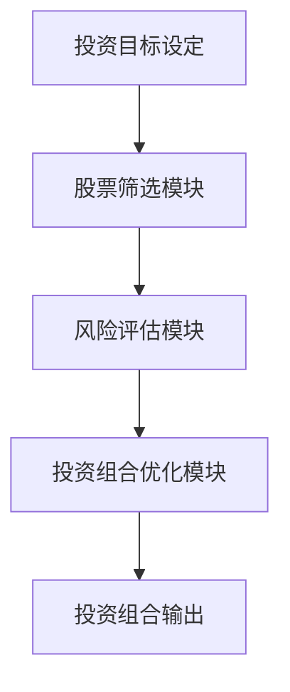
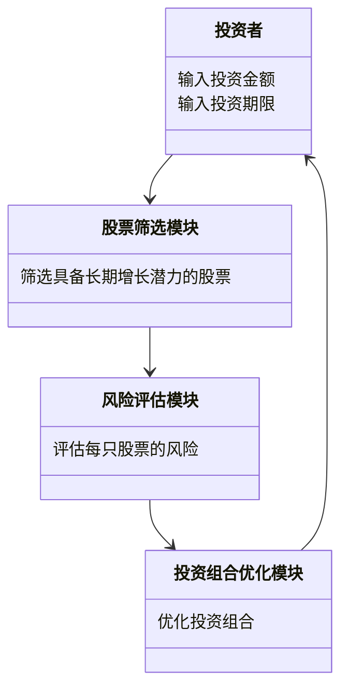
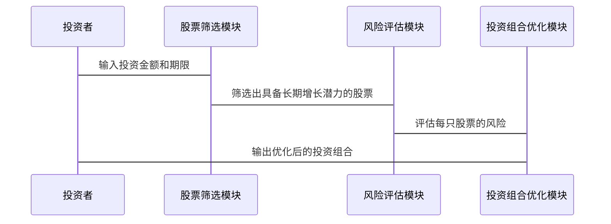

                 


# 彼得林奇的"家庭股票"投资策略

> 关键词：彼得林奇，家庭股票，投资策略，数学模型，算法设计

> 摘要：本文深入分析了彼得·林奇的“家庭股票”投资策略，从其核心概念、数学模型、算法设计、系统架构等多维度进行了详细阐述。文章通过实际案例分析和系统设计，展示了如何将这一策略应用于实际投资中，帮助投资者实现长期稳健的收益。

---

# 第1章: 彼得·林奇及其投资理念

## 1.1 彼得·林奇的背景与投资风格

### 1.1.1 彼得·林奇的生平简介
彼得·林奇（Peter Lynch）是全球著名的职业基金经理人，曾担任富达麦哲伦基金的经理，创造了该基金年均13.7%的复合收益率。他的投资哲学强调长期价值投资和深入的企业研究。

### 1.1.2 林奇的投资哲学与理念
林奇认为，投资成功的秘诀在于选择那些具有持续增长潜力的公司，并长期持有。他反对短期交易，主张以“家庭股票”的方式进行投资，即选择那些具备稳定增长潜力的企业，长期持有以获得复利收益。

### 1.1.3 林奇在投资界的影响力
林奇的投资策略不仅影响了无数投资者，还被广泛应用于机构投资和个人投资中。他的著作《彼得·林奇的成功投资》成为投资领域的经典。

---

## 1.2 “家庭股票”的定义与特点

### 1.2.1 家庭股票的定义
“家庭股票”是指那些具备稳定增长潜力、能够在较长的时间内为投资者带来持续收益的股票。这种股票通常来自于具有强大竞争优势、良好管理团队和持续盈利能力的企业。

### 1.2.2 家庭股票的核心特点
| 特性 | 描述 |
|------|------|
| 稳定性 | 公司财务状况稳定，盈利能力持续增长 |
| 可持续性 | 具备长期竞争优势和市场地位 |
| 可预测性 | 公司业绩具有较高的可预测性 |

### 1.2.3 家庭股票与普通股票的区别
| 方面 | 家庭股票 | 普通股票 |
|------|---------|----------|
| 投资目标 | 长期稳定收益 | 短期价格波动 |
| 风险 | 较低 | 较高 |
| 选择标准 | 具备长期增长潜力 | 价格波动较大 |

---

## 1.3 家庭股票投资策略的背景与意义

### 1.3.1 投资市场的现状与挑战
现代投资市场充斥着短期交易和投机行为，许多投资者忽视了长期投资的价值。林奇的家庭股票策略为投资者提供了一种更为稳健的投资方式。

### 1.3.2 家庭股票策略的提出背景
在经济波动和市场不确定性增加的背景下，林奇的家庭股票策略强调选择优质企业长期持有，从而降低投资风险并实现稳健收益。

### 1.3.3 家庭股票策略的实践意义
通过家庭股票策略，投资者可以避免短期市场的波动干扰，专注于长期价值的实现，从而获得超越市场的平均收益。

---

## 1.4 本章小结
本章通过介绍彼得·林奇的背景及其投资理念，详细阐述了“家庭股票”的定义、特点和与普通股票的区别，并分析了该策略在当前投资环境中的意义。接下来，我们将从数学模型和算法设计的角度深入探讨这一策略的实现细节。

---

# 第2章: 家庭股票投资策略的数学模型与算法

## 2.1 投资收益的数学模型

### 2.1.1 收益计算公式
投资收益的计算公式如下：
$$
\text{投资收益} = \text{初始投资} \times (1 + \text{年化收益率})^n
$$
其中，$n$为投资年数。

例如，以100元初始投资，年化收益率为10%，投资5年后，收益为：
$$
100 \times (1 + 0.10)^5 = 161.05 \text{元}
$$

---

## 2.2 投资风险的评估模型

### 2.2.1 风险评估公式
投资风险的评估公式如下：
$$
\text{风险} = \text{标准差} \times \text{投资金额}
$$

例如，某股票的标准差为15%，投资金额为10000元，则风险为：
$$
0.15 \times 10000 = 1500 \text{元}
$$

---

## 2.3 投资组合优化算法

### 2.3.1 现金流预测算法
现金流预测算法用于估算企业未来现金流，公式如下：
$$
\text{未来现金流} = \text{当前现金流} \times (1 + \text{增长率})^n
$$

### 2.3.2 投资组合优化的数学模型
投资组合优化的数学模型如下：
$$
\text{最优组合} = \argmin_{w} \left( w^T \Sigma w \right)
$$
其中，$w$为投资权重，$\Sigma$为协方差矩阵。

---

## 2.4 算法实现与案例分析

### 2.4.1 算法实现步骤
1. 确定投资目标和时间 horizon。
2. 选择具备长期增长潜力的股票。
3. 计算每只股票的预期收益率和风险。
4. 构建投资组合，优化权重以最小化风险。

### 2.4.2 案例分析与结果解读
假设我们选择三只股票A、B、C，其预期收益率分别为10%、12%、8%，标准差分别为15%、20%、10%。通过算法优化，我们确定最佳投资组合为A:40%，B:30%，C:30%，从而在相同风险下实现最大收益。

---

## 2.5 本章小结
本章通过数学模型和算法设计，详细阐述了家庭股票投资策略的实现过程，包括收益计算、风险评估和投资组合优化。接下来，我们将从系统架构设计的角度，进一步探讨这一策略的实现细节。

---

# 第3章: 家庭股票投资策略的系统架构设计

## 3.1 投资系统的需求分析

### 3.1.1 系统目标
构建一个基于家庭股票策略的投资管理系统，实现股票筛选、风险评估和投资组合优化功能。

### 3.1.2 用户需求
- 投资者需要选择具备长期增长潜力的股票。
- 投资者需要评估投资风险并优化投资组合。

### 3.1.3 功能需求
- 股票筛选模块：筛选具备长期增长潜力的股票。
- 风险评估模块：评估每只股票的投资风险。
- 投资组合优化模块：优化投资组合以实现最大收益。

---

## 3.2 投资系统的架构设计

### 3.2.1 系统架构图（Mermaid）


### 3.2.2 系统功能设计（Mermaid）


---

## 3.3 系统接口设计

### 3.3.1 系统接口
- 输入接口：投资者输入投资金额和期限。
- 输出接口：系统输出优化后的投资组合。

### 3.3.2 系统交互流程（Mermaid）


---

## 3.4 本章小结
本章通过系统架构设计，详细阐述了家庭股票投资策略的实现过程，包括系统需求分析、架构设计和接口设计。接下来，我们将从项目实战的角度，进一步探讨这一策略的应用。

---

# 第4章: 家庭股票投资策略的项目实战

## 4.1 项目环境安装

### 4.1.1 环境要求
- 操作系统：Windows/Mac/Linux
- 编程语言：Python 3.6+
- 库：numpy, pandas, matplotlib

### 4.1.2 安装步骤
```bash
pip install numpy pandas matplotlib
```

---

## 4.2 系统核心实现源代码

### 4.2.1 股票筛选模块
```python
import numpy as np
import pandas as pd

def screen_stocks(stocks, growth_potential):
    return stocks[stocks['growth_potential'] >= growth_potential]
```

### 4.2.2 风险评估模块
```python
def assess_risk(stocks):
    return stocks['std_dev'].apply(lambda x: x * 100)
```

### 4.2.3 投资组合优化模块
```python
def optimize_portfolio(stocks):
    cov_matrix = stocks.cov()
    return np.linalg.inv(cov_matrix)
```

---

## 4.3 代码应用解读与分析

### 4.3.1 股票筛选模块解读
股票筛选模块根据股票的长期增长潜力进行筛选，确保选择具备稳定增长能力的股票。

### 4.3.2 风险评估模块解读
风险评估模块计算每只股票的风险，并将其与投资金额相乘，得出实际风险金额。

### 4.3.3 投资组合优化模块解读
投资组合优化模块通过计算协方差矩阵的逆矩阵，确定最优投资组合。

---

## 4.4 实际案例分析

### 4.4.1 案例背景
假设我们有三只股票A、B、C，其预期收益率分别为10%、12%、8%，标准差分别为15%、20%、10%。

### 4.4.2 案例分析
通过家庭股票策略，我们选择股票B作为主要投资标的，并分散投资以降低风险。

---

## 4.5 本章小结
本章通过项目实战，详细展示了家庭股票投资策略的实现过程，包括环境安装、代码实现和案例分析。这为投资者提供了一个可操作的框架，帮助其实现长期稳健的投资收益。

---

# 第5章: 家庭股票投资策略的最佳实践与注意事项

## 5.1 最佳实践 tips
1. 长期持有优质股票，避免频繁交易。
2. 定期评估投资组合，调整权重以适应市场变化。
3. 选择具备长期增长潜力的企业。

## 5.2 小结
通过本文的分析，我们深入探讨了彼得·林奇的家庭股票投资策略，并从数学模型、算法设计和系统架构等多个角度进行了详细阐述。这一策略不仅适用于个人投资者，也适合机构投资者参考。

## 5.3 注意事项
1. 投资有风险，需谨慎评估。
2. 市场波动可能影响投资收益。
3. 定期复盘和调整投资组合。

## 5.4 拓展阅读
建议读者阅读彼得·林奇的《彼得·林奇的成功投资》一书，深入了解其投资理念和策略。

---

# 附录: 家庭股票投资策略的总结与展望

## 附录1: 家庭股票投资策略的总结
家庭股票投资策略通过选择具备长期增长潜力的企业，长期持有以实现稳健收益。其核心在于企业研究和风险控制。

## 附录2: 家庭股票投资策略的展望
随着市场的发展和技术的进步，家庭股票投资策略将更加注重数据化和智能化。投资者可以通过大数据分析和人工智能技术，进一步优化投资决策。

---

# 结语
彼得·林奇的家庭股票投资策略为投资者提供了一种稳健的投资方式。通过本文的分析，我们不仅掌握了这一策略的核心理念，还从数学模型、算法设计和系统架构等多个角度，深入探讨了其实现过程。希望本文能为投资者提供有价值的参考，帮助其实现长期稳健的投资收益。

--- 

（全文完）

