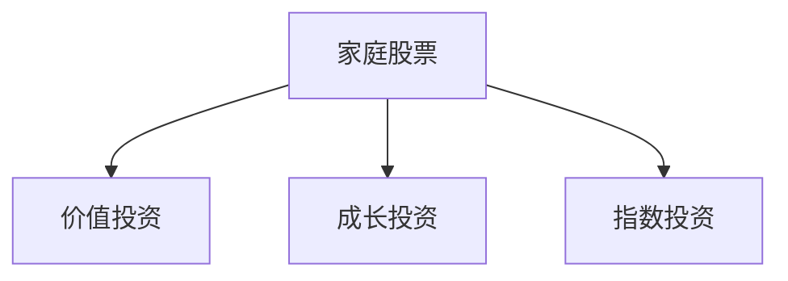
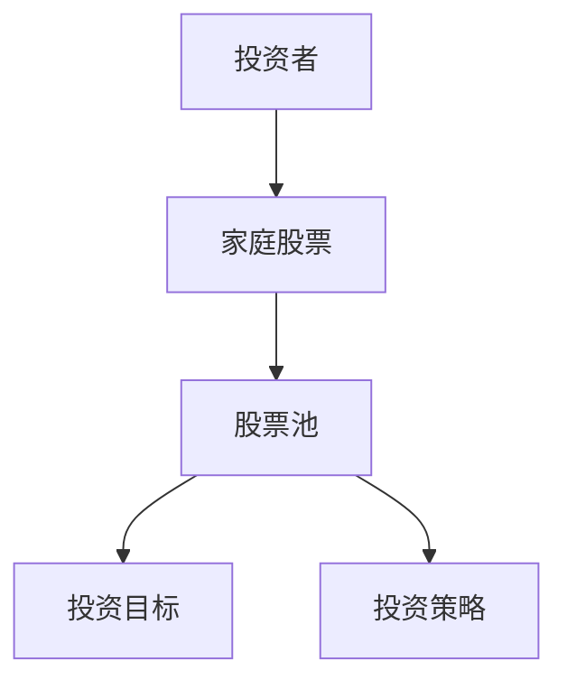
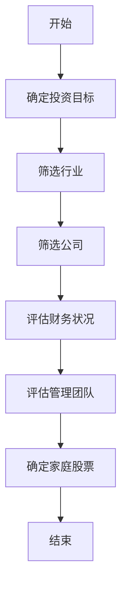

                 


# 彼得林奇的"家庭股票"长期跟踪方法

## 关键词：彼得林奇，家庭股票，投资方法，长期跟踪，股票筛选，风险管理

## 摘要：  
彼得林奇的“家庭股票”方法是一种以长期持有的优质股票为核心的投资策略，强调基本面分析和风险管理。本文将详细分析这种方法的核心理念、筛选标准、跟踪与管理策略，以及如何构建和优化投资组合，为投资者提供实用的指导。

---

# 第一部分：彼得林奇的“家庭股票”长期跟踪方法概述

## 第1章：彼得林奇的投资理念与“家庭股票”方法背景

### 1.1 彼得林奇的投资理念

#### 1.1.1 彼得林奇的投资者身份与成就  
彼得·林奇是美国著名的投资专家，曾管理富达麦哲伦基金，创造了辉煌的投资业绩。他的投资理念以基本面分析和长期持有优质股票为核心，强调深入研究和耐心等待投资标的的价值体现。

#### 1.1.2 彼得林奇的核心投资思想  
彼得林奇的投资思想强调：  
1. **价值投资**：寻找具有强大竞争优势和良好财务状况的公司。  
2. **长期持有**：避免频繁交易，减少交易成本和心理干扰。  
3. **分散投资**：通过多样化投资降低风险，同时集中投资于优质股票。  

#### 1.1.3 “家庭股票”方法的提出背景  
“家庭股票”方法是彼得林奇在长期投资实践中总结出的一种策略，旨在帮助投资者筛选出具有长期增长潜力的股票，并通过持续跟踪和管理，实现稳健的投资收益。

---

### 1.2 “家庭股票”的定义与目标

#### 1.2.1 家庭股票的定义  
“家庭股票”是指那些具有强大竞争优势、良好财务状况、优秀管理团队和持续增长潜力的公司股票。这些股票适合长期持有，能够在市场波动中保持稳定增长。

#### 1.2.2 家庭股票的核心目标  
- **稳定增长**：通过长期持有优质股票，实现资产的稳步增值。  
- **风险控制**：通过基本面分析和风险管理，降低投资风险。  
- **长期跟踪**：持续关注股票的表现，及时调整投资策略。  

#### 1.2.3 家庭股票与传统投资方法的区别  
下表对比了“家庭股票”方法与传统投资方法的主要区别：

| **对比维度** | **家庭股票方法** | **传统投资方法** |  
|--------------|-------------------|-------------------|  
| 投资期限     | 长期持有          | 短期交易          |  
| 投资策略     | 价值导向          | 技术分析或趋势交易|  
| 风险控制     | 强调基本面分析     | 更依赖市场情绪    |  

---

## 第2章：家庭股票的核心概念与联系

### 2.1 家庭股票的核心概念

#### 2.1.1 家庭股票的属性特征  
- **市场地位**：公司在行业中具有竞争优势，市场份额稳定。  
- **财务健康**：公司财务状况良好，盈利能力和现金流稳定。  
- **管理团队**：公司管理层能力强，治理结构透明。  
- **成长潜力**：公司在未来有明确的增长空间。  

#### 2.1.2 家庭股票与企业基本面的关系  
家庭股票的核心在于公司的基本面分析。以下是基本面分析的关键指标：

- **市盈率（P/E）**：衡量股票的估值水平，公式为：  
  $$ \text{市盈率} = \frac{\text{股价}}{\text{每股收益}} $$  
- **市净率（P/B）**：衡量股票相对于账面价值的高低，公式为：  
  $$ \text{市净率} = \frac{\text{股价}}{\text{每股净资产}} $$  
- **ROE（净资产收益率）**：衡量公司盈利能力，公式为：  
  $$ \text{ROE} = \frac{\text{净利润}}{\text{股东权益}} $$  

#### 2.1.3 家庭股票与其他投资策略的对比  
下图展示了“家庭股票”与其他投资策略的关系：  



---

### 2.2 核心概念的ER实体关系图



---

## 第3章：家庭股票的筛选标准与流程

### 3.1 家庭股票的筛选标准

#### 3.1.1 市场地位与竞争优势  
- 公司在行业中具有领先地位，市场份额稳定。  
- 具备强大的品牌影响力和客户忠诚度。  

#### 3.1.2 财务健康状况  
- 公司盈利能力和现金流稳定，ROE持续高于行业平均水平。  
- 负债率低，财务风险可控。  

#### 3.1.3 管理团队与公司治理  
- 管理层能力强，有明确的发展战略。  
- 公司治理结构透明，关联交易少，内控机制完善。  

#### 3.1.4 行业前景与成长空间  
- 行业处于成长期或成熟期，具备较大的增长潜力。  
- 公司未来几年有明确的增长点，如技术创新或市场扩展。  

---

### 3.2 家庭股票的筛选流程

#### 3.2.1 确定投资目标  
- 明确投资目标和风险承受能力，制定投资计划。  

#### 3.2.2 筛选行业  
- 根据行业前景和成长空间，选择具有较大潜力的行业。  

#### 3.2.3 筛选公司  
- 在目标行业中，筛选具备竞争优势和良好财务状况的公司。  

#### 3.2.4 评估财务状况  
- 通过财务指标（如ROE、市盈率等）评估公司财务健康状况。  

#### 3.2.5 评估管理团队  
- 调查公司管理层的背景和能力，评估其治理结构。  

#### 3.2.6 确定家庭股票  
- 综合评估后，将符合条件的股票加入股票池。  

下图展示了家庭股票的筛选流程：



---

## 第4章：家庭股票的长期跟踪与管理

### 4.1 家庭股票的跟踪指标

#### 4.1.1 股价波动分析  
- 定期观察股票价格波动，评估市场情绪和投资风险。  

#### 4.1.2 财务指标变化  
- 关注公司财务指标的变化，如ROE、净利润增长率等。  

#### 4.1.3 行业趋势与市场环境  
- 分析行业趋势和宏观经济环境，评估对公司的影响。  

---

### 4.2 家庭股票的动态管理策略

#### 4.2.1 定期评估与调整  
- 每季度或半年对投资组合进行评估，根据市场变化调整持仓。  

#### 4.2.2 风险控制与止损机制  
- 设置止损点，避免重大损失。  

#### 4.2.3 长期持有与价值发现  
- 长期持有优质股票，耐心等待价值的实现。  

---

## 第5章：家庭股票投资组合的构建与优化

### 5.1 投资组合的构建原则

#### 5.1.1 多元化配置  
- 通过多样化投资降低风险，避免过度集中于某一只股票或行业。  

#### 5.1.2 量化分析  
- 使用量化指标筛选股票，确保投资决策的科学性。  

---

### 5.2 投资组合的优化策略

#### 5.2.1 动态调整  
- 根据市场变化和公司基本面调整投资组合。  

#### 5.2.2 价值挖掘  
- 持续挖掘具有潜力的股票，替换不符合条件的股票。  

---

## 第6章：家庭股票方法的实际应用与案例分析

### 6.1 实际应用

#### 6.1.1 环境安装  
- 需要安装数据分析工具，如Excel、Python等。  

#### 6.1.2 核心实现源代码  
- 使用Python编写股票筛选代码，如下所示：

```python
import pandas as pd
import yfinance as yf

# 下载数据
def get_stock_data(ticker):
    data = yf.download(ticker, start='2020-01-01', end='2023-12-31')
    return data['Close']

# 筛选标准
def screen_stocks(tickers):
    selected = []
    for ticker in tickers:
        data = get_stock_data(ticker)
        # 计算市盈率
        pe = data[-1] / data[data['净利润'][-1]]
        if pe < 15 and data['ROE'][-1] > 15:
            selected.append(ticker)
    return selected

# 示例
tickers = ['AAPL', 'MSFT', 'GOOGL']
selected = screen_stocks(tickers)
print("符合条件的股票:", selected)
```

---

### 6.2 案例分析

#### 6.2.1 案例背景  
假设我们选择苹果公司（AAPL）作为家庭股票。  

#### 6.2.2 分析过程  
- 苹果公司是全球领先的科技公司，市场地位稳固。  
- 公司财务状况健康，ROE持续高于行业平均水平。  
- 管理层能力强，具备明确的发展战略。  

#### 6.2.3 投资建议  
- 长期持有苹果股票，定期跟踪其财务指标和市场表现。  

---

## 第7章：总结与展望

### 7.1 总结

- 彼得林奇的“家庭股票”方法是一种以长期持有的优质股票为核心的投资策略。  
- 通过基本面分析和风险管理，帮助投资者实现稳健的投资收益。  

### 7.2 注意事项

- 投资者应根据自身风险承受能力和投资目标选择适合的投资策略。  
- 定期评估和调整投资组合，确保投资目标的实现。  

### 7.3 拓展阅读

- 《彼得林奇的成功投资》  
- 《价值投资入门》  

---

## 关键词：彼得林奇，家庭股票，投资方法，长期跟踪，股票筛选，风险管理

