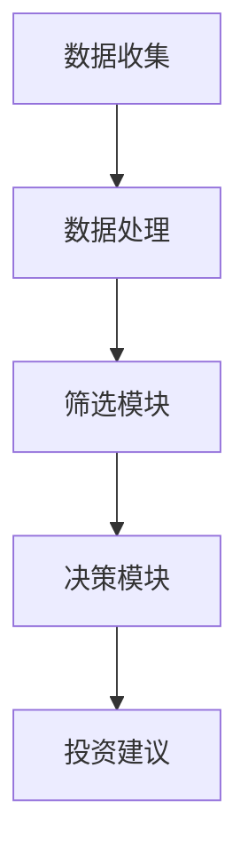

                 


# 彼得林奇的"小盘价值股"在不同经济周期中的筛选策略

> 关键词：彼得林奇，小盘价值股，经济周期，投资策略，选股标准

> 摘要：本文深入分析了彼得·林奇在不同经济周期中筛选小盘价值股的策略，探讨了其选股标准、经济周期对投资的影响，以及如何通过动态调整策略来优化投资组合。通过理论分析和实际案例，为投资者提供了实用的指导。

---

## 第一部分：背景介绍

### 第1章：小盘价值股的定义与特点

#### 1.1 小盘价值股的定义
- **小盘股**：通常指市值较小的公司股票，通常在30亿至20亿美元之间。
- **价值股**：相对于成长股，价值股通常价格低于其内在价值，具有较低的市盈率和市净率。

#### 1.2 小盘价值股的特点
- **低估值**：市盈率和市净率通常低于行业平均水平。
- **高潜力**：小盘股通常具有较高的增长潜力，尤其是在经济复苏期。
- **波动性**：小盘股价格波动较大，但回报潜力也更大。

### 第2章：彼得·林奇的投资理念

#### 2.1 彼得·林奇的生平与投资风格
- **背景**：彼得·林奇是美国著名投资经理，曾管理富达麦哲伦基金，创造了年化13%的超额收益。
- **投资风格**：注重基本面分析，寻找具有竞争优势的公司，尤其是小盘价值股。

#### 2.2 林奇的选股标准
- **低市盈率**：通常选择市盈率低于行业平均水平的公司。
- **高股息率**：倾向于选择股息率较高的公司，作为价值的信号。
- **强大的管理层**：公司治理结构良好，管理层能力强。

---

## 第二部分：核心概念与联系

### 第3章：经济周期对小盘价值股的影响

#### 3.1 不同经济周期的特征
- **衰退期**：经济增长放缓，企业盈利下降，小盘股通常会受到较大冲击，但具有低估值优势。
- **复苏期**：经济开始恢复，小盘股可能表现出较大的反弹潜力。
- **增长期**：经济快速发展，小盘股可能因为高增长而被市场忽视，提供投资机会。
- **成熟期**：经济稳定，小盘股可能因为行业地位稳固而表现稳定。

#### 3.2 小盘价值股在各周期的表现
- **衰退期**：防御性较强，但收益有限。
- **复苏期**：反弹潜力大，适合长期持有。
- **增长期**：增长潜力大，但需警惕估值过高。
- **成熟期**：表现稳定，适合长期投资。

### 第4章：小盘价值股与其他投资策略的对比

#### 4.1 对比分析
| 投资策略 | 小盘价值股 | 成长股 | 蓝筹股 |
|----------|------------|--------|--------|
| 市值范围 | 小         | 中大   | 中大   |
| 估值水平 | 低         | 中高   | 高     |
| 风险水平 | 中高       | 高     | 中低   |
| 收益潜力 | 高         | 高     | 中     |

#### 4.2 投资策略的选择
- **成长股**：适合经济快速增长期，注重公司未来增长潜力。
- **蓝筹股**：适合经济成熟期，注重稳定性和防御性。
- **小盘价值股**：适合经济复苏期和增长期，注重低估值和高潜力。

---

## 第三部分：算法原理

### 第5章：彼得·林奇的选股模型

#### 5.1 选股标准的数学公式
- **市盈率（P/E）**：$$P/E = \frac{Price}{Earnings}$$
- **市净率（P/B）**：$$P/B = \frac{Price}{Book\ Value}$$
- **股息率**：$$Dividend\ Yield = \frac{Dividend}{Price} \times 100\%$$

#### 5.2 筛选流程
1. 筛选市值在30亿至20亿美元之间的公司。
2. 计算P/E和P/B，选择低于行业平均水平的公司。
3. 筛选股息率较高且持续增长的公司。
4. 分析公司基本面，确保具有竞争优势和强大管理层。
5. 根据经济周期调整筛选标准。

---

## 第四部分：系统分析与架构设计

### 第6章：系统架构设计

#### 6.1 数据收集模块
- 数据源：股票数据库，包括市值、市盈率、市净率、股息率等。
- 数据处理：清洗和预处理数据，确保数据准确性。

#### 6.2 筛选模块
- 输入：经济周期判断。
- 输出：符合筛选标准的公司列表。

#### 6.3 决策模块
- 输入：公司列表和经济周期。
- 输出：投资建议和动态调整策略。

#### 6.4 系统架构图


---

## 第五部分：项目实战

### 第7章：实际案例分析

#### 7.1 案例背景
- **经济周期**：假设当前处于经济复苏期。
- **目标**：筛选小盘价值股，构建投资组合。

#### 7.2 环境安装
- 数据库：MySQL或MongoDB，用于存储股票数据。
- 工具：Python，Pandas，Matplotlib。

#### 7.3 核心代码实现
```python
import pandas as pd

# 数据加载
df = pd.read_csv('stock_data.csv')

# 筛选小盘股（市值在30亿至20亿美元之间）
df = df[(df['Market Cap'] >= 3e8) & (df['Market Cap'] <= 2e9)]

# 计算市盈率和市净率
df['P/E'] = df['Price'] / df['Earnings']
df['P/B'] = df['Price'] / df['Book Value']

# 筛选低估值公司（P/E < 行业平均，P/B < 行业平均）
industry_avg_pe = df['P/E'].mean()
industry_avg_pb = df['P/B'].mean()
selected = df[(df['P/E'] < industry_avg_pe) & (df['P/B'] < industry_avg_pb)]

# 筛选高股息率公司
selected = selected[selected['Dividend Yield'] > selected['Dividend Yield'].mean()]

# 输出结果
print(selected[['Company Name', 'P/E', 'P/B', 'Dividend Yield']])
```

#### 7.4 案例分析
- **数据预处理**：清洗数据，确保数据准确性。
- **筛选过程**：根据P/E、P/B和股息率筛选出符合条件的公司。
- **结果分析**：对比筛选出的公司与行业平均水平，评估其投资潜力。

---

## 第六部分：总结与最佳实践

### 第8章：总结

#### 8.1 小结
- 彼得·林奇的小盘价值股策略在不同经济周期中表现各异。
- 投资者应根据经济周期动态调整筛选标准，优化投资组合。

#### 8.2 投资建议
- **经济衰退期**：注重防御性，选择低估值的小盘股。
- **经济复苏期**：积极布局，挖掘小盘股的反弹潜力。
- **经济成熟期**：注重稳定性和防御性，选择具有强大竞争优势的小盘股。

#### 8.3 注意事项
- **风险控制**：分散投资，避免过度集中。
- **持续学习**：关注经济动态和公司基本面变化。
- **长期视角**：价值投资需要时间和耐心。

#### 8.4 拓展阅读
- 彼得·林奇的书籍：《彼得·林奇的成功投资》、《选股的艺术》。
- 相关投资策略：价值投资、成长投资、股息投资。

---

通过以上分析，我们可以看到，彼得·林奇的小盘价值股策略在不同经济周期中具有显著的优势，但也需要投资者具备敏锐的市场洞察力和灵活的调整能力。希望本文能为投资者提供有价值的指导和启发。

