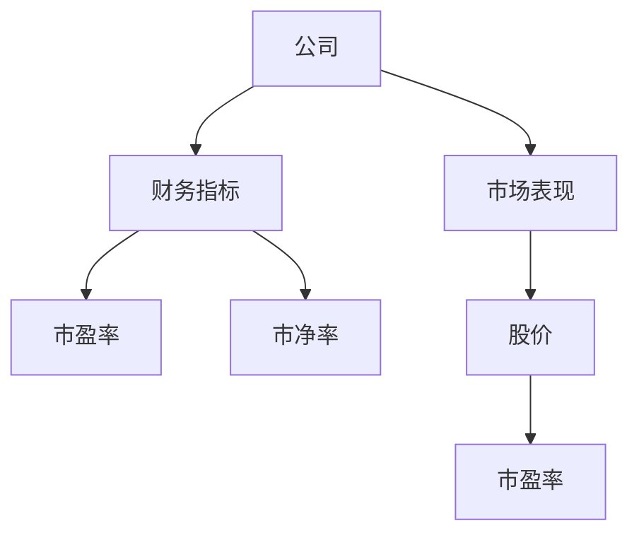
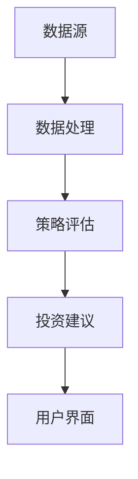

                 


---

# 彼得林奇的"小盘成长股"在不同货币政策环境下的选股策略

## 关键词：彼得林奇，小盘成长股，货币政策，选股策略，投资分析

## 摘要：本文探讨了彼得林奇的“小盘成长股”投资策略，并分析其在不同货币政策环境下的应用。通过背景介绍、核心概念对比、数学模型构建、系统架构设计和项目实战，详细阐述了如何在不同货币政策下优化选股策略，为投资者提供实用的指导。

---

## 第一部分: 背景介绍与核心概念

### 第1章: 彼得林奇与小盘成长股概述

#### 1.1 彼得林奇的投资理念
彼得·林奇是美国著名投资家，以其在小盘成长股投资上的成功闻名。他强调基本面分析和长期投资，认为市场中存在许多被低估的优秀公司，尤其是小盘成长股。他的策略注重寻找那些具有高成长潜力、低估值的公司。

#### 1.2 小盘成长股的定义与特点
小盘成长股指的是市值较小但具有高成长潜力的公司股票。这类股票通常市盈率较低，但收入和利润增长迅速。彼得林奇认为，小盘成长股在长期具有较高的增值空间。

#### 1.3 货币政策对股市的影响
货币政策通过影响利率、货币供应量和市场流动性来影响股市。扩张性货币政策通常会降低利率，增加市场流动性，刺激股市上涨；紧缩性货币政策则相反，可能抑制股市表现。

### 第2章: 小盘成长股与货币政策的关联

#### 2.1 小盘成长股的核心特征
- **低市盈率**：市盈率低于行业平均水平，表明股票价格相对较低。
- **高成长性**：收入和利润持续增长，具有较高的扩展潜力。
- **公司基本面**：财务状况健康，资产负债表稳健。

#### 2.2 货币政策对小盘成长股的影响
- **宽松货币政策**：降低利率，增加企业融资，促进小盘股增长。
- **紧缩货币政策**：提高利率，增加企业融资成本，可能抑制小盘股表现。

### 第3章: 小盘成长股的选股策略

#### 3.1 彼得林奇的选股标准
- **低市盈率**：选择市盈率低于行业平均水平的股票。
- **高成长性**：关注收入和利润持续增长的公司。
- **公司基本面**：分析财务报表，确保公司财务健康。

#### 3.2 不同货币政策环境下的策略调整
- **宽松环境**：增加对高成长行业的配置。
- **紧缩环境**：转向防御性行业，如公用事业。

---

## 第二部分: 核心概念与联系

### 第4章: 小盘成长股的核心概念与属性对比

#### 4.1 小盘成长股与其他股票类型的对比
| 类型        | 定义与特点                        | 投资策略                      |
|-------------|-----------------------------------|------------------------------|
| 大盘成长股  | 市值大，成长性强                 | 稳定增长，风险较低            |
| 小盘价值股  | 市值小，市盈率低                 | 价值被低估，长期增值潜力     |
| 大盘价值股  | 市值大，市盈率低                 | 稳定收益，防御性较强          |

#### 4.2 货币政策类型与市场影响的对比
| 类型        | 定义与特点                        | 对股市的影响                  |
|-------------|-----------------------------------|------------------------------|
| 扩张性货币政策 | 降低利率，增加流动性            | 刺激股市上涨                 |
| 紧缩性货币政策 | 提高利率，减少流动性            | 抑制股市表现                 |
| 中性货币政策 | 保持利率稳定，不主动干预        | 市场表现平稳                 |

### 第5章: 小盘成长股的ER实体关系图



---

## 第三部分: 算法原理与数学模型

### 第6章: 小盘成长股的评估模型

#### 6.1 小盘成长股评估模型的构建
- **输入**：公司财务数据、市场数据。
- **输出**：股票评分，投资建议。
- **流程**：数据收集→模型计算→结果分析。

#### 6.2 算法原理
- **市盈率计算**：市盈率=股价/每股收益。
- **成长性评分**：基于收入和利润增长率。

示例：
$$\text{市盈率} = \frac{\text{股价}}{\text{每股收益}}$$
$$\text{成长性评分} = \text{收入增长率} \times 0.5 + \text{利润增长率} \times 0.5$$

### 第7章: 系统架构设计

#### 7.1 系统功能设计
- 数据收集模块：获取公司财务数据和市场数据。
- 策略评估模块：计算股票评分，生成投资建议。
- 风险控制模块：监控市场变化，调整投资组合。

#### 7.2 系统架构图


---

## 第四部分: 项目实战

### 第8章: 环境安装与数据收集

#### 8.1 环境安装
- 安装Python和必要的库（如Pandas、NumPy）。

#### 8.2 数据收集
使用Yahoo Finance API获取股票数据。

### 第9章: 核心实现与代码示例

#### 9.1 代码示例
```python
import pandas as pd
import numpy as np

# 示例数据
data = {'股票': ['A', 'B', 'C'], 
        '市盈率': [15, 20, 18], 
        '收入增长率': [10, 5, 8], 
        '利润增长率': [12, 7, 6]}
df = pd.DataFrame(data)

# 计算成长性评分
df['成长性评分'] = df['收入增长率'] * 0.5 + df['利润增长率'] * 0.5

print(df)
```

### 第10章: 结果分析与优化

#### 10.1 结果分析
根据评分筛选出高成长性股票。

#### 10.2 策略优化
根据当前货币政策调整投资比例。

---

## 第五部分: 总结与展望

### 第11章: 最佳实践与总结

#### 11.1 小结
彼得林奇的小盘成长股策略在不同货币政策环境下表现各异。投资者需灵活调整策略，结合市场环境做出决策。

#### 11.2 注意事项
- 定期评估投资组合。
- 保持对市场变化的敏感性。
- 分散投资，降低风险。

### 第12章: 拓展阅读与未来研究方向

#### 12.1 拓展阅读
- 彼得林奇的书籍《彼得林奇的成功投资》。
- 研究其他投资策略在不同货币政策下的表现。

#### 12.2 未来研究方向
- 结合机器学习优化选股模型。
- 研究更多宏观经济指标对股市的影响。

---

# 结语
通过本文的分析，读者可以了解彼得林奇的小盘成长股策略在不同货币政策环境下的应用，并掌握如何根据市场变化优化投资策略。希望本文能为投资者提供有价值的指导和启发。

