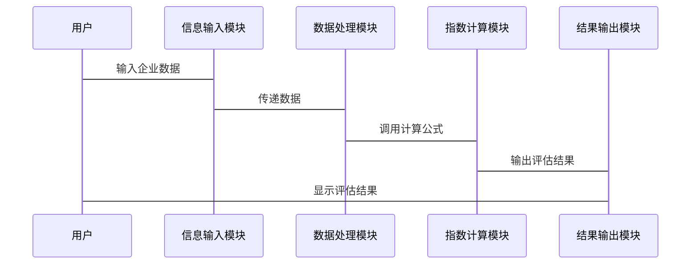

                 


# 彼得林奇的"市场先行者"优势持续性评估方法

> 关键词：市场先行者，竞争优势，持续性评估，彼得林奇，投资策略

> 摘要：本文从彼得林奇的投资理念出发，详细探讨市场先行者的优势及其持续性评估方法。通过分析市场先行者的核心竞争优势、市场环境影响、评估框架及关键成功因素，结合实际案例和系统架构设计，提出一套完整的评估体系，为投资者提供科学的决策依据。

---

# 第1章: 市场先行者与竞争优势概述

## 1.1 市场先行者概念

### 1.1.1 市场先行者的定义
市场先行者是指在某一市场或行业中，最早推出某种产品或服务的企业。这类企业通常具有先发优势，能够率先占领市场份额，形成品牌效应和客户忠诚度。

### 1.1.2 市场先行者的核心特征
- **先发优势**：市场先行者能够在市场中快速建立品牌形象和客户基础。
- **技术创新**：许多市场先行者通过技术创新占据了市场领先地位。
- **成本优势**：早期进入市场的企业往往能够通过规模经济降低成本。

### 1.1.3 市场先行者的优势与挑战
- **优势**：市场先行者能够快速获取市场份额，形成竞争壁垒。
- **挑战**：随着市场竞争加剧，市场先行者的优势可能逐渐被后来者削弱。

## 1.2 彼得林奇的市场观

### 1.2.1 彼得林奇的投资理念
彼得林奇是美国著名投资经理人，以其独特的投资策略闻名。他认为，投资成功的关键在于选择具有持续竞争优势的企业。

### 1.2.2 市场先行者在彼得林奇策略中的地位
彼得林奇非常重视市场先行者的优势，认为这类企业能够在市场中长期保持领先地位，为投资者带来稳定的收益。

### 1.2.3 市场先行者优势的持续性评估意义
通过评估市场先行者的优势是否能够持续，投资者可以更好地判断企业的长期发展潜力。

## 1.3 市场先行者优势的评估背景

### 1.3.1 企业竞争环境的变化
市场竞争的加剧和技术的进步使得市场先行者的竞争优势面临挑战。

### 1.3.2 市场先行者优势的动态性
市场先行者的优势并非一成不变，需要不断评估和调整。

### 1.3.3 评估方法的必要性
为了确保市场先行者的优势能够持续，投资者需要一套科学的评估方法。

## 1.4 本章小结
市场先行者作为市场竞争中的重要角色，其优势是否能够持续直接影响企业的长期发展。彼得林奇的投资理念为我们提供了评估市场先行者优势的重要视角。

---

# 第2章: 市场先行者竞争优势分析

## 2.1 市场先行者的核心竞争优势

### 2.1.1 品牌优势
市场先行者通常能够通过早期进入市场，快速建立品牌知名度和客户忠诚度。

### 2.1.2 技术领先
许多市场先行者通过技术创新占据了市场领先地位，形成了技术壁垒。

### 2.1.3 成本优势
市场先行者往往能够通过规模经济降低成本，形成价格竞争优势。

## 2.2 不同类型市场先行者的竞争优势对比

### 2.2.1 科技型市场先行者
科技型市场先行者通过技术创新占据市场领先地位，如苹果、谷歌等。

### 2.2.2 传统型市场先行者
传统型市场先行者通过规模化和成本控制占据市场优势，如沃尔玛、丰田等。

### 2.2.3 两者对比与优劣势分析
- **科技型市场先行者**：优势在于技术创新和高增长潜力，但可能面临技术迭代快的风险。
- **传统型市场先行者**：优势在于稳定的运营模式和成本控制，但可能在技术变革中失去优势。

## 2.3 市场先行者竞争优势的动态变化

### 2.3.1 竞争优势的周期性
市场先行者的优势通常会随着时间的推移而逐渐减弱，需要不断进行创新和调整。

### 2.3.2 竞争优势的转移因素
- **技术进步**：新技术的出现可能削弱原有技术优势。
- **市场竞争**：新进入者的竞争可能导致市场份额流失。
- **客户需求变化**：客户需求的变化可能使原有竞争优势不再适用。

### 2.3.3 竞争优势的维持策略
- **持续创新**：通过技术研发和产品创新保持技术领先。
- **成本控制**：通过优化流程和管理降低成本，保持价格竞争优势。
- **品牌建设**：通过营销和品牌建设增强客户忠诚度。

## 2.4 本章小结
市场先行者的核心竞争优势包括品牌、技术和成本优势，不同类型企业各有优劣。竞争优势并非一成不变，需要通过持续创新和优化来维持。

---

# 第3章: 市场环境对市场先行者优势的影响

## 3.1 宏观经济环境的影响

### 3.1.1 经济周期对市场先行者的影响
- **经济繁荣期**：市场先行者能够快速扩大市场份额。
- **经济衰退期**：市场先行者可能面临需求下降和成本上升的双重压力。

### 3.1.2 政策环境对市场先行者的影响
- **行业政策**：政府政策的调整可能影响市场先行者的竞争优势。
- **税收政策**：税收优惠或增加可能影响企业的成本结构。

## 3.2 行业周期对市场先行者的影响

### 3.2.1 行业生命周期的四个阶段
- **引入期**：市场先行者占据优势。
- **成长期**：市场竞争加剧，优势逐渐减弱。
- **成熟期**：市场饱和，竞争优势主要体现在成本和品牌。
- **衰退期**：市场需求下降，竞争优势难以维持。

### 3.2.2 行业周期对市场先行者优势的具体影响
- **引入期**：市场先行者能够快速获取市场份额。
- **成长期**：市场竞争加剧，优势逐渐被削弱。
- **成熟期**：企业需要通过成本控制和品牌建设维持优势。
- **衰退期**：市场需求下降，竞争优势难以维持。

## 3.3 政策法规对市场先行者的影响

### 3.3.1 行业政策变化
- **行业准入政策**：可能影响市场先行者的竞争优势。
- **反垄断政策**：可能限制市场先行者的市场支配地位。

### 3.3.2 知识产权保护
- **专利保护**：能够有效保护市场先行者的技术创新优势。
- **商标保护**：能够增强品牌竞争力。

## 3.4 本章小结
市场环境对市场先行者的优势影响深远，宏观经济、行业周期和政策法规等因素都会对竞争优势产生重要影响。

---

# 第4章: 彼得林奇的市场先行者优势持续性评估框架

## 4.1 评估框架的构建

### 4.1.1 评估维度
- **市场地位**：市场份额、品牌影响力等。
- **竞争优势**：技术创新、成本优势等。
- **持续能力**：企业的创新能力、管理能力等。

### 4.1.2 评估指标
- **市场份额**：企业占据的市场份额比例。
- **利润率**：企业的盈利能力。
- **研发投入**：企业的技术创新能力。
- **客户忠诚度**：客户的满意度和忠诚度。

## 4.2 评估框架的数学模型

### 4.2.1 竞争优势指数（Competitive Advantage Index, CAI）
$$ \text{CAI} = \frac{\text{市场份额} + \text{利润率} + \text{研发投入}}{3} $$

### 4.2.2 持续能力指数（Sustainability Index, SI）
$$ \text{SI} = \text{创新能力} \times \text{管理能力} \times \text{市场适应能力} $$

## 4.3 评估框架的实施步骤

### 4.3.1 确定评估指标
根据企业特点选择合适的评估指标。

### 4.3.2 数据收集
收集企业的市场份额、利润率、研发投入等数据。

### 4.3.3 计算指数
使用上述数学模型计算竞争优势指数和持续能力指数。

### 4.3.4 评估结果
根据计算结果对企业竞争优势的持续性进行评估。

## 4.4 实际案例分析

### 4.4.1 案例介绍
以某科技公司为例，分析其市场地位、竞争优势和持续能力。

### 4.4.2 数据计算
计算该公司的CAI和SI指数，评估其竞争优势的持续性。

## 4.5 本章小结
通过构建评估框架，我们可以科学地评估市场先行者的优势是否能够持续，从而为投资者提供决策依据。

---

# 第5章: 市场先行者优势持续性的关键成功因素

## 5.1 创新能力

### 5.1.1 技术创新
市场先行者需要不断进行技术创新，保持技术领先。

### 5.1.2 产品创新
通过产品创新满足客户需求，保持市场竞争力。

## 5.2 成本控制

### 5.2.1 规模经济
通过规模化生产降低成本，保持价格竞争优势。

### 5.2.2 管理优化
通过优化管理流程降低成本。

## 5.3 品牌建设

### 5.3.1 品牌忠诚度
通过品牌建设增强客户忠诚度。

### 5.3.2 品牌影响力
通过营销和推广扩大品牌影响力。

## 5.4 案例分析

### 5.4.1 案例介绍
以某市场先行者为例，分析其在创新、成本控制和品牌建设方面的成功经验。

### 5.4.2 经验总结
总结市场先行者在优势持续性方面的成功经验，为其他企业提供借鉴。

## 5.5 本章小结
市场先行者优势的持续性取决于创新能力、成本控制和品牌建设等多个因素。

---

# 第6章: 市场先行者优势持续性评估的系统分析与架构设计

## 6.1 问题场景介绍

### 6.1.1 问题背景
市场先行者优势的持续性评估需要一个完整的系统支持。

### 6.1.2 问题目标
构建一个能够评估市场先行者优势持续性的系统。

## 6.2 系统功能设计

### 6.2.1 领域模型
```mermaid
classDiagram
    class MarketLeader {
        市场份额
        利润率
        研发投入
        创新能力
        管理能力
        市场适应能力
    }
    class 竞争优势指数(Competitive Advantage Index, CAI) {
        计算公式：CAI = (市场份额 + 利润率 + 研发投入) / 3
    }
    class 持续能力指数(Sustainability Index, SI) {
        计算公式：SI = 创新能力 × 管理能力 × 市场适应能力
    }
    MarketLeader --> 竞争优势指数
    MarketLeader --> 持续能力指数
```

### 6.2.2 系统架构设计


### 6.2.3 系统接口设计
- **输入接口**：接收企业的市场份额、利润率、研发投入等数据。
- **输出接口**：输出竞争优势指数和持续能力指数。

### 6.2.4 系统交互设计


## 6.3 系统实现

### 6.3.1 环境安装
- **Python环境**：安装Python 3.x及以上版本。
- **依赖库**：安装numpy、pandas等数据处理库。

### 6.3.2 核心功能实现

#### 6.3.2.1 竞争优势指数计算
```python
import numpy as np
import pandas as pd

def calculate_cai(enterprise_data):
    market_share = enterprise_data['market_share']
    profitability = enterprise_data['profitability']
    r

