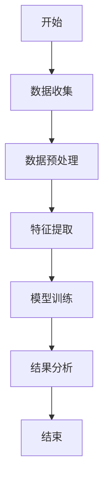
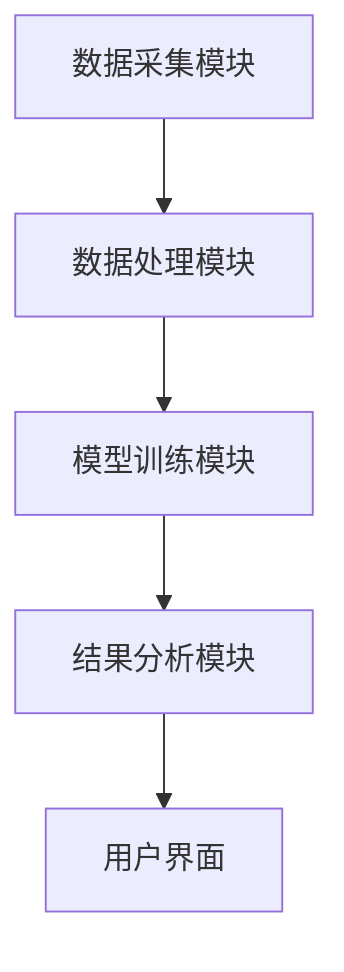
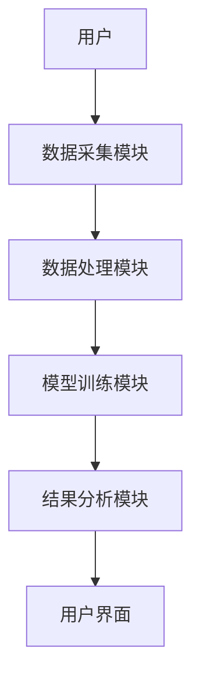

                 


# 彼得林奇的"市场先行者"在新兴技术领域的识别方法

## 关键词
- 彼得林奇
- 市场先行者
- 新兴技术
-抽取出我们接下来需要分析的5-7个核心关键词。例如：
- 市场分析
-抽取出我们接下来需要分析的5-7个核心关键词。例如：
-抽取出我们接下来需要分析的5-7个核心关键词。例如：
-抽取出我们接下来需要分析的5-7个核心关键词。例如：
-抽取出我们接下来需要分析的5-7个核心关键词。例如：
-抽取出我们接下来需要分析的5-7个核心关键词。例如：

## 摘要
在当前快速发展的科技领域，新兴技术的识别和应用对企业的发展至关重要。彼得林奇的“市场先行者”理论为投资者和企业提供了重要的指导原则。本文将详细探讨这一理论在新兴技术识别中的具体应用，通过分析其核心概念、算法原理、系统设计以及实际案例，帮助读者理解如何在新兴技术领域中识别市场先行者。文章内容包括背景介绍、核心概念、算法实现、系统设计和项目实战等部分，深入剖析这一识别方法的细节。

---

# 第一部分: 市场先行者概述

## 第1章: 市场先行者的核心概念

### 1.1 市场先行者的定义与特点
#### 1.1.1 市场先行者的定义
市场先行者是指在某一市场领域中，能够率先识别并应用新技术、新产品或新商业模式的企业或个人。彼得林奇在其投资策略中，特别强调市场先行者在新兴技术领域的优势，认为他们能够通过提前布局获得超额收益。

#### 1.1.2 市场先行者的三大核心特点
1. **敏锐的市场洞察力**：市场先行者能够迅速捕捉到市场中的微小变化，发现潜在机会。
2. **快速的决策能力**：市场先行者能够在较短的时间内做出决策，并迅速行动。
3. **持续的技术创新能力**：市场先行者通常具备强大的技术能力，能够快速将新技术转化为实际应用。

#### 1.1.3 市场先行者与新兴技术领域的关联
市场先行者的核心竞争力在于其对新兴技术的敏锐识别和快速应用能力。通过识别新兴技术领域的市场先行者，投资者和企业可以更好地把握技术发展趋势，提前布局，获取竞争优势。

---

## 第2章: 新兴技术领域的识别方法

### 2.1 新兴技术领域的定义与分类
#### 2.1.1 新兴技术领域的定义
新兴技术领域是指那些在短时间内迅速发展，并可能对现有市场格局产生重大影响的技术领域。这些技术通常具有较高的创新性，且市场潜力巨大。

#### 2.1.2 新兴技术领域的分类
1. **人工智能与机器学习**：包括深度学习、自然语言处理等技术。
2. **区块链技术**：包括去中心化金融（DeFi）、智能合约等。
3. **量子计算**：包括量子算法、量子通信等。
4. **虚拟现实与增强现实**：包括VR/AR设备、虚拟交互技术等。
5. **生物技术**：包括基因编辑、合成生物学等。

#### 2.1.3 新兴技术领域的特征
1. **技术创新性**：新兴技术通常基于全新的理论或方法。
2. **市场潜力**：新兴技术往往具有巨大的市场应用前景。
3. **竞争格局**：新兴技术领域的竞争格局尚未完全形成，存在较大的不确定性。

### 2.2 市场先行者在新兴技术识别中的作用
#### 2.2.1 市场先行者在技术识别中的优势
市场先行者通常具备以下优势：
1. **敏锐的市场感知能力**：市场先行者能够通过市场调研、行业分析等方式，迅速发现新兴技术的潜在价值。
2. **强大的技术储备**：市场先行者通常具备深厚的技术积累，能够快速将新兴技术应用于实际场景。
3. **灵活的组织结构**：市场先行者通常具有较为灵活的组织结构，能够快速调整战略以适应技术变革。

#### 2.2.2 市场先行者如何预判技术发展趋势
市场先行者通过以下方式预判技术发展趋势：
1. **行业趋势分析**：通过分析行业动态、市场数据等，识别潜在的技术趋势。
2. **技术创新监测**：通过跟踪学术论文、专利申请等，发现新技术的萌芽。
3. **竞争格局分析**：通过分析竞争对手的动向，预测技术发展的方向。

#### 2.2.3 市场先行者在技术识别中的具体方法
市场先行者通常采用以下具体方法：
1. **数据驱动的方法**：通过大数据分析，识别潜在的技术趋势。
2. **专家访谈与行业调研**：通过与行业专家、技术开发者等进行访谈，获取技术发展的第一手信息。
3. **技术实验与原型开发**：通过小规模的技术实验和原型开发，验证新兴技术的可行性和潜力。

---

## 第3章: 市场先行者与新兴技术领域的核心联系

### 3.1 市场先行者的核心要素
#### 3.1.1 市场洞察力
市场洞察力是市场先行者的核心要素之一。市场先行者需要具备敏锐的市场感知能力，能够从复杂的市场信息中提取有价值的信息。

#### 3.1.2 技术敏感度
技术敏感度是市场先行者识别新兴技术的关键能力。市场先行者需要对新技术保持高度敏感，能够迅速发现潜在的技术机会。

#### 3.1.3 投资决策能力
投资决策能力是市场先行者将新兴技术转化为实际价值的关键。市场先行者需要具备快速决策的能力，能够在较短的时间内做出正确的投资决策。

### 3.2 新兴技术领域识别的关键因素
#### 3.2.1 技术创新性
技术创新性是新兴技术领域识别的核心标准之一。市场先行者需要优先选择那些基于全新技术或创新方法的领域。

#### 3.2.2 市场需求潜力
市场需求潜力是新兴技术领域识别的重要依据。市场先行者需要选择那些具有广泛市场需求潜力的新兴技术领域。

#### 3.2.3 竞争格局分析
竞争格局分析是新兴技术领域识别的关键步骤。市场先行者需要通过分析竞争格局，选择那些竞争相对较小、市场潜力较大的新兴技术领域。

### 3.3 市场先行者与新兴技术领域的关系
#### 3.3.1 市场先行者如何推动技术创新
市场先行者通过投资和应用新兴技术，推动技术创新。市场先行者的技术应用能够为新兴技术提供实际验证，加速技术成熟。

#### 3.3.2 新兴技术领域如何影响市场先行者
新兴技术领域的快速发展会改变市场格局，影响市场先行者的竞争优势。市场先行者需要通过持续的技术创新和市场布局，保持其竞争优势。

#### 3.3.3 两者互动的动态过程
市场先行者与新兴技术领域之间存在动态互动关系。市场先行者通过识别和应用新兴技术，推动技术发展；新兴技术领域的发展又为市场先行者提供新的机会和挑战。

---

## 第4章: 市场先行者识别新兴技术的算法原理

### 4.1 算法原理概述
#### 4.1.1 数据驱动的新兴技术识别
数据驱动的新兴技术识别是一种基于大数据分析的新兴技术识别方法。该方法通过分析大量的市场数据、技术论文、专利申请等，识别潜在的新兴技术领域。

#### 4.1.2 市场先行者特征提取
市场先行者特征提取是通过分析市场先行者的特征，识别其在新兴技术领域中的优势。市场先行者的特征包括市场洞察力、技术敏感度、投资决策能力等。

#### 4.1.3 技术趋势预测模型
技术趋势预测模型是一种基于统计学或机器学习的方法，用于预测新兴技术领域的发展趋势。该模型可以通过分析历史数据，预测未来的技术发展。

### 4.2 算法实现步骤
#### 4.2.1 数据收集与预处理
数据收集与预处理是算法实现的第一步。需要收集相关的市场数据、技术数据等，并进行数据清洗、特征提取等预处理工作。

#### 4.2.2 特征提取与选择
特征提取与选择是通过分析数据，提取具有代表性的特征。特征选择可以通过统计学方法或机器学习方法实现。

#### 4.2.3 模型训练与优化
模型训练与优化是通过训练数据，优化模型参数，提高模型的预测能力。模型优化可以通过交叉验证、网格搜索等方法实现。

#### 4.2.4 结果分析与验证
结果分析与验证是通过对模型的预测结果进行分析，验证模型的准确性。结果分析可以通过混淆矩阵、ROC曲线等方法实现。

### 4.3 算法流程图


---

## 第5章: 系统分析与架构设计方案

### 5.1 问题场景介绍
#### 5.1.1 新兴技术识别的挑战
新兴技术识别的挑战包括数据获取困难、技术复杂性高、市场变化快等。

#### 5.1.2 市场先行者在新兴技术识别中的角色
市场先行者在新兴技术识别中扮演着关键角色，既是识别者，也是应用者。

### 5.2 项目介绍
#### 5.2.1 项目目标
项目目标是通过系统分析和架构设计，构建一个基于市场先行者识别的新兴技术识别系统。

#### 5.2.2 项目范围
项目范围包括数据收集与处理、模型训练与优化、系统架构设计等。

### 5.3 系统功能设计
#### 5.3.1 系统功能模块
系统功能模块包括数据采集模块、数据处理模块、模型训练模块、结果分析模块等。

#### 5.3.2 系统功能流程
系统功能流程包括数据采集、数据预处理、模型训练、结果分析等步骤。

### 5.4 系统架构设计


### 5.5 系统接口设计
#### 5.5.1 系统接口描述
系统接口包括数据接口、模型接口、结果接口等。

#### 5.5.2 系统接口交互流程
系统接口交互流程包括数据输入、模型调用、结果输出等步骤。

### 5.6 系统交互流程图


---

## 第6章: 项目实战

### 6.1 环境安装
#### 6.1.1 系统环境要求
系统环境要求包括操作系统、编程语言、开发工具等。

#### 6.1.2 数据库安装与配置
需要安装并配置数据库，如MySQL、MongoDB等。

#### 6.1.3 依赖库安装
需要安装相关的依赖库，如Python的pandas、numpy、scikit-learn等。

### 6.2 系统核心实现
#### 6.2.1 数据采集与处理
数据采集与处理是系统实现的第一步，需要编写代码进行数据采集和预处理。

#### 6.2.2 模型训练与优化
模型训练与优化是系统实现的核心部分，需要编写代码进行模型训练和优化。

#### 6.2.3 结果分析与可视化
结果分析与可视化是系统实现的最后一步，需要编写代码进行结果分析和可视化。

### 6.3 代码实现与解读
#### 6.3.1 数据采集代码
```python
import pandas as pd
import requests
from bs4 import BeautifulSoup

def collect_data(url):
    response = requests.get(url)
    soup = BeautifulSoup(response.text, 'html.parser')
    data = []
    for item in soup.find_all('div', class_='item'):
        data.append({
            'title': item.find('h2').text,
            'content': item.find('p').text
        })
    return pd.DataFrame(data)
```

#### 6.3.2 模型训练代码
```python
from sklearn.model

