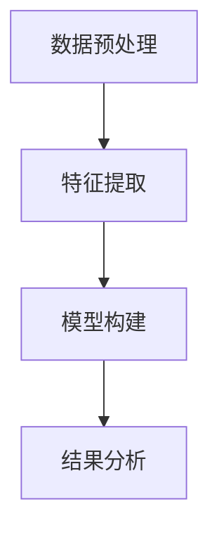
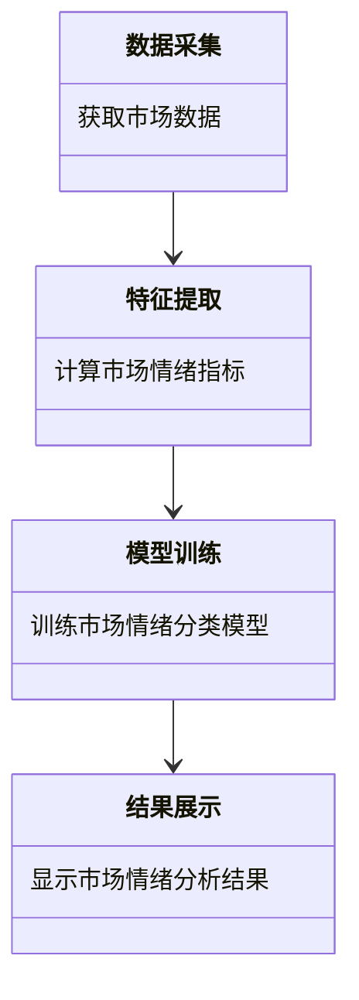

                 


# 彼得林奇的"市场情绪"判断技巧

> 关键词：市场情绪、彼得林奇、投资策略、情绪分析、市场趋势

> 摘要：本文深入探讨了彼得林奇的市场情绪分析方法，分析了其在投资决策中的重要性，并通过详细的技术分析和实际案例，展示了如何利用市场情绪指标进行投资策略优化。

---

## 正文

### 第1章: 背景介绍

#### 1.1 市场情绪的定义与重要性

##### 1.1.1 什么是市场情绪
市场情绪是指投资者在市场中的整体心理状态，反映了市场参与者对当前市场状况的乐观或悲观态度。

##### 1.1.2 市场情绪的影响因素
市场情绪受多种因素影响，包括经济数据、政策变化、市场新闻等。

##### 1.1.3 市场情绪与投资者行为的关系
市场情绪直接影响投资者的决策，进而影响市场的波动。

#### 1.2 彼得林奇的市场情绪分析方法

##### 1.2.1 彼得林奇的市场情绪理论概述
彼得林奇认为，市场情绪是影响投资决策的重要因素。

##### 1.2.2 彼得林奇市场情绪分析的核心思想
分析市场情绪的核心在于识别市场的乐观与悲观情绪，从而指导投资策略。

##### 1.2.3 彼得林奇市场情绪分析的应用场景
适用于股票市场、基金市场等金融市场的投资决策。

---

### 第2章: 核心概念与联系

#### 2.1 市场情绪的核心概念

##### 2.1.1 市场情绪的构成要素
市场情绪由市场参与度、市场估值和市场预期构成。

##### 2.1.2 市场情绪的动态变化
市场情绪会随着市场环境的变化而波动。

##### 2.1.3 市场情绪的相互作用
市场情绪与其他市场因素相互作用，共同影响市场走势。

#### 2.2 彼得林奇市场情绪分析的ER实体关系图

##### 2.2.1 实体识别
市场情绪、投资者行为、市场数据。

##### 2.2.2 关系识别
市场情绪与投资者行为的关系，投资者行为与市场数据的关系。

##### 2.2.3 属性识别
市场情绪的强度、投资者行为的类型、市场数据的特征。

```mermaid
erDiagram
    class 市场情绪 {
        市场情绪强度
    }
    class 投资者行为 {
        行为类型
    }
    class 市场数据 {
        数据特征
    }
    市场情绪 --| 投资者行为 : 影响
    投资者行为 --| 市场数据 : 反映
```

---

### 第3章: 算法原理

#### 3.1 数据预处理

##### 3.1.1 数据清洗
去除无效数据，处理缺失值。

##### 3.1.2 数据标准化
将数据标准化，便于后续分析。

#### 3.2 特征提取

##### 3.2.1 市场情绪指标
计算恐慌指数（VIX）和市场情绪指数（PSI）。

##### 3.2.2 投资者行为特征
分析投资者的买卖行为。

#### 3.3 模型构建

##### 3.3.1 市场情绪分类模型
使用机器学习算法对市场情绪进行分类。

##### 3.3.2 投资决策模型
基于市场情绪预测市场趋势。

#### 3.4 结果分析

##### 3.4.1 情绪与市场的相关性分析
分析市场情绪与市场走势的相关性。

##### 3.4.2 投资策略优化
根据市场情绪调整投资策略。



```python
import pandas as pd
import numpy as np

# 数据预处理
data = pd.read_csv('market_data.csv')
data = data.dropna()
data = (data - data.mean()) / data.std()

# 特征提取
vix = data['VIX'].values
psi = data['PSI'].values

# 模型构建
from sklearn.ensemble import RandomForestClassifier
model = RandomForestClassifier()
model.fit(vix.reshape(-1, 1), psi.reshape(-1, 1))

# 结果分析
importances = model.feature_importances_
print(importances)
```

---

### 第4章: 系统分析与架构设计

#### 4.1 系统功能设计

##### 4.1.1 领域模型
市场情绪分析系统的功能模块包括数据采集、特征提取、模型训练和结果展示。



#### 4.2 系统架构设计

##### 4.2.1 系统架构
采用分层架构，包括数据层、业务逻辑层和表现层。

##### 4.2.2 接口设计
定义数据接口和模型接口，便于模块之间的交互。

##### 4.2.3 交互设计
通过用户界面展示分析结果，用户可以输入参数进行分析。

---

### 第5章: 项目实战

#### 5.1 实战环境安装

##### 5.1.1 安装必要的库
安装pandas、numpy、scikit-learn等库。

#### 5.2 核心实现代码

##### 5.2.1 数据预处理
读取数据并进行标准化处理。

##### 5.2.2 特征提取
计算恐慌指数和市场情绪指数。

##### 5.2.3 模型训练
训练随机森林分类器，预测市场情绪。

##### 5.2.4 结果展示
可视化分析结果，展示市场情绪的变化趋势。

#### 5.3 实战案例分析

##### 5.3.1 案例背景
选择特定时间段的市场数据进行分析。

##### 5.3.2 数据分析
分析市场情绪的变化，判断市场趋势。

##### 5.3.3 投资策略调整
根据分析结果调整投资组合。

---

### 第6章: 最佳实践与总结

#### 6.1 关键点总结

##### 6.1.1 理解市场情绪的重要性
市场情绪是投资决策的重要因素。

##### 6.1.2 掌握分析方法
正确使用彼得林奇的方法进行市场情绪分析。

##### 6.1.3 结合其他因素
综合考虑多种因素，制定全面的投资策略。

#### 6.2 注意事项

##### 6.2.1 数据质量
确保数据的准确性和完整性。

##### 6.2.2 模型优化
不断优化模型，提高分析准确性。

##### 6.2.3 风险控制
合理控制风险，避免过度依赖市场情绪分析。

#### 6.3 拓展阅读

##### 6.3.1 推荐书籍
《彼得林奇的投资策略》。

##### 6.3.2 相关论文
市场情绪分析的经典论文。

---

### 第7章: 结语

彼得林奇的市场情绪分析方法为投资者提供了重要的决策工具。通过深入理解市场情绪的核心概念，掌握算法原理和系统设计，投资者可以更好地制定投资策略，提升投资效果。

--- 

以上是《彼得林奇的"市场情绪"判断技巧》的目录大纲及内容概要，希望对您有所帮助。

