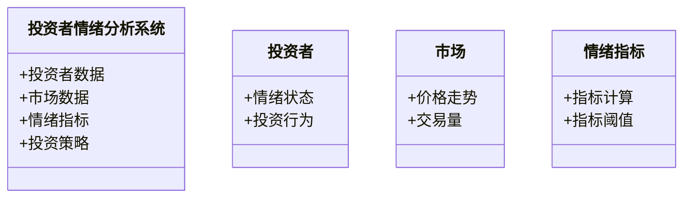
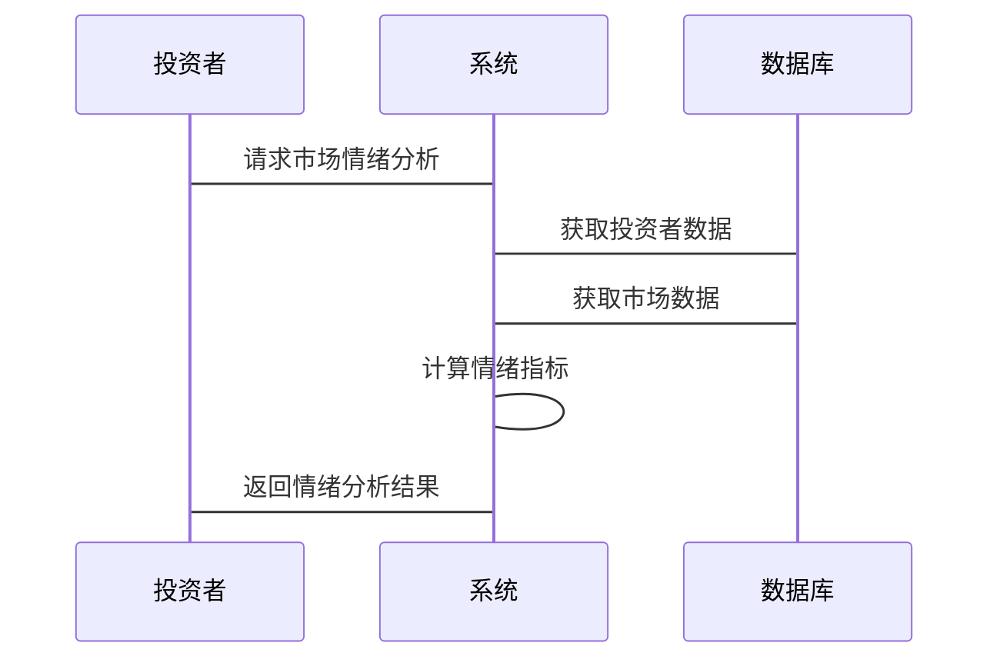

                 


# 彼得林奇的"市场情绪"判断方法

> 关键词：彼得·林奇，市场情绪，投资策略，情绪指标，投资者心理，系统设计，Python实现

> 摘要：本文深入探讨了彼得·林奇的市场情绪判断方法，分析了其核心概念、投资者心理、市场情绪周期、情绪指标体系，并结合系统设计和Python实现，提供了一套完整的市场情绪分析框架。文章通过理论与实践相结合的方式，展示了如何利用市场情绪分析来优化投资决策，并提供了实际案例和代码实现，帮助读者更好地理解和应用这一方法。

---

## 第一部分：市场情绪概述

### 第1章：市场情绪的核心概念

#### 1.1 市场情绪的定义与重要性

##### 1.1.1 什么是市场情绪
市场情绪是指投资者在市场中的整体心理状态和态度，反映了投资者对市场未来走势的看法和信心。市场情绪可以通过投资者的行为、言论和市场数据来体现。

##### 1.1.2 市场情绪在投资中的作用
市场情绪是影响投资决策的重要因素。当市场情绪过于乐观时，可能会导致资产价格泡沫；而当市场情绪过于悲观时，可能会导致资产价格被低估。

##### 1.1.3 彼得·林奇对市场情绪的独到见解
彼得·林奇认为，市场情绪是投资者决策的关键因素之一。他强调，投资者需要关注市场情绪的变化，以便在市场情绪低落时寻找投资机会，在市场情绪高涨时保持警惕。

---

#### 1.2 彼得·林奇的市场情绪分析方法

##### 1.2.1 市场情绪分析的基本原理
市场情绪分析的基本原理是通过分析投资者的心理状态和行为，预测市场走势。彼得·林奇的方法侧重于通过观察市场参与者的心理变化来判断市场的未来走势。

##### 1.2.2 市场情绪与投资机会的关系
市场情绪与投资机会密切相关。当市场情绪低迷时，可能会有更多的投资机会；而当市场情绪高涨时，投资机会可能会减少。

##### 1.2.3 林奇方法的核心要素
- **投资者心理分析**：分析投资者的心理状态，判断市场的理性与非理性。
- **市场情绪周期**：识别市场情绪的周期性变化，以便在市场情绪低谷时进行投资。
- **情绪指标体系**：通过情绪指标量化市场情绪，帮助投资者做出决策。

---

#### 1.3 市场情绪分析的背景与现状

##### 1.3.1 当前市场环境的特点
当前市场环境复杂多变，投资者情绪受多种因素影响，包括经济数据、政策变化、国际局势等。

##### 1.3.2 市场情绪分析的演变历程
市场情绪分析从传统的投资者心理分析逐渐发展为结合技术指标和大数据分析的综合方法。

##### 1.3.3 林奇方法的应用场景
林奇方法适用于各种市场环境，尤其是在市场情绪波动较大的情况下，能够帮助投资者做出更明智的决策。

---

#### 1.4 本章小结
本章介绍了市场情绪的核心概念，分析了彼得·林奇的市场情绪分析方法，并探讨了其在当前市场环境中的应用。市场情绪是投资者决策的重要因素，而林奇方法为我们提供了一种有效的分析工具。

---

## 第二部分：市场情绪的构成与分析

### 第2章：投资者心理与市场情绪

#### 2.1 投资者心理的分类

##### 2.1.1 理性投资者与非理性投资者
理性投资者根据市场信息做出决策，而非理性投资者则受情绪影响较大。

##### 2.1.2 投资者心理对市场情绪的影响
投资者的心理状态直接影响市场情绪的变化。例如，贪婪和恐惧是导致市场情绪波动的主要因素。

##### 2.1.3 投资者心理的群体效应
投资者心理具有群体效应，即个体心理状态会通过群体行为影响整体市场情绪。

---

#### 2.2 市场情绪周期的分析

##### 2.2.1 市场情绪的波动周期
市场情绪通常呈现周期性变化，包括从乐观到悲观，再从悲观到乐观的循环。

##### 2.2.2 不同周期的投资策略
- **乐观周期**：谨慎投资，避免过度乐观导致的市场泡沫。
- **悲观周期**：积极寻找投资机会，利用市场低估的机会。

---

#### 2.3 彼得·林奇的投资者心理分析

##### 2.3.1 林奇对投资者心理的洞察
彼得·林奇认为，投资者心理是市场的核心驱动力。他强调，投资者需要关注市场的心理变化，以便在市场情绪低落时寻找投资机会。

##### 2.3.2 心理分析在投资决策中的应用
通过分析投资者的心理状态，投资者可以更好地判断市场的未来走势，并做出相应的投资决策。

---

#### 2.4 本章小结
本章分析了投资者心理与市场情绪的关系，探讨了市场情绪周期的特征，并总结了彼得·林奇的投资者心理分析方法。投资者心理是市场情绪的核心驱动力，而市场情绪的变化对投资决策具有重要影响。

---

## 第三部分：市场情绪分析的工具与方法

### 第3章：市场情绪分析的工具

#### 3.1 市场情绪指标的分类

##### 3.1.1 技术指标
- **相对强弱指数（RSI）**：衡量市场的超买或超卖状态。
- **移动平均收敛散度（MACD）**：分析市场的趋势和动能。

##### 3.1.2 基本面指标
- **市盈率（P/E）**：衡量股票的估值。
- **市净率（P/B）**：衡量股票相对于其资产价值的估值。

##### 3.1.3 心理指标
- **投资者信心指数**：反映投资者对市场的信心。
- **市场情绪指数（PSI）**：量化市场的整体情绪。

---

#### 3.2 彼得·林奇的情绪指标体系

##### 3.2.1 林奇情绪指标的定义
林奇情绪指标是一种通过分析投资者心理和市场行为来量化市场情绪的指标。

##### 3.2.2 林奇指标的计算方法
林奇指标的计算公式如下：
$$
\text{林奇情绪指标} = \frac{\text{投资者情绪}}{\text{市场参与度}}
$$
其中，投资者情绪可以通过市场成交量和投资者信心指数来衡量，市场参与度则通过市场交易量来反映。

##### 3.2.3 林奇指标的实际应用
林奇指标可以帮助投资者判断市场的整体情绪，并据此调整投资策略。

---

#### 3.3 市场情绪分析的其他工具

##### 3.3.1 媒体情绪分析
通过分析媒体的报道和评论，判断市场情绪的变化。

##### 3.3.2 社会情绪分析
通过分析社交媒体上的投资者情绪，判断市场的整体情绪。

##### 3.3.3 机构投资者情绪分析
通过分析机构投资者的持仓和交易行为，判断市场情绪的变化。

---

#### 3.4 本章小结
本章介绍了市场情绪分析的工具与方法，包括技术指标、基本面指标和心理指标。同时，探讨了彼得·林奇的情绪指标体系，并分析了其他市场情绪分析工具的应用。这些工具为投资者提供了多种方法来判断市场情绪。

---

## 第四部分：市场情绪分析的系统设计

### 第4章：系统分析与架构设计

#### 4.1 问题场景介绍

##### 4.1.1 投资者情绪分析的典型场景
- 投资者需要判断市场的整体情绪，以便做出投资决策。
- 投资者需要分析市场的心理变化，以便识别投资机会。

##### 4.1.2 系统目标与范围
系统目标是为投资者提供市场情绪分析工具，帮助其做出投资决策。系统范围包括市场情绪指标计算、投资者心理分析、市场情绪周期分析等功能。

---

#### 4.2 系统功能设计

##### 4.2.1 领域模型设计（Mermaid 类图）


##### 4.2.2 系统架构设计（Mermaid 架构图）


##### 4.2.3 系统接口设计
- **投资者情绪数据接口**：提供投资者情绪数据的接口。
- **市场数据接口**：提供市场数据的接口。
- **情绪指标计算接口**：提供情绪指标计算的接口。

##### 4.2.4 系统交互设计（Mermaid 序列图）


---

#### 4.3 本章小结
本章通过系统设计的方法，介绍了投资者情绪分析系统的架构和功能设计。系统设计包括领域模型、架构设计、接口设计和系统交互设计，为投资者提供了完整的市场情绪分析工具。

---

## 第五部分：市场情绪分析的项目实战

### 第5章：项目实战

#### 5.1 环境安装

##### 5.1.1 Python环境安装
需要安装Python 3.8及以上版本。

##### 5.1.2 依赖库安装
安装必要的依赖库，例如：
- pandas
- numpy
- matplotlib
- requests

#### 5.2 系统核心实现源代码

##### 5.2.1 情绪指标计算代码
```python
import pandas as pd
import numpy as np

def calculate Lynch_emotion_index(investor_mood, market_participation):
    return investor_mood / market_participation

# 示例数据
investor_mood = 0.7
market_participation = 0.5
emotion_index = calculate_Lynch_emotion_index(investor_mood, market_participation)
print(f"林奇情绪指数: {emotion_index}")
```

##### 5.2.2 数据可视化代码
```python
import matplotlib.pyplot as plt

# 示例数据
emotion_data = [0.6, 0.5, 0.7, 0.4, 0.8]
plt.plot(emotion_data, label="市场情绪指数")
plt.xlabel("时间")
plt.ylabel("情绪指数")
plt.legend()
plt.show()
```

#### 5.3 代码应用解读与分析

##### 5.3.1 情绪指标计算
通过上述代码，我们可以计算出林奇情绪指数，并根据指数的大小判断市场的整体情绪。

##### 5.3.2 数据可视化
通过数据可视化，我们可以直观地观察市场情绪的变化趋势，并据此做出投资决策。

---

#### 5.4 实际案例分析

##### 5.4.1 案例背景
假设当前市场情绪指数为0.6，市场参与度为0.5，计算林奇情绪指数为1.2，说明市场情绪较为乐观，但市场参与度较低，可能存在投资机会。

##### 5.4.2 投资策略调整
根据情绪指数，投资者可以调整投资策略，例如增加对市场的配置，或寻找被低估的资产。

---

#### 5.5 本章小结
本章通过项目实战的方式，展示了如何利用Python代码实现市场情绪分析。通过情绪指标计算和数据可视化，投资者可以更好地判断市场情绪，并据此调整投资策略。

---

## 第六部分：最佳实践与注意事项

### 第6章：最佳实践与注意事项

#### 6.1 投资者心理分析的关键点

##### 6.1.1 关注市场情绪周期
投资者需要关注市场情绪周期的变化，以便在市场情绪低谷时寻找投资机会。

##### 6.1.2 结合基本面分析
市场情绪分析应结合基本面分析，避免仅依赖情绪指标做出决策。

##### 6.1.3 保持理性
投资者需要保持理性，避免被市场情绪左右，做出非理性的投资决策。

---

#### 6.2 系统设计的注意事项

##### 6.2.1 数据来源的可靠性
系统设计时，需要确保数据来源的可靠性，以保证情绪指标的准确性。

##### 6.2.2 系统的可扩展性
系统设计时，需要考虑系统的可扩展性，以便未来添加更多的市场情绪分析工具。

##### 6.2.3 系统的安全性
系统设计时，需要考虑系统的安全性，避免数据泄露和系统攻击。

---

#### 6.3 项目实战中的注意事项

##### 6.3.1 数据的实时性
项目实战中，需要确保数据的实时性，以便及时捕捉市场情绪的变化。

##### 6.3.2 代码的可维护性
项目实战中，需要确保代码的可维护性，以便未来对系统进行优化和升级。

##### 6.3.3 投资者教育
投资者需要接受充分的教育，以便更好地理解和应用市场情绪分析方法。

---

#### 6.4 本章小结
本章总结了市场情绪分析中的最佳实践和注意事项，包括投资者心理分析、系统设计和项目实战中的关键点。投资者需要结合市场情绪分析与基本面分析，做出理性的投资决策。

---

## 第七部分：总结与展望

### 第7章：总结与展望

#### 7.1 总结
本文深入探讨了彼得·林奇的市场情绪判断方法，分析了其核心概念、投资者心理、市场情绪周期、情绪指标体系，并结合系统设计和Python实现，提供了一套完整的市场情绪分析框架。通过理论与实践相结合的方式，展示了如何利用市场情绪分析来优化投资决策。

#### 7.2 展望
未来，市场情绪分析将更加智能化和数据化。随着人工智能和大数据技术的发展，市场情绪分析将更加精准和高效，为投资者提供更多的投资机会。

---

## 结语

彼得·林奇的市场情绪判断方法为我们提供了一种有效的投资工具。通过分析市场情绪的变化，投资者可以更好地判断市场的未来走势，并做出相应的投资决策。本文通过理论与实践相结合的方式，展示了如何利用市场情绪分析优化投资决策，并提供了实际案例和代码实现。希望本文能够为投资者提供有价值的参考，帮助他们在复杂的市场环境中做出明智的投资决策。

