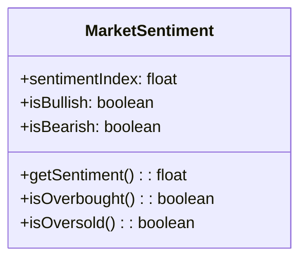
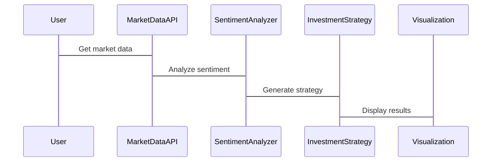

                 


# 彼得林奇的"市场情绪"利用技巧

> 关键词：市场情绪、彼得林奇、投资策略、技术分析、基本面分析、情绪周期

> 摘要：本文深入探讨了彼得林奇如何利用市场情绪进行投资决策，分析了市场情绪的定义、重要性及其对投资的影响，详细讲解了技术分析和基本面分析在市场情绪分析中的应用，并通过实际案例展示了如何避免情绪化决策，保持理性投资。

---

# 第一部分: 市场情绪概述

## 第1章: 市场情绪的基本概念

### 1.1 什么是市场情绪

#### 1.1.1 市场情绪的定义
市场情绪（Market Sentiment）是指市场参与者对当前市场环境的心理态度和看法，通常表现为乐观或悲观。这种情绪会影响投资者的决策，从而影响市场价格。

$$市场情绪 = \sum_{i=1}^{n} \text{投资者情绪}_i$$

市场情绪可以通过多种指标来衡量，如技术指标（RSI、MACD）和投资者情绪调查。

#### 1.1.2 市场情绪的重要性
市场情绪是投资决策的重要参考因素。它可以帮助投资者识别市场趋势和潜在风险，从而做出更明智的投资决策。

#### 1.1.3 市场情绪的核心要素
市场情绪的核心要素包括投资者心理、市场趋势和市场参与度。

---

### 1.2 彼得·林奇的基本投资理念

#### 1.2.1 彼得·林奇的简介
彼得·林奇（Peter Lynch）是美国著名的职业棒球运动员，以其卓越的投掷能力和稳定的表现而闻名。他在职业生涯中多次打破记录，成为棒球界的重要人物。

#### 1.2.2 林奇的投资哲学
林奇的投资哲学强调长期投资和价值发现，他主张通过深入分析市场情绪和基本面因素来选择投资标的。

#### 1.2.3 林奇与市场情绪的关系
林奇认为，市场情绪是影响投资决策的重要因素，但投资者应避免被短期情绪左右，而是应关注长期价值。

---

### 1.3 市场情绪与投资决策

#### 1.3.1 市场情绪对投资的影响
市场情绪可以影响投资者的行为，从而影响市场价格。例如，当市场情绪乐观时，投资者更倾向于买入，推动价格上涨。

#### 1.3.2 如何利用市场情绪做出投资决策
投资者可以通过分析市场情绪指标，识别市场趋势和潜在风险。例如，使用RSI指标判断超买或超卖信号。

#### 1.3.3 市场情绪的周期性特征
市场情绪通常呈现周期性变化，从乐观到悲观，再从悲观到乐观，形成一个循环。投资者应关注这些周期变化，调整投资策略。

---

## 第2章: 市场情绪的分析方法

### 2.1 技术分析与市场情绪

#### 2.1.1 技术分析的基本原理
技术分析通过分析历史价格和成交量数据，预测未来市场走势。常用的技术指标包括RSI、MACD等。

#### 2.1.2 技术指标在情绪分析中的应用
RSI指标用于判断市场超买或超卖状态，MACD指标用于判断市场趋势强度。

#### 2.1.3 常用的技术指标解读
- RSI：相对强弱指数，范围在0-100之间。RSI < 30表示超卖，RSI > 70表示超买。
- MACD：移动平均收敛散度，用于判断趋势强度和潜在反转点。

### 2.2 基本面分析与市场情绪

#### 2.2.1 基本面分析的定义
基本面分析通过分析公司的财务报表、行业地位和宏观经济指标，评估其内在价值。

#### 2.2.2 基本面分析与市场情绪的关系
基本面分析可以帮助投资者识别市场情绪的合理性。例如，当市场情绪乐观但公司基本面不佳时，可能是市场泡沫的信号。

#### 2.2.3 基本面分析在情绪利用中的作用
基本面分析可以帮助投资者在市场情绪高涨时识别潜在风险，避免盲目跟风。

### 2.3 投资者心理与市场情绪

#### 2.3.1 投资者心理的分类
投资者心理包括乐观心理、悲观心理和从众心理等。

#### 2.3.2 从众心理与市场情绪
从众心理可能导致市场情绪的过度波动。例如，当大多数投资者乐观时，市场情绪可能过度上涨，形成泡沫。

#### 2.3.3 贪婪与恐惧的市场表现
贪婪和恐惧是市场情绪的极端表现。当市场情绪过于乐观时，投资者可能过于贪婪，忽视风险；当市场情绪过于悲观时，投资者可能过于恐惧，错失机会。

---

## 第3章: 彼得·林奇的市场情绪利用技巧

### 3.1 林奇的选股方法

#### 3.1.1 选股的基本原则
林奇主张选择那些基本面良好、市场情绪稳定且估值合理的股票。

#### 3.1.2 如何识别市场情绪中的投资机会
通过分析市场情绪指标，识别市场低估或高估的区域。例如，当市场情绪悲观时，可能有低估的投资机会。

#### 3.1.3 林奇选股的实战案例
以苹果公司为例，当市场情绪乐观时，选择基本面良好的科技股进行投资。

### 3.2 行业分析与市场情绪

#### 3.2.1 行业分析的基本步骤
行业分析包括分析行业趋势、竞争格局和宏观经济影响。

#### 3.2.2 市场情绪在行业分析中的应用
通过分析行业市场情绪，识别行业的潜在风险和机会。例如，当行业市场情绪乐观时，行业内的龙头企业可能有较好的投资机会。

#### 3.2.3 不同行业中的市场情绪表现
不同行业对市场情绪的敏感性不同。例如，科技行业对市场情绪的变化更为敏感。

### 3.3 市场情绪周期与投资策略

#### 3.3.1 市场情绪的周期性变化
市场情绪通常呈现周期性变化，从乐观到悲观，再从悲观到乐观。

#### 3.3.2 不同情绪周期下的投资策略
- 乐观周期：选择基本面良好的股票进行投资。
- 悲观周期：寻找被市场低估的投资机会。

#### 3.3.3 林奇如何应对市场情绪周期
林奇主张在市场情绪悲观时，寻找基本面良好的股票进行投资，避免被市场情绪左右。

### 3.4 避免情绪化决策的技巧

#### 3.4.1 情绪化决策的常见误区
- 过度乐观：忽视潜在风险。
- 过度悲观：错失投资机会。

#### 3.4.2 如何保持理性投资
通过制定投资计划和定期回顾投资决策，避免情绪化决策。

#### 3.4.3 林奇的建议
林奇建议投资者关注长期投资目标，避免被短期市场情绪左右。

---

## 第4章: 系统分析与架构设计方案

### 4.1 系统功能设计

#### 4.1.1 领域模型


### 4.2 系统架构设计


### 4.3 系统接口设计



---

## 第5章: 项目实战

### 5.1 环境安装

- 安装Python和相关库（pandas、numpy、matplotlib）

### 5.2 核心代码实现

```python
import pandas as pd
import numpy as np
import matplotlib.pyplot as plt

def calculate_sentiment(sentiment_data):
    # 计算市场情绪指数
    sentiment_index = np.mean(sentiment_data)
    return sentiment_index

def generate_investment_strategy(sentiment_index):
    if sentiment_index > 0.7:
        return "Buy"
    elif sentiment_index < 0.3:
        return "Sell"
    else:
        return "Hold"

# 示例数据
sentiment_data = np.random.uniform(0, 1, 100)
sentiment_index = calculate_sentiment(sentiment_data)
strategy = generate_investment_strategy(sentiment_index)
print(f"Market Sentiment Index: {sentiment_index}")
print(f"Investment Strategy: {strategy}")
```

### 5.3 案例分析

假设市场情绪指数为0.8，生成的投资策略为“Buy”，建议投资者买入股票。

---

## 第6章: 最佳实践与总结

### 6.1 最佳实践

- 定期回顾投资策略，避免情绪化决策。
- 关注市场情绪指标，识别投资机会。

### 6.2 小结

彼得林奇的市场情绪利用技巧强调了理性投资的重要性，通过分析市场情绪和基本面因素，制定长期投资策略。

### 6.3 注意事项

- 市场情绪只是投资决策的一个因素，需结合其他因素综合分析。
- 避免过度依赖市场情绪指标，防止误判。

### 6.4 拓展阅读

- 《彼得·林奇的成功投资》
- 《技术分析实战指南》

---

# 结语

通过本文的分析，读者可以深入了解彼得林奇如何利用市场情绪进行投资决策，并掌握相关技巧和策略。希望本文能为投资者提供有价值的参考，帮助他们在复杂的市场环境中做出明智的投资决策。

