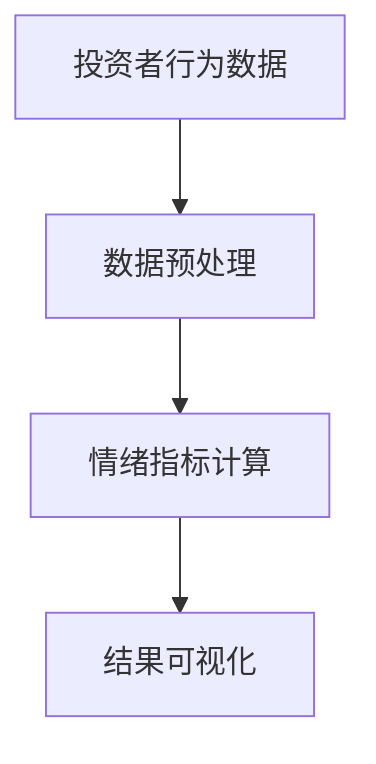
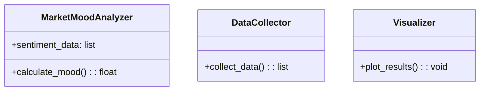
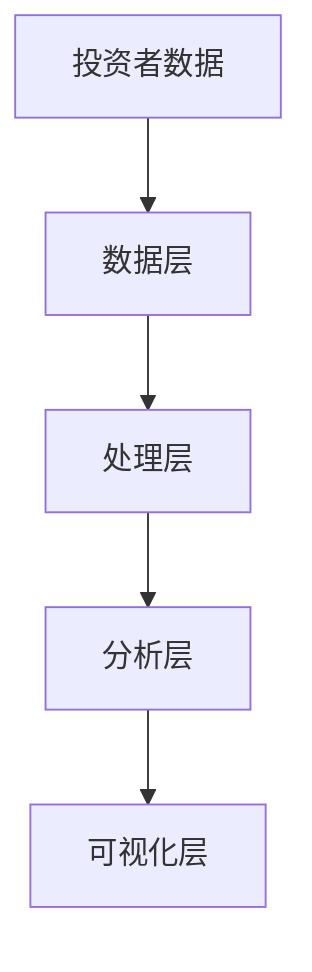

                 


# 彼得林奇的"市场情绪"指标在不同地域市场的比较

## 关键词
彼得林奇，市场情绪，投资分析，跨市场比较，算法原理，系统设计

## 摘要
本文探讨了彼得林奇提出的市场情绪指标在不同地域市场的应用与比较。通过分析美国、欧洲和亚洲等市场的特点，本文揭示了市场情绪指标在不同地区的表现差异及其原因。结合算法原理和系统设计，本文为投资者提供了跨市场分析的工具和方法，帮助其在复杂多变的市场环境中做出更明智的投资决策。

---

# 第1章: 彼得林奇的市场情绪指标概述

## 1.1 市场情绪指标的定义与特点
### 1.1.1 定义
市场情绪指标是一种量化投资者情绪的工具，用于衡量市场参与者对市场的乐观或悲观程度。

### 1.1.2 核心特点
- **波动性**：市场情绪指标会随着市场波动而变化。
- **前瞻性**：能够反映市场对未来走势的预期。
- **相对性**：不同市场的指标具有可比性。

### 1.1.3 投资分析中的作用
市场情绪指标可以帮助投资者识别市场的超买或超卖状态，从而做出更明智的投资决策。

## 1.2 彼得林奇市场情绪指标的核心概念
### 1.2.1 投资者情绪的量化方法
通过分析投资者的行为数据，如交易量、持仓情况等，量化市场情绪。

### 1.2.2 计算公式
$$
\text{市场情绪指数} = \frac{\text{投资者乐观比例} - \text{投资者悲观比例}}{\text{总投资者数}}
$$

### 1.2.3 边界与外延
市场情绪指标的范围通常在-1到1之间，正数表示乐观，负数表示悲观。

## 1.3 背景与应用
### 1.3.1 起源
彼得林奇在其投资理论中首次提出市场情绪指标，用于分析市场的短期波动。

### 1.3.2 理论基础
市场情绪指标基于行为金融学，认为投资者情绪会影响市场价格。

### 1.3.3 实际应用
广泛应用于股票、基金等金融资产的投资分析和风险管理。

---

# 第2章: 不同地域市场的市场情绪分析

## 2.1 美国市场的市场情绪分析
### 2.1.1 市场特点与投资者行为
美国市场成熟度高，投资者行为较为理性，但市场波动较大。

### 2.1.2 情绪指标计算与比较
$$
\text{美国市场情绪指数} = \frac{N_{\text{乐观}} - N_{\text{悲观}}}{N_{\text{总}}}
$$

### 2.1.3 实际案例分析
以2020年新冠疫情为例，美国市场情绪指数在疫情初期急剧下降，随后逐步恢复。

## 2.2 欧洲市场的市场情绪分析
### 2.2.1 市场特点与投资者行为
欧洲市场受经济政策影响较大，投资者行为较为保守。

### 2.2.2 情绪指标计算与比较
$$
\text{欧洲市场情绪指数} = \frac{M_{\text{乐观}} - M_{\text{悲观}}}{M_{\text{总}}}
$$

### 2.2.3 实际案例分析
2008年金融危机期间，欧洲市场情绪指数显著低于美国市场。

## 2.3 亚洲市场的市场情绪分析
### 2.3.1 市场特点与投资者行为
亚洲市场波动性高，投资者行为受区域经济影响较大。

### 2.3.2 情绪指标计算与比较
$$
\text{亚洲市场情绪指数} = \frac{A_{\text{乐观}} - A_{\text{悲观}}}{A_{\text{总}}}
$$

### 2.3.3 实际案例分析
2023年科技股牛市中，亚洲市场情绪指数显著高于其他地区。

---

# 第3章: 市场情绪指标的比较与分析

## 3.1 不同地域市场情绪指标的对比
### 3.1.1 美国、欧洲、亚洲的对比
- 美国市场情绪指数波动幅度最大。
- 欧洲市场情绪指数较为稳定。
- 亚洲市场情绪指数受经济周期影响显著。

### 3.1.2 其他市场的对比
包括新兴市场和成熟市场的对比。

## 3.2 情绪指标差异性分析
### 3.2.1 差异性来源
- 经济政策差异。
- 投资者结构差异。
- 市场发展阶段差异。

### 3.2.2 实际影响
情绪指标差异影响跨市场投资策略。

## 3.3 情绪指标的共性与特性
### 3.3.1 共性
所有市场的市场情绪指数都呈现周期性波动。

### 3.3.2 特性
各市场的独特性影响情绪指标的表现。

---

# 第4章: 市场情绪指标的算法原理

## 4.1 算法原理概述
市场情绪指标的计算涉及数据采集、处理和分析。

## 4.2 数据流图


## 4.3 核心算法实现
```python
def calculate_market_mood(sentiment_data):
    optimistic = sum(sentiment_data['optimistic'])
    pessimistic = sum(sentiment_data['pessimistic'])
    total = optimistic + pessimistic
    if total == 0:
        return 0
    return (optimistic - pessimistic) / total
```

## 4.4 数学模型
$$
\text{市场情绪指数} = \frac{\sum (\text{乐观情绪}) - \sum (\text{悲观情绪})}{\sum (\text{总情绪})}
$$

---

# 第5章: 系统分析与架构设计

## 5.1 系统功能设计
### 5.1.1 领域模型类图


## 5.2 系统架构设计


---

# 第6章: 项目实战

## 6.1 环境安装
- Python
- Pandas
- Matplotlib

## 6.2 核心代码实现
```python
import pandas as pd
import matplotlib.pyplot as plt

def main():
    # 数据加载
    data = pd.read_csv('market_sentiment.csv')
    # 情绪计算
    mood = calculate_market_mood(data)
    # 结果可视化
    plt.plot(data.index, data['sentiment'], label='Market Mood')
    plt.show()

if __name__ == "__main__":
    main()
```

## 6.3 实际案例分析
以2020年新冠疫情为例，分析不同市场的市场情绪指数变化。

## 6.4 项目小结
总结项目成果，讨论其在投资分析中的应用前景。

---

# 第7章: 最佳实践与总结

## 7.1 小结
市场情绪指标在跨市场分析中具有重要价值。

## 7.2 注意事项
- 数据的准确性和及时性。
- 情绪指标的周期性影响。

## 7.3 拓展阅读
推荐相关书籍和研究论文。

---

# 结语
通过本文的分析，读者可以深入了解彼得林奇的市场情绪指标在不同地域市场的表现差异，并利用这些知识进行更有效的投资决策。

