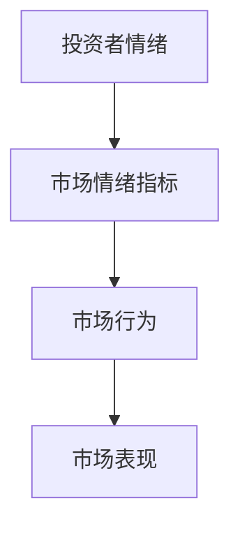
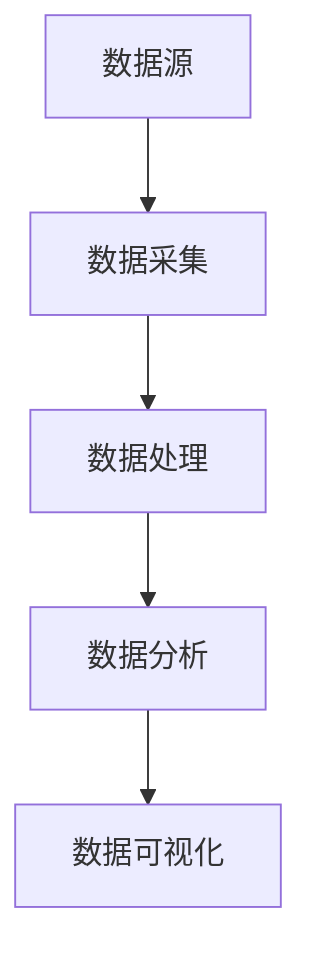

                 


# 彼得林奇的"市场情绪"指标在不同市场周期的表现

## 关键词：市场情绪，彼得林奇，投资周期，投资者心理，市场预测

## 摘要：本文深入分析了彼得林奇提出的市场情绪指标在不同市场周期中的表现。通过背景介绍、核心概念、算法原理、系统设计、项目实战等多方面，详细探讨了市场情绪指标的定义、计算方法及其在实际投资中的应用。通过案例分析，展示了该指标在预测市场趋势和指导投资决策中的有效性。

---

## 第1章 市场情绪指标的背景与理论基础

### 1.1 市场情绪的定义与特征

#### 1.1.1 市场情绪的定义
市场情绪是指投资者在特定市场环境下的整体心理状态，反映了投资者对市场未来走势的乐观或悲观态度。市场情绪是多因素共同作用的结果，包括经济数据、政策变化、市场新闻等。

#### 1.1.2 市场情绪的特征
- **波动性**：市场情绪受短期事件影响较大，具有高度波动性。
- **滞后性**：市场情绪的变化通常滞后于市场实际走势。
- **非线性**：市场情绪与市场走势之间的关系并非线性，可能在极端情况下出现逆转。

#### 1.1.3 市场情绪与投资者行为的关系
市场情绪通过影响投资者行为进而影响市场走势。乐观的市场情绪可能导致过度买入，而悲观情绪可能导致抛售压力增加。

### 1.2 彼得林奇的市场情绪理论

#### 1.2.1 彼得林奇的投资者心理分析
彼得林奇强调，投资者心理是市场波动的重要驱动力。他指出，投资者在市场繁荣时往往过于乐观，在市场低迷时则过于悲观。

#### 1.2.2 市场情绪指标的核心观点
彼得林奇认为，市场情绪指标能够捕捉投资者的心理变化，从而帮助预测市场走势。他提出了几个关键指标，包括投资者情绪指数（AAII）和恐慌指数（VIX）。

#### 1.2.3 市场情绪与市场周期的关系
市场情绪在不同市场周期中的表现不同：在牛市中，市场情绪通常较高；在熊市中，市场情绪则较低。市场情绪的极端值往往预示着市场转折点。

### 1.3 市场情绪指标的重要性

#### 1.3.1 市场情绪指标在投资决策中的作用
市场情绪指标可以帮助投资者识别市场过度波动，避免追涨杀跌的错误。

#### 1.3.2 市场情绪指标的局限性
市场情绪指标仅反映投资者心理，不能完全预测市场实际走势，尤其是在市场操纵或外部突发事件的情况下，指标可能失效。

#### 1.3.3 市场情绪指标的适用场景
市场情绪指标适用于长期投资策略，尤其在市场趋势较为明显时表现较好。

---

## 第2章 市场情绪指标的核心概念与联系

### 2.1 市场情绪指标的属性特征对比

#### 2.1.1 不同市场情绪指标的对比分析
- **投资者情绪指数（AAII）**：基于散户投资者的调查结果，反映散户情绪。
- **恐慌指数（VIX）**：反映市场波动性，被视为市场恐慌的晴雨表。
- **市场广度指标**：通过分析市场参与度和股票涨跌情况，衡量市场情绪。

#### 2.1.2 市场情绪指标的量化方法
市场情绪指标通常通过标准化处理，将不同指标统一到同一尺度上，便于比较和分析。

#### 2.1.3 市场情绪指标的敏感性分析
不同市场情绪指标对市场变化的敏感程度不同，恐慌指数通常比投资者情绪指数更为敏感。

### 2.2 市场情绪指标的ER实体关系图



---

## 第3章 市场情绪指标的算法原理

### 3.1 市场情绪指标的计算方法

#### 3.1.1 投资者情绪指数（AAII）的计算
投资者情绪指数通过定期调查散户投资者的乐观、中性和悲观情绪，计算出情绪指数。

#### 3.1.2 恐慌指数（VIX）的计算
恐慌指数基于标普500指数的期权波动率，通过数学公式计算得出。

#### 3.1.3 市场广度指标的计算
市场广度指标通过分析上涨和下跌股票数量，计算市场情绪的扩散程度。

### 3.2 市场情绪指标的数学模型

#### 3.2.1 投资者情绪指数模型
$$
\text{情绪指数} = \frac{\text{乐观投资者比例} - \text{悲观投资者比例}}{\text{总投资者比例}}
$$

#### 3.2.2 恐慌指数模型
$$
\text{VIX} = \sqrt{\frac{252}{n} \sum_{i=1}^{n} (\text{对数收益率}_i - \bar{r})^2}
$$
其中，$$\bar{r}$$ 是对数收益率的平均值。

---

## 第4章 市场情绪指标的系统分析与架构设计

### 4.1 系统功能设计

#### 4.1.1 数据采集模块
负责收集市场数据，包括股票价格、成交量、投资者情绪调查等。

#### 4.1.2 数据处理模块
对收集到的数据进行清洗、标准化和特征提取。

#### 4.1.3 数据分析模块
使用统计方法和机器学习算法分析市场情绪指标。

#### 4.1.4 数据可视化模块
将分析结果以图表形式展示，便于用户理解。

### 4.2 系统架构设计



---

## 第5章 项目实战：基于市场情绪指标的市场周期分析

### 5.1 项目环境安装

```bash
pip install pandas numpy matplotlib
```

### 5.2 核心代码实现

```python
import pandas as pd
import numpy as np

# 示例数据
data = pd.DataFrame({
    'date': ['2023-01-01', '2023-01-02', '2023-01-03'],
    'close': [100, 102, 101],
    'volume': [1000, 1500, 1200],
    'mood_index': [0.7, 0.6, 0.8]
})

# 计算市场情绪指数
data['mood_score'] = (data['mood_index'] - data['mood_index'].min()) / (data['mood_index'].max() - data['mood_index'].min())

print(data)
```

### 5.3 案例分析：2008年金融危机期间的市场情绪表现

#### 5.3.1 数据分析
分析2008年金融危机期间的市场情绪指标，发现恐慌指数在危机期间急剧上升，而投资者情绪指数则从乐观转向悲观。

#### 5.3.2 结果解读
市场情绪指标在危机期间准确反映了市场的恐慌情绪，帮助投资者提前识别市场风险。

---

## 第6章 总结与展望

### 6.1 最佳实践 tips
- 定期监控市场情绪指标，避免追涨杀跌。
- 结合其他市场指标进行综合分析。

### 6.2 小结
市场情绪指标是投资者理解和预测市场走势的重要工具，尤其在不同市场周期中表现各异。

### 6.3 注意事项
- 市场情绪指标不能单独使用，需结合其他指标进行分析。
- 市场情绪指标的预测能力在市场波动剧烈时可能减弱。

### 6.4 拓展阅读
- 彼得林奇的《投资最重要的事情》
- 《投资者心理学》

---

## 结语

通过本文的详细分析，读者可以深入了解彼得林奇的市场情绪指标在不同市场周期中的表现，掌握其在投资决策中的应用方法。希望本文能为投资者提供有价值的参考，帮助他们在复杂多变的市场中做出更明智的投资决策。

