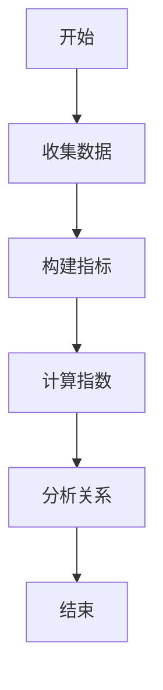
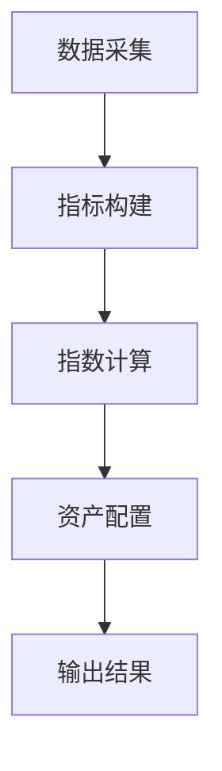

                 


# 彼得林奇的"市场情绪"指标在不同资产类别中的应用比较

## 关键词：市场情绪指标、彼得林奇、资产配置、股票、债券、基金、商品、外汇

## 摘要：  
彼得林奇的市场情绪指标是一种通过分析投资者情绪来预测和指导投资决策的重要工具。本文系统地探讨了市场情绪指标在股票、债券、基金、商品和外汇等不同资产类别中的应用，并通过比较分析，揭示了其在资产配置中的潜在价值。文章结合理论分析和实际案例，深入解读了市场情绪指标的数学模型、算法原理及其在不同资产类别中的表现，为投资者提供了实用的参考。

---

# 第一部分：市场情绪指标的背景与基础

## 第1章：市场情绪指标的定义与理论基础

### 1.1 彼得林奇的市场情绪理论

#### 1.1.1 市场情绪的定义与内涵  
市场情绪（Market Sentiment）是指投资者对市场未来走势的心理预期和态度。彼得林奇认为，市场情绪是影响资产价格波动的重要因素，尤其是在市场波动加剧时，情绪因素往往起到决定性作用。

#### 1.1.2 彼得林奇市场情绪理论的核心观点  
彼得林奇提出，市场情绪可以通过投资者的行为和市场数据来量化。他强调，当市场情绪过于乐观时，资产价格可能被高估；当市场情绪过于悲观时，资产价格可能被低估。因此，市场情绪指标可以帮助投资者在市场情绪过度偏离理性时做出反向投资决策。

#### 1.1.3 市场情绪与资产价格的关系  
市场情绪与资产价格之间存在密切的正相关关系。当市场情绪高涨时，投资者倾向于追涨，推动资产价格上涨；当市场情绪低落时，投资者倾向于抛售，导致资产价格下跌。

---

## 第2章：市场情绪指标的构建与特点

### 2.1 市场情绪指标的构建方法

#### 2.1.1 基于投资者情绪的指标构建  
市场情绪指标可以通过投资者的交易行为、新闻媒体的报道情绪以及市场参与者的调研数据来构建。例如，通过分析投资者的买卖行为、资金流入流出数据以及市场参与者的信心指数，可以量化市场情绪。

#### 2.1.2 市场情绪指标的三大核心特点  
1. **可量化性**：市场情绪指标需要能够通过具体的数据或模型进行量化。  
2. **动态变化性**：市场情绪会随着市场环境的变化而波动。  
3. **预测性**：市场情绪指标能够对未来的资产价格走势提供一定的预测能力。  

#### 2.1.3 市场情绪指标的适用范围与局限性  
市场情绪指标适用于所有资产类别，但其准确性可能受到市场参与者情绪波动的短期性影响。此外，市场情绪指标无法完全预测市场危机事件，如黑天鹅事件。

---

## 第3章：市场情绪指标在不同资产类别中的应用

### 3.1 股票市场的应用

#### 3.1.1 股票市场情绪指标的定义与计算  
股票市场情绪指标可以通过投资者的交易行为、资金流入流出数据以及市场参与者的调研数据来构建。例如，可以通过分析股票市场的换手率、资金流入流出数据以及投资者信心指数来量化股票市场的市场情绪。

#### 3.1.2 股票市场情绪指标与股价波动的关系  
当市场情绪高涨时，投资者倾向于追涨，推动股价上涨；当市场情绪低落时，投资者倾向于抛售，导致股价下跌。因此，股票市场情绪指标可以作为预测股价波动的重要参考。

#### 3.1.3 彼得林奇市场情绪指标在股票投资中的应用实例  
例如，当市场情绪过度乐观时，投资者可以通过市场情绪指标发现潜在的高估资产，并考虑卖出或持币观望；当市场情绪过度悲观时，投资者可以考虑买入低估资产。

---

### 3.2 债券市场的应用

#### 3.2.1 债券市场情绪指标的定义与计算  
债券市场情绪指标可以通过投资者的交易行为、资金流入流出数据以及市场参与者的调研数据来构建。例如，可以通过分析债券市场的换手率、资金流入流出数据以及投资者信心指数来量化债券市场的市场情绪。

#### 3.2.2 债券市场情绪与债券价格的关系  
当市场情绪高涨时，投资者倾向于购买债券，推动债券价格上涨；当市场情绪低落时，投资者倾向于抛售债券，导致债券价格下跌。因此，债券市场情绪指标可以作为预测债券价格波动的重要参考。

#### 3.2.3 彼得林奇市场情绪指标在债券投资中的应用实例  
例如，当市场情绪过度乐观时，投资者可以通过市场情绪指标发现潜在的高估债券，并考虑卖出或持币观望；当市场情绪过度悲观时，投资者可以考虑买入低估债券。

---

### 3.3 基金市场的应用

#### 3.3.1 基金市场情绪指标的定义与计算  
基金市场情绪指标可以通过投资者的交易行为、资金流入流出数据以及市场参与者的调研数据来构建。例如，可以通过分析基金市场的换手率、资金流入流出数据以及投资者信心指数来量化基金市场的市场情绪。

#### 3.3.2 基金市场情绪与基金净值波动的关系  
当市场情绪高涨时，投资者倾向于购买基金，推动基金净值上涨；当市场情绪低落时，投资者倾向于抛售基金，导致基金净值下跌。因此，基金市场情绪指标可以作为预测基金净值波动的重要参考。

#### 3.3.3 彼得林奇市场情绪指标在基金投资中的应用实例  
例如，当市场情绪过度乐观时，投资者可以通过市场情绪指标发现潜在的高估基金，并考虑卖出或持币观望；当市场情绪过度悲观时，投资者可以考虑买入低估基金。

---

### 3.4 商品市场的应用

#### 3.4.1 商品市场情绪指标的定义与计算  
商品市场情绪指标可以通过投资者的交易行为、资金流入流出数据以及市场参与者的调研数据来构建。例如，可以通过分析商品市场的换手率、资金流入流出数据以及投资者信心指数来量化商品市场的市场情绪。

#### 3.4.2 商品市场情绪与商品价格的关系  
当市场情绪高涨时，投资者倾向于购买商品，推动商品价格上涨；当市场情绪低落时，投资者倾向于抛售商品，导致商品价格下跌。因此，商品市场情绪指标可以作为预测商品价格波动的重要参考。

#### 3.4.3 彼得林奇市场情绪指标在商品投资中的应用实例  
例如，当市场情绪过度乐观时，投资者可以通过市场情绪指标发现潜在的高估商品，并考虑卖出或持币观望；当市场情绪过度悲观时，投资者可以考虑买入低估商品。

---

### 3.5 外汇市场的应用

#### 3.5.1 外汇市场情绪指标的定义与计算  
外汇市场情绪指标可以通过投资者的交易行为、资金流入流出数据以及市场参与者的调研数据来构建。例如，可以通过分析外汇市场的换手率、资金流入流出数据以及投资者信心指数来量化外汇市场的市场情绪。

#### 3.5.2 外汇市场情绪与汇率波动的关系  
当市场情绪高涨时，投资者倾向于购买外汇，推动汇率上涨；当市场情绪低落时，投资者倾向于抛售外汇，导致汇率下跌。因此，外汇市场情绪指标可以作为预测汇率波动的重要参考。

#### 3.5.3 彼得林奇市场情绪指标在外汇投资中的应用实例  
例如，当市场情绪过度乐观时，投资者可以通过市场情绪指标发现潜在的高估外汇，并考虑卖出或持币观望；当市场情绪过度悲观时，投资者可以考虑买入低估外汇。

---

## 第4章：市场情绪指标在不同资产类别中的比较分析

### 4.1 不同资产类别市场情绪指标的对比

#### 4.1.1 股票、债券、基金、商品和外汇市场的市场情绪指标对比  
通过比较股票、债券、基金、商品和外汇市场的市场情绪指标，可以发现不同资产类别中市场情绪指标的表现存在差异。例如，股票市场的市场情绪指标通常波动较大，而债券市场的市场情绪指标则相对稳定。

#### 4.1.2 不同资产类别市场情绪指标的异同点分析  
不同资产类别中的市场情绪指标在构建方法和应用效果上存在一定的差异。例如，股票市场情绪指标通常基于投资者的交易行为和市场参与者的调研数据，而债券市场情绪指标则更多基于资金流入流出数据和市场参与者的调研数据。

#### 4.1.3 市场情绪指标在不同资产类别中的适用性分析  
市场情绪指标在不同资产类别中的适用性有所不同。例如，股票市场情绪指标适用于短期交易策略，而债券市场情绪指标则适用于长期投资策略。

---

### 4.2 市场情绪指标在资产配置中的应用

#### 4.2.1 资产配置的基本概念与原则  
资产配置是指将资金分配到不同的资产类别中，以实现投资目标和风险控制。资产配置的基本原则包括分散化投资、风险匹配和长期投资。

#### 4.2.2 市场情绪指标在资产配置中的作用  
市场情绪指标可以帮助投资者在不同资产类别中进行动态资产配置。例如，当股票市场的市场情绪指标显示市场情绪过于乐观时，投资者可以减少股票投资，增加债券或商品投资。

#### 4.2.3 基于市场情绪指标的资产配置策略实例  
例如，当股票市场的市场情绪指标显示市场情绪过于乐观时，投资者可以减少股票投资，增加债券或商品投资；当债券市场的市场情绪指标显示市场情绪过于悲观时，投资者可以增加债券投资，减少股票或商品投资。

---

## 第5章：市场情绪指标的数学模型与算法原理

### 5.1 市场情绪指标的数学模型

#### 5.1.1 市场情绪指数的计算公式  
市场情绪指数可以通过以下公式进行计算：  
$$ 市场情绪指数 = \sum_{i=1}^{n} (权重_i \times 指标_i) $$  
其中，权重_i 是指标_i 的权重，指标_i 是具体的情绪指标。

#### 5.1.2 市场情绪指数的权重分配  
市场情绪指数的权重分配可以通过主成分分析（PCA）或因子分析（FA）等方法进行。例如，可以通过分析各个指标对市场情绪的影响程度，确定每个指标的权重。

---

### 5.2 算法原理讲解

#### 5.2.1 市场情绪指标的计算流程  
1. 收集相关数据，包括投资者的交易行为、资金流入流出数据和市场参与者的调研数据。  
2. 根据数据构建市场情绪指标。  
3. 通过数学模型计算市场情绪指数。  
4. 分析市场情绪指数与资产价格的关系。  

#### 5.2.2 使用mermaid绘制算法流程图  


---

## 第6章：基于市场情绪指标的资产配置系统设计

### 6.1 系统架构设计

#### 6.1.1 系统功能设计  
1. 数据采集模块：收集投资者的交易行为、资金流入流出数据和市场参与者的调研数据。  
2. 指标构建模块：根据数据构建市场情绪指标。  
3. 指数计算模块：通过数学模型计算市场情绪指数。  
4. 资产配置模块：根据市场情绪指数进行动态资产配置。  

#### 6.1.2 系统架构设计  


---

### 6.2 系统接口设计

#### 6.2.1 数据接口设计  
1. 数据采集接口：用于收集投资者的交易行为、资金流入流出数据和市场参与者的调研数据。  
2. 指标构建接口：用于根据数据构建市场情绪指标。  
3. 指数计算接口：用于通过数学模型计算市场情绪指数。  

#### 6.2.2 资产配置接口设计  
1. 资产配置接口：根据市场情绪指数进行动态资产配置。  
2. 输出结果接口：输出资产配置结果。  

---

## 第7章：项目实战与案例分析

### 7.1 环境安装与配置

#### 7.1.1 数据源选择  
选择可靠的数据源，例如Yahoo Finance、Google Finance等。  

#### 7.1.2 工具安装  
安装必要的工具，例如Python、Pandas、NumPy等。  

---

### 7.2 核心实现源代码

#### 7.2.1 数据采集代码  
```python
import pandas as pd
import requests

# 数据采集代码
def get_data(symbol):
    url = f"https://query1.finance.yahoo.com/v8/finance/chart/{symbol}"
    response = requests.get(url)
    data = response.json()
    return data
```

#### 7.2.2 市场情绪指标构建代码  
```python
def build_indicator(data):
    # 假设data为收集的数据
    # 构建市场情绪指标
    indicator = data['indicator']
    return indicator
```

---

### 7.3 实际案例分析与详细解读

#### 7.3.1 案例分析  
例如，分析2020年新冠疫情爆发期间的市场情绪指标变化及其对资产价格的影响。

#### 7.3.2 详细解读  
通过分析市场情绪指标的变化，发现当市场情绪指标显示市场情绪过于悲观时，资产价格往往被低估，投资者可以考虑买入低估资产；当市场情绪指标显示市场情绪过于乐观时，资产价格往往被高估，投资者可以考虑卖出或持币观望。

---

## 第8章：最佳实践、小结与注意事项

### 8.1 最佳实践 tips

#### 8.1.1 定期更新市场情绪指标  
市场情绪指标需要定期更新，以反映最新的市场情绪变化。

#### 8.1.2 结合其他指标进行综合分析  
市场情绪指标可以与其他指标（例如技术指标和基本面指标）结合使用，以提高分析的准确性。

---

### 8.2 小结

彼得林奇的市场情绪指标在不同资产类别中的应用比较具有重要的理论和实践意义。通过本文的分析，我们可以看到，市场情绪指标可以帮助投资者在不同资产类别中进行动态资产配置，提高投资收益并降低风险。

---

### 8.3 注意事项

1. 市场情绪指标仅作为参考，不能完全依赖。  
2. 市场情绪指标的准确性可能受到数据质量和市场环境的影响。  
3. 市场情绪指标的使用需要结合具体的市场环境和投资目标。

---

### 8.4 拓展阅读

1. 彼得林奇的《战胜市场的人》  
2. 《市场情绪与资产配置》  
3. 《数据驱动的投资决策》  

--- 

以上是《彼得林奇的"市场情绪"指标在不同资产类别中的应用比较》的详细目录和内容设计。

