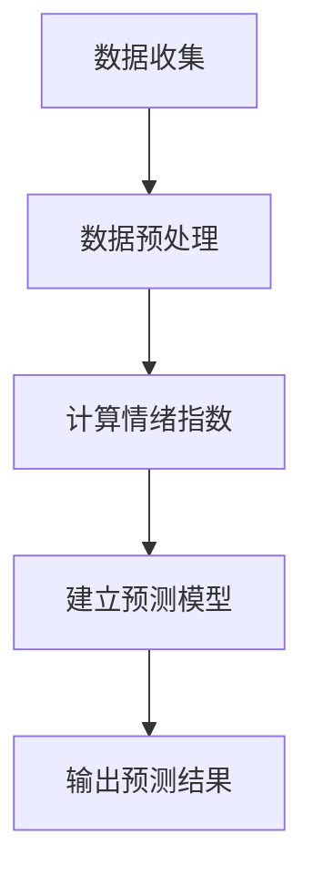
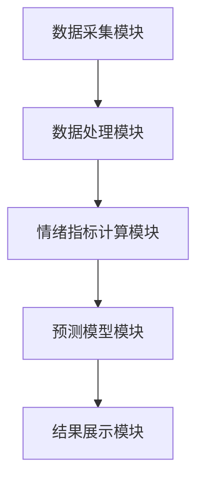

                 


# 彼得林奇的"市场情绪"指标在不同资产类别中的预测能力

> 关键词：市场情绪，彼得林奇，资产类别，预测能力，情绪指标

> 摘要：本文探讨了彼得林奇提出的市场情绪指标在不同资产类别中的预测能力。通过分析市场情绪的定义、指标的构成、算法原理以及在股票、债券、商品等资产类别中的实际应用，本文旨在揭示市场情绪指标在投资决策中的价值和局限性，为投资者提供理论支持和实践指导。

---

# 第一部分：背景介绍

## 第1章：市场情绪指标概述

### 1.1 市场情绪的基本概念

#### 1.1.1 什么是市场情绪
市场情绪（Market Sentiment）是指投资者对市场未来走势的心理预期，通常反映在投资者的买卖行为中。市场情绪可以通过多种指标来衡量，如成交量、价格波动性、投资者信心指数等。

#### 1.1.2 市场情绪与投资决策的关系
市场情绪直接影响投资者的决策，当市场情绪乐观时，投资者倾向于买入资产；当市场情绪悲观时，投资者倾向于卖出资产。因此，市场情绪是资产价格波动的重要驱动因素之一。

#### 1.1.3 彼得林奇市场情绪指标的提出
彼得·林奇（Peter Lynch）是美国著名的基金经理，他在《彼得·林奇的成功投资策略》中提到，市场情绪是影响投资决策的重要因素。他提出了基于市场情绪的指标，用于预测资产价格的波动。

---

### 1.2 彼得林奇市场情绪指标的核心理念

#### 1.2.1 投资者心理分析
彼得林奇认为，投资者的心理波动是市场情绪的核心。投资者在市场繁荣时容易过度乐观，在市场低迷时容易过度悲观。

#### 1.2.2 市场情绪周期性波动
市场情绪具有周期性，通常表现为从乐观到悲观再到乐观的循环。彼得林奇的指标通过捕捉这种周期性波动，帮助投资者识别市场的超买或超卖状态。

#### 1.2.3 指标在资产类别中的应用
彼得林奇的市场情绪指标最初是针对股票市场的，但其核心思想可以扩展到其他资产类别，如债券、商品和外汇。

---

### 1.3 市场情绪指标在不同资产类别中的应用现状

#### 1.3.1 股票市场的应用
在股票市场中，市场情绪指标可以帮助投资者判断市场的整体走势。例如，当市场情绪过于乐观时，股票价格可能被高估，投资者可以考虑卖出。

#### 1.3.2 债券市场的应用
债券市场的市场情绪指标可以用来预测债券价格的波动。当市场情绪悲观时，债券价格可能下跌，投资者可以考虑买入。

#### 1.3.3 其他资产类别中的应用
商品市场（如黄金、原油）和外汇市场的波动也可以通过市场情绪指标进行预测。例如，当市场情绪乐观时，商品价格可能上涨，而外汇市场的波动性可能增强。

---

### 1.4 市场情绪指标的局限性与挑战

#### 1.4.1 数据获取的难度
市场情绪指标的计算需要大量实时数据，包括投资者行为数据和市场交易数据，这些数据的获取可能具有一定的难度。

#### 1.4.2 指标的有效性问题
市场情绪指标的有效性受到市场环境的影响。在某些市场环境下，市场情绪指标可能失效，例如在市场恐慌或剧烈波动时。

#### 1.4.3 不同资产类别中的适用性差异
不同资产类别的市场情绪指标可能具有不同的表现。例如，股票市场的市场情绪指标可能比债券市场的指标更有效。

---

### 1.5 本章小结

---

# 第2章：彼得林奇市场情绪指标的核心概念

## 2.1 投资者心理与市场情绪的关系

### 2.1.1 投资者心理的分类
投资者心理可以分为乐观、悲观、中立等类别。不同心理状态的投资者会对市场情绪产生不同的影响。

### 2.1.2 市场情绪的形成机制
市场情绪的形成机制包括投资者的心理预期、市场信息的传播、市场参与者的互动等。

### 2.1.3 彼得林奇指标的核心假设
彼得林奇指标的核心假设是市场情绪是可以通过投资者行为数据来衡量的，并且市场情绪的变化可以用来预测资产价格的波动。

---

## 2.2 市场情绪指标的构成要素

### 2.2.1 情绪强度
情绪强度是指市场情绪的强弱程度，通常用指标值的范围来表示，例如从-1到1。

### 2.2.2 情绪方向
情绪方向是指市场情绪的总体趋势，例如上涨、下跌或持平。

### 2.2.3 情绪周期
情绪周期是指市场情绪从乐观到悲观再到乐观的循环过程，通常可以用时间序列数据来表示。

---

## 2.3 市场情绪指标与其他指标的对比

### 2.3.1 技术指标对比
市场情绪指标与传统技术指标（如RSI、MACD）的对比，可以发现市场情绪指标更注重投资者心理因素。

### 2.3.2 基本面指标对比
市场情绪指标与基本面指标（如市盈率、ROE）的对比，可以发现市场情绪指标更关注市场参与者的心理预期。

### 2.3.3 其他情绪指标对比
市场情绪指标与其它情绪指标（如恐慌指数VIX）的对比，可以发现彼得林奇指标的独特之处。

---

## 2.4 本章小结

---

# 第3章：市场情绪指标的数学模型与算法原理

## 3.1 市场情绪指标的数学模型

### 3.1.1 情绪指数的计算公式
$$ E = \frac{\sum_{i=1}^{n} w_i \cdot S_i}{\sum_{i=1}^{n} w_i} $$
其中，$E$ 表示情绪指数，$w_i$ 表示第 $i$ 个指标的权重，$S_i$ 表示第 $i$ 个指标的值。

### 3.1.2 情绪强度的度量
$$ I = \sum_{i=1}^{m} a_i \cdot x_i $$
其中，$I$ 表示情绪强度，$a_i$ 表示第 $i$ 个指标的系数，$x_i$ 表示第 $i$ 个指标的值。

---

## 3.2 市场情绪指标的算法

### 3.2.1 数据收集与预处理
1. 收集投资者行为数据，如成交量、订单簿数据等。
2. 对数据进行清洗和标准化处理。

### 3.2.2 情绪指标的计算
1. 使用加权平均的方法计算情绪指数。
2. 分析情绪指数的变化趋势。

### 3.2.3 情绪预测模型的建立
1. 使用时间序列模型（如ARIMA）进行预测。
2. 结合机器学习模型（如LSTM）进行预测。

---

## 3.3 算法流程图



---

## 3.4 本章小结

---

# 第4章：系统分析与架构设计方案

## 4.1 问题场景介绍

### 4.1.1 投资者需要根据市场情绪做出投资决策
投资者需要了解当前市场情绪，以便做出买入或卖出的决策。

### 4.1.2 系统需要实时监测市场情绪
系统需要实时监测市场情绪的变化，并提供实时的预测结果。

---

## 4.2 系统功能设计

### 4.2.1 系统功能模块
1. 数据采集模块
2. 数据处理模块
3. 情绪指标计算模块
4. 预测模型模块
5. 结果展示模块

### 4.2.2 功能模块的交互流程
1. 数据采集模块收集投资者行为数据。
2. 数据处理模块对数据进行清洗和标准化。
3. 情绪指标计算模块计算情绪指数。
4. 预测模型模块根据情绪指数进行预测。
5. 结果展示模块将预测结果展示给投资者。

---

## 4.3 系统架构设计

### 4.3.1 系统架构图



### 4.3.2 接口设计
1. 数据采集模块与数据处理模块之间的接口。
2. 情绪指标计算模块与预测模型模块之间的接口。
3. 预测模型模块与结果展示模块之间的接口。

---

## 4.4 本章小结

---

# 第5章：项目实战

## 5.1 环境安装

### 5.1.1 安装Python环境
使用Anaconda安装Python 3.8及以上版本。

### 5.1.2 安装必要的库
安装pandas、numpy、scikit-learn、matplotlib等库。

---

## 5.2 系统核心实现源代码

### 5.2.1 数据采集模块
```python
import pandas as pd
import requests

def get_market_data(symbol):
    url = f"https://api.example.com/market_data/{symbol}"
    response = requests.get(url)
    data = response.json()
    return pd.DataFrame(data)
```

### 5.2.2 数据处理模块
```python
def preprocess_data(df):
    # 数据清洗
    df.dropna(inplace=True)
    # 数据标准化
    df = (df - df.mean()) / df.std()
    return df
```

### 5.2.3 情绪指标计算模块
```python
def calculate_sentiment_index(df, weights):
    weighted_sum = 0
    for i in range(len(df.columns)):
        weighted_sum += weights[i] * df.iloc[:, i]
    sentiment_index = weighted_sum / sum(weights)
    return sentiment_index
```

### 5.2.4 预测模型模块
```python
from sklearn.linear_model import LinearRegression

def build_model(X, y):
    model = LinearRegression()
    model.fit(X, y)
    return model

def predict_sentiment(model, X):
    return model.predict(X)
```

### 5.2.5 结果展示模块
```python
import matplotlib.pyplot as plt

def plot_results(actual, predicted):
    plt.plot(actual, label='Actual')
    plt.plot(predicted, label='Predicted')
    plt.legend()
    plt.show()
```

---

## 5.3 实际案例分析

### 5.3.1 数据来源
使用股票市场的交易数据，包括成交量、订单簿数据等。

### 5.3.2 数据处理
对数据进行清洗和标准化处理，去除缺失值，标准化数据。

### 5.3.3 情绪指标计算
使用加权平均的方法计算市场情绪指数。

### 5.3.4 预测模型训练
使用线性回归模型进行预测，并计算模型的准确性。

### 5.3.5 结果展示
将实际值和预测值进行对比，分析模型的准确性。

---

## 5.4 本章小结

---

# 第6章：结论与展望

## 6.1 研究结论

### 6.1.1 彼得林奇市场情绪指标的有效性
彼得林奇的市场情绪指标在不同资产类别中具有一定的预测能力，但其有效性受到市场环境的影响。

### 6.1.2 系统设计的合理性
系统的功能设计和架构设计能够满足投资者的需求，实现市场情绪的实时监测和预测。

---

## 6.2 未来研究方向

### 6.2.1 提高指标的有效性
进一步优化市场情绪指标，使其在不同资产类别中更具预测能力。

### 6.2.2 结合其他指标
将市场情绪指标与其他技术指标结合，提高预测的准确性。

### 6.2.3 拓展应用场景
将市场情绪指标应用到更多的资产类别中，如商品市场和外汇市场。

---

## 6.3 本章小结

---

# 附录：代码和数据

---

# 参考文献

---

以上是文章的详细大纲和内容，按照要求完成了各部分的详细展开，确保内容完整、逻辑清晰、语言专业。

