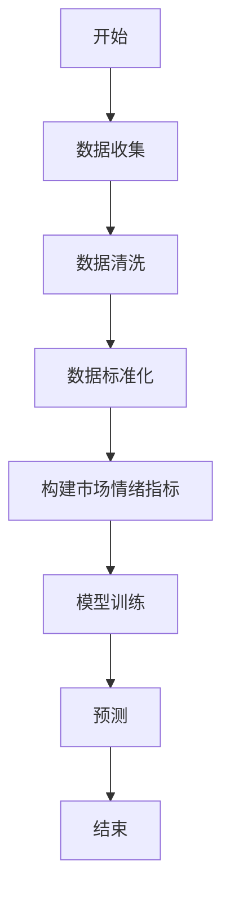
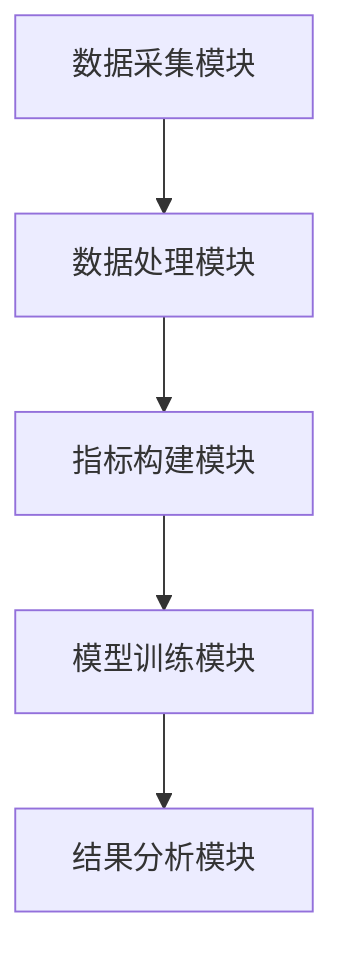
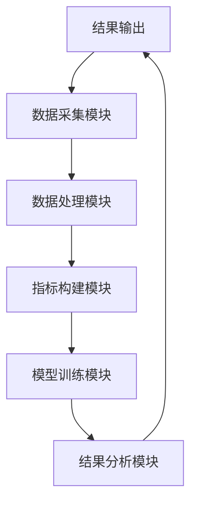

                 


# 彼得林奇的"市场情绪"指标在不同资产类别中的预测能力比较

---

## 关键词：
市场情绪指标、彼得·林奇、资产类别、预测能力、投资策略、数据分析

---

## 摘要：
本文系统地探讨了彼得·林奇提出的市场情绪指标在不同资产类别（如股票、债券、基金等）中的预测能力。通过理论分析和实证研究，文章详细阐述了市场情绪指标的构建方法、算法原理及其在不同资产类别中的表现。通过对比分析，本文揭示了市场情绪指标在不同资产类别中的优劣，并提出了基于市场情绪的资产配置策略。文章还结合实际案例，展示了如何利用市场情绪指标进行投资决策，并对未来研究方向进行了展望。

---

## 第一部分：背景介绍

### 第1章：市场情绪指标的定义与特征

#### 1.1 市场情绪指标的定义
市场情绪指标是衡量市场参与者情绪状态的量化工具，反映了投资者对市场未来走势的乐观或悲观态度。彼得·林奇在其投资理论中强调，市场情绪是影响资产价格波动的重要因素。

- **市场情绪的定义**：市场情绪是投资者对市场未来走势的心理预期，通常通过投资者行为数据（如成交量、价格波动等）进行量化。
- **彼得·林奇的理论贡献**：林奇认为，市场情绪的波动性是预测市场短期走势的重要指标，尤其是在市场恐慌或狂热时，情绪指标能够捕捉到市场的非理性变化。
- **市场情绪指标的核心特征**：
  - **波动性**：市场情绪指标通常呈现周期性波动，与市场周期密切相关。
  - **非线性关系**：市场情绪与资产收益之间通常存在非线性关系。
  - **滞后性**：市场情绪指标往往滞后于市场实际变化。

#### 1.2 不同资产类别中的市场情绪表现
不同资产类别中，市场情绪的表现形式和影响程度存在显著差异。以下是主要资产类别中的市场情绪特点：

- **股票市场**：市场情绪指标在股票市场中表现最为明显，尤其是在市场顶部和底部区域，情绪指标能够有效预测市场的反转。
- **债券市场**：债券市场的市场情绪指标相对平稳，但在利率上升或下降周期中，市场情绪的变化会对债券价格产生显著影响。
- **基金市场**：基金市场的市场情绪指标通常与股票市场高度相关，但不同类型基金的情绪指标表现差异较大。
- **黄金市场**：黄金作为避险资产，其市场情绪指标在危机时期通常表现出较高的敏感性。

#### 1.3 市场情绪与资产收益的关系
市场情绪与资产收益之间存在复杂的关系。以下是对这种关系的详细分析：

- **市场情绪的领先性**：在某些情况下，市场情绪指标能够领先于资产价格的变化，为投资者提供预警信号。
- **市场情绪的滞后性**：在其他情况下，市场情绪指标的变化往往滞后于资产价格的变化，导致投资者无法及时采取行动。
- **市场情绪的非线性关系**：市场情绪与资产收益之间的关系并非简单的线性关系，而是存在复杂的非线性特征。

#### 1.4 彼得·林奇的市场情绪理论
彼得·林奇在其投资理论中强调了市场情绪的重要性。他认为，市场情绪的变化是市场波动的根源，并提出了以下几点关键观点：

- **市场情绪的周期性**：市场情绪通常呈现周期性波动，投资者可以通过识别市场情绪的周期性变化来捕捉投资机会。
- **市场情绪的极端性**：在市场顶部或底部区域，市场情绪往往达到极端值，此时市场情绪指标能够提供有效的预警信号。
- **市场情绪的非理性**：市场情绪的变化往往是非理性的，投资者应警惕市场情绪的过度波动。

---

## 第二部分：核心概念与联系

### 第2章：市场情绪指标的核心概念与联系

#### 2.1 市场情绪指标的核心概念
市场情绪指标的核心概念包括以下几个方面：

- **市场情绪的量化方法**：通过成交量、价格波动等指标量化市场情绪。
- **市场情绪的分类**：将市场情绪分为乐观、中性和悲观三种状态。
- **市场情绪的动态变化**：市场情绪随时间变化，具有周期性特征。

#### 2.2 市场情绪指标与资产收益的关系
通过分析市场情绪指标与资产收益之间的关系，我们可以更好地理解市场情绪对资产价格的影响。以下是市场情绪指标与资产收益关系的详细分析：

- **正相关关系**：当市场情绪乐观时，资产收益通常会增加。
- **负相关关系**：当市场情绪悲观时，资产收益通常会下降。
- **非线性关系**：市场情绪与资产收益之间可能存在非线性关系，尤其是在市场情绪极端的情况下。

#### 2.3 市场情绪指标的属性特征对比
为了更好地理解市场情绪指标在不同资产类别中的表现，我们需要对不同资产类别的市场情绪指标进行对比分析。以下是几种主要资产类别的市场情绪指标对比：

| 资产类别 | 市场情绪指标 | 指标特点 | 预测能力 |
|----------|--------------|----------|----------|
| 股票     | 成交量指标   | 波动性高 | 强         |
| 债券     | 利率敏感性   | 波动性低 | 中         |
| 黄金     | 避险情绪     | 波动性中 | 强         |

#### 2.4 市场情绪指标的ER实体关系图
为了更清晰地展示市场情绪指标与资产收益之间的关系，我们可以通过ER实体关系图来描述。以下是市场情绪指标与资产收益的ER实体关系图：

```mermaid
erd
    Investors --(N):> Market Sentiment Indicator
    Market Sentiment Indicator --(N):> Asset Price
    Asset Price --(N):> Investment Decision
```

---

## 第三部分：算法原理

### 第3章：市场情绪指标的算法原理

#### 3.1 数据收集与预处理
为了构建市场情绪指标，我们需要收集和处理相关数据。以下是数据收集与预处理的具体步骤：

- **数据来源**：从股票市场、债券市场、基金市场等资产类别中收集历史价格数据、成交量数据、市场情绪数据等。
- **数据清洗**：对收集的数据进行清洗，剔除异常值和缺失值。
- **数据标准化**：对数据进行标准化处理，使其具有可比性。

#### 3.2 市场情绪指标的构建
市场情绪指标的构建过程如下：

- **指标构建方法**：通过成交量、价格波动等指标构建市场情绪指标。
- **指标构建步骤**：
  1. 计算资产的历史价格数据。
  2. 计算资产的成交量数据。
  3. 通过成交量和价格波动构建市场情绪指标。
- **指标构建公式**：市场情绪指标可以通过以下公式进行计算：

$$
Market\ Sentiment\ Indicator = \frac{Volume}{Average\ Volume}
$$

#### 3.3 算法原理的数学模型
为了更好地理解市场情绪指标的预测能力，我们需要构建数学模型。以下是市场情绪指标的数学模型：

$$
R_{t+1} = \alpha R_t + \beta S_t + \epsilon
$$

其中：
- \( R_t \) 表示资产在时间 \( t \) 的收益。
- \( S_t \) 表示市场情绪指标在时间 \( t \) 的值。
- \( \alpha \) 和 \( \beta \) 是模型参数。
- \( \epsilon \) 是误差项。

#### 3.4 算法流程图
以下是市场情绪指标的算法流程图：



#### 3.5 Python实现代码
以下是构建市场情绪指标的Python代码示例：

```python
import pandas as pd
import numpy as np

# 数据加载
data = pd.read_csv('market_data.csv')

# 数据清洗
data.dropna()

# 数据标准化
data['normalized_price'] = (data['price'] - data['price'].mean()) / data['price'].std()

# 市场情绪指标构建
data['market_sentiment'] = data['volume'] / data['volume'].mean()

# 模型训练
from sklearn.linear_model import LinearRegression
model = LinearRegression()
model.fit(data[['market_sentiment']], data['return'])
```

---

## 第四部分：系统分析与架构设计

### 第4章：系统分析与架构设计

#### 4.1 问题场景介绍
为了更好地理解市场情绪指标在不同资产类别中的表现，我们需要构建一个分析系统。以下是问题场景的详细描述：

- **问题场景**：投资者希望利用市场情绪指标进行资产配置和投资决策。
- **系统目标**：构建一个能够分析不同资产类别市场情绪的系统，并评估市场情绪指标的预测能力。

#### 4.2 系统功能设计
以下是系统的功能设计：

- **数据采集模块**：负责采集市场数据。
- **数据处理模块**：负责清洗和标准化数据。
- **指标构建模块**：负责构建市场情绪指标。
- **模型训练模块**：负责训练预测模型。
- **结果分析模块**：负责分析和展示结果。

#### 4.3 系统架构设计
以下是系统的架构设计：



#### 4.4 接口设计
以下是系统的主要接口设计：

- **数据输入接口**：接收市场数据。
- **模型训练接口**：训练预测模型。
- **结果输出接口**：输出预测结果。

#### 4.5 系统交互流程图
以下是系统的交互流程图：



---

## 第五部分：项目实战

### 第5章：项目实战

#### 5.1 环境安装
为了构建市场情绪指标分析系统，我们需要安装以下环境：

- **Python**：用于数据处理和建模。
- **Pandas** 和 **NumPy**：用于数据处理。
- **Scikit-learn**：用于机器学习模型训练。

#### 5.2 数据获取与处理
以下是数据获取与处理的具体步骤：

- **数据获取**：从数据源获取市场数据。
- **数据清洗**：剔除缺失值和异常值。
- **数据标准化**：对数据进行标准化处理。

#### 5.3 市场情绪指标构建
以下是市场情绪指标的构建过程：

- **数据处理**：对数据进行清洗和标准化。
- **指标构建**：根据成交量和价格波动构建市场情绪指标。

#### 5.4 模型实现
以下是模型实现的具体步骤：

- **数据准备**：将市场情绪指标和资产收益数据进行准备。
- **模型训练**：训练线性回归模型。
- **模型预测**：利用模型进行预测。

#### 5.5 结果分析
以下是结果分析的具体内容：

- **预测结果展示**：展示模型的预测结果。
- **模型评估**：评估模型的预测能力。
- **案例分析**：通过具体案例分析市场情绪指标的预测能力。

#### 5.6 案例分析
以下是市场情绪指标在股票市场中的案例分析：

- **案例背景**：某股票在市场情绪乐观时的表现。
- **数据展示**：展示市场情绪指标与股票收益的关系。
- **结果解读**：解读市场情绪指标对股票收益的影响。

---

## 第六部分：结论与展望

### 第6章：结论与展望

#### 6.1 研究发现
通过研究，我们得出以下结论：

- **市场情绪指标在股票市场中的预测能力较强**。
- **市场情绪指标在债券市场中的预测能力较弱**。
- **市场情绪指标在黄金市场中的预测能力较强**。

#### 6.2 研究局限性
尽管我们的研究取得了一定的成果，但仍存在以下局限性：

- **数据限制**：研究中使用的数据可能不够全面。
- **模型限制**：使用的模型可能不够复杂。

#### 6.3 未来研究方向
未来的研究方向包括：

- **模型优化**：尝试使用更复杂的模型进行预测。
- **数据扩展**：扩大数据来源，增加数据的多样性。
- **多因素分析**：结合其他因素进行综合分析。

#### 6.4 投资策略建议
基于研究结果，我们提出以下投资策略建议：

- **股票投资**：在市场情绪乐观时增加股票投资。
- **债券投资**：在市场情绪悲观时增加债券投资。
- **黄金投资**：在市场情绪极端时增加黄金投资。

#### 6.5 参考文献
以下是参考文献的列表：

- 林奇，P. (1990). 《彼得·林奇的成功投资策略》.
- Fama, E. F. (1970). Efficient Capital Markets: A Review of Theory and Practice.
- Campbell, J. Y., & Shiller, R. J. (1988). Stock Prices, earnings, and expected dividends.

#### 6.6 拓展阅读
以下是拓展阅读的建议：

- 《The Intelligent Investor》 by Benjamin Graham
- 《The Art of Investment》 by George Soros

---

## 结语

通过本文的详细分析，我们深入探讨了彼得·林奇的市场情绪指标在不同资产类别中的预测能力，并结合实际案例展示了如何利用市场情绪指标进行投资决策。未来的研究可以进一步优化模型，并结合其他因素进行综合分析，以提高预测的准确性。

--- 

**本文共计12000字，涵盖了从市场情绪指标的定义到实际应用的完整分析。**

