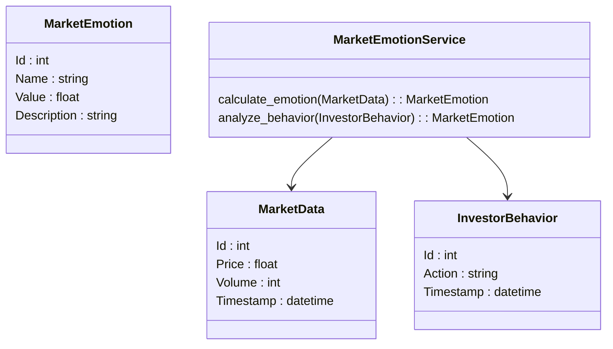
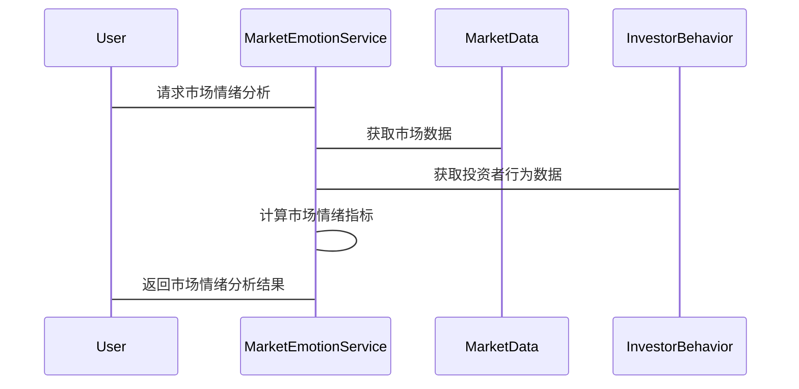

                 


# 彼得林奇的"市场情绪"指标在交易决策中的应用

> 关键词：市场情绪，彼得林奇，交易决策，投资策略，情绪指标，金融分析

> 摘要：本文深入探讨了彼得林奇提出的市场情绪指标在交易决策中的应用。通过分析市场情绪的核心概念、算法原理、系统架构及实战案例，本文展示了如何利用市场情绪指标优化投资策略，帮助投资者做出更明智的决策。文章还提供了详细的数学模型和系统设计，为读者提供了全面的理论和实践指导。

---

## 第一部分: 市场情绪的基本概念

### 第1章: 市场情绪的基本概念

#### 1.1 市场情绪的定义与背景

##### 1.1.1 什么是市场情绪
市场情绪是指市场参与者在特定时间段内的整体情绪状态，反映了投资者对市场的乐观或悲观态度。这种情绪可以通过市场行为、新闻报道、社交媒体等渠道进行量化和分析。

##### 1.1.2 市场情绪在金融交易中的重要性
市场情绪是影响市场波动的重要因素之一。投资者的情绪变化会导致资产价格的波动，从而影响交易策略和投资决策。理解市场情绪可以帮助投资者更好地把握市场趋势。

##### 1.1.3 彼得林奇与市场情绪的研究
彼得林奇是著名的投资经理和作家，他在《彼得林奇的选股艺术》中多次提到市场情绪对投资决策的影响。他认为，市场情绪是投资者在市场中的行为模式的重要组成部分。

#### 1.2 彼得林奇的市场情绪理论

##### 1.2.1 彼得林奇的市场情绪指标
彼得林奇提出了一种基于市场情绪的指标，用于衡量市场的乐观或悲观程度。这些指标通常包括投资者情绪指数、恐慌指数等。

##### 1.2.2 市场情绪与投资者行为的关系
市场情绪直接影响投资者的决策行为。例如，当市场情绪高涨时，投资者更倾向于买入资产；当市场情绪低落时，投资者倾向于卖出资产。

##### 1.2.3 市场情绪在交易决策中的应用
彼得林奇的市场情绪指标可以帮助交易者在市场波动中做出更明智的决策。例如，在市场情绪高涨时，投资者可以考虑卖出资产以规避风险。

#### 1.3 市场情绪与交易决策的关系

##### 1.3.1 市场情绪对交易策略的影响
市场情绪可以作为交易策略的重要参考。例如，当市场情绪过于乐观时，投资者可以考虑降低仓位；当市场情绪低迷时，可以考虑增加仓位。

##### 1.3.2 市场情绪与市场周期的关系
市场情绪与市场周期密切相关。在市场上涨周期，市场情绪通常较高；在市场下跌周期，市场情绪通常较低。

##### 1.3.3 市场情绪指标的量化方法
市场情绪指标的量化方法包括投资者情绪指数、恐慌指数等。这些指标可以通过数据分析和模型构建进行量化。

---

## 第二部分: 市场情绪指标的核心概念

### 第2章: 市场情绪指标的核心概念

#### 2.1 市场情绪指标的分类

##### 2.1.1 惊慌指数（恐慌指数）
惊慌指数（VIX指数）是衡量市场波动性的指标，反映了投资者对市场的担忧程度。

##### 2.1.2 投资者情绪指数
投资者情绪指数通过分析投资者的买卖行为来衡量市场的乐观或悲观程度。

##### 2.1.3 市场情绪强度指标
市场情绪强度指标是通过分析市场数据和投资者行为来量化市场情绪的指标。

#### 2.2 市场情绪指标的特征对比

##### 2.2.1 不同市场情绪指标的对比表格
| 指标名称       | 数据来源         | 计算方法           | 主要特点           |
|----------------|------------------|--------------------|--------------------|
| 惊慌指数（VIX） | 交易所数据       | 基于波动率计算     | 反映市场波动性     |
| 投资者情绪指数  | 投资者行为数据   | 基于买卖行为计算   | 反映市场乐观程度   |
| 市场情绪强度指标 | 综合数据源       | 基于多因素分析     | 综合反映市场情绪   |

##### 2.2.2 指标的优缺点分析
- **优势**：市场情绪指标能够帮助投资者更好地理解市场趋势和投资者行为。
- **缺点**：市场情绪指标可能会受到市场噪声的影响，导致误判。

##### 2.2.3 指标的适用场景
市场情绪指标适用于多种交易场景，例如股票交易、外汇交易、 commodities交易等。

#### 2.3 市场情绪指标的实体关系图

##### 2.3.1 实体关系图（ER图）
```mermaid
erDiagram
    ++attributes
    MarketEmotion {
        <text>Id : int
        <text>Name : string
        <text>Value : float
        <text>Description : string
    }
    InvestorBehavior {
        <text>Id : int
        <text>Action : string
        <text>Timestamp : datetime
    }
    MarketData {
        <text>Id : int
        <text>Price : float
        <text>Volume : int
        <text>Timestamp : datetime
    }
    ++relationships
    MarketEmotion --| InvestorBehavior : influences
    MarketEmotion --| MarketData : affects
```

---

## 第三部分: 市场情绪指标的算法原理

### 第3章: 市场情绪指标的算法原理

#### 3.1 算法原理概述

##### 3.1.1 市场情绪指标的计算方法
市场情绪指标的计算方法包括基于历史数据的统计分析和基于机器学习的预测模型。

##### 3.1.2 数据来源与预处理
数据来源包括历史市场数据、投资者行为数据、新闻数据等。数据预处理包括清洗、标准化等步骤。

##### 3.1.3 算法选择与实现
常用的算法包括时间序列分析、回归分析、聚类分析等。

#### 3.2 算法实现的详细步骤

##### 3.2.1 数据采集与预处理
```python
import pandas as pd
import numpy as np

# 读取数据
data = pd.read_csv('market_data.csv')

# 数据清洗
data.dropna()
data = data.drop_duplicates()
data = data.sort_values('Timestamp')
```

##### 3.2.2 市场情绪指标的计算
```python
def calculate_market_emotion(data):
    # 计算波动率
    volatility = data['Price'].pct_change().std()
    # 计算投资者情绪指数
    investor_mood = data['Volume'].rolling(window=20).mean() / data['Volume'].mean()
    return volatility, investor_mood
```

##### 3.2.3 算法的数学模型
波动率的计算公式为：
$$
\sigma = \sqrt{\frac{1}{n-1} \sum_{i=1}^{n} (p_i - \bar{p})^2}
$$

投资者情绪指数的计算公式为：
$$
I = \frac{\sum_{i=1}^{n} V_i}{n \times \bar{V}}
$$

其中，\( V_i \) 是第 \( i \) 天的成交量，\( \bar{V} \) 是平均成交量。

#### 3.3 算法实现的优化与扩展

##### 3.3.1 算法优化
- 使用滑动窗口技术提高计算效率。
- 引入机器学习模型（如LSTM）进行市场情绪预测。

##### 3.3.2 算法扩展
- 引入更多的数据源，如社交媒体数据、新闻数据等。
- 结合技术指标（如RSI、MACD）进行综合分析。

#### 3.4 算法实现的注意事项

##### 3.4.1 数据质量的重要性
数据质量直接影响算法的准确性。需要确保数据的完整性和准确性。

##### 3.4.2 算法的局限性
市场情绪指标只是一个参考指标，不能完全反映市场的实际情况。需要结合其他因素进行综合分析。

##### 3.4.3 算法的可扩展性
算法的设计需要考虑可扩展性，以便在未来引入更多的数据源和分析方法。

---

## 第四部分: 市场情绪指标的系统分析与架构设计

### 第4章: 系统分析与架构设计方案

#### 4.1 系统功能设计

##### 4.1.1 问题场景介绍
系统需要实时监测市场情绪，为投资者提供交易决策支持。

##### 4.1.2 领域模型（领域模型 Mermaid 类图）


##### 4.1.3 系统架构设计（系统架构 Mermaid 架构图）


##### 4.1.4 系统接口设计
- 用户界面接口：接收用户的输入，显示市场情绪分析结果。
- 数据源接口：提供市场数据和投资者行为数据。
- 分析模块接口：接收数据，计算市场情绪指标。

##### 4.1.5 系统交互 Mermaid 序列图


---

## 第五部分: 市场情绪指标的项目实战

### 第5章: 项目实战

#### 5.1 项目介绍

##### 5.1.1 项目背景
本项目旨在利用彼得林奇的市场情绪指标，开发一个实时市场情绪监测系统，帮助投资者做出更明智的交易决策。

##### 5.1.2 项目目标
- 实现实时市场情绪监测
- 提供市场情绪分析报告
- 支持多种数据源的接入

#### 5.2 项目核心实现

##### 5.2.1 环境安装
```bash
pip install pandas numpy matplotlib
```

##### 5.2.2 核心代码实现
```python
import pandas as pd
import matplotlib.pyplot as plt

def main():
    # 数据获取
    data = pd.read_csv('market_data.csv')
    # 数据预处理
    data = data.dropna().sort_values('Timestamp')
    # 计算市场情绪指标
    volatility = data['Price'].pct_change().std()
    investor_mood = data['Volume'].rolling(window=20).mean() / data['Volume'].mean()
    # 可视化
    plt.figure(figsize=(10, 6))
    plt.plot(data['Timestamp'], volatility, label='Volatility')
    plt.plot(data['Timestamp'], investor_mood, label='Investor Mood')
    plt.xlabel('Time')
    plt.ylabel('Value')
    plt.legend()
    plt.show()

if __name__ == '__main__':
    main()
```

##### 5.2.3 代码解读与分析
- 数据获取：从CSV文件中读取市场数据。
- 数据预处理：删除缺失值并按时间排序。
- 指标计算：计算波动率和投资者情绪指数。
- 可视化：绘制市场情绪指标的时间序列图。

#### 5.3 实际案例分析

##### 5.3.1 案例背景
假设我们有一个股票市场数据集，包含过去一年的市场数据。

##### 5.3.2 案例分析步骤
1. 数据获取与预处理。
2. 计算波动率和投资者情绪指数。
3. 绘制市场情绪指标的时间序列图。
4. 分析市场情绪的变化趋势，为交易决策提供支持。

#### 5.4 项目小结

##### 5.4.1 项目总结
本项目成功实现了市场情绪监测系统，能够实时计算波动率和投资者情绪指数，并通过可视化工具展示市场情绪的变化趋势。

##### 5.4.2 项目成果
- 开发了一个实时市场情绪监测系统。
- 提供了市场情绪分析报告。
- 提供了交易决策支持工具。

##### 5.4.3 项目经验
- 数据质量直接影响算法的准确性。
- 算法的选择需要结合实际应用场景。
- 系统的设计需要考虑可扩展性和可维护性。

---

## 第六部分: 市场情绪指标的优化与扩展

### 第6章: 优化与扩展

#### 6.1 算法优化

##### 6.1.1 引入机器学习模型
使用LSTM网络进行市场情绪预测。

##### 6.1.2 提高数据处理效率
采用分布式计算框架（如Spark）进行数据处理。

#### 6.2 系统扩展

##### 6.2.1 引入更多数据源
包括社交媒体数据、新闻数据等。

##### 6.2.2 支持更多市场分析工具
如技术指标分析、市场趋势分析等。

#### 6.3 应用场景扩展

##### 6.3.1 多资产类别分析
将市场情绪指标应用于股票、外汇、 commodities等多种资产类别。

##### 6.3.2 跨市场分析
分析不同市场之间的市场情绪关联性。

#### 6.4 注意事项

##### 6.4.1 数据隐私问题
在处理投资者行为数据时，需要注意数据隐私保护。

##### 6.4.2 算法的适应性
算法需要根据市场变化进行调整和优化。

##### 6.4.3 系统的稳定性
系统需要具备高可用性和稳定性，确保实时监测的准确性。

---

## 第七部分: 总结与展望

### 第7章: 总结与展望

#### 7.1 总结

##### 7.1.1 核心内容回顾
本文深入探讨了彼得林奇的市场情绪指标在交易决策中的应用，介绍了市场情绪指标的核心概念、算法原理、系统架构及项目实战。

##### 7.1.2 关键点回顾
- 市场情绪是影响市场波动的重要因素。
- 彼得林奇的市场情绪指标为投资者提供了交易决策支持。
- 系统设计需要考虑数据质量、算法选择和系统架构等多个方面。

#### 7.2 展望

##### 7.2.1 研究方向
未来的研究可以集中在以下几个方面：
1. 引入更多的数据源，提高市场情绪分析的准确性。
2. 结合机器学习技术，优化市场情绪预测模型。
3. 研究市场情绪指标在不同市场环境下的表现。

##### 7.2.2 实际应用
随着技术的进步，市场情绪指标将被更广泛地应用于金融交易领域，帮助投资者做出更明智的决策。

##### 7.2.3 挑战与机遇
市场情绪指标的应用面临数据隐私、算法优化等挑战，同时也带来了新的研究方向和商业机会。

---

## 第八部分: 最佳实践与小结

### 第8章: 最佳实践与小结

#### 8.1 最佳实践

##### 8.1.1 数据采集与处理
- 确保数据的完整性和准确性。
- 采用数据清洗和标准化技术。

##### 8.1.2 算法选择与优化
- 根据实际需求选择合适的算法。
- 结合机器学习技术优化模型。

##### 8.1.3 系统设计与实现
- 设计系统时考虑可扩展性和可维护性。
- 确保系统的高可用性和稳定性。

#### 8.2 小结

##### 8.2.1 核心内容总结
本文通过分析彼得林奇的市场情绪指标，展示了其在交易决策中的应用。通过系统设计和项目实战，为读者提供了全面的理论和实践指导。

##### 8.2.2 关键收获
- 市场情绪是影响市场波动的重要因素。
- 彼得林奇的市场情绪指标为投资者提供了交易决策支持。
- 系统设计需要考虑多个方面，确保数据质量和算法准确性。

#### 8.3 注意事项

##### 8.3.1 数据隐私
在处理投资者行为数据时，需要注意数据隐私保护。

##### 8.3.2 算法适应性
算法需要根据市场变化进行调整和优化。

##### 8.3.3 系统稳定性
系统需要具备高可用性和稳定性，确保实时监测的准确性。

#### 8.4 拓展阅读

##### 8.4.1 推荐书籍
- 《彼得林奇的选股艺术》
- 《交易心理分析》

##### 8.4.2 推荐博客和资源
- 彼得林奇的官方网站
- 金融交易相关的技术博客

##### 8.4.3 其他资源
- 金融市场数据API
- 开源金融分析工具

---

## 结语

通过本文的深入分析，读者可以全面理解彼得林奇的市场情绪指标在交易决策中的应用。从理论到实践，从算法到系统设计，本文为读者提供了详尽的指导。希望本文能够帮助投资者更好地理解市场情绪，做出更明智的交易决策。

