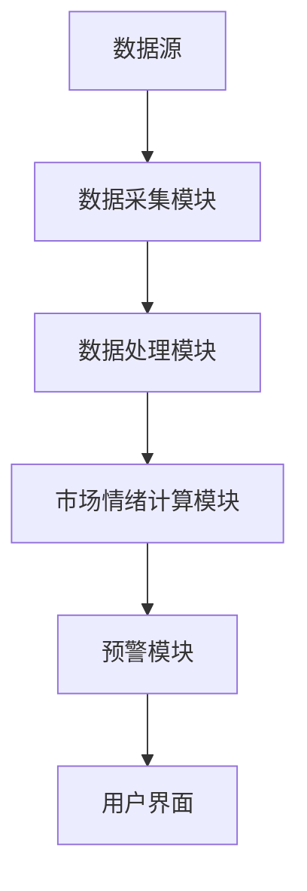
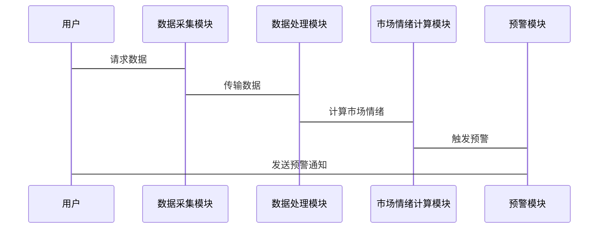

                 


# 彼得林奇的"市场情绪"指标在危机预警中的应用

**关键词**：市场情绪，彼得林奇，危机预警，金融分析，投资策略

**摘要**：本文深入探讨了彼得林奇提出的“市场情绪”指标在金融市场的应用，重点分析其如何帮助投资者预测市场危机。通过量化模型、系统架构和实际案例，详细阐述了市场情绪指标的理论基础、算法实现及其在危机预警中的实际应用。文章还提供了系统设计、项目实战和优化建议，帮助读者更好地理解和应用这一指标。

---

# 第一部分: 市场情绪指标的背景与概述

## 第1章: 市场情绪指标的背景与概述

### 1.1 市场情绪指标的定义与作用

#### 1.1.1 什么是市场情绪
市场情绪是指投资者在特定时间段内的整体心理状态，反映了市场参与者的乐观或悲观情绪。这种情绪可以通过多种指标量化，例如成交量、股价波动率、投资者信心指数等。

#### 1.1.2 市场情绪在金融分析中的作用
市场情绪是金融分析中的重要因素。它可以帮助投资者预测市场趋势、评估风险，并制定相应的投资策略。尤其是在危机发生前，市场情绪的变化往往能够提供预警信号。

#### 1.1.3 彼得林奇与市场情绪指标的关联
彼得林奇是美国著名的投资经理，他在职业生涯中积累了丰富的市场经验。他提出，市场情绪是影响投资决策的关键因素之一，并开发了相应的指标来量化市场情绪。

### 1.2 市场情绪指标的核心要素

#### 1.2.1 投资者心理与市场情绪的关系
投资者的心理状态直接影响市场情绪。当大多数投资者乐观时，市场情绪为正；反之则为负。这种情绪通过市场行为（如交易量、股价波动）反映出来。

#### 1.2.2 市场情绪的量化维度
市场情绪的量化维度包括：
- 投资者信心指数
- 股价波动率
- 成交量变化
- 市场情绪指数（如恐慌指数）

#### 1.2.3 市场情绪指标的分类与特点
市场情绪指标可以分为以下几类：
- **情绪指标**：如恐慌指数、投资者信心指数。
- **行为指标**：如成交量、换手率。
- **市场估值指标**：如市盈率、市净率。

---

## 第2章: 市场情绪的构成与影响

### 2.1 投资者情绪的构成要素

#### 2.1.1 理性与非理性决策
投资者在市场中的决策往往是理性和非理性的结合。理性决策基于基本面分析，而非理性决策则受到情绪影响。

#### 2.1.2 市场参与者的心理特征
投资者的心理特征包括风险偏好、时间偏好和信息处理能力等。这些特征影响其市场情绪。

#### 2.1.3 市场情绪的传播机制
市场情绪可以通过信息传播、社会影响等方式在投资者之间传播。例如，负面新闻可能导致市场恐慌，从而加剧市场情绪的恶化。

### 2.2 市场情绪与市场波动的关系

#### 2.2.1 市场情绪对价格波动的影响
市场情绪直接影响资产价格。当市场情绪乐观时，资产价格上涨；当市场情绪悲观时，资产价格下跌。

#### 2.2.2 市场情绪周期性分析
市场情绪具有周期性，通常与市场周期密切相关。例如，市场情绪在牛市中较高，在熊市中较低。

#### 2.2.3 市场情绪与金融危机的关联
市场情绪是金融危机的重要诱因。当市场情绪过度乐观时，可能导致资产泡沫；当市场情绪过度悲观时，可能导致市场崩盘。

### 2.3 彼得林奇市场情绪理论的扩展

#### 2.3.1 彼得林奇的市场情绪指标体系
彼得林奇提出了多个市场情绪指标，包括投资者信心指数、恐慌指数等。这些指标可以量化市场情绪，并用于预测市场趋势。

#### 2.3.2 市场情绪指标在危机预警中的应用
市场情绪指标可以用于危机预警。例如，当市场情绪突然下降时，可能预示着市场危机的到来。

#### 2.3.3 市场情绪指标的局限性与改进方向
市场情绪指标的局限性包括：
- 数据采集困难
- 模型的局限性
- 市场情绪的不可预测性

---

## 第3章: 市场情绪指标的量化模型与算法

### 3.1 市场情绪指标的数学模型

#### 3.1.1 市场情绪指数的构建公式
市场情绪指数（MEI）可以基于多个指标构建，例如：
$$ MEI = \alpha \cdot V + \beta \cdot R + \gamma \cdot C $$
其中，$V$ 表示成交量，$R$ 表示股价波动率，$C$ 表示投资者信心指数，$\alpha$、$\beta$、$\gamma$ 是权重系数。

#### 3.1.2 情绪强度的量化方法
情绪强度可以通过标准化处理量化。例如：
$$ S = \frac{E - \mu}{\sigma} $$
其中，$E$ 是情绪指标的值，$\mu$ 是均值，$\sigma$ 是标准差。

#### 3.1.3 时间序列分析模型
时间序列分析模型（如ARIMA）可以用于市场情绪的预测。例如：
$$ ARIMA(p, d, q) $$
其中，$p$ 是自回归阶数，$d$ 是差分阶数，$q$ 是移动平均阶数。

### 3.2 市场情绪指标的算法实现

#### 3.2.1 数据预处理与特征提取
数据预处理包括数据清洗、标准化等。特征提取包括选择相关指标，如成交量、股价波动率等。

#### 3.2.2 基于机器学习的情绪分类算法
机器学习算法（如随机森林、支持向量机）可以用于市场情绪分类。例如：
```python
from sklearn.ensemble import RandomForestClassifier
model = RandomForestClassifier()
model.fit(X_train, y_train)
```

#### 3.2.3 基于深度学习的情绪预测模型
深度学习模型（如LSTM）可以用于市场情绪预测。例如：
```python
from keras.layers import LSTM, Dense
from keras.models import Sequential
model = Sequential()
model.add(LSTM(64, input_shape=(timesteps, features)))
model.add(Dense(1))
model.compile(loss='mean_squared_error', optimizer='adam')
```

### 3.3 市场情绪指标的验证与优化

#### 3.3.1 模型的验证方法
模型验证包括回测、交叉验证等。例如，使用历史数据回测模型的预测能力。

#### 3.3.2 模型的优化方法
模型优化包括调整参数、选择特征等。例如，使用网格搜索优化随机森林模型的参数。

---

## 第4章: 市场情绪指标的系统架构与实现方案

### 4.1 系统架构设计

#### 4.1.1 系统功能设计
系统功能包括数据采集、情绪指标计算、预警触发等。

#### 4.1.2 系统架构图
使用Mermaid绘制系统架构图：


### 4.2 系统实现方案

#### 4.2.1 数据接口设计
数据接口包括数据采集接口、数据存储接口等。

#### 4.2.2 系统交互流程图
使用Mermaid绘制系统交互流程图：


---

## 第5章: 市场情绪指标的项目实战

### 5.1 项目实战环境安装

#### 5.1.1 环境安装步骤
安装Python、数据处理库（如Pandas）、机器学习库（如Scikit-learn）等。

### 5.2 系统核心实现源代码

#### 5.2.1 市场情绪指标计算代码
```python
import pandas as pd
import numpy as np

def compute_market_emotion(data):
    # 计算成交量变化率
    volume_change = data['volume'].pct_change()
    # 计算股价波动率
    volatility = data['price'].std()
    # 计算市场情绪指数
    mei = volume_change * volatility
    return mei

data = pd.DataFrame({
    'price': [100, 105, 98, 102, 101],
    'volume': [1000, 1200, 900, 1100, 1050]
})
result = compute_market_emotion(data)
print(result)
```

#### 5.2.2 基于机器学习的预警系统代码
```python
from sklearn.ensemble import RandomForestClassifier

def train_emotion_classifier(X_train, y_train):
    model = RandomForestClassifier()
    model.fit(X_train, y_train)
    return model

# 示例数据
X_train = np.random.randn(100, 5)
y_train = np.random.randint(0, 2, 100)

model = train_emotion_classifier(X_train, y_train)
```

### 5.3 项目实战小结

#### 5.3.1 项目实现的关键点
- 数据采集与处理
- 市场情绪指标计算
- 预警系统实现

#### 5.3.2 实际案例分析与解读
通过实际案例分析，验证市场情绪指标的预警能力。

---

## 第6章: 总结与展望

### 6.1 总结
本文详细探讨了彼得林奇的市场情绪指标在危机预警中的应用，分析了其理论基础、算法实现和系统架构。通过实际案例展示了其应用价值。

### 6.2 优化建议与注意事项

#### 6.2.1 数据质量的重要性
数据质量直接影响模型的准确性，需选择高质量的数据源。

#### 6.2.2 模型的局限性
市场情绪指标的预测能力有限，需结合其他指标进行综合分析。

#### 6.2.3 实际应用中的注意事项
在实际应用中，需考虑市场环境的变化，及时调整模型参数。

### 6.3 未来展望

#### 6.3.1 市场情绪指标的优化方向
未来可以研究更复杂的模型，如深度学习模型，提高预测精度。

#### 6.3.2 技术的发展与应用
随着技术的发展，市场情绪指标的应用将更加广泛，尤其是在大数据和人工智能领域。

---

## 参考文献
1. 彼得林奇的原著
2. 相关学术论文
3. 技术博客和资料

---

**附录：** 详细代码示例、数据表、图表等。

---

通过以上步骤，本文详细阐述了彼得林奇的市场情绪指标在危机预警中的应用，帮助读者理解和应用这一重要指标。

