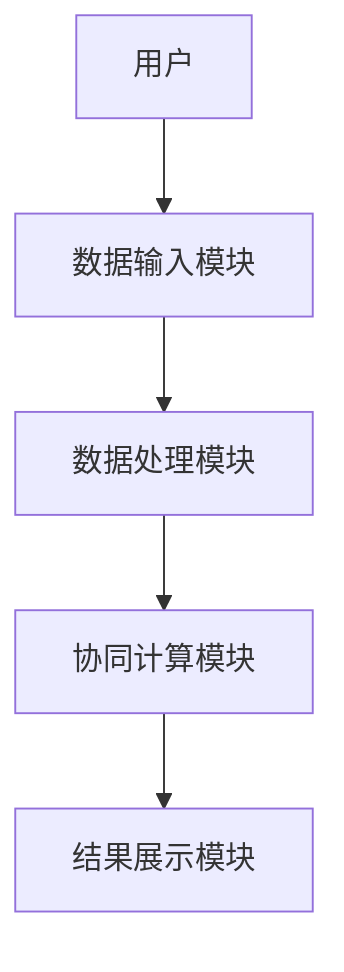
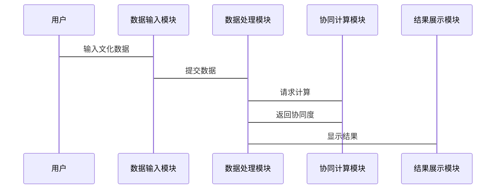

                 


# 彼得林奇的"市场机会"在跨境并购中的文化协同评估模型

## 关键词：彼得林奇，市场机会，跨境并购，文化协同，评估模型

## 摘要

本文将探讨彼得林奇的“市场机会”理论在跨境并购中的应用，特别是在文化协同评估中的重要性。通过构建一个基于文化协同的评估模型，本文旨在为企业在跨境并购中提供一种新的视角和方法，以识别和利用市场机会，从而提高并购的成功率。

---

# 第一部分：背景介绍

## 第1章：彼得林奇的市场机会理论

### 1.1 彼得林奇的投资者画像

彼得·林奇（Peter Lynch）是全球最著名的投资专家之一，以其在共同基金行业的卓越表现闻名。他的投资哲学强调长期投资、深入研究和寻找市场中的独特机会。

- **投资者画像**：彼得林奇认为，成功的投资者需要具备市场敏感性，能够识别市场中的低估机会，并且能够在市场波动中保持冷静。

### 1.2 市场机会的核心概念

彼得林奇的市场机会理论强调以下几点：

- **市场机会的定义**：市场机会是指在特定市场中，由于某种原因导致某些资产被低估，从而为投资者提供超额收益的可能性。
- **市场机会的识别**：彼得林奇认为，市场机会通常出现在市场情绪低落或市场波动较大的时候，此时某些优质资产可能被市场过度抛售。

### 1.3 跨界并购中的文化协同重要性

跨境并购是指一家公司收购另一家位于不同国家或地区的公司。文化协同在跨境并购中至关重要，因为文化差异可能导致管理冲突、团队不信任以及运营效率低下。

- **文化协同的定义**：文化协同是指在跨境并购中，双方企业在文化价值观、管理风格和企业行为上的一致性，从而确保并购后的整合顺利进行。
- **文化协同的影响**：文化协同能够提高并购后的整合效率，减少管理冲突，并增强企业的整体竞争力。

---

## 第2章：文化协同评估模型的基本原理

### 2.1 文化协同的核心概念

文化协同评估模型需要考虑以下核心概念：

- **文化的定义与维度**：文化通常包括价值观、信仰、习惯和行为准则等。在跨境并购中，文化协同需要考虑双方企业在管理风格、决策模式和企业价值观等方面的差异。
- **协同效应的定义**：协同效应是指并购后双方企业在资源、技术、市场和管理等方面的整合所产生的额外价值。

### 2.2 彼得林奇市场机会与文化协同的联系

彼得林奇的市场机会理论与文化协同在跨境并购中的应用密切相关。市场机会的识别需要考虑文化因素，因为文化差异可能影响企业的市场定位和运营效率。

- **市场机会与文化协同的互动**：市场机会的识别需要考虑目标企业的文化背景，因为文化差异可能影响企业对市场的适应能力和竞争力。
- **文化协同对市场机会的影响**：文化协同能够增强企业的市场敏感性，从而更好地识别和利用市场机会。

### 2.3 文化协同评估模型的构建

文化协同评估模型需要结合彼得林奇的市场机会理论，构建一个能够量化文化协同对市场机会影响的数学模型。

- **模型的输入**：模型需要输入双方企业的文化维度数据，包括管理风格、决策模式和企业价值观等。
- **模型的输出**：模型输出文化协同度，衡量双方企业在文化上的匹配程度，并预测并购后的市场机会。

---

## 第3章：文化协同评估模型的算法实现

### 3.1 模型算法概述

文化协同评估模型的算法基于以下步骤：

1. **数据预处理**：对双方企业的文化数据进行清洗和标准化。
2. **文化维度量化**：将文化维度转换为可量化的指标，例如使用0到1的评分体系。
3. **文化协同度计算**：基于量化后的文化维度，计算双方企业的文化协同度。

### 3.2 算法的数学模型

文化协同度的计算公式如下：

$$
\text{文化协同度} = \sum_{i=1}^{n} w_i \times c_i
$$

其中，\( w_i \) 是第 \( i \) 个文化的权重，\( c_i \) 是第 \( i \) 个文化的协同评分。

### 3.3 算法实现的步骤

1. **数据收集**：收集双方企业的文化数据，包括管理风格、决策模式和企业价值观等。
2. **数据清洗**：对数据进行清洗，去除异常值和缺失值。
3. **数据标准化**：将文化数据标准化为0到1的评分体系。
4. **文化协同度计算**：根据公式计算文化协同度。
5. **结果分析**：分析文化协同度，评估并购后的市场机会。

---

## 第4章：系统架构与设计

### 4.1 系统功能模块设计

文化协同评估系统的功能模块包括：

1. **数据输入模块**：用于输入双方企业的文化数据。
2. **数据处理模块**：对数据进行清洗和标准化。
3. **协同计算模块**：计算文化协同度。
4. **结果展示模块**：展示文化协同度的结果。

### 4.2 系统架构设计

使用Mermaid绘制系统架构图：



### 4.3 系统接口设计

系统接口设计包括：

1. **数据输入接口**：用户输入双方企业的文化数据。
2. **数据处理接口**：对数据进行清洗和标准化。
3. **协同计算接口**：计算文化协同度。
4. **结果展示接口**：展示文化协同度的结果。

### 4.4 系统交互设计

使用Mermaid绘制系统交互流程图：



---

## 第5章：项目实战

### 5.1 环境安装

需要安装以下工具：

1. Python 3.x
2. Mermaid工具
3. 数据处理库（如Pandas、NumPy）

### 5.2 核心代码实现

以下是文化协同评估模型的核心代码示例：

```python
import pandas as pd
import numpy as np

# 定义文化协同度计算函数
def calculate_cultural_synergy(company1_data, company2_data):
    # 计算文化协同度
    synergy = np.dot(company1_data, company2_data)
    return synergy

# 示例数据
company1 = pd.Series([0.8, 0.6, 0.7], index=['管理风格', '决策模式', '企业价值观'])
company2 = pd.Series([0.7, 0.5, 0.8], index=['管理风格', '决策模式', '企业价值观'])

# 计算文化协同度
synergy = calculate_cultural_synergy(company1, company2)
print("文化协同度:", synergy)
```

### 5.3 实际案例分析

以下是一个实际案例分析：

假设我们有两家公司，A和B，分别位于不同的国家。我们需要评估它们的文化协同度。

- **公司A**：管理风格：0.8，决策模式：0.6，企业价值观：0.7
- **公司B**：管理风格：0.7，决策模式：0.5，企业价值观：0.8

计算文化协同度：

$$
\text{文化协同度} = 0.8 \times 0.7 + 0.6 \times 0.5 + 0.7 \times 0.8 = 0.56 + 0.3 + 0.56 = 1.42
$$

---

## 第6章：最佳实践

### 6.1 小结

本文通过构建文化协同评估模型，将彼得林奇的市场机会理论应用于跨境并购中。通过量化文化协同度，企业可以更好地识别和利用市场机会，从而提高并购的成功率。

### 6.2 注意事项

- 文化协同评估模型只是一个工具，实际操作中需要结合具体情况。
- 文化协同度的计算需要依赖高质量的数据。

### 6.3 拓展阅读

- 彼得林奇的《投资任何股票的正确方法》
- 关于文化管理的著作，如《企业文化：企业为何成功或失败》

---

# 结语

通过本文的分析，我们可以看到，彼得林奇的市场机会理论在跨境并购中的文化协同评估中具有重要的应用价值。企业可以通过量化文化协同度，更好地识别和利用市场机会，从而提高并购的成功率。未来的研究可以进一步优化模型，考虑更多的文化维度和市场因素。

