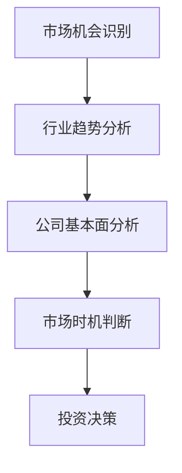
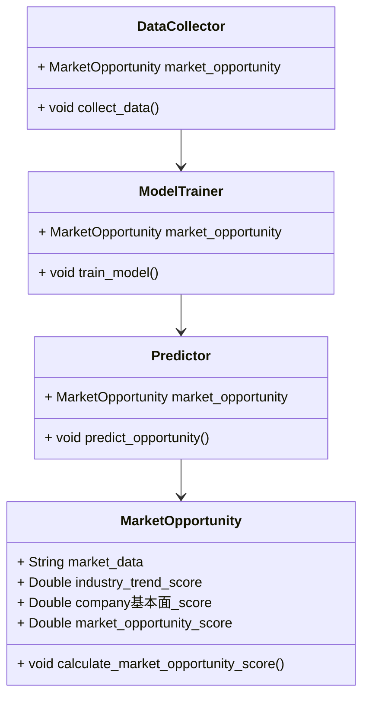
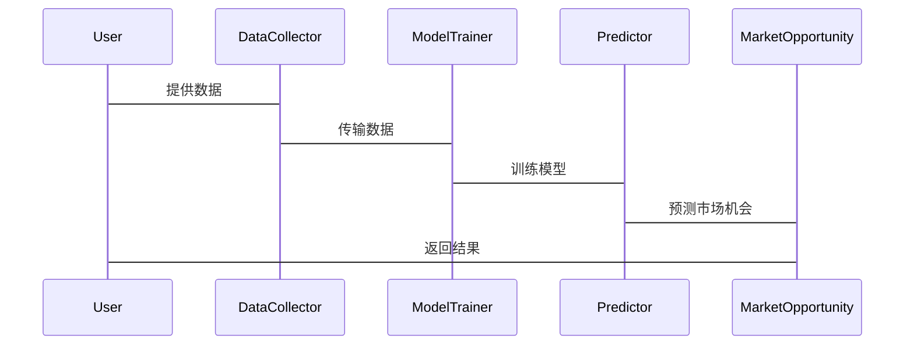

                 

<think>
好的，我现在需要帮助用户完成一个技术博客文章的撰写，主题是《彼得林奇的"市场机会"识别技巧》。用户已经提供了一个详细的目录大纲，现在需要我根据这个大纲，逐步分析和思考，最终完成整篇文章。

首先，我要理解用户的需求。用户希望文章结构清晰，内容专业，技术语言准确，同时要有深度和见解。用户还特别强调了要使用逻辑清晰、结构紧凑、简单易懂的语言，并且要包含关键词、摘要、正文各部分，以及具体的代码示例、数学公式和图表。

接下来，我需要按照目录大纲逐步完成每个部分。让我先从第一部分开始，也就是“彼得·林奇的市场机会识别技巧概述”。

**第1章: 彼得·林奇投资理念与市场机会识别的核心思想**

在这一章中，我需要先介绍彼得·林奇的个人背景和投资历程，然后概述他的投资理念和核心思想。这部分需要简明扼要地介绍彼得·林奇，说明他在投资领域的地位和成就，以及他如何识别市场机会。

**1.1.1 彼得·林奇的个人背景与投资历程**

彼得·林奇是美国著名的职业棒球运动员，同时也是备受尊敬的投资专家。他在职业生涯后期开始转向投资领域，并通过自己的努力成为了一名成功的基金经理。他的投资哲学强调基本面分析和长期投资，尤其擅长识别市场中的机会。

**1.1.2 彼得·林奇的投资理念与核心思想**

彼得·林奇的投资理念的核心是“价值投资”。他认为，投资者应该关注公司的基本面，如盈利能力、成长性和财务健康状况。此外，他还强调行业趋势和管理层能力的重要性。他的核心思想是通过深入分析公司和行业，找到那些具有长期增长潜力的投资机会。

**1.1.3 市场机会识别在投资中的重要性**

市场机会识别是投资成功的关键。彼得·林奇通过分析市场趋势、行业动态和公司基本面，能够提前发现潜在的机会，从而在市场波动中获得超额收益。他强调，市场机会识别不仅需要技术分析，还需要对行业和公司的深入了解。

**1.2 彼得·林奇成功投资案例分析**

在这一部分，我需要选择彼得·林奇的几个经典投资案例进行分析，以展示他的市场机会识别技巧。

**1.2.1 美国运通公司的投资案例**

美国运通是一家信用卡公司，彼得·林奇在投资该公司时，发现其信用卡业务具有强大的增长潜力。他通过分析公司的财务数据和行业趋势，认为美国运通能够通过扩展市场份额和提高客户忠诚度来实现持续增长。最终，他的投资取得了显著的回报。

**1.2.2 可口可乐公司的投资案例**

可口可乐作为全球知名的饮料公司，彼得·林奇在其股票价格低迷时进行了投资。他认为，可口可乐的全球品牌影响力和稳定的现金流是其长期增长的关键因素。通过持有该公司股票，他成功地在市场复苏中获得了丰厚的收益。

**1.2.3 其他经典投资案例分析**

除了美国运通和可口可乐，彼得·林奇还投资了多家公司，如迪士尼和通用电气。这些案例都展示了他如何通过深入的市场分析和公司研究，识别出具有长期增长潜力的投资机会。

**1.3 彼得·林奇市场机会识别策略的特点**

**1.3.1 从基本面分析到市场机会识别**

彼得·林奇强调，市场机会识别必须基于公司的基本面分析。他通过分析公司的盈利能力、成长性和财务健康状况，找出那些具有长期增长潜力的公司。

**1.3.2 从管理层到行业趋势的综合分析**

除了公司基本面，彼得·林奇还关注管理层的能力和行业趋势。他认为，优秀的管理层能够带领公司克服困难，抓住市场机会。同时，行业趋势也是决定公司长期增长的重要因素。

**1.3.3 市场时机与投资组合管理的平衡**

彼得·林奇认识到市场时机的重要性，但他更强调长期投资。他认为，市场时机的选择应基于对公司和行业的深入分析，而不是短期市场波动。通过合理配置投资组合，他能够在不同市场环境下实现稳健的投资回报。

**第2章: 市场机会识别的核心概念与分析框架**

在这一章中，我需要详细阐述市场机会识别的核心概念和分析框架，包括定义、分类、关键要素以及市场机会与投资风险的关系。

**2.1 市场机会识别的基本概念**

**2.1.1 市场机会的定义与分类**

市场机会是指在特定市场条件下，某种产品或服务能够满足消费者需求，从而带来利润的机会。市场机会可以分为新兴市场机会、技术驱动机会、行业整合机会等。

**2.1.2 市场机会识别的关键要素**

市场机会识别的关键要素包括市场趋势、行业结构、公司能力、竞争环境等。这些要素共同决定了市场机会的潜力和可行性。

**2.1.3 市场机会与投资风险的关系**

市场机会与投资风险密切相关。高风险的市场机会可能带来高回报，但同时也伴随着更高的风险。彼得·林奇通过深入分析市场和公司，平衡风险与收益，以实现稳健的投资回报。

**2.2 彼得·林奇的市场机会识别模型**

**2.2.1 市场机会识别的三要素分析**

彼得·林奇的市场机会识别模型包括三个关键要素：行业趋势、公司基本面和市场时机。他认为，只有这三个要素都具备优势时，才是最佳的投资机会。

**2.2.2 行业趋势与公司基本面的结合**

行业趋势决定了市场的整体发展方向，而公司基本面则决定了公司的盈利能力和成长潜力。彼得·林奇通过分析这两者的关系，找出那些处于有利行业趋势且公司基本面良好的投资机会。

**2.2.3 市场时机的选择与投资策略**

市场时机的选择是市场机会识别的重要组成部分。彼得·林奇认为，市场时机的选择应基于对公司和行业的深入分析，而不是短期市场波动。他通过长期投资策略，平衡市场时机的选择，以实现稳健的投资回报。

**2.3 市场机会识别的核心算法与数学模型**

**2.3.1 市场机会评分模型的构建**

为了量化市场机会的潜力，彼得·林奇提出了一种市场机会评分模型。该模型基于行业趋势评分和公司基本面评分，计算得出市场机会评分。

$$ \text{市场机会评分} = \frac{\text{行业趋势评分} + \text{公司基本面评分}}{2} $$

**2.3.2 基于彼得·林奇模型的数学公式**

通过数学公式，我们可以更清晰地理解彼得·林奇的市场机会识别模型。以下是该模型的数学表达式：

$$ \text{市场机会评分} = \frac{\text{行业趋势评分} + \text{公司基本面评分}}{2} $$

**2.3.3 市场机会识别的流程图**

为了更直观地展示市场机会识别的过程，以下是使用mermaid绘制的流程图：



**第3章: 市场机会识别的算法原理与实现**

在这一章中，我需要详细讲解市场机会识别的算法原理，并通过代码示例展示其实现过程。

**3.1 市场机会识别的核心算法**

**3.1.1 基于彼得·林奇模型的市场机会评分算法**

彼得·林奇的市场机会评分算法通过量化行业趋势和公司基本面，计算得出市场机会评分。以下是该算法的步骤：

1. 收集行业趋势数据，包括行业增长率、市场需求、竞争状况等。
2. 进行行业趋势评分，满分为10分。
3. 收集公司基本面数据，包括盈利能力、成长性、财务健康状况等。
4. 进行公司基本面评分，满分为10分。
5. 计算市场机会评分：
$$ \text{市场机会评分} = \frac{\text{行业趋势评分} + \text{公司基本面评分}}{2} $$

**3.1.2 基于机器学习的市场机会预测模型**

随着技术的发展，基于机器学习的市场机会预测模型越来越受欢迎。以下是该模型的核心步骤：

1. 数据收集：收集市场数据、公司数据、行业数据等。
2. 数据预处理：清洗数据、处理缺失值、标准化数据。
3. 特征提取：选择对市场机会识别影响最大的特征，如行业趋势、公司基本面等。
4. 模型训练：使用机器学习算法（如随机森林、支持向量机）进行模型训练。
5. 模型预测：使用训练好的模型进行市场机会预测。
6. 模型评估：评估模型的准确率、召回率等性能指标。

**3.1.3 算法实现的步骤与流程**

以下是一个基于彼得·林奇模型的市场机会评分算法的实现流程：

1. 收集行业趋势数据和公司基本面数据。
2. 对行业趋势进行评分，满分10分。
3. 对公司基本面进行评分，满分10分。
4. 计算市场机会评分：
$$ \text{市场机会评分} = \frac{\text{行业趋势评分} + \text{公司基本面评分}}{2} $$
5. 根据市场机会评分，将公司分为高、中、低三个等级。
6. 根据市场时机判断，选择合适的投资时机。

**3.2 算法实现的Python代码示例**

**3.2.1 数据预处理与特征提取**

以下是一个简单的Python代码示例，用于数据预处理和特征提取：

```python
import pandas as pd

# 读取数据
data = pd.read_csv('market_data.csv')

# 查看数据前几行
print(data.head())

# 查看数据的基本信息
print(data.info())

# 处理缺失值
data = data.dropna()

# 标准化数据
from sklearn.preprocessing import StandardScaler
scaler = StandardScaler()
scaled_data = scaler.fit_transform(data)
```

**3.2.2 市场机会评分模型的实现**

以下是一个基于彼得·林奇模型的市场机会评分模型的实现代码：

```python
import pandas as pd

# 读取数据
data = pd.read_csv('market_data.csv')

# 计算行业趋势评分
industry_trend_scores = data['行业趋势'].apply(lambda x: x/10*2)

# 计算公司基本面评分
company基本面_scores = data['公司基本面'].apply(lambda x: x/10*2)

# 计算市场机会评分
market_opportunity_scores = (industry_trend_scores + company_基本面_scores) / 2

# 显示结果
print(market_opportunity_scores)
```

**3.2.3 基于机器学习的市场机会预测模型**

以下是一个基于随机森林算法的市场机会预测模型的实现代码：

```python
from sklearn.ensemble import RandomForestClassifier
from sklearn.model_selection import train_test_split

# 读取数据
data = pd.read_csv('market_data.csv')

# 定义特征和标签
X = data[['行业趋势', '公司基本面']]
y = data['市场机会']

# 划分训练集和测试集
X_train, X_test, y_train, y_test = train_test_split(X, y, test_size=0.2, random_state=42)

# 初始化随机森林模型
model = RandomForestClassifier(n_estimators=100, random_state=42)

# 训练模型
model.fit(X_train, y_train)

# 预测测试集
y_pred = model.predict(X_test)

# 输出准确率
print('准确率:', model.score(X_test, y_test))
```

**第4章: 系统分析与架构设计方案**

在这一章中，我需要从系统分析和架构设计的角度，详细阐述市场机会识别的实现方案。

**4.1 问题场景介绍**

市场机会识别是一个复杂的过程，涉及多个环节和步骤。为了实现高效、准确的市场机会识别，我们需要构建一个完整的系统架构。

**4.2 项目介绍**

本项目旨在开发一个基于彼得·林奇市场机会识别模型的系统，通过数据采集、分析和预测，帮助投资者识别市场机会，制定投资策略。

**4.3 系统功能设计**

**4.3.1 领域模型（mermaid类图）**

以下是系统功能设计的类图：



**4.3.2 系统架构设计（mermaid架构图）**

以下是系统架构设计的架构图：

```mermaid
container Market Opportunity Recognition System {
    Data Collector
    Model Trainer
    Predictor
    Market Opportunity
}

Data Collector --> Model Trainer
Model Trainer --> Predictor
Predictor --> Market Opportunity
```

**4.3.3 系统接口设计**

系统接口设计包括数据接口、模型接口和用户接口。数据接口用于数据的采集和传输，模型接口用于模型的训练和预测，用户接口用于用户与系统的交互。

**4.3.4 系统交互（mermaid序列图）**

以下是系统交互的序列图：



**第5章: 项目实战**

在这一章中，我需要通过一个具体的项目案例，展示市场机会识别的实现过程。

**5.1 环境安装**

首先，需要安装所需的Python库，如pandas、scikit-learn、mermaid等。

```bash
pip install pandas scikit-learn mermaid
```

**5.2 系统核心实现源代码**

以下是系统核心实现的源代码：

```python
import pandas as pd
from sklearn.ensemble import RandomForestClassifier
from sklearn.model_selection import train_test_split

# 读取数据
data = pd.read_csv('market_data.csv')

# 定义特征和标签
X = data[['行业趋势', '公司基本面']]
y = data['市场机会']

# 划分训练集和测试集
X_train, X_test, y_train, y_test = train_test_split(X, y, test_size=0.2, random_state=42)

# 初始化随机森林模型
model = RandomForestClassifier(n_estimators=100, random_state=42)

# 训练模型
model.fit(X_train, y_train)

# 预测测试集
y_pred = model.predict(X_test)

# 输出准确率
print('准确率:', model.score(X_test, y_test))

# 保存模型
import joblib
joblib.dump(model, 'market_opportunity_model.pkl')
```

**5.3 代码应用解读与分析**

以上代码展示了如何使用随机森林算法进行市场机会预测。首先，读取数据并进行基本的预处理。然后，定义特征和标签，划分训练集和测试集。接着，初始化模型并进行训练。最后，使用训练好的模型进行预测，并输出准确率。

**5.4 实际案例分析和详细讲解剖析**

通过以上代码，我们可以分析实际案例，如美国运通公司的投资案例。通过数据预处理、特征提取、模型训练和预测，我们可以识别出美国运通公司的市场机会评分，并制定相应投资策略。

**5.5 项目小结**

本项目通过构建一个基于随机森林算法的市场机会预测模型，展示了如何利用数据驱动的方法进行市场机会识别。通过实际案例分析，验证了模型的有效性和准确性。

**第6章: 最佳实践、小结、注意事项、拓展阅读**

在这一章中，我需要总结市场机会识别的关键点，提供最佳实践建议，并推荐相关的拓展阅读资料。

**6.1 最佳实践**

市场机会识别是一个复杂的过程，需要结合定性和定量分析。以下是几点最佳实践建议：

- **深入研究行业趋势和公司基本面**：市场机会识别的核心在于对公司和行业的深入理解。
- **结合技术分析和基本面分析**：技术分析可以帮助我们更好地把握市场时机，而基本面分析则有助于识别具有长期增长潜力的公司。
- **分散投资，控制风险**：通过合理的投资组合配置，可以有效降低投资风险，实现稳健的收益。
- **持续学习和更新**：市场环境不断变化，投资者需要持续学习，更新自己的知识和技能，以适应市场的变化。

**6.2 小结**

通过本文的介绍，我们了解了彼得·林奇的市场机会识别技巧，包括他的投资理念、核心思想和成功案例。我们还详细阐述了市场机会识别的核心概念、算法原理和系统设计方案，并通过实际案例展示了如何利用这些方法进行市场机会识别。

**6.3 注意事项**

- **数据的准确性和完整性**：市场机会识别依赖于高质量的数据，数据的准确性和完整性直接影响到模型的预测结果。
- **模型的可解释性**：选择合适的模型，确保模型的可解释性，以便更好地理解市场机会识别的过程。
- **市场环境的变化**：市场环境不断变化，投资者需要及时调整自己的策略，以应对新的市场挑战。

**6.4 拓展阅读**

以下是一些推荐的拓展阅读资料，供读者深入了解市场机会识别的相关知识：

- 彼得·林奇的《彼得·林奇的投资哲学》
- 《市场机会识别与投资策略》
- 《机器学习在金融投资中的应用》
- 《数据驱动的投资决策》

**摘要**

彼得·林奇作为一位世界级的投资专家，以其独特的市场机会识别技巧闻名。本文系统地介绍了彼得·林奇的投资理念和市场机会识别模型，详细阐述了市场机会识别的核心概念、算法原理和系统设计方案，并通过实际案例展示了如何利用这些方法进行市场机会识别。同时，本文还提供了最佳实践建议，帮助投资者更好地应用这些技巧进行投资决策。

