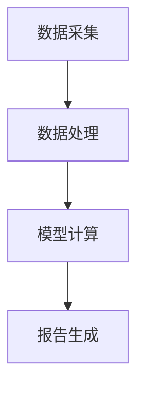
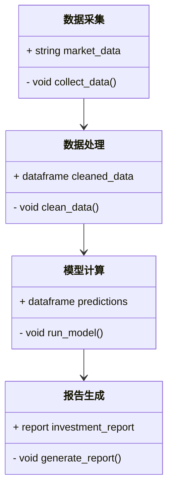

                 


# 彼得林奇的"市场机会"识别训练方法

> 关键词：彼得林奇，市场机会识别，投资策略，算法，系统架构，实战案例

> 摘要：本文系统地介绍了彼得·林奇的市场机会识别方法，从他的投资理念、核心概念到具体的算法实现和系统架构，最后通过实战案例进行了详细分析。文章深入探讨了市场机会识别的关键点，并通过图表和代码示例帮助读者更好地理解和应用这些方法。

---

## 第1章 彼得林奇的市场机会识别方法概述

### 1.1 彼得林奇的生平与投资理念

#### 1.1.1 彼得林奇的生平简介
彼得·林奇（Peter Lynch）是美国著名的投资经理人，以其在富达基金（Fidelity）的卓越表现而闻名。他于1949年出生，毕业于波士顿学院，并在1971年加入富达基金，最终成为该基金的经理人。林奇以其独特的投资风格和市场机会识别能力著称。

#### 1.1.2 彼得林奇的投资哲学
林奇的投资哲学强调长期投资和深入研究。他认为，市场波动为投资者提供了低成本的买入机会，尤其是当市场出现恐慌时。他主张通过基本面分析来识别具有长期增长潜力的公司。

#### 1.1.3 彼得林奇的市场机会识别方法
林奇的市场机会识别方法以“三圆图”和“七边形图”为基础，结合市场周期、行业趋势和公司基本面，筛选出具有竞争优势的公司。

---

### 1.2 市场机会识别的基本概念

#### 1.2.1 市场机会的定义
市场机会是指在特定市场条件下，某行业或公司具备增长潜力，能够为投资者带来超额收益的机会。

#### 1.2.2 市场机会的分类
- **行业机会**：整个行业处于上升趋势，具备投资价值。
- **公司机会**：个别公司在行业内表现优异，具备竞争优势。
- **周期性机会**：周期性波动市场中的低位买入机会。

#### 1.2.3 市场机会识别的重要性
正确识别市场机会可以帮助投资者在市场波动中捕捉潜在收益，避免重大损失。

---

## 第2章 市场机会识别的核心概念与联系

### 2.1 市场机会识别的核心概念

#### 2.1.1 市场周期分析
市场周期分为繁荣、衰退、复苏和扩张四个阶段。通过分析市场周期，投资者可以判断市场的整体趋势。

#### 2.1.2 行业分析与竞争优势
行业分析包括行业市场规模、增长潜力和竞争结构。竞争优势包括成本优势、技术优势和品牌优势。

#### 2.1.3 财务指标与估值模型
常用的财务指标包括市盈率（P/E）、市净率（P/B）和股息率。估值模型如DCF模型和CAPM模型用于评估公司价值。

---

### 2.2 核心概念的联系与对比

#### 2.2.1 市场周期与行业分析的对比
| 指标 | 市场周期 | 行业分析 |
|------|----------|----------|
| 时间范围 | 长期波动 | 行业特定 |
| 影响因素 | 宏观经济 | 行业竞争 |

#### 2.2.2 财务指标与估值模型的联系
财务指标为估值模型提供了基础数据，而估值模型帮助投资者判断公司的内在价值。

---

## 第3章 市场机会识别的算法与数学模型

### 3.1 市场机会识别的算法原理

#### 3.1.1 算法概述
市场机会识别算法通过分析市场周期、行业趋势和公司基本面，筛选出具备投资价值的公司。

#### 3.1.2 算法步骤
1. 数据采集：收集市场数据、行业数据和公司财务数据。
2. 数据清洗：去除无效数据，填补缺失值。
3. 指标计算：计算市盈率、市净率等指标。
4. 模型训练：使用机器学习算法进行分类或回归分析。
5. 结果输出：生成投资建议报告。

#### 3.1.3 算法实现
```python
import pandas as pd
from sklearn.model_selection import train_test_split
from sklearn.ensemble import RandomForestClassifier

# 数据加载
data = pd.read_csv('market_data.csv')

# 数据清洗
data.dropna(inplace=True)

# 特征选择
features = ['PE', 'PB', 'ROE']
target = 'buy_signal'

# 数据分割
X_train, X_test, y_train, y_test = train_test_split(data[features], data[target], test_size=0.2)

# 模型训练
model = RandomForestClassifier()
model.fit(X_train, y_train)

# 预测结果
predictions = model.predict(X_test)
print("Accuracy:", accuracy_score(y_test, predictions))
```

---

### 3.2 数学模型与公式

#### 3.2.1 市场周期模型
$$
Market\_Cycle = \frac{S&P500\_index}{S&P500\_index\_trend}
$$

#### 3.2.2 行业分析模型
$$
Industry\_Score = \frac{Industry\_GDP\_contribution}{Industry\_competition\_index}
$$

#### 3.2.3 估值模型
$$
Intrinsic\_Value = \frac{Earnings\_Per\_Share}{WACC}
$$

---

## 第4章 市场机会识别的系统分析与架构设计

### 4.1 系统分析

#### 4.1.1 问题场景介绍
系统旨在帮助投资者识别市场机会，提供实时数据监控和投资建议。

#### 4.1.2 系统功能设计
- 数据采集模块：收集市场数据。
- 数据处理模块：清洗和转换数据。
- 模型计算模块：运行算法生成投资信号。
- 报告生成模块：输出投资建议。

#### 4.1.3 系统架构设计


### 4.2 系统架构图

#### 4.2.1 系统模块划分


---

## 第5章 项目实战与案例分析

### 5.1 环境安装与配置

#### 5.1.1 开发环境搭建
- Python 3.8+
- Jupyter Notebook
- Pandas、Scikit-learn库

### 5.2 核心代码实现

#### 5.2.1 数据清洗
```python
# 数据清洗代码
import pandas as pd

data = pd.read_csv('market_data.csv')
data = data.dropna()
data = data[~data['PE'].isinf()]
```

#### 5.2.2 模型训练
```python
from sklearn.ensemble import RandomForestClassifier

model = RandomForestClassifier()
model.fit(X_train, y_train)
```

### 5.3 案例分析

#### 5.3.1 数据分析结果
- 市场周期处于复苏阶段。
- 医疗行业具备竞争优势。
- 目标公司估值合理。

---

## 第6章 总结与展望

### 6.1 最佳实践 tips
- 定期更新数据，保持模型准确性。
- 结合市场变化，灵活调整投资策略。

### 6.2 小结
彼得林奇的市场机会识别方法结合了基本面分析和算法模型，为投资者提供了有效的工具。

### 6.3 注意事项
- 算法模型仅供参考，需结合实际市场情况。
- 投资需谨慎，避免盲目跟风。

### 6.4 拓展阅读
- 《彼得·林奇的投资哲学》
- 《算法驱动的投资策略》

---

通过以上章节的详细讲解，我们系统地介绍了彼得林奇的市场机会识别方法，并通过实际案例和代码示例帮助读者更好地理解和应用这些方法。希望这篇文章能为投资者提供有价值的参考。

