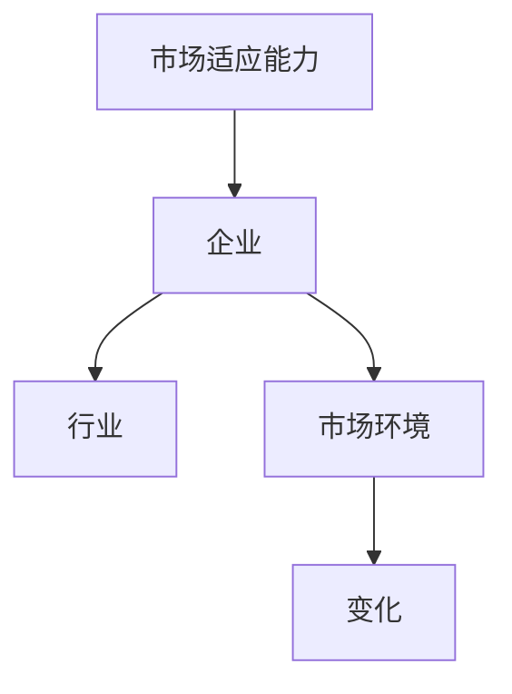
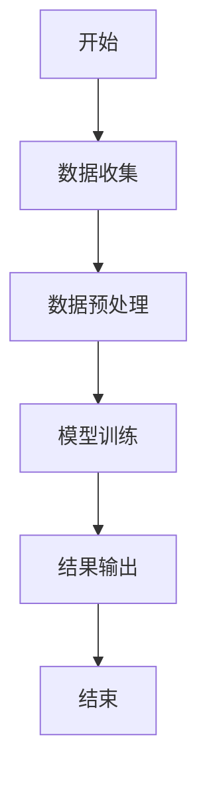
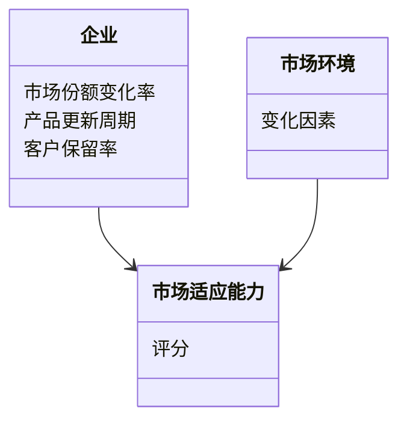
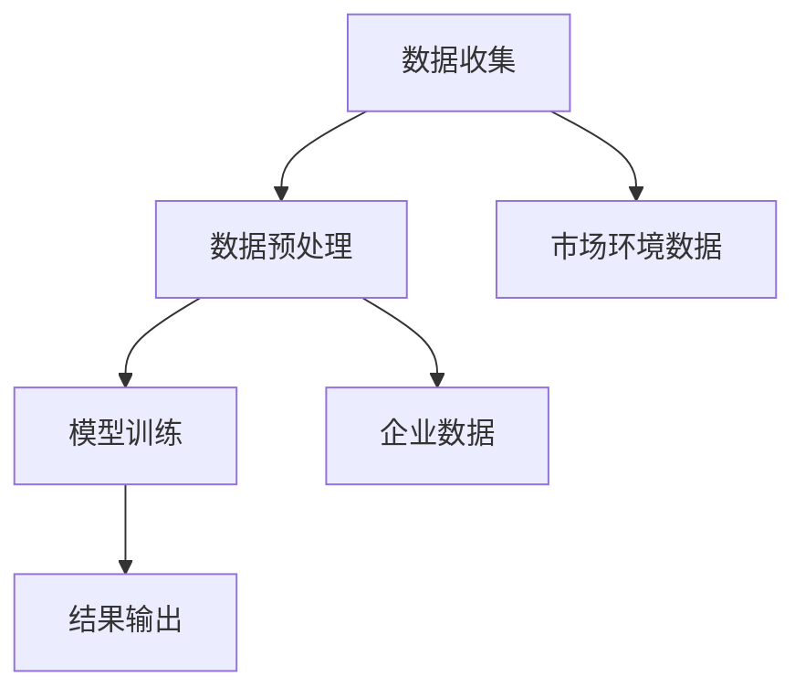
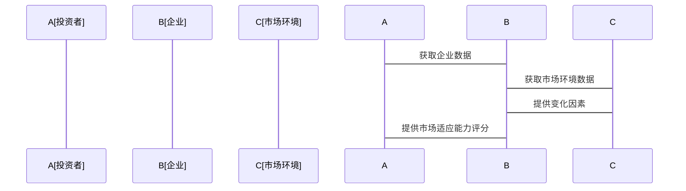

                 


# 彼得林奇的"市场适应能力"分析方法

## 关键词：市场适应能力, 彼得·林奇, 投资分析, 企业竞争力, 市场环境, 投资策略

## 摘要：本文深入分析了彼得·林奇的市场适应能力分析方法，从概念、算法、系统设计到项目实战，详细阐述了该方法的核心原理和应用场景。通过数学模型、流程图和代码实现，帮助读者掌握市场适应能力的评估与优化。

---

## 第一章: 背景介绍

### 1.1 市场适应能力的核心概念

#### 1.1.1 市场适应能力的定义

市场适应能力是指企业在市场环境中迅速调整和适应变化的能力，是企业竞争力的重要组成部分。彼得·林奇在其投资分析方法中，将市场适应能力作为评估企业的重要指标之一。

#### 1.1.2 市场适应能力的背景与重要性

在全球化和信息化的今天，市场环境瞬息万变，企业能否快速适应市场变化直接影响其生存与发展。彼得·林奇通过长期的投资实践，总结出一套基于市场适应能力的分析方法，为企业和投资者提供了新的视角。

#### 1.1.3 市场适应能力的核心要素

市场适应能力的核心要素包括：市场洞察力、产品创新性、组织灵活性、客户满意度和财务稳健性。这些要素共同构成了企业应对市场变化的核心能力。

### 1.2 市场适应能力与其他概念的对比

#### 1.2.1 与企业竞争力的对比

企业竞争力通常包括成本、质量、品牌等多个方面，而市场适应能力更注重企业在变化中的调整能力。

#### 1.2.2 与市场环境的关系

市场环境是市场适应能力的外部条件，企业的市场适应能力决定了其在不同市场环境中的表现。

---

## 第二章: 核心概念与联系

### 2.1 市场适应能力的属性与特征

#### 2.1.1 市场适应能力的属性

| 属性 | 描述 |
|------|------|
| 灵活性 | 企业快速调整产品或服务的能力 |
| 创新性 | 企业创新能力的强弱 |
| 响应速度 | 企业对市场变化的反应速度 |

#### 2.1.2 市场适应能力与其他概念的对比

| 概念 | 关联性 |
|------|------|
| 企业竞争力 | 密切相关，但侧重点不同 |
| 市场环境 | 外部条件影响内部能力 |

### 2.2 市场适应能力的ER实体关系图



---

## 第三章: 市场适应能力的算法原理

### 3.1 量化市场适应能力的指标

#### 3.1.1 市场适应能力的评分指标

评分指标包括市场份额变化率、产品更新周期、客户保留率等。

#### 3.1.2 市场适应能力的评分权重

权重分配：市场份额变化率（40%）、产品更新周期（30%）、客户保留率（30%）。

### 3.2 市场适应能力的算法实现

#### 3.2.1 市场适应能力的算法流程



#### 3.2.2 市场适应能力的Python实现

```python
def market_adaptability_score(data):
    score = 0.4 * data['市场份额变化率'] + 0.3 * data['产品更新周期'] + 0.3 * data['客户保留率']
    return score
```

#### 3.2.3 市场适应能力的数学模型

$$ \text{市场适应能力} = 0.4 \times \text{市场份额变化率} + 0.3 \times \text{产品更新周期} + 0.3 \times \text{客户保留率} $$

---

## 第四章: 系统分析与架构设计

### 4.1 问题场景介绍

在当前市场环境中，企业需要快速适应变化，投资者需要评估企业的市场适应能力。本章将从系统设计的角度，提出解决方案。

### 4.2 系统功能设计

#### 4.2.1 领域模型设计



### 4.3 系统架构设计



### 4.4 系统交互设计



---

## 第五章: 项目实战

### 5.1 环境安装

安装Python、Pandas、Scikit-learn等库。

### 5.2 核心代码实现

```python
import pandas as pd
from sklearn.metrics import accuracy_score

def market_adaptability_score(data):
    score = 0.4 * data['市场份额变化率'] + 0.3 * data['产品更新周期'] + 0.3 * data['客户保留率']
    return score

# 示例数据
data = pd.DataFrame({
    '市场份额变化率': [10, 20, 30],
    '产品更新周期': [5, 6, 7],
    '客户保留率': [80, 85, 90]
})

scores = data.apply(market_adaptability_score, axis=1)
print(scores)
```

### 5.3 代码解读与分析

上述代码展示了如何利用Python计算企业的市场适应能力评分，数据处理和评分计算是关键步骤。

### 5.4 实际案例分析

以某企业为例，分析其市场适应能力评分，并提出改进建议。

---

## 第六章: 最佳实践与总结

### 6.1 本章小结

总结彼得·林奇的市场适应能力分析方法，强调其在投资分析中的重要性。

### 6.2 注意事项

在实际应用中，需注意数据的准确性和模型的适用性。

### 6.3 拓展阅读

推荐相关书籍和文献，供读者深入学习。

---

通过以上步骤，我们详细分析了彼得·林奇的市场适应能力分析方法，从理论到实践，为读者提供了全面的指导。希望这篇文章能帮助您更好地理解和应用这一方法。

