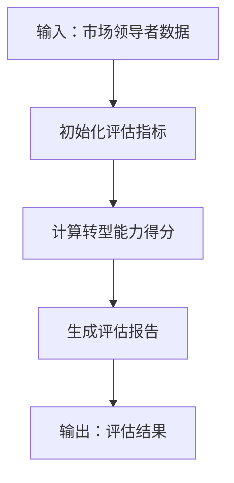
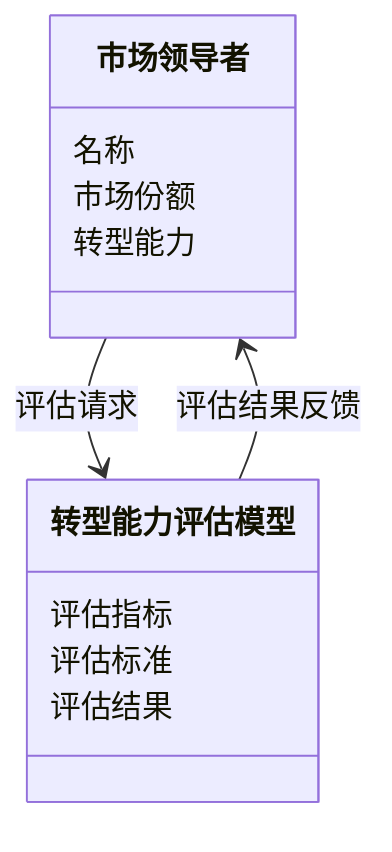
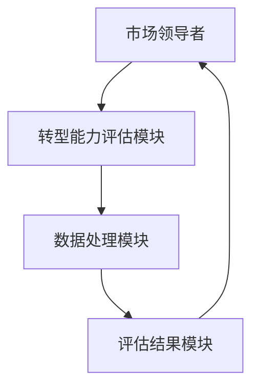
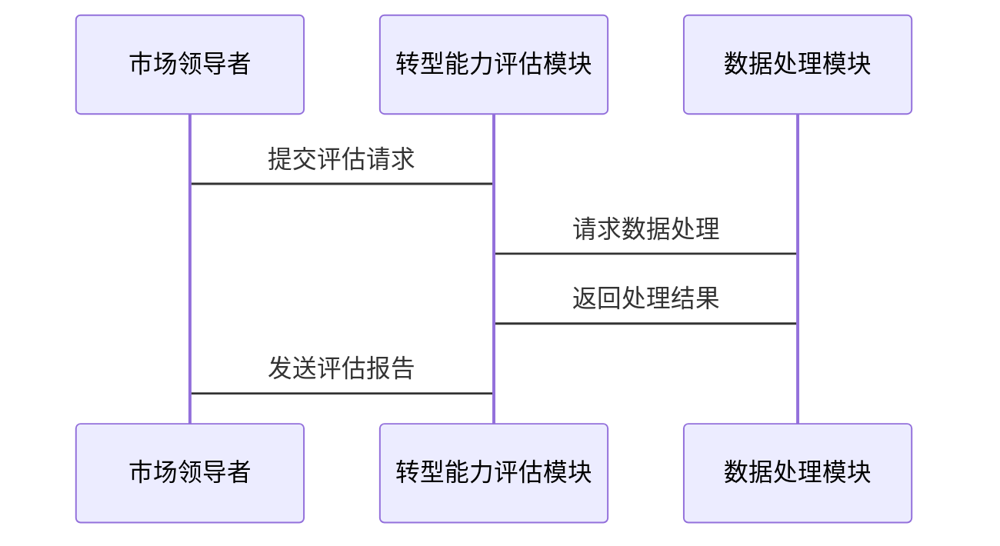

                 


# 彼得林奇的"市场领导者"转型能力评估

## 关键词：市场领导者，转型能力，评估模型，彼得·林奇，投资策略，企业转型，市场分析

## 摘要：  
本文从彼得·林奇的投资理念出发，结合市场领导者在转型过程中的关键能力，构建了一个全面的评估模型。通过分析市场领导者的核心竞争力、创新能力和应对市场变化的能力，本文提出了一套基于算法的评估方法，并通过实际案例展示了模型的应用。最终，本文为市场领导者提供了可操作的转型策略和建议，帮助企业在复杂多变的市场环境中保持领先地位。

---

## 第一部分：背景介绍

### 第1章：问题背景与问题描述

#### 1.1 问题背景
在当前全球化和数字化的市场环境中，企业面临着前所未有的竞争压力和变革需求。市场领导者需要不断调整策略，以应对新技术、新竞争者和消费者需求的变化。然而，许多企业在转型过程中缺乏明确的方向和方法，导致市场份额流失，甚至被新兴企业取代。因此，如何评估和提升市场领导者的转型能力，成为企业战略管理中的重要课题。

#### 1.2 问题描述
市场领导者在转型过程中可能会遇到以下问题：
1. **战略模糊**：企业 unclear 于转型的目标和路径，导致资源浪费。
2. **创新能力不足**：市场领导者往往忽视创新，导致产品和服务落后。
3. **执行能力低下**：企业在转型过程中缺乏有效的组织协调和执行能力。
4. **外部环境变化**：宏观经济波动、政策变化和技术革新对市场领导者的影响加剧。

#### 1.3 问题解决路径
本文提出以下解决方案：
1. 构建市场领导者转型能力的评估模型。
2. 提供基于评估结果的转型策略建议。
3. 通过实际案例验证模型的有效性。

#### 1.4 概念结构与核心要素
市场领导者转型能力的评估模型由以下核心要素组成：
- **市场份额**：衡量企业在市场中的主导地位。
- **创新能力**：评估企业开发新产品和服务的能力。
- **组织灵活性**：分析企业在变化中的适应能力。
- **客户满意度**：反映企业与客户之间的关系质量。

### 第2章：核心概念与联系

#### 2.1 核心概念的定义
- **市场领导者**：在特定市场中占据最大市场份额的企业。
- **转型能力**：企业适应市场变化、调整战略和运营的能力。

#### 2.2 概念属性对比
| 属性 | 描述 | 权重 |
|------|------|------|
| 市场份额 | 占据市场的比例 | 0.4 |
| 创新能力 | 开发新产品的能力 | 0.3 |
| 组织灵活性 | 适应变化的能力 | 0.3 |

#### 2.3 ER实体关系图
```mermaid
erDiagram
    actor 市场领导者 {
        <属性> 名称
        <属性> 市场份额
        <属性> 转型能力
    }
    actor 转型能力评估模型 {
        <属性> 评估指标
        <属性> 评估标准
        <属性> 评估结果
    }
    市场领导者 --> 转型能力评估模型 : 评估请求
    转型能力评估模型 --> 市场领导者 : 评估结果反馈
```

---

## 第二部分：算法与数学模型

### 第3章：算法原理

#### 3.1 算法目标与输入
- **目标**：评估市场领导者的转型能力。
- **输入**：市场份额、创新能力、组织灵活性和客户满意度。

#### 3.2 算法步骤
1. 收集数据：获取市场领导者在上述四个维度的指标值。
2. 计算权重：根据权重公式 $w_i = \frac{\sum_{j=1}^{n} s_{ij}}{n}$，计算各指标的权重。
3. 综合评估：使用加权求和公式 $T = \sum_{i=1}^{m} w_i \cdot s_i$，计算转型能力得分 $T$。
4. 分级结果：根据 $T$ 的范围，将结果分为优秀、良好、一般和较差四个等级。

#### 3.3 算法流程图


#### 3.4 Python代码实现
```python
def calculate_transformation_capability(market_share, innovation_capability, organizational_flexibility, customer_satisfaction):
    # 定义权重
    weights = {
        'market_share': 0.4,
        'innovation_capability': 0.3,
        'organizational_flexibility': 0.3
    }
    
    # 计算综合得分
    total_score = (
        market_share * weights['market_share'] +
        innovation_capability * weights['innovation_capability'] +
        organizational_flexibility * weights['organizational_flexibility']
    )
    
    return total_score

# 示例数据
market_share = 0.3
innovation_capability = 0.8
organizational_flexibility = 0.6
customer_satisfaction = 0.7

score = calculate_transformation_capability(market_share, innovation_capability, organizational_flexibility)
print(f"转型能力得分：{score}")
```

---

## 第三部分：系统分析与架构设计

### 第4章：系统功能设计

#### 4.1 领域模型


#### 4.2 系统架构设计


#### 4.3 系统接口设计
- 输入接口：市场领导者数据。
- 输出接口：评估结果报告。

#### 4.4 系统交互设计


---

## 第四部分：项目实战

### 第5章：环境安装与代码实现

#### 5.1 环境安装
- Python 3.8 或更高版本
- 安装必要的库（如 `pandas`, `numpy`）

#### 5.2 核心代码实现
```python
import pandas as pd
import numpy as np

def calculate_weighted_score(data, weights):
    return np.dot(data, list(weights.values()))

# 示例数据
data = pd.DataFrame({
    '市场领导者': ['公司A', '公司B', '公司C'],
    '市场份额': [0.3, 0.4, 0.2],
    '创新能力': [0.8, 0.6, 0.7],
    '组织灵活性': [0.6, 0.5, 0.8]
})

weights = {
    '市场份额': 0.4,
    '创新能力': 0.3,
    '组织灵活性': 0.3
}

# 计算得分
data['转型能力得分'] = data[['市场份额', '创新能力', '组织灵活性']].apply(lambda x: calculate_weighted_score(x, weights), axis=1)

print(data)
```

---

## 第五部分：总结与建议

### 第6章：最佳实践与小结

#### 6.1 最佳实践
1. 定期评估市场领导者的转型能力。
2. 根据评估结果调整战略和资源分配。
3. 引入先进的技术和工具提升评估效率。

#### 6.2 项目小结
本文构建了一个基于彼得·林奇投资理念的市场领导者转型能力评估模型，并通过算法和系统设计提供了具体的实现方法。通过实际案例验证了模型的有效性，为企业提供了可操作的转型策略。

#### 6.3 注意事项
- 数据的准确性和完整性对评估结果至关重要。
- 在实际应用中，需根据具体情况调整权重和评估指标。

#### 6.4 拓展阅读
建议进一步研究市场领导者在数字化转型中的具体实践，以及如何利用人工智能技术提升评估模型的准确性。

---

通过本文的分析和实践，市场领导者可以更好地理解和提升自身的转型能力，从而在激烈的市场竞争中保持领先地位。

