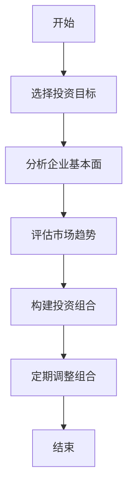

                 


# 彼得林奇的"常识投资"原则解析

> 关键词：投资原则，彼得·林奇，常识投资，长期投资，价值投资，分散投资

> 摘要：本文详细解析了彼得·林奇的“常识投资”原则，探讨了其核心理念、数学模型、系统架构及实际应用。通过逐步分析，帮助读者理解并掌握如何在投资决策中应用这些原则。

---

# 第一部分: 彼得林奇的"常识投资"原则背景与概述

## 第1章: 投资的基本概念与背景

### 1.1 投资的基本概念

#### 1.1.1 投资的定义与分类
投资是将资金投入某个项目或资产，以期在未来获得收益的行为。根据风险和回报的不同，投资可以分为股票、债券、房地产等多种类型。

#### 1.1.2 金融市场的基本构成
金融市场包括股票市场、债券市场、货币市场等，是投资者进行交易的场所。市场的参与者包括个人投资者、机构投资者、经纪商等。

#### 1.1.3 投资者的角色与类型
投资者可以是个人或机构，根据投资目标和风险承受能力不同，可以分为保守型、稳健型和激进型投资者。

### 1.2 彼得·林奇与常识投资

#### 1.2.1 彼得·林奇的生平简介
彼得·林奇是美国著名投资经理人，以其长期投资策略和价值投资理念闻名。他的投资哲学强调长期持有优质资产。

#### 1.2.2 常识投资的定义与核心理念
常识投资是指基于基本面分析和长期持有策略的投资方式，强调选择具有强大基本面和良好管理的公司。

#### 1.2.3 常识投资与传统投资的区别
与短期交易和投机不同，常识投资更注重公司的内在价值和长期增长潜力。

### 1.3 常识投资的原则与目标

#### 1.3.1 长期投资的核心原则
长期持有优质资产，避免频繁交易，减少交易成本。

#### 1.3.2 价值投资的基本理念
购买被市场低估的资产，长期持有，等待其价值回归。

#### 1.3.3 分散投资的风险控制
通过投资多样化的资产来降低风险，避免过度集中。

---

## 第2章: 常识投资的核心概念与联系

### 2.1 常识投资的核心原理

#### 2.1.1 价值投资的数学模型
$$ \text{内在价值} = \sum_{t=1}^{n} \frac{CF_t}{(1 + r)^t} $$
其中，\( CF_t \) 是第 \( t \) 年的现金流，\( r \) 是折现率。

#### 2.1.2 长期投资的收益计算
$$ \text{年化收益率} = \left( \frac{1 + r}{1} \right)^{1/n} - 1 $$

#### 2.1.3 分散投资的风险评估
$$ \text{投资组合风险} = \sqrt{\sum_{i=1}^{n} w_i^2 \sigma_i^2} $$
其中，\( w_i \) 是资产 \( i \) 的权重，\( \sigma_i \) 是资产 \( i \) 的波动率。

### 2.2 常识投资的核心要素对比

#### 2.2.1 不同投资策略的对比分析
| 投资策略 | 核心理念 | 适合人群 |
|----------|----------|----------|
| 价值投资 | 寻找被低估的资产 | 耐心的长期投资者 |
| 技术分析 | 通过价格和成交量预测未来走势 | 短期交易者 |
| 分散投资 | 降低整体风险 | 所有投资者 |

#### 2.2.2 市场波动与投资决策的关系
市场波动是投资中的常见现象，但常识投资强调长期视角，不受短期波动影响。

#### 2.2.3 投资组合的优化配置
通过合理分配资产，平衡风险与收益，优化投资组合的表现。

### 2.3 常识投资的ER实体关系图
```mermaid
er
    actor 投资者
    entity 投资组合
    entity 股票
    entity 债券
    entity 其他资产
    relationship 投资者拥有投资组合
    relationship 投资组合包含股票
    relationship 投资组合包含债券
    relationship 投资组合包含其他资产
```

### 2.4 常识投资的算法流程图


---

## 第3章: 常识投资的算法原理与数学模型

### 3.1 投资决策的数学模型

#### 3.1.1 常识投资的数学公式
$$ \text{投资收益} = \text{资产价值} \times \text{收益率} $$

#### 3.1.2 投资组合的优化模型
$$ \text{风险} = \sqrt{\sum_{i=1}^{n} w_i^2 \sigma_i^2} $$

#### 3.1.3 现金流折现法
$$ \text{内在价值} = \sum_{t=1}^{n} \frac{CF_t}{(1 + r)^t} $$

### 3.2 投资组合优化的Python实现

```python
import numpy as np
import pandas as pd

def calculate_portfolio_risk(weights, covariance_matrix):
    return np.sqrt(np.dot(weights.T, covariance_matrix @ weights))

# 示例数据
returns = pd.DataFrame({'股票': [0.1, 0.05, -0.02], 
                        '债券': [0.03, 0.02, 0.01]})
weights = np.array([0.6, 0.4])
covariance_matrix = returns.cov().values

risk = calculate_portfolio_risk(weights, covariance_matrix)
print(f"投资组合风险：{risk}")
```

---

## 第4章: 系统分析与架构设计方案

### 4.1 问题场景介绍

#### 4.1.1 项目介绍
构建一个投资决策支持系统，帮助投资者根据常识投资原则进行投资决策。

#### 4.1.2 系统功能设计
- 用户登录与注册
- 资产配置建议
- 投资组合管理
- 市场分析与预测

#### 4.1.3 系统架构设计


### 4.2 系统功能模块

#### 4.2.1 用户界面
- 登录注册
- 投资组合管理
- 数据分析与可视化

#### 4.2.2 数据处理层
- 数据采集与清洗
- 数据分析与建模
- 报告生成

#### 4.2.3 数据库设计


---

## 第5章: 项目实战与案例分析

### 5.1 环境安装与配置

#### 5.1.1 安装Python与相关库
```bash
pip install numpy pandas matplotlib
```

### 5.2 核心代码实现

#### 5.2.1 股票筛选系统
```python
import pandas as pd
import numpy as np

def stock_screening(financial_data, threshold):
    return financial_data[financial_data['ROE'] > threshold]

# 示例数据
financial_data = pd.DataFrame({
    '股票': ['A', 'B', 'C'],
    'ROE': [0.15, 0.1, 0.2]
})

selected_stocks = stock_screening(financial_data, 0.12)
print(selected_stocks)
```

---

## 第6章: 最佳实践与小结

### 6.1 小结
彼得·林奇的常识投资原则强调长期持有优质资产，通过分散投资降低风险。投资者应根据自身情况选择合适的投资策略。

### 6.2 注意事项
- 避免过度交易，减少交易成本。
- 定期评估投资组合，及时调整。
- 保持耐心，长期持有优质资产。

### 6.3 拓展阅读
推荐书籍：
- 《彼得·林奇的成功投资》
- 《投资学基础》

---

通过以上步骤，我们系统地解析了彼得·林奇的“常识投资”原则，并结合实际案例和代码示例，帮助读者理解如何在投资决策中应用这些原则。希望本文能为投资者提供有价值的指导和启示。

