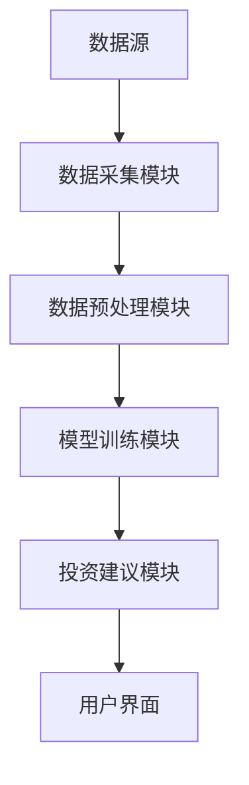

                 


# 彼得林奇的"常识投资"在人工智能投顾时代的价值重估

> **关键词**：人工智能投顾、彼得林奇、常识投资、机器学习、投资策略

> **摘要**：随着人工智能技术的迅速发展，投资顾问领域正在经历一场深刻的变革。本文深入探讨了彼得·林奇的"常识投资"理念，并分析其在人工智能投顾时代的价值重估。通过对比传统投资策略与AI驱动的投资顾问，文章揭示了两者的优劣势及互补性，同时详细阐述了AI投顾的算法原理、系统架构及实际应用案例。最后，文章总结了传统投资策略在AI时代的演变趋势，并提出了未来投资顾问领域的发展方向。

---

## 第1章：背景介绍

### 1.1 投资的基本概念

投资是将资源（如资金）投入到某个项目或资产中，以期获得未来收益的行为。投资的基本目标是在不确定的市场环境中，通过科学的决策和风险管理，实现财富的保值与增值。

### 1.2 传统投资策略的优缺点

#### 1.2.1 传统投资策略的核心要素

- **基本面分析**：通过研究公司的财务数据、行业地位、管理团队等因素，评估其投资价值。
- **技术分析**：通过分析历史价格走势、成交量等市场数据，预测未来的价格变化。
- **市场情绪**：投资者的心理和行为对市场的影响，常被用于判断市场的短期波动。

#### 1.2.2 传统投资策略的优缺点

- **优点**：
  - 基于长期研究和经验积累，能够捕捉到一些确定性的投资机会。
  - 在市场波动剧烈时，传统策略的防御性较强。
- **缺点**：
  - 依赖投资者的主观判断，容易受到情绪影响。
  - 数据处理能力有限，难以应对海量数据的分析需求。

### 1.3 人工智能投顾的崛起

人工智能（AI）技术的快速发展为投资顾问领域带来了新的可能性。AI投顾通过机器学习、自然语言处理等技术，能够快速分析海量数据，提供实时的投资建议。

#### 1.3.1 AI投顾的核心技术

- **机器学习**：通过训练模型，AI能够识别数据中的模式和趋势，预测市场走势。
- **自然语言处理（NLP）**：用于分析新闻、公司财报等非结构化数据，提取有价值的信息。
- **大数据分析**：整合来自不同来源的海量数据，提供更全面的市场分析。

#### 1.3.2 AI投顾的优势

- **数据处理能力强**：AI能够快速处理和分析海量数据，发现传统方法难以察觉的模式。
- **实时性高**：AI系统能够实时跟踪市场动态，提供即时的投资建议。
- **减少人为干扰**：AI通过算法进行决策，降低了情绪化投资的影响。

---

## 第2章：彼得林奇的"常识投资"理念

### 2.1 彼得林奇的"常识投资"定义

彼得·林奇是全球著名投资家，他提出的"常识投资"理念强调基于常识和长期视角的投资策略。他认为，投资者应该选择自己熟悉的行业和公司，通过深入研究和长期持有，实现财富增长。

#### 2.1.1 常识投资的核心要素

- **行业选择**：选择自己熟悉且有竞争优势的行业。
- **公司研究**：分析公司的财务状况、管理团队、市场地位等。
- **长期持有**：避免频繁交易，降低交易成本和税收负担。

### 2.2 常识投资的哲学与策略

#### 2.2.1 长期投资与价值投资

彼得林奇认为，投资的最终目标是寻找那些具有持续增长潜力的公司，而不是短期的价格波动。他强调长期投资的重要性，认为时间是优秀公司的朋友。

#### 2.2.2 投资者的心理与行为

投资者的心理偏差（如过度自信、从众心理）是影响投资决策的重要因素。彼得林奇建议投资者克服这些心理偏差，坚持自己的投资策略。

#### 2.2.3 市场波动与投资机会

市场波动是投资的常态，彼得林奇认为，投资者应该在市场恐慌时寻找低估的投资机会，在市场狂热时保持冷静。

### 2.3 常识投资的实践方法

#### 2.3.1 行业分析与公司基本面研究

彼得林奇强调，投资者应该选择那些具有强大基本面的公司，尤其是那些在行业内具有竞争优势的企业。

#### 2.3.2 投资组合的构建与管理

- **分散投资**：避免将所有资金投入到单一行业或公司，降低投资风险。
- **定期调整**：根据市场变化和公司基本面，定期审视和调整投资组合。

#### 2.3.3 风险控制与收益平衡

彼得林奇认为，投资的最终目标是实现收益与风险的平衡。他建议投资者在追求收益的同时，注重风险控制。

---

## 第3章：人工智能投顾的核心技术与应用

### 3.1 人工智能投顾的主要技术

#### 3.1.1 机器学习在投资预测中的应用

机器学习是一种人工智能技术，通过训练模型，能够预测股票价格的走势。常用算法包括回归分析、支持向量机（SVM）、随机森林等。

#### 3.1.2 自然语言处理与新闻分析

自然语言处理技术能够分析新闻、公司财报等文本数据，提取有价值的信息。例如，通过分析公司财报的语言描述，预测公司的财务状况。

#### 3.1.3 数据挖掘与市场情绪分析

数据挖掘技术能够从海量数据中提取模式和趋势，帮助投资者发现市场机会。市场情绪分析通过社交媒体、新闻等数据，判断市场的乐观或悲观情绪。

### 3.2 AI投顾的优势与局限

#### 3.2.1 AI投顾的优势

- **数据处理能力强**：AI能够快速处理和分析海量数据，发现传统方法难以察觉的模式。
- **实时性高**：AI系统能够实时跟踪市场动态，提供即时的投资建议。
- **减少人为干扰**：AI通过算法进行决策，降低了情绪化投资的影响。

#### 3.2.2 AI投顾的局限

- **黑箱问题**：AI模型的决策过程往往是不透明的，难以解释具体的投资逻辑。
- **数据质量依赖**：AI投顾的效果依赖于数据的质量和完整性，如果数据不准确或不完整，可能会影响投资决策。
- **市场不可预测性**：尽管AI能够分析大量数据，但市场仍然存在许多不可预测的因素，如政策变化、突发事件等。

---

## 第4章：传统投资策略与AI投顾的对比分析

### 4.1 传统投资策略的优缺点

#### 4.1.1 传统投资策略的核心

传统投资策略以基本面分析和技术分析为主，强调投资者的主观判断和经验积累。

#### 4.1.2 传统投资策略的优缺点

- **优点**：
  - 依赖长期经验和深入研究，能够在复杂市场中发现潜在机会。
  - 风险控制能力强，能够根据市场变化及时调整投资策略。
- **缺点**：
  - 数据处理能力有限，难以应对海量数据的分析需求。
  - 依赖投资者的主观判断，容易受到情绪影响。

### 4.2 AI投顾的优势与局限

#### 4.2.1 AI投顾的优势

- **数据处理能力强**：AI能够快速处理和分析海量数据，发现传统方法难以察觉的模式。
- **实时性高**：AI系统能够实时跟踪市场动态，提供即时的投资建议。
- **减少人为干扰**：AI通过算法进行决策，降低了情绪化投资的影响。

#### 4.2.2 AI投顾的局限

- **黑箱问题**：AI模型的决策过程往往是不透明的，难以解释具体的投资逻辑。
- **数据质量依赖**：AI投顾的效果依赖于数据的质量和完整性，如果数据不准确或不完整，可能会影响投资决策。
- **市场不可预测性**：尽管AI能够分析大量数据，但市场仍然存在许多不可预测的因素，如政策变化、突发事件等。

---

## 第5章：AI投顾系统的设计与实现

### 5.1 系统架构设计

#### 5.1.1 系统功能设计

- **数据采集模块**：从股票市场、新闻媒体等来源获取数据。
- **数据预处理模块**：清洗和转换数据，确保数据的准确性和一致性。
- **模型训练模块**：利用机器学习算法，训练投资预测模型。
- **投资建议模块**：根据模型预测结果，生成投资建议。

#### 5.1.2 系统架构图



### 5.2 算法实现

#### 5.2.1 机器学习算法

- **线性回归**：用于预测股票价格的变化趋势。
- **支持向量机（SVM）**：用于分类问题，如判断股票是否值得投资。

#### 5.2.2 代码实现

```python
import numpy as np
import pandas as pd
from sklearn.linear_model import LinearRegression

# 数据加载
data = pd.read_csv('stock_data.csv')

# 特征与目标分离
X = data[['open', 'high', 'low', 'volume']]
y = data['close']

# 模型训练
model = LinearRegression()
model.fit(X, y)

# 预测
predicted_price = model.predict(X)
```

---

## 第6章：传统投资策略与AI投顾的结合

### 6.1 互补性分析

- **传统策略的优势**：长期经验和深入研究能力。
- **AI投顾的优势**：数据处理能力强、实时性高。

### 6.2 结合策略的设计

#### 6.2.1 混合投资策略

- **步骤一**：利用AI投顾进行初步筛选，获取潜在的投资机会。
- **步骤二**：结合传统策略进行深入研究，确认投资标的。
- **步骤三**：定期监控和调整投资组合。

---

## 第7章：总结与展望

### 7.1 本文总结

本文深入探讨了彼得·林奇的"常识投资"理念，并分析其在人工智能投顾时代的价值重估。通过对比传统投资策略与AI投顾，揭示了两者的优劣势及互补性。

### 7.2 未来展望

随着人工智能技术的不断发展，投资顾问领域将面临更多的机遇和挑战。未来，AI投顾将更加智能化、个性化，同时传统投资策略也将与新技术结合，实现更高效的决策支持。

---

## 致谢

感谢读者的耐心阅读，希望本文能够为投资顾问领域的从业者和研究者提供有价值的参考。

---

**参考文献**

- 彼得·林奇《彼得·林奇的选股术》
- 机器学习与投资预测的相关文献
- 人工智能在金融领域的应用研究

