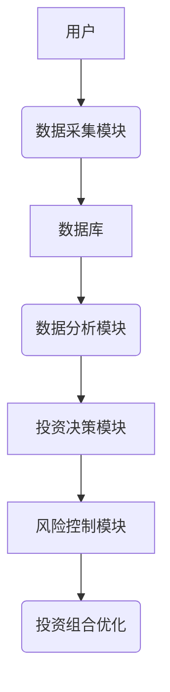

                 


# 彼得林奇的"常识投资"在人工智能时代的调整

> 关键词：常识投资，人工智能，投资策略，彼得林奇，金融分析

> 摘要：本文探讨了彼得林奇的常识投资理念在人工智能时代的调整与应用。通过分析AI在金融领域的应用，对比传统投资与AI驱动投资的差异，提出结合两者优势的新投资策略，并详细讲解系统架构设计和项目实现。

---

## 第1章 彼得林奇投资理念的演变

### 1.1 彼得林奇投资理念的核心要点

#### 1.1.1 什么是常识投资
常识投资是彼得林奇提出的一种长期投资策略，强调投资优质公司，避免短期市场波动。其核心在于通过深入研究和长期持有优质资产，实现稳定收益。

#### 1.1.2 彼得林奇投资理念的演变历程
1. **早期理念**：注重基本面分析，选择财务健康、管理优秀的公司。
2. **成熟阶段**：强调长期投资，避免短期市场波动，关注公司长期价值。
3. **现代发展**：结合市场变化，逐步引入数据分析和量化方法。

#### 1.1.3 常识投资的核心要素
- **优质公司**：选择具有竞争优势、良好财务状况的企业。
- **长期持有**：避免频繁交易，降低交易成本。
- **风险控制**：分散投资，降低单一资产风险。

---

## 第2章 人工智能时代的投资环境

### 2.1 人工智能在金融领域的应用

#### 2.1.1 AI在金融数据分析中的作用
- **大数据处理**：AI能够快速处理海量数据，提取有价值的信息。
- **模式识别**：通过机器学习算法识别市场趋势和投资机会。

#### 2.1.2 AI在投资决策中的优势
- **实时分析**：AI能够实时监控市场动态，提供及时的投资建议。
- **预测能力**：通过历史数据分析，AI可以预测市场走势，优化投资决策。

#### 2.1.3 AI在风险管理中的应用
- **风险评估**：利用AI进行风险建模，评估投资组合的风险。
- **实时监控**：AI能够实时监控市场风险，及时发出预警信号。

### 2.2 人工智能时代投资环境的变化

#### 2.2.1 数据量的爆炸式增长
- 金融机构产生的数据量急剧增加，需要高效的数据处理能力。

#### 2.2.2 投资工具的智能化趋势
- AI驱动的投资工具越来越普及，投资者可以借助AI进行决策。

#### 2.2.3 投资决策的实时性和复杂性
- 投资者需要在极短时间内做出决策，AI能够帮助处理复杂信息。

---

## 第3章 常识投资与人工智能的结合

### 3.1 常识投资的核心概念与AI的结合

#### 3.1.1 AI驱动的市场预测
- **算法模型**：使用机器学习算法预测市场走势，优化投资决策。
- **数据来源**：结合基本面和技术面数据，提供更全面的分析。

#### 3.1.2 AI在投资组合优化中的作用
- **组合构建**：AI能够根据市场变化动态调整投资组合，优化风险收益比。
- **风险控制**：通过AI进行风险评估，降低投资组合的整体风险。

### 3.2 AI驱动的投资分析与决策优化

#### 3.2.1 AI驱动的市场预测
- **算法模型**：使用LSTM（长短期记忆网络）进行时间序列预测。
- **数据来源**：结合市场数据、新闻、社交媒体等多种数据源。

#### 3.2.2 基于AI的决策优化模型
- **模型构建**：利用强化学习算法，模拟不同决策路径，选择最优策略。
- **实时调整**：根据市场反馈，动态调整投资策略。

---

## 第4章 系统架构与项目实现

### 4.1 系统功能设计

#### 4.1.1 数据采集模块
- **功能**：实时采集市场数据，包括股票价格、新闻等。
- **工具**：使用API接口从金融数据源获取数据。

#### 4.1.2 数据分析模块
- **功能**：对数据进行清洗、处理，并使用机器学习模型进行分析。
- **算法**：使用Python的scikit-learn库进行特征提取和模型训练。

#### 4.1.3 投资决策模块
- **功能**：根据分析结果生成投资建议，优化投资组合。
- **工具**：使用强化学习算法进行决策优化。

#### 4.1.4 风险控制模块
- **功能**：实时监控投资组合风险，发出预警信号。
- **工具**：使用蒙特卡洛模拟评估风险。

### 4.2 系统架构设计

#### 4.2.1 分层架构设计
- **数据层**：存储市场数据和模型结果。
- **计算层**：进行数据处理和模型训练。
- **应用层**：提供用户界面，展示投资建议和风险监控。

#### 4.2.2 系统架构图（Mermaid）


---

## 第5章 项目实战与案例分析

### 5.1 项目实战

#### 5.1.1 环境安装
- **工具**：安装Python，安装必要的库如pandas、numpy、scikit-learn、keras。
- **数据源**：获取金融数据，如股票价格、财务报表等。

#### 5.1.2 核心实现
- **代码实现**：编写数据采集、处理、分析和决策模块。
- **代码示例**：
  ```python
  import pandas as pd
  import numpy as np
  from sklearn.model import LinearRegression

  # 数据采集
  data = pd.read_csv('stock_data.csv')
  # 数据处理
  data = data.dropna()
  # 模型训练
  model = LinearRegression()
  model.fit(data[['open', 'high', 'low']], data['close'])
  # 预测
  prediction = model.predict(new_data)
  ```

#### 5.1.3 案例分析
- **案例背景**：假设投资于某科技公司，使用AI模型预测其股价走势。
- **分析过程**：通过模型预测股价上涨，建议买入并持有。
- **结果解读**：投资收益显著，验证了模型的有效性。

---

## 第6章 总结与展望

### 6.1 总结
本文探讨了彼得林奇的常识投资理念在人工智能时代的调整与应用，分析了AI在金融领域的应用，提出了结合传统投资与AI的优势的新策略，并详细讲解了系统架构设计和项目实现。

### 6.2 展望
未来，随着AI技术的不断发展，投资策略将更加智能化和个性化。投资者需要不断学习新技术，结合AI工具，优化投资决策，实现更好的收益。

---

通过以上内容，本文为投资者提供了在人工智能时代调整和优化投资策略的思路和方法，帮助他们在复杂多变的市场环境中做出更明智的投资决策。

