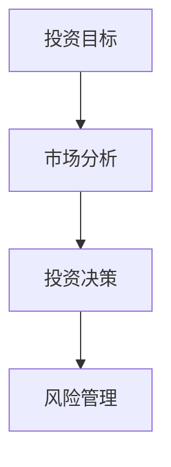

                 

# 彼得林奇的"常识投资"在复杂市场环境中的运用

> 关键词：常识投资，彼得林奇，复杂市场，投资策略，风险管理

> 摘要：本文将探讨彼得林奇的“常识投资”方法在复杂市场环境中的应用。通过分析常识投资的核心原理、复杂市场的特征以及如何在复杂市场中优化投资策略，本文将为投资者提供实用的指导和建议。文章结合了理论分析和实际案例，深入探讨了风险管理、资产配置、投资组合优化等关键问题。

---

## 第一部分：常识投资的基本原理

### 第1章：常识投资的核心理念

#### 1.1 彼得林奇与常识投资的起源

彼得·林奇是全球最著名的投资专家之一，他的投资理念以“常识投资”为核心。他强调，投资不仅仅是对市场的分析，更是对经济常识的理解。林奇的投资策略基于长期价值，而非短期市场波动。

#### 1.2 常识投资的核心概念与特点

常识投资的核心在于通过研究公司的基本面（如财务状况、行业地位、管理团队等）来判断其长期价值。其特点包括：

1. **长期视角**：关注公司的长期增长潜力，而非短期市场波动。
2. **基本面分析**：通过研究公司的财务报表、行业趋势和管理层决策来评估其价值。
3. **分散投资**：通过多样化投资组合来降低风险。

#### 1.3 常识投资的边界与外延

常识投资的边界在于其对市场的依赖性和对风险的控制。其外延则包括对宏观经济趋势、行业周期以及政策变化的适应性分析。

---

### 第2章：常识投资的核心原理

#### 2.1 投资的三要素：价值、风险与回报

- **价值**：公司的真实价值是投资的核心。通过分析财务数据，投资者可以评估公司的内在价值。
- **风险**：投资的回报与风险成正比。常识投资通过分散投资和风险管理来降低风险。
- **回报**：长期投资的目标是实现资产的保值和增值。

#### 2.2 常识投资的决策模型

常识投资的决策模型基于以下几个步骤：

1. **确定投资目标**：明确投资的目的和风险承受能力。
2. **分析市场趋势**：研究宏观经济和行业趋势。
3. **评估公司基本面**：分析公司的财务状况、管理层能力和行业地位。
4. **计算投资回报**：通过财务模型评估公司的未来盈利能力。
5. **制定投资策略**：根据分析结果制定投资计划。

#### 2.3 常识投资与市场周期的关系

市场周期包括上升、下降、震荡等阶段。常识投资强调在市场低谷时买入优质资产，在市场高点时谨慎投资。通过长期持有优质资产，投资者可以穿越市场周期，实现稳健回报。

---

## 第二部分：复杂市场环境下的投资策略

### 第3章：复杂市场的定义与特征

#### 3.1 市场复杂性的度量指标

复杂市场通常具有以下特征：

1. **高波动性**：市场价格波动剧烈，难以预测。
2. **不确定性**：经济环境不稳定，政策变化频繁。
3. **信息过载**：投资者面临海量信息，难以筛选有用信息。

#### 3.2 复杂市场的风险因素分析

复杂市场的风险因素包括：

1. **宏观经济风险**：如经济衰退、通货膨胀等。
2. **行业风险**：如政策变化、技术革新等。
3. **市场波动风险**：如市场流动性不足、投资者情绪波动等。

#### 3.3 复杂市场的投资机会识别

在复杂市场中，投资机会通常隐藏在以下几个方面：

1. **低估值资产**：通过基本面分析发现被市场低估的公司。
2. **行业拐点**：关注行业周期变化，寻找新兴行业的投资机会。
3. **政策红利**：分析政策变化对行业和公司的影响，寻找受益于政策支持的领域。

---

### 第4章：常识投资在复杂市场中的应用

#### 4.1 投资组合的优化策略

在复杂市场中，投资者需要通过优化投资组合来降低风险和提高回报。具体策略包括：

1. **分散投资**：通过投资不同行业和资产类别来降低风险。
2. **动态调整**：根据市场变化及时调整投资组合。
3. **风险对冲**：利用衍生工具对冲市场风险。

#### 4.2 市场波动下的应对措施

面对市场波动，投资者需要采取以下措施：

1. **保持冷静**：避免情绪化决策，坚持长期投资。
2. **加强监控**：密切关注市场变化和公司基本面。
3. **灵活调整**：根据市场情况及时调整投资策略。

#### 4.3 风险管理的具体方法

有效的风险管理是复杂市场中投资成功的关键。具体方法包括：

1. **设定止损点**：为每个投资设定止损点，避免重大损失。
2. **定期评估**：定期评估投资组合的风险和收益。
3. **情景分析**：通过情景分析模拟不同市场情况下的投资表现。

---

## 第三部分：系统分析与架构设计方案

### 第5章：投资系统的功能设计

#### 5.1 投资目标设定

投资者需要明确投资目标，包括投资期限、风险承受能力和收益目标。

#### 5.2 市场分析模块

通过分析宏观经济数据、行业趋势和市场情绪，投资者可以更好地把握市场方向。

#### 5.3 投资决策模块

基于市场分析和公司基本面，投资者可以制定投资策略。

#### 5.4 风险管理模块

通过设定止损点、分散投资和风险对冲，投资者可以有效控制投资风险。

---

### 第6章：系统架构设计

#### 6.1 系统功能模块

1. **市场分析模块**：包括宏观经济数据、行业趋势和市场情绪分析。
2. **投资决策模块**：基于基本面分析和财务模型制定投资策略。
3. **风险管理模块**：包括止损点设定、风险评估和对冲策略。

#### 6.2 系统架构图

---

## 第四部分：项目实战与案例分析

### 第7章：实际案例分析

#### 7.1 案例背景

在2020年新冠疫情爆发期间，市场出现剧烈波动。投资者需要在市场低谷时寻找被低估的资产。

#### 7.2 投资策略

通过基本面分析，投资者发现某科技公司在疫情期间业务需求激增，具备长期增长潜力。

#### 7.3 投资结果

长期持有该公司的股票，投资者在市场复苏后获得了可观的回报。

---

## 第五部分：总结与展望

### 第8章：总结

常识投资在复杂市场中的应用需要投资者具备长期视角和风险管理能力。通过基本面分析和投资组合优化，投资者可以在复杂环境中实现稳健回报。

### 第9章：展望

未来市场环境的不确定性将增加，投资者需要不断学习和适应。通过结合现代技术手段，如大数据和人工智能，投资者可以进一步提升投资决策的科学性和准确性。

---

通过本文的分析，投资者可以更好地理解和应用彼得林奇的常识投资方法，在复杂市场中做出明智的投资决策。

