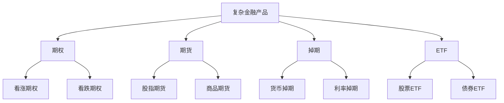
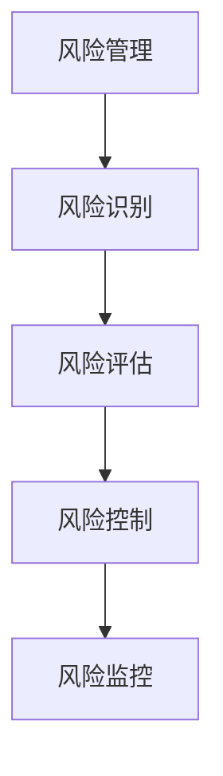
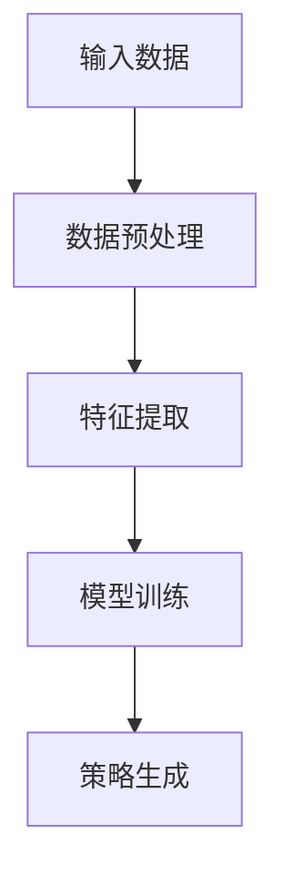
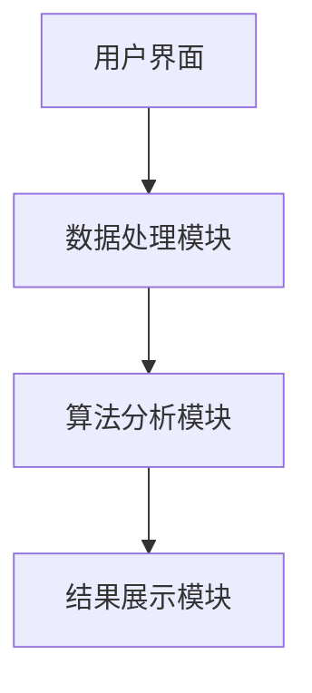
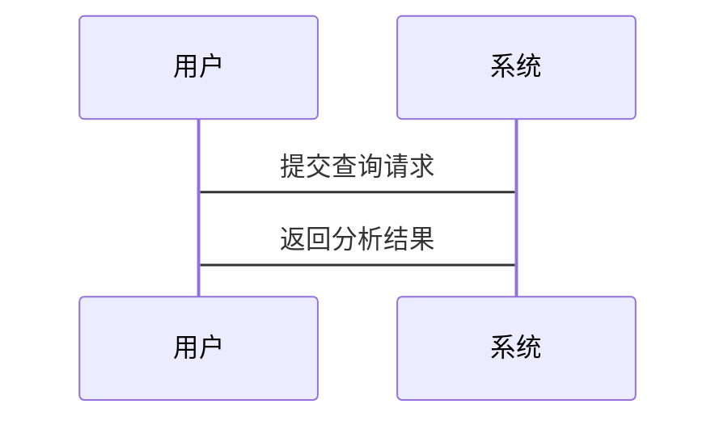

                 


# 彼得林奇的"常识投资"在复杂金融产品中的应用

> 关键词：彼得林奇，常识投资，复杂金融产品，风险管理，投资策略

> 摘要：本文详细探讨了彼得林奇的常识投资理念及其在复杂金融产品中的应用。通过分析复杂金融产品的特点、风险以及投资策略，本文展示了如何将常识投资原则应用于ETF、期权、衍生品等复杂金融工具中。同时，本文结合了算法优化和系统分析，提供了风险管理的解决方案，并通过实际案例分析，验证了常识投资在复杂金融产品中的有效性和可行性。

---

## 第一部分: 彼得林奇的"常识投资"概述

### 第1章: 彼得林奇与常识投资的背景

#### 1.1 彼得林奇及其投资理念
##### 1.1.1 彼得林奇的生平简介
彼得·林奇（Peter Lynch）是美国著名的职业基金经理人，被誉为“股神”之一。他从1977年到2004年担任富达麦哲伦基金的经理，期间将该基金的资产从1800万美元增长到140亿美元，年平均回报率超过29%。彼得林奇的投资理念以“常识投资”（Fundamental Analysis）为核心，强调长期投资、价值投资和基本面分析。

##### 1.1.2 彼得林奇的投资哲学
彼得林奇的投资哲学可以总结为以下几个核心观点：
- **长期投资**：避免短期市场波动的干扰，关注企业的长期价值。
- **价值投资**：寻找那些被市场低估的优质企业，关注企业的基本面指标（如市盈率、市净率、ROE等）。
- **分散投资**：通过投资不同类型和行业的企业来分散风险。
- **逆向思维**：在市场恐慌时买入，市场狂热时卖出。

##### 1.1.3 彼得林奇的成功案例分析
彼得林奇的代表案例包括投资于像IBM、Intel、可口可乐等知名企业。他的成功在于他对企业的深入了解和对市场的长期判断。

#### 1.2 常识投资的核心概念
##### 1.2.1 常识投资的定义
常识投资是一种基于基本面分析的投资方法，强调通过对企业的财务状况、行业地位、管理团队等因素的深入研究，找到具有长期竞争优势的企业进行投资。

##### 1.2.2 常识投资的核心要素
常识投资的核心要素包括：
- **企业的财务状况**：关注企业的盈利能力、资产负债情况、现金流等。
- **行业的竞争格局**：分析行业的市场集中度、进入壁垒等。
- **管理团队的能力**：评估企业管理层的战略眼光和执行力。
- **企业的估值指标**：如市盈率、市净率、股息率等。

##### 1.2.3 常识投资与传统投资的区别
与传统的技术分析或短期投机不同，常识投资更注重企业的内在价值，强调长期持有的策略。

#### 1.3 常识投资的适用场景
##### 1.3.1 常识投资的适用领域
常识投资适用于股票投资、基金投资、房地产投资等领域。

##### 1.3.2 常识投资的局限性
常识投资的局限性在于其对市场短期波动的钝感，以及对复杂金融产品的分析能力有限。

##### 1.3.3 常识投资的边界与外延
常识投资的核心在于对企业基本面的分析，其外延可以扩展到对复杂金融产品的分析，如ETF、期权等。

---

### 第2章: 常识投资的核心原理

#### 2.1 常识投资的基本原理
##### 2.1.1 市场有效性的假设
市场有效性假设认为，市场价格反映了所有可获得的信息，因此投资者很难通过短期交易获得超额收益。

##### 2.1.2 投资者心理与市场行为
彼得林奇强调投资者心理对市场的影响，认为市场的非理性行为为长期投资者提供了机会。

##### 2.1.3 市场波动与投资机会
市场波动为长期投资者提供了低位买入、高位卖出的机会。

#### 2.2 常识投资的核心策略
##### 2.2.1 长期投资策略
长期投资策略的核心是避免频繁交易，降低交易成本，同时利用复利效应。

##### 2.2.2 价值投资策略
价值投资策略强调寻找那些市场价格低于内在价值的企业。

##### 2.2.3 股票选择标准
彼得林奇的股票选择标准包括：
- 企业的财务状况健康。
- 企业的行业地位稳固。
- 企业的管理团队能力强。
- 企业的估值指标合理。

#### 2.3 常识投资的风险管理
##### 2.3.1 投资组合的风险分散
通过投资不同类型和行业的企业来分散风险。

##### 2.3.2 仓位管理与止损策略
根据市场环境和个人风险承受能力，合理配置仓位，并设置止损点。

##### 2.3.3 市场波动中的应对措施
在市场恐慌时保持冷静，利用市场的非理性行为寻找投资机会。

---

## 第二部分: 复杂金融产品中的应用

### 第3章: 复杂金融产品的基本分析

#### 3.1 复杂金融产品的定义与分类
##### 3.1.1 金融衍生品的定义
金融衍生品是基于基础资产（如股票、债券、商品等）的金融合约，其价值来源于基础资产的价格波动。

##### 3.1.2 期权、期货、掉期的基本原理
- **期权**：买方有权在特定时间内以特定价格买入或卖出标的资产。
- **期货**：买方和卖方约定在未来特定时间以特定价格买入或卖出标的资产。
- **掉期**：双方约定在未来特定时间交换资产或现金流。

##### 3.1.3 ETF与指数基金的特点
- **ETF**：交易所交易基金，可以在交易所上市交易，具有流动性好、透明度高等特点。
- **指数基金**：跟踪特定指数的投资基金，具有分散风险、费用低等优点。

#### 3.2 复杂金融产品的风险分析
##### 3.2.1 杠杆效应与放大风险
杠杆效应可以放大收益，也可以放大亏损。

##### 3.2.2 市场流动性风险
流动性风险是指在市场中无法以合理价格买卖资产的风险。

##### 3.2.3 信用风险与违约风险
信用风险是指交易对手违约的风险。

#### 3.3 复杂金融产品的定价模型
##### 3.3.1 Black-Scholes期权定价公式
Black-Scholes模型用于定价欧式期权，其公式为：
$$ C = S_0 N(d_1) - K e^{-rT} N(d_2) $$
其中：
- \( S_0 \) 是标的资产的价格
- \( K \) 是行权价
- \( r \) 是无风险利率
- \( T \) 是到期时间
- \( N(d) \) 是标准正态分布的累积分布函数
- \( d_1 = \frac{\ln(S_0/K) + (r + \sigma^2/2)T}{\sigma \sqrt{T}} \)
- \( d_2 = d_1 - \sigma \sqrt{T} \)

##### 3.3.2 布朗运动与随机过程
布朗运动描述了资产价格的随机波动，是金融数学中的基础模型。

##### 3.3.3 风险中性定价原理
风险中性定价假设投资者对风险有补偿，因此在定价时需要考虑无风险利率和风险溢价。

#### 3.4 用 Mermaid 绘制的复杂金融产品分类图


### 第4章: 常识投资在复杂金融产品中的应用策略

#### 4.1 常识投资与复杂金融产品的结合
##### 4.1.1 常识投资在ETF中的应用
ETF作为复杂金融产品的一种，可以通过基本面分析选择跟踪优质指数的ETF进行投资。

##### 4.1.2 常识投资在期权交易中的应用
通过分析标的资产的基本面，判断期权的合理价格，并进行套利或对冲。

##### 4.1.3 常识投资在衍生品投资中的应用
通过对衍生品的标的资产进行基本面分析，评估其风险和价值。

#### 4.2 常识投资在复杂金融产品中的风险管理
##### 4.2.1 复杂金融产品中的风险识别
通过分析复杂金融产品的结构和市场环境，识别潜在风险。

##### 4.2.2 常识投资与复杂金融产品的风险控制
通过分散投资、设置止损等方式控制风险。

#### 4.3 用 Mermaid 绘制的风险管理流程图


---

## 第三部分: 算法优化与系统分析

### 第5章: 算法优化在复杂金融产品中的应用

#### 5.1 算法优化的核心原理
##### 5.1.1 基于基本面分析的算法
通过算法筛选符合条件的复杂金融产品，如ETF、期权等。

##### 5.1.2 基于技术分析的算法
结合技术指标和市场数据，优化投资策略。

#### 5.2 用 Mermaid 绘制的算法优化流程图


#### 5.3 用 Python 实现的算法优化代码
```python
import pandas as pd
import numpy as np

# 示例代码：基于ETF的基本面分析
def screen_etf(data):
    # 筛选条件：高ROE、低市盈率、大市值
    filtered = data[(data['ROE'] > 15) & (data['PE'] < 15) & (data['Market Cap'] > 100000000)]
    return filtered

# 数据加载与处理
data = pd.read_csv('etf_data.csv')
result = screen_etf(data)
print(result)
```

---

## 第四部分: 项目实战

### 第6章: 复杂金融产品投资的实战分析

#### 6.1 项目背景与目标
选择一个复杂的金融产品（如ETF）作为研究对象，分析其基本面和市场表现。

#### 6.2 系统功能设计
##### 6.2.1 系统架构设计
使用Mermaid绘制系统架构图。



##### 6.2.2 系统接口设计
定义系统接口，如数据接口、算法接口等。

##### 6.2.3 系统交互设计
使用Mermaid绘制系统交互序列图。



#### 6.3 用 Python 实现的系统核心代码
```python
import pandas as pd
import matplotlib.pyplot as plt

# 数据加载
data = pd.read_csv('etf_data.csv')

# 数据可视化
data['Price'].plot()
plt.show()
```

#### 6.4 案例分析与结果解读
通过具体案例分析，展示常识投资在复杂金融产品中的应用效果。

#### 6.5 项目小结
总结项目经验，提出改进建议。

---

## 第五部分: 总结与展望

### 第7章: 总结与最佳实践

#### 7.1 最佳实践 tips
- 保持长期投资心态。
- 深入研究企业的基本面。
- 通过分散投资降低风险。

#### 7.2 未来展望
随着金融市场的复杂化，常识投资在复杂金融产品中的应用将更加广泛和深入。

---

### 参考文献
1. 彼得·林奇. 《彼得林奇的股票投资策略》.
2. John C. Hull. 《期权、期货和其他衍生产品》.
3. 张五强. 《复杂金融产品的定价与风险管理》.

---

通过以上思考和分析，我们可以看到，彼得林奇的常识投资理念在复杂金融产品中的应用具有广泛的可能性和实际操作价值。通过结合基本面分析、风险管理、算法优化等方法，投资者可以在复杂金融市场中实现长期稳定的收益。

