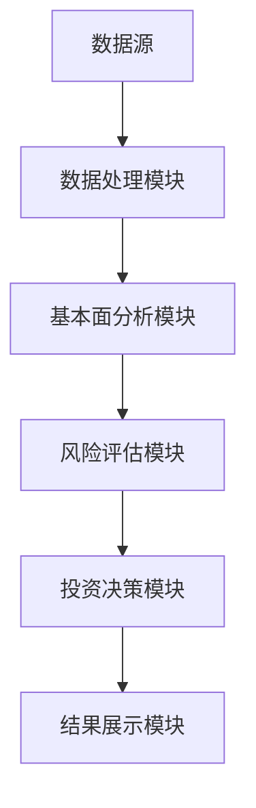
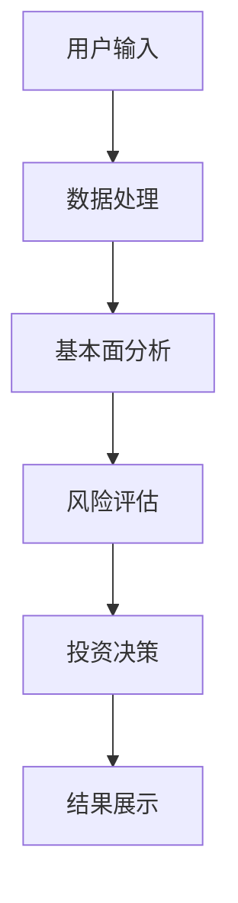
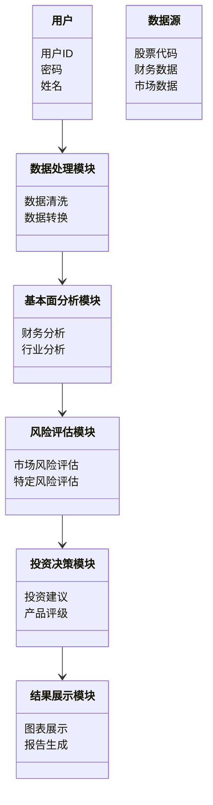

                 


# 彼得林奇的"常识投资"在复杂金融产品评估中的应用

> 关键词：彼得林奇，常识投资，复杂金融产品，金融产品评估，投资策略

> 摘要：本文详细探讨了彼得林奇的常识投资法在复杂金融产品评估中的应用。通过分析复杂金融产品的特点，结合常识投资的核心思想，构建了基于基本面分析的评估模型，并通过实际案例验证了其有效性。

---

## 第1章: 彼得林奇的常识投资概述

### 1.1 常识投资的基本概念

#### 1.1.1 常识投资的定义
常识投资是一种基于基本面分析的投资策略，强调长期投资、分散投资和对市场的深刻理解。彼得·林奇是这一方法的代表人物，他认为投资者应选择那些具有强大基本面和良好管理的公司进行投资。

#### 1.1.2 常识投资的核心思想
- **长期投资**：避免频繁交易，长期持有优质资产。
- **分散投资**：通过投资不同行业和公司的产品，降低风险。
- **基本面分析**：研究公司的财务状况、行业地位和管理团队，选择具有增长潜力的公司。

#### 1.1.3 常识投资与传统投资的区别
- 传统投资往往依赖技术分析或短期市场波动，而常识投资更注重长期基本面。
- 传统投资可能涉及复杂的金融工具，而常识投资更倾向于简单、可理解的投资标的。

### 1.2 彼得林奇的投资哲学

#### 1.2.1 彼得林奇的投资理念
彼得·林奇认为，成功的投资取决于对市场的深刻理解、对公司基本面的分析以及对行业趋势的把握。他强调避免跟风，选择那些具有持续增长潜力的公司。

#### 1.2.2 彼得林奇的选股标准
- **公司基本面**：健康的财务状况、稳定的收益和现金流。
- **行业地位**：公司在行业中的竞争力和市场占有率。
- **管理团队**：管理层的能力和诚信。

#### 1.2.3 彼得林奇对市场的看法
林奇认为市场波动是投资机会的来源，投资者应利用市场的非理性来寻找低估的资产。

### 1.3 常识投资在金融产品评估中的应用

#### 1.3.1 常识投资的基本原理
常识投资通过分析公司的基本面和行业趋势，选择具有长期增长潜力的公司，避免短期市场波动的影响。

#### 1.3.2 常识投资与复杂金融产品的结合
复杂金融产品如ETF、杠杆基金等，具有较高的风险和复杂的结构。常识投资通过基本面分析和长期投资策略，帮助投资者选择那些具有稳定收益和较低风险的产品。

#### 1.3.3 常识投资在金融产品评估中的优势
- 提供长期视角，避免短期波动的干扰。
- 通过分散投资降低风险。
- 强调基本面分析，帮助识别高质量的产品。

---

## 第2章: 复杂金融产品的基本特征

### 2.1 复杂金融产品的定义

#### 2.1.1 复杂金融产品的分类
复杂金融产品包括ETF、杠杆基金、期权、衍生品等。这些产品通常具有复杂的结构和较高的风险。

#### 2.1.2 复杂金融产品的特点
- **高杠杆**：放大收益和风险。
- **复杂结构**：涉及多层嵌套和多种金融工具。
- **高风险**：波动性大，容易受到市场环境的影响。

#### 2.1.3 复杂金融产品的风险
- **市场风险**：产品价值受市场波动影响较大。
- **杠杆风险**：高杠杆可能导致更大的损失。
- **流动性风险**：某些复杂产品可能难以快速变现。

### 2.2 常见复杂金融产品分析

#### 2.2.1 ETF基金
ETF（交易所交易基金）是一种追踪指数或其他资产的基金，具有分散投资和交易便利的特点。

#### 2.2.2 杠杆基金
杠杆基金通过借入资金放大收益，但也增加了风险。

#### 2.2.3 期权与衍生品
期权和衍生品是基于其他资产的金融工具，具有较高的复杂性和风险。

### 2.3 复杂金融产品的评估方法

#### 2.3.1 基于基本面的评估方法
分析公司的财务状况、行业地位和管理团队，选择具有长期增长潜力的公司。

#### 2.3.2 基于技术分析的评估方法
通过分析价格走势、成交量等技术指标来预测市场趋势。

#### 2.3.3 基于风险的评估方法
评估产品的风险承受能力和市场波动对产品的影响。

---

## 第3章: 常识投资在复杂金融产品评估中的应用原理

### 3.1 常识投资的核心要素

#### 3.1.1 市场分析
分析市场趋势和行业动态，选择具有增长潜力的行业和公司。

#### 3.1.2 个股分析
研究公司的财务状况、管理团队和市场地位，选择具有长期增长潜力的公司。

#### 3.1.3 行业分析
评估行业的发展前景和竞争状况，选择具有优势的行业进行投资。

### 3.2 复杂金融产品评估的核心要素

#### 3.2.1 产品结构分析
分析产品的结构和嵌套情况，评估其复杂性和潜在风险。

#### 3.2.2 风险分析
评估产品的市场风险、杠杆风险和流动性风险。

#### 3.2.3 市场环境分析
分析宏观经济环境、政策变化和市场趋势对产品的影响。

### 3.3 常识投资在复杂金融产品评估中的应用步骤

#### 3.3.1 确定评估目标
明确评估的目的和范围，选择合适的复杂金融产品进行评估。

#### 3.3.2 收集相关信息
收集产品的基本面数据、市场信息和行业动态，为评估提供依据。

#### 3.3.3 分析产品特征
分析产品的结构、风险和市场环境，评估其潜在收益和风险。

#### 3.3.4 制定评估策略
基于分析结果，制定合理的投资策略，选择具有长期增长潜力的产品。

#### 3.3.5 实施评估并调整策略
根据评估结果进行投资，定期调整投资组合以适应市场变化。

---

## 第4章: 基于常识投资的复杂金融产品评估模型

### 4.1 常识投资评估模型的基本框架

#### 4.1.1 模型的输入变量
- 公司财务数据
- 市场指数
- 行业动态
- 宏观经济指标

#### 4.1.2 模型的输出结果
- 产品评级
- 投资建议
- 风险评估

#### 4.1.3 模型的评估标准
- 准确性
- 可靠性
- 可操作性

### 4.2 基于常识投资的评估算法

#### 4.2.1 算法的步骤
1. 数据收集与预处理
2. 基本面分析
3. 风险评估
4. 投资决策

#### 4.2.2 算法的实现
```python
def fundamental_analysis(company_data):
    # 分析公司财务状况
    # 返回评级
    pass

def risk_assessment(risk_factors):
    # 评估产品风险
    # 返回风险等级
    pass

def investment_decision(assessment_results):
    # 制定投资策略
    # 返回投资建议
    pass
```

#### 4.2.3 算法的优缺点
- 优点：简单易懂，适用于长期投资。
- 缺点：对短期市场波动的反应较慢。

### 4.3 常识投资评估模型的数学模型

#### 4.3.1 股票价值评估模型
$$ P = \frac{E}{E/P} $$
其中，P为股票的内在价值，E为公司的收益，E/P为市盈率。

#### 4.3.2 风险评估模型
$$ R = \alpha \times \text{市场风险} + \beta \times \text{特定风险} $$
其中，α为市场风险系数，β为特定风险系数。

---

## 第5章: 系统设计与实现

### 5.1 系统需求分析

#### 5.1.1 功能需求
- 数据收集与处理
- 基本面分析
- 风险评估
- 投资决策

#### 5.1.2 性能需求
- 高效的数据处理能力
- 准确的分析结果

### 5.2 系统架构设计

#### 5.2.1 系统架构图


#### 5.2.2 数据流图


#### 5.2.3 实体关系图


### 5.3 系统接口设计

#### 5.3.1 数据接口
- 数据输入接口：接收股票代码、财务数据等。
- 数据输出接口：返回分析结果和投资建议。

#### 5.3.2 用户接口
- 用户输入界面：允许用户输入数据和选择功能。
- 结果展示界面：以图表和报告形式展示分析结果。

### 5.4 系统实现

#### 5.4.1 环境安装
需要安装Python、Pandas、Matplotlib等工具。

#### 5.4.2 核心代码实现
```python
import pandas as pd
import matplotlib.pyplot as plt

def load_data():
    # 加载数据
    pass

def analyze_fundamentals(data):
    # 基本面分析
    pass

def assess_risk(data):
    # 风险评估
    pass

def make_investment_decision(risk_assessment, fundamental_assessment):
    # 投资决策
    pass

def display_results():
    # 结果展示
    pass
```

---

## 第6章: 项目实战与案例分析

### 6.1 项目背景
本项目旨在利用常识投资法评估复杂金融产品，选择具有长期增长潜力的产品进行投资。

### 6.2 项目实现

#### 6.2.1 环境安装
安装必要的库和工具，如Python、Pandas、Matplotlib等。

#### 6.2.2 核心代码实现
```python
import pandas as pd
import numpy as np

def evaluate_product(product_data):
    # 评估产品
    pass

def main():
    # 加载数据
    data = pd.read_csv('product_data.csv')
    # 评估产品
    result = evaluate_product(data)
    # 显示结果
    print(result)

if __name__ == '__main__':
    main()
```

#### 6.2.3 案例分析
以某只ETF为例，分析其基本面和市场表现，评估其投资价值。

### 6.3 项目小结
通过实际案例分析，验证了常识投资法在复杂金融产品评估中的有效性和实用性。

---

## 第7章: 总结与展望

### 7.1 总结
本文详细探讨了彼得林奇的常识投资法在复杂金融产品评估中的应用，构建了基于基本面分析的评估模型，并通过实际案例验证了其有效性。

### 7.2 展望
未来可以进一步研究如何结合机器学习等先进技术，提升复杂金融产品的评估精度和效率。

---

## 参考文献

- 彼得·林奇. 《彼得林奇的股票投资策略》
- 金融产品评估相关文献
- 相关技术文档和标准

---

通过本文的详细讲解，读者可以深入了解彼得林奇的常识投资法在复杂金融产品评估中的应用，并能够实际操作相关评估模型的构建和应用。

