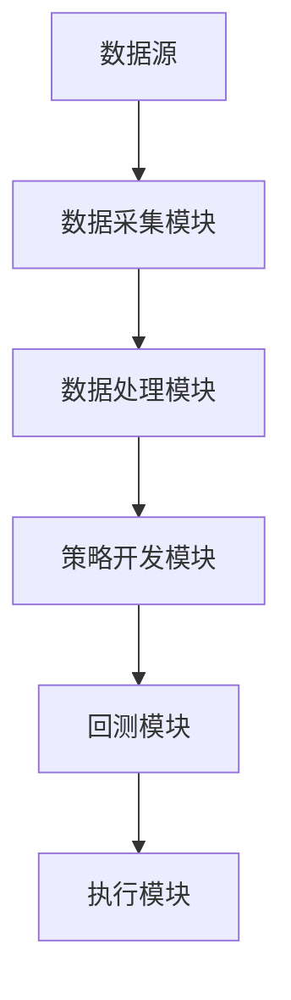
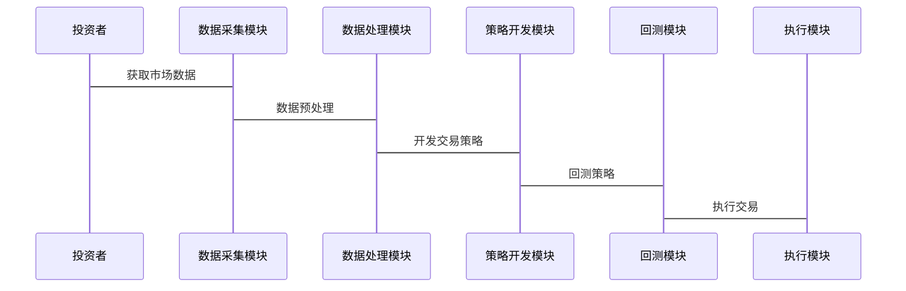

                 


# 彼得林奇的"常识投资"在算法交易盛行时代的重新定位

> 关键词：算法交易，彼得林奇，常识投资，投资策略，风险管理，系统架构

> 摘要：本文探讨了彼得林奇的常识投资理念在当前算法交易盛行时代的适应性和演变。通过分析算法交易的原理和其与传统投资策略的结合，提出了在现代金融市场中如何优化投资策略的方案。

---

# 第1章: 彼得林奇的常识投资概述

## 1.1 彼得林奇投资理念的核心思想

### 1.1.1 彼得林奇的常识投资定义

彼得林奇是全球著名的投资专家，他的常识投资理念强调通过深入研究公司基本面，寻找具有持续增长潜力的企业进行投资。这种方法注重长期价值，而非短期市场波动。

### 1.1.2 彼得林奇投资策略的特点

- **基本面分析**：注重企业的财务状况、行业地位和管理团队。
- **长期投资**：避免频繁交易，追求企业的长期增长。
- **分散投资**：通过投资多个行业和公司降低风险。

### 1.1.3 彼得林奇投资理念的优缺点

- **优点**：适合长期投资者，风险较低。
- **缺点**：在市场波动剧烈时，可能错过短期收益。

## 1.2 算法交易的起源与发展

### 1.2.1 算法交易的定义与特点

算法交易是利用计算机程序自动执行交易决策，基于数学模型和市场数据进行高速交易。

### 1.2.2 算法交易的主要类型

- **高频交易**：依赖高速计算机进行超短线交易。
- **统计套利**：利用价格差异进行无风险套利。
- **算法分层**：结合多种算法策略进行交易。

### 1.2.3 算法交易的优缺点

- **优点**：高速执行、高效率、避免人为情绪干扰。
- **缺点**：高风险，可能引发市场波动。

## 1.3 彼得林奇常识投资与算法交易的对比

### 1.3.1 投资理念的差异

- 常识投资：基于长期价值和基本面分析。
- 算法交易：基于数学模型和高速执行。

### 1.3.2 投资策略的差异

- 常识投资：分散投资、长期持有。
- 算法交易：集中策略、高频交易。

### 1.3.3 投资风险的差异

- 常识投资：风险较低，波动较小。
- 算法交易：风险较高，波动剧烈。

## 1.4 本章小结

本章介绍了彼得林奇的常识投资理念和算法交易的基本概念，分析了两者在投资策略和风险上的差异，为后续分析奠定了基础。

---

# 第2章: 算法交易与常识投资的核心概念

## 2.1 算法交易的数学模型

### 2.1.1 算法交易的数学基础

算法交易依赖于时间序列分析、统计套利等数学模型。例如，使用移动平均线（MA）和相对强弱指数（RSI）进行交易信号生成。

**公式示例**：
$$
\text{MA}(n) = \frac{1}{n} \sum_{i=1}^{n} p_i
$$
其中，\( p_i \) 表示第i天的价格，\( n \) 为窗口大小。

### 2.1.2 算法交易的核心算法

- **移动平均线算法**：用于识别价格趋势。
- **布林带算法**：用于识别价格波动范围。

### 2.1.3 算法交易的风险评估模型

使用VaR（Value at Risk）模型评估投资组合的风险。

**公式示例**：
$$
\text{VaR}(\alpha) = \text{median}(p)
$$
其中，\( \alpha \) 为置信水平。

## 2.2 常识投资的决策模型

### 2.2.1 常识投资的决策流程

- 数据收集：分析公司财务报表、行业趋势。
- 估值分析：计算市盈率、市净率等指标。
- 投资决策：基于估值和行业分析做出投资决策。

### 2.2.2 常识投资的关键指标

- **市盈率（P/E）**：衡量股价相对于每股收益的高低。
- **市净率（P/B）**：衡量股价相对于每股净资产的高低。

## 2.3 算法交易与常识投资的结合

### 2.3.1 算法交易与常识投资的协同效应

通过算法交易捕捉短期市场波动，结合常识投资进行长期布局。

### 2.3.2 算法交易与常识投资的互补性

算法交易提供短期交易信号，常识投资提供长期投资方向。

### 2.3.3 算法交易与常识投资的融合模式

混合策略：将算法交易作为辅助工具，用于执行常识投资的交易信号。

## 2.4 本章小结

本章深入分析了算法交易和常识投资的核心概念，探讨了两者结合的可能性和优势，为后续的系统设计提供了理论基础。

---

# 第3章: 算法交易的核心算法与实现

## 3.1 算法交易的主要算法

### 3.1.1 移动平均线算法

移动平均线用于识别价格趋势，常用于生成买入和卖出信号。

**代码示例**：
```python
import pandas as pd
import numpy as np

def compute_ma(data, window):
    return data['price'].rolling(window).mean()
```

### 3.1.2 布林带算法

布林带用于识别价格波动范围，帮助判断超买超卖信号。

**代码示例**：
```python
def compute_bollinger_bands(data, window, num_std):
    rolling_mean = data['price'].rolling(window).mean()
    rolling_std = data['price'].rolling(window).std()
    upper_band = rolling_mean + num_std * rolling_std
    lower_band = rolling_mean - num_std * rolling_std
    return upper_band, lower_band
```

## 3.2 算法交易的实现步骤

### 3.2.1 数据采集与处理

从数据源获取历史价格数据，清洗和预处理数据。

### 3.2.2 算法策略开发

设计交易策略，编写算法代码。

### 3.2.3 系统回测与优化

使用回测框架测试策略表现，优化参数。

### 3.2.4 系统部署与运行

将策略部署到交易系统，实时执行交易。

## 3.3 算法交易的数学模型

### 3.3.1 时间序列分析模型

使用ARIMA模型预测未来价格走势。

**公式示例**：
$$
ARIMA(p, d, q) = \phi(B) \theta(B) (1 - B)^d X_t
$$
其中，\( p \) 为自回归阶数，\( d \) 为差分阶数，\( q \) 为移动平均阶数。

### 3.3.2 机器学习算法在交易中的应用

使用支持向量机（SVM）进行分类预测。

**代码示例**：
```python
from sklearn.svm import SVC

model = SVC()
model.fit(X_train, y_train)
y_pred = model.predict(X_test)
```

## 3.4 本章小结

本章详细介绍了算法交易的核心算法和实现步骤，展示了如何通过数学模型和代码实现交易策略。

---

# 第4章: 算法交易与常识投资的系统架构设计

## 4.1 系统架构概述

### 4.1.1 系统模块划分

- 数据采集模块：负责获取市场数据。
- 策略开发模块：设计交易策略。
- 系统回测模块：测试策略表现。
- 系统执行模块：执行交易指令。

### 4.1.2 系统功能设计

- 数据处理：清洗和预处理数据。
- 策略开发：设计和实现交易策略。
- 系统回测：测试策略的回测结果。
- 系统执行：实时执行交易。

## 4.2 系统架构设计

### 4.2.1 系统架构图



### 4.2.2 系统交互图



## 4.3 本章小结

本章设计了算法交易与常识投资的系统架构，展示了如何将理论应用于实际系统中。

---

# 第5章: 项目实战

## 5.1 环境安装

安装必要的开发环境，如Python、Jupyter Notebook、回测框架（如Backtrader）。

## 5.2 系统核心实现源代码

### 5.2.1 数据采集模块

```python
import yfinance as yf

data = yf.download('AAPL', start='2020-01-01', end='2023-01-01')
```

### 5.2.2 策略开发模块

```python
class SimpleStrategy:
    def init(self):
        self.position = 0
        self.data = self.I('close')

    def next(self):
        if self.data > self.data.mean():
            self.position = 1
        elif self.data < self.data.mean():
            self.position = -1
        self.position.size = 100
```

### 5.2.3 回测模块

```python
from backtrader import Strategy, indicators

class BollingerStrategy(Strategy):
    def init(self):
        self.add_indicator(indicators.BollingerBands)

    def next(self):
        if indicators.BollingerBands(self.data).upper > self.data:
            self.position.close()
```

## 5.3 实际案例分析

以苹果公司（AAPL）为例，展示策略的回测结果和表现分析。

## 5.4 项目小结

本章通过实际案例展示了如何将算法交易应用于具体投资策略，验证了理论的有效性。

---

# 第6章: 最佳实践与总结

## 6.1 最佳实践 tips

- 结合市场环境调整策略参数。
- 定期评估和优化交易策略。
- 注意风险管理，避免过度杠杆。

## 6.2 小结

本文探讨了彼得林奇的常识投资在算法交易时代的定位和应用，通过理论分析和实践案例展示了如何优化投资策略。

## 6.3 注意事项

- 算法交易需要考虑交易成本和滑点。
- 风险管理是投资成功的关键。

## 6.4 拓展阅读

推荐阅读《算法交易：从零到实战》和《彼得林奇选股术》。

---

# 结语

彼得林奇的常识投资理念在算法交易时代依然具有重要价值。通过结合算法交易的高效性和常识投资的长期性，投资者可以在现代金融市场中找到适合自己的投资策略。

---

