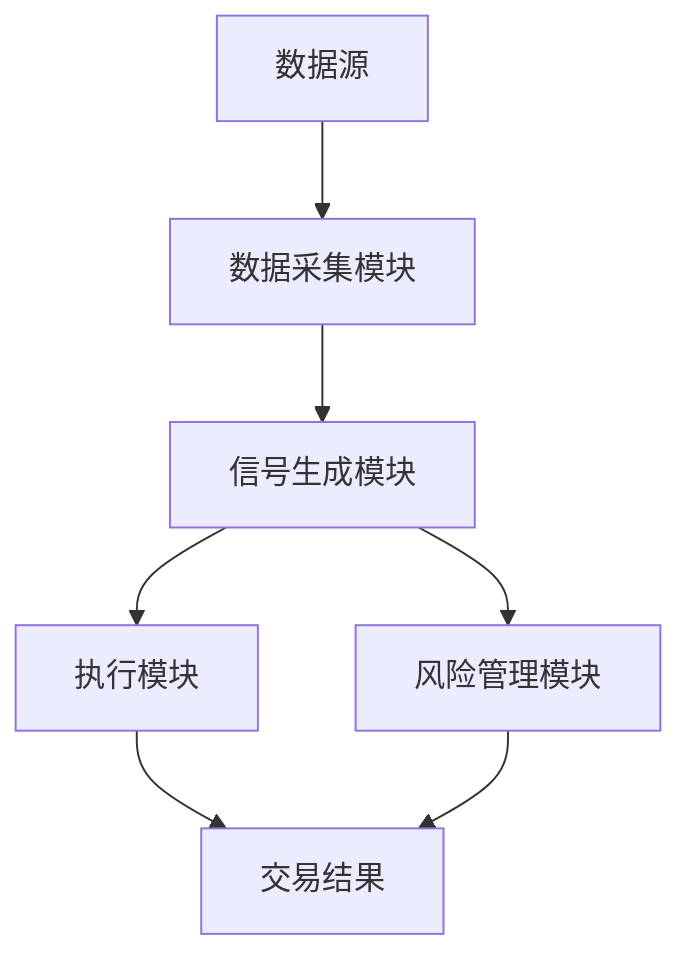
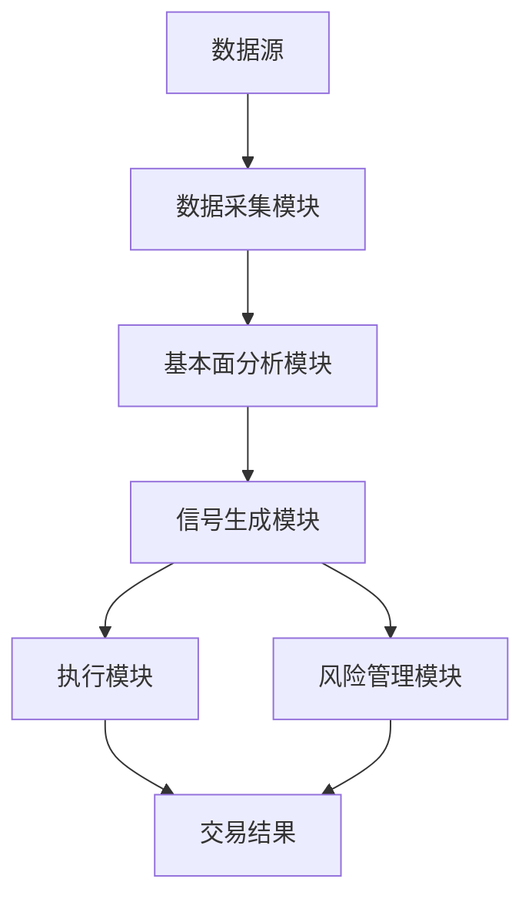

                 


# 彼得林奇的"常识投资"在算法交易盛行时代的重要性

> 关键词：算法交易、常识投资、彼得林奇、投资策略、风险管理

> 摘要：在当前算法交易主导的金融市场中，彼得林奇的常识投资理念依然具有重要的现实意义。本文将深入分析彼得林奇的常识投资理论，探讨其在算法交易时代的适用性，并结合实际案例，阐述如何将常识投资理念融入算法交易系统中，以实现长期稳定的收益。

---

# 第一部分: 背景介绍与核心概念

## 第1章: 算法交易的现状与问题

### 1.1 算法交易的定义与现状

算法交易是一种基于数学模型和计算机程序自动执行交易的交易方式。它通过高速计算机和复杂算法，在极短时间内完成大量的交易操作。近年来，随着技术的进步和市场对效率的追求，算法交易在金融市场中占据了重要地位。

- **算法交易的广泛应用**：目前，全球各大交易所的交易量中，约有70%以上是由算法交易完成的。
- **算法交易的优点**：
  - 高效性：可以在毫秒级别完成交易。
  - 稳定性：通过程序化交易减少人为情绪干扰。
  - 大数据处理能力：能够快速分析大量市场数据，捕捉短期交易机会。
- **算法交易的缺点**：
  - 过度依赖模型：算法交易依赖于预先设定的数学模型，模型失效可能导致重大损失。
  - 市场波动性增加：算法交易可能导致市场的非理性波动，例如闪电崩盘。
  - 高技术门槛：需要专业的技术团队和高昂的硬件投入。

### 1.2 常识投资的基本概念

常识投资是一种基于基本面分析和长期价值投资的策略，强调通过研究企业的财务状况、行业地位和市场前景来做出投资决策。

- **常识投资的核心理念**：
  - 长期导向：关注企业的长期价值，而不是短期价格波动。
  - 基本面分析：通过分析企业的财务报表、管理团队和行业前景来评估其价值。
  - 风险控制：注重投资组合的分散化，降低投资风险。
- **常识投资的优点**：
  - 抗风险能力强：能够抵御市场的短期波动，长期表现稳定。
  - 低技术门槛：不需要复杂的算法支持，适合个人投资者。
  - 长期收益高：通过投资优质企业，获得长期稳定的收益。

## 第2章: 彼得林奇的常识投资理论

### 2.1 彼得林奇的生平与投资理念

彼得·林奇（Peter Lynch）是美国著名的职业基金经理人，被誉为“最伟大的股票投资者之一”。他在任职富达麦哲伦基金期间，通过基本面分析和长期投资策略，取得了出色的业绩。

- **彼得林奇的投资哲学**：
  - **价值投资**：寻找被市场低估的优质企业进行投资。
  - **分散投资**：通过分散投资降低风险，避免过度依赖单一股票。
  - **长期持有**：长期持有优质企业股票，分享企业成长的成果。
  - **关注基本面**：通过分析企业的财务报表、行业地位和管理团队，评估其投资价值。

### 2.2 彼得林奇的常识投资策略

彼得林奇的常识投资策略以基本面分析为核心，注重企业的长期价值，而非短期价格波动。他的策略主要包括以下几个方面：

- **行业分析**：选择具有增长潜力的行业，投资其中的龙头企业。
- **财务分析**：通过分析企业的财务报表，评估其盈利能力、资产负债状况和现金流情况。
- **管理团队**：关注企业的管理团队，选择那些具有优秀管理能力的企业。
- **估值分析**：通过市盈率、市净率等指标，评估企业的投资价值。

### 2.3 彼得林奇的成功案例

彼得林奇在职业生涯中管理的麦哲伦基金取得了卓越的业绩，年均收益率超过29%，远远跑赢市场指数。他的成功案例包括：

- **可口可乐公司**：彼得林奇通过分析可口可乐的财务状况和市场地位，认为其具有长期增长潜力，因此长期持有该股票，最终获得了丰厚的回报。
- **IBM公司**：彼得林奇通过基本面分析，发现IBM在信息技术领域的领先地位，因此选择投资该公司，获得了长期稳定的收益。

## 第3章: 算法交易时代下的投资挑战

### 3.1 算法交易对传统投资的影响

算法交易的广泛应用对传统投资方式产生了深远影响。一方面，算法交易提高了市场的流动性和交易效率；另一方面，算法交易也带来了一些问题，例如市场的不稳定性、交易成本的增加以及信息不对称的加剧。

- **算法交易对市场流动性的贡献**：算法交易通过高频交易提高了市场的流动性和价格发现能力。
- **算法交易引发的市场波动**：算法交易可能导致市场的非理性波动，例如闪电崩盘。
- **算法交易的潜在风险**：算法交易依赖于复杂的数学模型和计算机程序，模型失效或程序错误可能导致重大损失。

### 3.2 算法交易与常识投资的冲突与融合

算法交易和常识投资在投资理念和操作方式上存在显著差异。算法交易注重短期价格波动，依赖数学模型和程序化交易；常识投资注重长期价值，依赖基本面分析和管理能力。然而，两者并非完全对立，而是可以互补的。

- **算法交易的短期导向与常识投资的长期导向**：算法交易关注短期价格波动，而常识投资关注长期价值。
- **算法交易的复杂性与常识投资的简洁性**：算法交易需要复杂的数学模型和计算机程序，而常识投资相对简单易懂。
- **算法交易与常识投资的互补性**：算法交易可以用于捕捉短期交易机会，而常识投资可以用于长期价值投资。

---

# 第二部分: 算法交易的原理与实现

## 第4章: 算法交易的数学模型与公式

### 4.1 算法交易的核心数学模型

算法交易依赖于复杂的数学模型，这些模型通过分析市场数据，预测价格走势并生成交易信号。以下是一些常见的算法交易模型：

- **时间序列分析模型**：用于分析价格走势和市场波动。
- **马尔可夫链模型**：用于预测市场的状态转移。
- **布朗运动模型**：用于模拟价格的随机波动。

### 4.2 常见的算法交易策略公式

以下是一些常见的算法交易策略及其数学公式：

- **均值回归策略**：
  - 假设市场价格会在均值附近波动，当价格偏离均值时，会回归均值。
  - 公式：$r_t = \alpha + \beta r_{t-1} + \epsilon_t$
  
- **动量策略**：
  - 假设价格走势具有惯性，近期的价格走势会延续到未来。
  - 公式：$p_t = p_{t-1} + \epsilon_t$

- **跨期套利策略**：
  - 利用不同市场或不同时间的价格差异进行套利。
  - 公式：$p_1 - p_2 = c$

## 第5章: 算法交易的系统架构设计

### 5.1 算法交易系统的功能模块

一个完整的算法交易系统通常包括以下几个功能模块：

- **数据采集模块**：从数据源获取市场数据，例如股票价格、成交量等。
- **信号生成模块**：通过分析市场数据，生成交易信号。
- **执行模块**：根据交易信号，执行具体的交易操作。
- **风险管理模块**：监控交易风险，调整交易策略。

### 5.2 算法交易系统的架构图

以下是一个算法交易系统的架构图：



### 5.3 算法交易系统的接口设计

- **数据接口**：从数据源获取市场数据，例如股票价格、成交量等。
- **信号接口**：生成交易信号，指示买入或卖出。
- **执行接口**：执行具体的交易操作，例如下单、撤单等。
- **风险管理接口**：监控交易风险，调整交易策略。

## 第6章: 算法交易的代码实现

### 6.1 环境安装与配置

- **Python环境安装**：安装Python编程语言和必要的开发工具。
- **第三方库安装**：安装pandas、numpy、matplotlib等第三方库，用于数据处理和可视化。

### 6.2 算法交易系统核心代码实现

以下是一个简单的算法交易系统代码示例：

```python
import pandas as pd
import numpy as np
import matplotlib.pyplot as plt

# 数据采集模块
def fetch_data():
    # 模拟从数据库获取数据
    data = pd.DataFrame({
        'timestamp': [1, 2, 3, 4, 5],
        'price': [100, 101, 99, 102, 100]
    })
    return data

# 信号生成模块
def generate_signal(data):
    # 计算价格移动平均线
    price = data['price']
    ma = price.rolling(window=3).mean()
    signal = 'buy' if price[-1] > ma[-1] else 'sell'
    return signal

# 执行模块
def execute_trade(signal):
    if signal == 'buy':
        print("买入信号")
    elif signal == 'sell':
        print("卖出信号")

# 风险管理模块
def risk_management():
    # 简单的风险管理策略
    pass

# 主程序
def main():
    data = fetch_data()
    signal = generate_signal(data)
    execute_trade(signal)
    risk_management()

if __name__ == "__main__":
    main()
```

### 6.3 代码应用解读与分析

- **代码功能模块分析**：
  - `fetch_data()`：从数据库获取数据。
  - `generate_signal()`：通过移动平均线生成交易信号。
  - `execute_trade()`：根据信号执行交易。
  - `risk_management()`：监控交易风险。

- **代码运行流程分析**：
  1. 数据采集模块从数据库获取市场数据。
  2. 信号生成模块通过分析数据，生成买入或卖出信号。
  3. 执行模块根据信号执行具体的交易操作。
  4. 风险管理模块监控交易风险，调整交易策略。

- **代码优化建议**：
  - 增加更多的交易策略，例如动量策略、均值回归策略等。
  - 引入风险管理模块，例如止损、止盈等机制。
  - 提高系统的运行效率，例如使用并行计算、分布式系统等。

---

# 第三部分: 常识投资与算法交易的结合

## 第7章: 常识投资在算法交易中的应用

### 7.1 常识投资与算法交易的结合

将常识投资理念融入算法交易系统中，可以充分发挥算法交易的高效性和常识投资的长期稳定性。

- **基本面分析的自动化**：通过算法程序自动分析企业的财务报表、行业地位和管理团队。
- **交易信号的优化**：结合基本面分析和算法交易信号，生成更可靠的交易策略。
- **风险管理的增强**：通过常识投资的分散化策略，降低算法交易的风险。

### 7.2 基于常识投资的算法交易系统设计

以下是一个基于常识投资的算法交易系统架构图：



### 7.3 实际案例分析

假设我们设计一个基于常识投资的算法交易系统，以下是具体步骤：

1. **数据采集**：从数据库获取企业的财务数据、市场数据等。
2. **基本面分析**：通过算法程序自动分析企业的财务报表、行业地位和管理团队。
3. **信号生成**：结合基本面分析和算法交易信号，生成买入或卖出信号。
4. **风险管理**：通过分散化投资和风险管理模块，降低交易风险。
5. **交易执行**：根据生成的信号，执行具体的交易操作。

### 7.4 系统优化与总结

- **系统优化**：
  - 增加更多的基本面分析指标，例如市盈率、市净率、ROE等。
  - 引入机器学习算法，提高基本面分析的准确性。
  - 优化风险管理模块，例如动态调整止损和止盈点位。
- **系统总结**：
  - 将常识投资理念融入算法交易系统中，可以充分发挥算法交易的高效性和常识投资的长期稳定性。
  - 通过自动化和智能化的方式，提高投资决策的准确性和效率。

---

# 第四部分: 总结与展望

## 第8章: 总结与展望

### 8.1 总结

在算法交易盛行的时代，彼得林奇的常识投资理念依然具有重要的现实意义。通过将常识投资与算法交易相结合，可以充分发挥两种投资方式的优势，实现长期稳定的收益。

### 8.2 展望

随着人工智能和大数据技术的不断发展，算法交易将变得更加智能化和自动化。未来，基于常识投资的算法交易系统将更加复杂和高效，投资者需要不断学习和适应新的技术和市场环境。

---

# 参考文献

1. 彼得·林奇. 《彼得林奇的投资策略》
2. 哈里·马科维茨. 《投资组合理论》
3. 李录. 《投资中最简单的事》

---

通过以上目录结构和内容设计，我们可以清晰地看到彼得林奇的常识投资理念在算法交易时代的应用价值，以及如何通过结合两种投资方式，实现长期稳定的收益。

