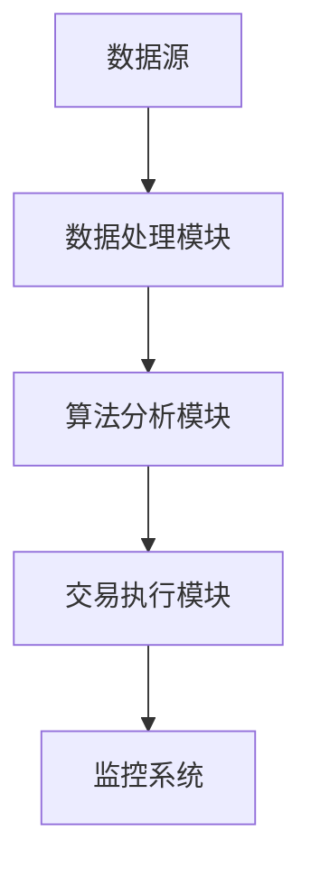

                 


# 彼得林奇的"常识投资"在高频交易时代的价值重估

## 关键词
- 彼得林奇
- 常识投资
- 高频交易
- 投资策略
- 金融市场

## 摘要
在金融市场日益复杂的今天，彼得林奇的"常识投资"理念在高频交易时代的价值需要重新评估。本文从常识投资的基本原理出发，结合高频交易的技术特点，分析了两者在投资策略中的应用与融合。通过详细讲解高频交易中的算法实现、数学模型和系统架构，本文展示了如何将常识投资理念与现代技术手段相结合，以应对高频交易时代的挑战。最后，通过实际案例分析和最佳实践总结，本文为投资者提供了新的视角和策略选择。

---

# 第一部分：彼得林奇的常识投资概述

## 第1章：彼得林奇与常识投资

### 1.1 彼得林奇的生平与投资理念

#### 1.1.1 彼得林奇的生平简介
彼得·林奇（Peter Lynch）是美国著名的投资专家，曾任富达投资管理公司的基金经理。他以卓越的投资业绩和独特的投资理念闻名，提出了"常识投资"（Fundamental Investing）的概念。林奇认为，投资者应该基于对公司基本面的深入分析，选择具有成长潜力的股票进行投资。

#### 1.1.2 彼得林奇的投资哲学
林奇强调，投资不仅仅是对市场的预测，而是对企业的深入了解。他认为，成功的投资需要结合市场趋势、公司财务状况以及行业前景等因素，找到那些具有竞争优势和增长潜力的企业。

#### 1.1.3 彼得林奇的"常识投资"核心理念
常识投资的核心在于通过分析企业的财务报表、管理层能力、行业地位等因素，评估其内在价值。林奇认为，投资者应该选择那些具有合理市盈率、良好的财务状况和持续增长潜力的企业。

---

### 1.2 高频交易的基本概念

#### 1.2.1 高频交易的定义与特点
高频交易是指利用先进的计算机技术，在极短时间内进行大量的买卖交易，以捕捉市场中的微小价格波动。高频交易的特点包括高速性、自动化和算法驱动。

#### 1.2.2 高频交易的技术基础
高频交易依赖于高速的网络连接、先进的算法交易平台和强大的数据处理能力。交易系统能够实时分析市场数据，并根据预设的算法自动执行交易指令。

#### 1.2.3 高频交易与传统投资的区别
高频交易注重短期价格波动，而传统投资注重长期价值。高频交易依赖技术手段，而传统投资更依赖基本面分析。

---

### 1.3 常识投资在高频交易时代的必要性

#### 1.3.1 高频交易时代的市场特点
高频交易使得市场波动更加频繁和复杂，投资者需要更快速的反应和更精准的判断。然而，市场的短期波动并不意味着长期价值的改变。

#### 1.3.2 常识投资在高频交易中的价值
常识投资通过对企业基本面的深入分析，可以帮助投资者在高频交易中找到那些具有长期增长潜力的企业，避免被短期市场波动所迷惑。

#### 1.3.3 高频交易与常识投资的结合点
高频交易提供了快速的交易执行能力，而常识投资提供了长期的价值判断。两者的结合可以帮助投资者在短期波动中把握长期投资机会。

---

## 第2章：常识投资的核心概念与高频交易的关系

### 2.1 常识投资的核心概念

#### 2.1.1 常识投资的基本原理
常识投资强调对企业的深入了解，包括财务状况、管理层能力、行业地位等因素。通过分析这些因素，投资者可以评估企业的内在价值。

#### 2.1.2 常识投资的关键要素
- 企业的财务报表分析
- 行业发展趋势
- 管理层能力

#### 2.1.3 常识投资的优缺点
优点：能够发现具有长期增长潜力的企业；缺点：需要大量时间和精力进行基本面分析，且难以应对短期市场波动。

---

### 2.2 高频交易的核心概念

#### 2.2.1 高频交易的技术实现
高频交易依赖于高速的网络连接、先进的算法交易平台和强大的数据处理能力。交易系统能够实时分析市场数据，并根据预设的算法自动执行交易指令。

#### 2.2.2 高频交易的市场影响
高频交易增加了市场的流动性和价格波动。由于其高速性和自动化，高频交易对市场的影响更加复杂和难以预测。

#### 2.2.3 高频交易的风险与挑战
- 市场波动加剧
- 系统性风险增加
- 交易成本降低

---

### 2.3 常识投资与高频交易的对比分析

#### 2.3.1 两者的异同点对比

| 特性        | 常识投资             | 高频交易             |
|-------------|--------------------|----------------------|
| 投资策略     | 长期价值驱动         | 短期价格波动         |
| 分析方法     | 基本面分析           | 技术分析和算法驱动    |
| 投资期限     | 长期                | 短期                 |
| 交易频率     | 低                  | 高                  |

#### 2.3.2 常识投资在高频交易中的应用
- 帮助投资者识别具有长期增长潜力的企业。
- 在高频交易中，利用常识投资的理念，选择那些被市场低估的企业。

#### 2.3.3 高频交易对常识投资的挑战
- 市场波动加剧，短期价格波动可能掩盖企业的长期价值。
- 高频交易可能导致市场的过度波动，影响企业的长期价值实现。

---

## 第3章：常识投资在高频交易中的策略分析

### 3.1 常识投资的基本策略

#### 3.1.1 价值投资策略
价值投资策略强调购买那些市场价格低于内在价值的企业。通过长期持有，等待市场重新评估其价值。

#### 3.1.2 成长投资策略
成长投资策略关注那些具有高增长潜力的企业。通过分析企业的财务报表和行业前景，选择具有持续增长能力的企业。

#### 3.1.3 投资组合优化策略
通过优化投资组合，降低投资风险。投资组合优化策略包括分散投资、风险管理和资产配置。

---

### 3.2 高频交易中的常见策略

#### 3.2.1 统计套利策略
统计套利策略通过分析市场的统计规律，寻找价格偏离合理价值的机会。当市场价格回归合理价值时，套利者可以获得利润。

#### 3.2.2 算法交易策略
算法交易策略通过编写交易算法，自动执行交易指令。算法交易可以利用市场中的微小价格波动，快速进行买卖操作。

#### 3.2.3 裁剪交易策略
裁剪交易策略通过分析市场的短期波动，进行高频买卖操作。该策略依赖于对市场的快速反应和对价格波动的准确预测。

---

### 3.3 常识投资在高频交易中的应用案例

#### 3.3.1 案例背景
假设某企业在高频交易中，由于市场波动导致其股价短期下跌。然而，通过常识投资的分析，该企业具有长期增长潜力。

#### 3.3.2 投资策略
投资者可以选择在股价低于内在价值时买入该企业股票，长期持有，等待市场重新评估其价值。

#### 3.3.3 实际效果
通过长期持有该企业股票，投资者能够在市场重新评估其价值时获得利润，同时规避了短期市场波动的风险。

---

## 第4章：高频交易中的算法实现

### 4.1 统计套利算法的实现

#### 4.1.1 算法原理
统计套利算法通过分析市场的统计规律，寻找价格偏离合理价值的机会。当市场价格回归合理价值时，套利者可以获得利润。

#### 4.1.2 算法实现
以下是统计套利算法的Python代码示例：

```python
import pandas as pd
import numpy as np

def calculate_mean_reversion_signal(data, window=20):
    # 计算过去20天的平均价格
    data['SMA'] = data['price'].rolling(window=window).mean()
    # 计算当前价格与平均价格的差值
    data['signal'] = data['price'] - data['SMA']
    return data

# 示例数据
data = pd.DataFrame({'price': np.random.normal(100, 1, 100)})
signal = calculate_mean_reversion_signal(data)
print(signal)
```

#### 4.1.3 算法优缺点
- 优点：能够捕捉到市场中的短期价格波动。
- 缺点：需要对市场波动进行准确预测，且可能受到市场冲击的影响。

---

### 4.2 机器学习算法的实现

#### 4.2.1 算法原理
机器学习算法通过分析市场数据，预测未来的市场走势。常用的机器学习算法包括支持向量机（SVM）、随机森林（Random Forest）和神经网络（Neural Networks）。

#### 4.2.2 算法实现
以下是使用随机森林进行市场预测的Python代码示例：

```python
from sklearn.ensemble import RandomForestClassifier
from sklearn.model_selection import train_test_split

# 示例数据
data = pd.DataFrame({
    'feature1': np.random.normal(0, 1, 100),
    'feature2': np.random.normal(0, 1, 100),
    'label': np.random.randint(0, 2, 100)
})

# 划分训练集和测试集
X = data[['feature1', 'feature2']]
y = data['label']
X_train, X_test, y_train, y_test = train_test_split(X, y, test_size=0.2)

# 训练随机森林模型
model = RandomForestClassifier()
model.fit(X_train, y_train)

# 预测测试集
y_pred = model.predict(X_test)

print("预测结果：", y_pred)
print("真实标签：", y_test.values)
```

#### 4.2.3 算法优缺点
- 优点：能够捕捉到复杂的市场规律，提高预测的准确性。
- 缺点：需要大量的数据和计算资源，且模型的可解释性较低。

---

## 第5章：数学模型与高频交易

### 5.1 均值回归模型

#### 5.1.1 模型原理
均值回归模型假设价格会回归到其长期均值水平。该模型常用于统计套利策略中。

#### 5.1.2 模型公式
$$ E_t = \alpha + \beta t $$

其中，$E_t$ 是$t$时刻的预期价格，$\alpha$ 是截距，$\beta$ 是回归系数。

#### 5.1.3 模型应用
通过计算当前价格与均值回归模型的预期价格之间的差异，投资者可以判断是否进行套利交易。

---

### 5.2 马科维茨有效投资组合模型

#### 5.2.1 模型原理
马科维茨有效投资组合模型通过优化投资组合的风险和收益，找到最优的投资组合。

#### 5.2.2 模型公式
$$ \text{Minimize } \sigma^2 \text{ subject to } \mu \geq \text{目标收益} $$

其中，$\sigma^2$ 是投资组合的方差，$\mu$ 是投资组合的期望收益。

#### 5.2.3 模型应用
通过优化投资组合的风险和收益，投资者可以在高频交易中找到风险最小化而收益最大化的投资组合。

---

## 第6章：系统架构与高频交易

### 6.1 高频交易系统的组成部分

#### 6.1.1 数据源
高频交易系统需要实时获取市场数据，包括股票价格、成交量等。

#### 6.1.2 算法引擎
算法引擎负责根据预设的算法，对市场数据进行分析和交易决策。

#### 6.1.3 执行系统
执行系统负责根据算法引擎的决策，执行具体的交易指令。

#### 6.1.4 监控系统
监控系统负责对交易过程进行实时监控，确保交易系统的正常运行。

---

### 6.2 系统架构设计

#### 6.2.1 系统功能设计
- 数据采集与处理
- 算法分析与决策
- 交易执行与监控

#### 6.2.2 系统架构图



---

## 第7章：项目实战与最佳实践

### 7.1 项目实战

#### 7.1.1 环境配置
- 安装必要的Python库，如Pandas、NumPy、Scikit-learn等。
- 配置高频交易的交易平台。

#### 7.1.2 核心实现
- 编写统计套利算法的Python代码。
- 实现机器学习算法的市场预测模型。

#### 7.1.3 案例分析
通过具体案例分析，展示如何在高频交易中应用常识投资策略。

---

### 7.2 最佳实践

#### 7.2.1 风险管理
- 设置止损点，避免亏损过大。
- 分散投资，降低投资风险。

#### 7.2.2 数据源选择
- 选择可靠的市场数据源，确保数据的准确性和及时性。

#### 7.2.3 算法优化
- 定期优化算法模型，提高交易的准确性和效率。

---

## 第8章：总结与展望

### 8.1 总结
本文从彼得林奇的常识投资理念出发，结合高频交易的技术特点，分析了两者在投资策略中的应用与融合。通过详细讲解高频交易中的算法实现、数学模型和系统架构，本文展示了如何将常识投资理念与现代技术手段相结合，以应对高频交易时代的挑战。

### 8.2 展望
随着科技的不断进步，高频交易将更加依赖于算法和技术手段。未来，投资者需要更加深入地理解市场的规律，结合常识投资和高频交易的优势，找到适合自己的投资策略。

---

# 结语
在高频交易时代，常识投资的价值需要重新评估。通过结合现代技术手段，投资者可以在短期波动中把握长期投资机会。本文为投资者提供了新的视角和策略选择，希望对读者在投资实践中有所帮助。

