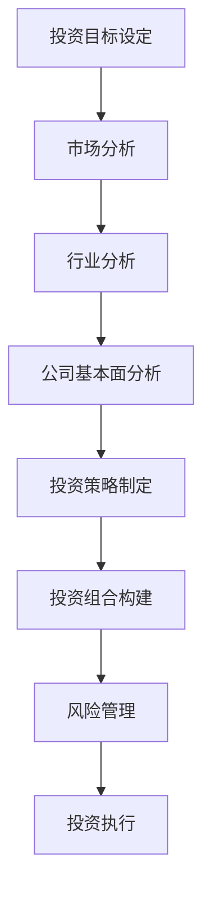
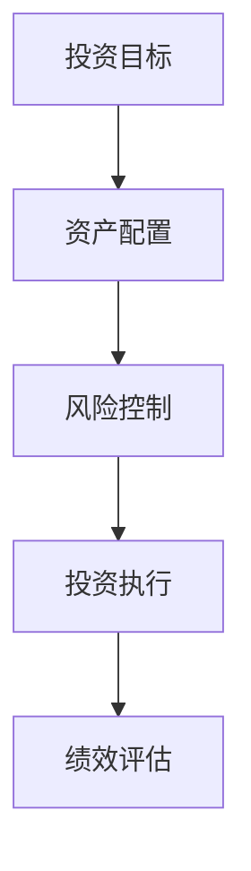

                 

# 彼得林奇的"常识投资"实践指南

> 关键词：彼得林奇，常识投资，价值投资，成长投资，股息投资，风险管理

> 摘要：本文深入探讨了彼得·林奇的“常识投资”理念，结合技术分析、系统架构设计和实际案例，详细讲解了如何通过常识投资实现稳健的投资回报。

---

## 第一部分：彼得林奇与常识投资概述

### 第1章：彼得林奇的背景与投资理念

#### 1.1 彼得林奇的生平简介
彼得·林奇（Peter Lynch）是美国著名的职业基金经理人，被誉为“最伟大的股票投资者之一”。他从1977年到2000年期间管理富达麦哲伦基金（Fidelity Magellan Fund），创造了年化13.4%的超额收益，远超市场平均水平。他的投资理念强调“常识投资”，即利用个人经验和常识进行投资决策。

#### 1.2 常识投资的核心理念
常识投资的核心思想是：通过深入研究和分析，选择那些具有竞争优势、良好管理和增长潜力的公司，同时避免过度复杂的金融工具和市场炒作。

#### 1.3 彼得林奇投资哲学的演变
彼得林奇的投资哲学从早期的“买入并持有”逐渐演变为“价值投资与成长投资相结合”。他强调，投资者应该关注公司的基本面，同时关注市场的周期性变化。

### 第2章：常识投资的基本概念

#### 2.1 常识投资的定义
常识投资是一种以基本面分析为基础，结合市场周期和公司竞争优势的投资方法。它强调长期持有优质资产，避免短期市场波动的干扰。

#### 2.2 常识投资的特点
- 以基本面分析为核心
- 强调长期投资
- 避免过度复杂的金融工具
- 结合市场周期和公司分析

#### 2.3 常识投资与其他投资方法的区别
- **价值投资**：关注低估的股票，注重安全边际。
- **成长投资**：关注高成长性的公司，注重未来的增长潜力。
- **股息投资**：关注高股息收益率的股票，注重稳定的现金流。

---

## 第二部分：常识投资的核心概念与策略

### 第3章：价值投资策略与实践

#### 3.1 价值投资的基本原理
价值投资的核心是寻找市场低估的股票。彼得林奇认为，投资者应该寻找那些市场价格低于内在价值的公司。

#### 3.2 价值投资的适用场景
- 市场处于熊市或调整期
- 特定行业或公司因市场情绪被低估

#### 3.3 彼得林奇的选股标准
- 公司具有竞争优势
- 管理层具备良好的治理能力
- 财务状况稳健，负债率低
- 盈利能力稳定且可预期

#### 3.4 实际案例分析
以可口可乐为例，彼得林奇在20世纪80年代买入该股票，并长期持有，获得了丰厚的回报。他强调，选择股票时应关注公司的品牌、市场地位和长期盈利能力。

---

### 第4章：成长投资策略与实践

#### 4.1 成长投资的基本原理
成长投资的核心是寻找那些收入和利润快速增长的公司，即使它们当前的市场价格高于内在价值。

#### 4.2 成长投资的适用场景
- 市场处于牛市或上升周期
- 高成长行业的新兴公司

#### 4.3 彼得林奇的成长投资策略
- 关注高成长行业的龙头公司
- 选择具有强大研发能力和市场拓展能力的公司
- 保持适度的估值，避免过高溢价

#### 4.4 实际案例分析
以苹果公司为例，彼得林奇在其高速成长阶段买入并持有，受益于公司的技术创新和市场扩展。

---

### 第5章：股息投资策略与实践

#### 5.1 股息投资的基本原理
股息投资强调选择那些能够稳定派发股息的公司，通常这类公司具有较强的盈利能力和稳定的现金流。

#### 5.2 股息投资的适用场景
- 市场处于稳定或成熟期
- 投资者需要稳定的现金流收益

#### 5.3 彼得林奇的股息投资策略
- 选择股息率合理、增长稳定的公司
- 重点关注公用事业、消费必需品等行业
- 长期持有，避免频繁交易

#### 5.4 实际案例分析
以宝洁公司为例，彼得林奇长期持有该公司股票，并享受稳定的股息收益和股价增长。

---

## 第三部分：风险管理与投资组合管理

### 第6章：风险管理策略

#### 6.1 风险识别与评估
- 市场风险：宏观经济波动、政策变化等
- 公司风险：财务状况、管理层变动等
- 投资组合风险：集中度、相关性等

#### 6.2 风险管理的数学模型
- **夏普比率**：衡量投资组合的风险调整后收益。
  $$ \text{夏普比率} = \frac{E[r_p] - r_f}{\sigma_p} $$
- **最大回撤**：衡量投资组合的最大亏损幅度。

#### 6.3 投资组合的风险管理策略
- 分散投资：避免过度集中于单一行业或公司
- 定期再平衡：根据市场变化调整投资比例
- 设置止损点：保护投资本金

---

### 第7章：投资组合管理策略

#### 7.1 投资组合的构建步骤
1. **设定投资目标**：收益目标、风险承受能力
2. **选择投资标的**：根据资产配置和投资策略选择股票、债券等
3. **制定投资计划**：明确买入、持有和卖出的时机
4. **监控与调整**：定期评估投资组合的表现，进行必要的调整

#### 7.2 资产配置的系统架构设计
- **资产分配**：股票、债券、现金的比例
- **行业分布**：分散投资于不同行业
- **地域分布**：全球化配置

---

## 第四部分：实际案例与系统分析

### 第8章：市场分析与行业分析

#### 8.1 市场分析的方法
- **宏观经济分析**：关注GDP、利率、通胀等指标
- **行业分析**：分析行业的生命周期、竞争格局

#### 8.2 行业分析的工具
- **行业PE分析**：比较行业平均市盈率
- **行业趋势分析**：关注行业的未来增长潜力

#### 8.3 实际案例分析
以科技行业为例，分析其当前的市场地位、增长潜力和投资机会。

---

### 第9章：系统分析与架构设计

#### 9.1 投资决策流程图

#### 9.2 投资组合管理架构图

---

## 第五部分：总结与展望

### 第10章：总结与最佳实践

#### 10.1 总结
彼得林奇的“常识投资”理念强调基本面分析、长期投资和风险管理。投资者应结合市场环境和个人能力，灵活运用这些策略。

#### 10.2 最佳实践
- **持续学习**：关注行业动态和公司基本面
- **保持纪律**：坚持投资计划，避免情绪化决策
- **分散投资**：降低投资风险
- **定期调整**：根据市场变化优化投资组合

#### 10.3 注意事项
- 避免过度杠杆
- 避免短期投机
- 避免盲目跟随市场潮流

---

### 第11章：未来展望与拓展阅读

#### 11.1 未来展望
随着市场环境的变化，常识投资的理念和策略也需要不断更新。投资者应关注新兴行业和技术，灵活调整投资策略。

#### 11.2 拓展阅读
- 《彼得林奇的投资哲学》
- 《价值投资实战策略》
- 《风险管理与投资组合优化》

---

通过以上内容，我们可以看到，彼得林奇的“常识投资”是一种注重基本面分析、长期投资和风险管理的投资方法。投资者通过深入研究公司基本面，结合市场周期和行业分析，选择具有竞争优势的公司进行投资，并通过合理的资产配置和风险管理，实现稳健的长期收益。

