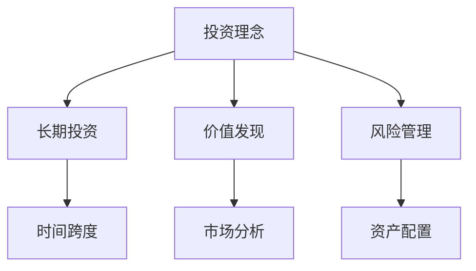
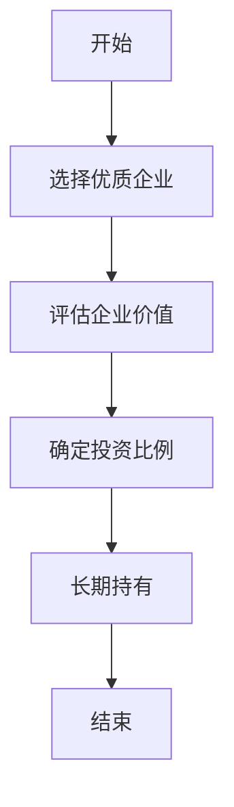
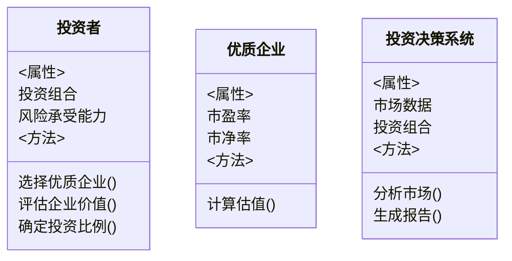
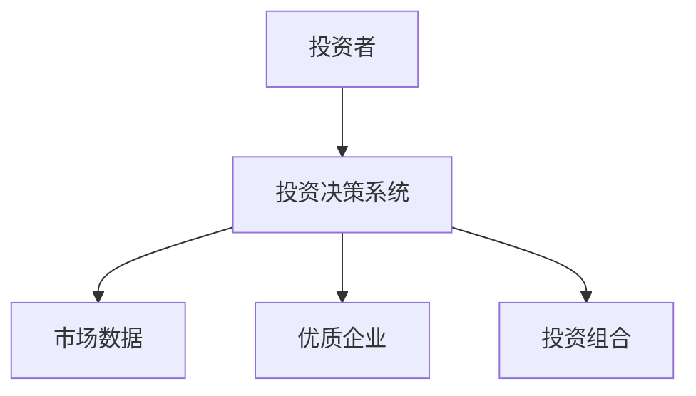

                 


# 彼得林奇的"慢牛"投资哲学

> 关键词：投资哲学，彼得林奇，慢牛，长期投资，价值发现，风险管理

> 摘要：本文深入解析了彼得林奇的"慢牛"投资哲学，从其核心概念、算法原理到系统架构进行了全面分析，结合实际案例和代码实现，为读者提供了一种稳健的投资策略。

---

## 第1章: 投资哲学的背景与起源

### 1.1 投资哲学的定义与核心要素

#### 1.1.1 投资哲学的定义
投资哲学是指投资者在进行投资决策时所遵循的一套系统化的方法论和价值观。它不仅仅是对市场的理解和分析，更是一种长期的、系统的思维方式。

#### 1.1.2 投资哲学的核心要素
- **长期视角**：投资不是短期的交易行为，而是长期的价值积累。
- **价值发现**：寻找具有持续增长潜力的优质企业。
- **风险管理**：控制风险是投资成功的关键。

#### 1.1.3 投资哲学与"慢牛"理念的联系
"慢牛"投资哲学强调的是稳中求进，追求长期稳定的收益，而不是短期的暴利。

---

### 1.2 彼得林奇的背景与投资理念

#### 1.2.1 彼得林奇的生平简介
彼得·林奇是美国著名的基金经理，以其长期的投资业绩而闻名。他的投资理念以稳健著称，注重基本面分析和长期价值。

#### 1.2.2 彼得林奇的投资风格
- **价值投资**：寻找被市场低估的企业。
- **长期持有**：减少频繁交易，降低交易成本。

#### 1.2.3 彼得林奇的"慢牛"理念起源
"慢牛"理念源于对市场的深刻理解：市场的长期上涨是由优质企业的持续增长驱动的。

---

### 1.3 "慢牛"投资哲学的基本概念

#### 1.3.1 什么是"慢牛"投资
"慢牛"投资是指通过长期持有优质企业股票，逐步实现资产增值的投资策略。

#### 1.3.2 "慢牛"与传统投资理念的对比
| 概念 | "慢牛"投资 | 传统投资 |
|------|------------|-----------|
| 时间跨度 | 长期持有 | 短期交易 |
| 风险管理 | 低风险 | 高风险 |
| 收益来源 | 企业增长 | 市场波动 |

#### 1.3.3 "慢牛"投资的边界与外延
- **边界**：只投资于具有持续增长潜力的企业。
- **外延**：通过分散投资降低风险。

---

## 第2章: "慢牛"投资哲学的核心概念与联系

### 2.1 核心概念原理

#### 2.1.1 长期投资与价值发现
长期投资的核心在于发现具有持续增长潜力的企业，而不是短期的价格波动。

#### 2.1.2 风险管理与资产配置
通过分散投资和严格的风险控制，降低投资组合的波动性。

#### 2.1.3 市场波动与投资策略
市场波动是投资的一部分，"慢牛"策略通过长期持有优质资产，抵御短期波动的影响。

---

### 2.2 核心概念属性特征对比表格

| 概念 | 属性 | 特征 |
|------|------|------|
| 长期投资 | 时间跨度 | 长期持有 |
| 价值发现 | 方法论 | 深度分析 |
| 风险管理 | 管理方式 | 分散投资 |

---

### 2.3 ER实体关系图架构



---

## 第3章: "慢牛"投资哲学的算法原理

### 3.1 算法原理讲解



---

### 3.2 算法实现代码示例

```python
def slow_bull_investment():
    # 选择优质企业
    def select_quality_company():
        return "优质企业A"

    # 评估企业价值
    def evaluate_value(company):
        # 计算市盈率
        pe_ratio = (company.market_value / company.net_profit) * 100
        return pe_ratio

    # 确定投资比例
    def determine_investment_ratio(pe_ratio):
        if pe_ratio < 15:
            return 10
        else:
            return 0

    # 长期持有
    def hold_forever(company, ratio):
        return f"投资{company}，比例为{ratio}%"

    # 主函数
    company = select_quality_company()
    pe_ratio = evaluate_value(company)
    investment_ratio = determine_investment_ratio(pe_ratio)
    return hold_forever(company, investment_ratio)

# 示例运行
print(slow_bull_investment())
```

---

### 3.3 数学模型与公式

#### 市盈率公式
$$\text{市盈率} = \frac{\text{股价}}{\text{每股净利润}}$$

#### 市净率公式
$$\text{市净率} = \frac{\text{股价}}{\text{每股净资产}}$$

---

## 第4章: "慢牛"投资哲学的系统分析与架构设计

### 4.1 系统功能设计



---

### 4.2 系统架构设计



---

## 第5章: 项目实战

### 5.1 环境安装

```bash
pip install numpy pandas matplotlib
```

---

### 5.2 核心代码实现

```python
import pandas as pd
import numpy as np

def calculate_pe_ratio(df):
    df['PE'] = df['股价'] / df['每股净利润']
    return df

# 示例数据
data = {
    '企业名称': ['企业A', '企业B', '企业C'],
    '股价': [100, 80, 120],
    '每股净利润': [20, 30, 10]
}
df = pd.DataFrame(data)

# 计算市盈率
df = calculate_pe_ratio(df)
print(df)
```

---

### 5.3 案例分析

#### 案例分析1
- **企业A**：市盈率 = 100 / 20 = 5
- **企业B**：市盈率 = 80 / 30 ≈ 2.67
- **企业C**：市盈率 = 120 / 10 = 12

---

## 第6章: 最佳实践与小结

### 6.1 最佳实践

- **长期持有**：避免频繁交易，降低交易成本。
- **分散投资**：降低投资组合的风险。
- **风险管理**：定期评估投资组合的风险。

### 6.2 小结

"慢牛"投资哲学是一种稳健的投资策略，通过长期持有优质企业股票，实现资产的稳步增长。

### 6.3 注意事项

- **市场波动**：即使在市场下跌时，优质企业的长期价值仍可能保持。
- **风险管理**：定期评估投资组合的风险，及时调整。

---

## 第7章: 拓展阅读

- **《彼得林奇的成功投资》**：深入解析彼得林奇的投资理念。
- **《价值投资入门》**：学习价值投资的基本原理。

---

通过以上分析，我们可以看到"慢牛"投资哲学不仅是一种投资策略，更是一种长期的、系统的思维方式。希望本文能为投资者提供有价值的参考和启发。

