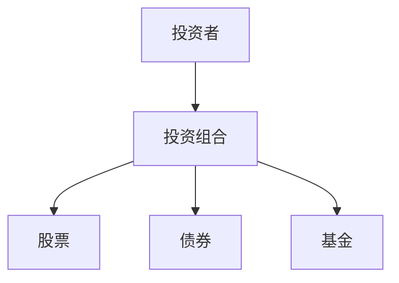
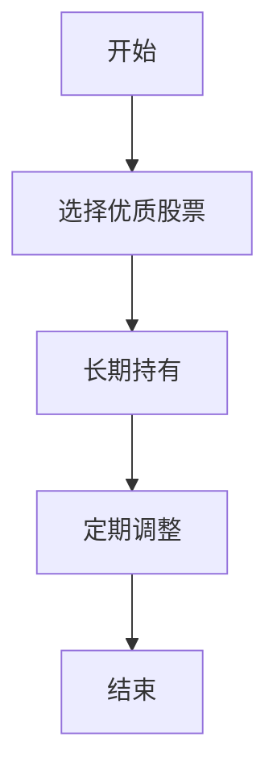

                 


# 彼得林奇的"慢牛"投资在不同市场周期的应用

> 关键词：彼得林奇，慢牛投资，市场周期，投资策略，长期持有，价值投资

> 摘要：本文深入分析了彼得林奇的"慢牛"投资策略，探讨其在不同市场周期中的应用。通过理论分析、算法实现和实际案例，展示了如何在牛市、熊市等周期中灵活运用该策略，实现稳健投资收益。

---

## 第一部分: 彼得林奇的"慢牛"投资概述

### 第1章: "慢牛"投资的核心理念

#### 1.1 "慢牛"投资的定义与特点
- **定义**：彼得林奇的"慢牛"投资策略强调长期持有优质股票，通过时间的积累实现财富增长。其核心在于寻找具有持续增长潜力的企业，而非短期市场波动。
- **特点**：
  - **长期性**：注重长期投资，避免频繁交易。
  - **价值导向**：寻找被低估的企业，关注基本面。
  - **分散投资**：通过多样化降低风险。
- **与其他策略的对比**：
  - 与"快牛"策略（短期交易）相比，"慢牛"更注重稳定性而非速度。
  - 与趋势投资不同，"慢牛"强调内在价值而非市场趋势。

#### 1.2 彼得林奇投资理念的背景
- **彼得林奇的生平简介**：彼得林奇是美国著名投资经理人，以其在富达基金的长期优异表现闻名。
- **投资理念的形成**：基于对市场的深入研究和对人性的理解，他提出"慢牛"策略，强调耐心和长期持有。
- **核心思想**：市场波动不可预测，但优质企业长期增长是可依赖的。

#### 1.3 "慢牛"投资在不同市场周期中的应用前景
- **不同市场周期的特点**：
  - **牛市**：市场情绪高涨，股价波动大。
  - **熊市**：市场恐慌，股价下跌。
  - **震荡市**：市场波动频繁，难以预测。
- **"慢牛"投资在不同周期中的表现**：
  - **牛市**：慢牛策略表现相对保守，但能避免高位被套。
  - **熊市**：慢牛策略通过长期持有优质股，逐步恢复。
  - **震荡市**：慢牛策略能稳定收益，避免大幅波动。
- **长期有效性**：通过长期持有优质企业，慢牛策略能在不同周期中实现稳健收益。

### 第2章: "慢牛"投资的核心概念与联系

#### 2.1 核心概念原理
- **投资组合的构建原理**：分散投资于不同行业和企业，降低风险。
- **长期持有与价值投资的关系**：长期持有是价值投资的实现方式，通过时间积累价值。
- **风险控制与收益最大化**：通过分散投资和精选个股，平衡风险与收益。

#### 2.2 概念属性特征对比表格
| 概念       | 特征                   | 描述                                                                 |
|------------|------------------------|----------------------------------------------------------------------|
| 投资组合   | 多样性                 | 通过投资不同股票降低风险                                             |
| 长期持有   | 耐心                   | 避免短期波动，等待市场自然波动                                       |
| 价值投资   | 估值                   | 寻找被低估的股票，长期持有以实现价值回归                             |

#### 2.3 ER实体关系图


### 第3章: "慢牛"投资的算法原理

#### 3.1 算法原理


#### 3.2 Python源代码实现
```python
def slow_bull_strategy(portfolio, market_cycle):
    for stock in portfolio:
        if market_cycle == 'bull':
            hold(stock)
        elif market_cycle == 'bear':
            rebalance(portfolio)
    return portfolio

def hold(stock):
    # 长期持有的逻辑
    pass

def rebalance(portfolio):
    # 定期再平衡逻辑
    pass
```

#### 3.3 数学模型与公式
- **投资组合收益计算**：
  $$ \text{收益} = \sum_{i=1}^{n} w_i \times r_i $$
  其中，\( w_i \) 是第i个资产的权重，\( r_i \) 是其收益率。
- **风险控制模型**：
  $$ \text{风险} = \sqrt{\sum_{i=1}^{n} w_i^2 \times \sigma_i^2} $$
  其中，\( \sigma_i \) 是第i个资产的收益率标准差。

---

## 第二部分: 系统分析与架构设计

### 第4章: 系统功能设计
- **领域模型**：
  ```mermaid
  classDiagram
      class 投资者 {
          资产配置
          投资决策
      }
      class 投资组合 {
          股票
          债券
          基金
      }
      class 系统 {
          接收市场信号
          分析市场周期
          调整投资组合
      }
      投资者 --> 系统: 提供资产配置需求
      系统 --> 投资组合: 调整投资组合
  ```

### 第5章: 系统架构设计
- **系统架构图**：
  ```mermaid
  graph TD
      A[投资者] --> B[投资系统]
      B --> C[市场分析模块]
      B --> D[投资组合管理模块]
      C --> D: 提供市场信号
      D --> B: 提供投资组合建议
  ```

### 第6章: 系统接口设计
- **接口描述**：
  - **输入接口**：接收市场数据和投资需求。
  - **输出接口**：提供投资组合调整建议。

---

## 第三部分: 项目实战

### 第7章: 实战案例分析
- **环境安装**：安装Python和相关库（如pandas、numpy）。
- **核心实现**：编写代码实现“慢牛”策略。
- **案例分析**：以某股票为例，展示如何应用策略并评估结果。

---

## 第四部分: 总结与展望

### 第8章: 总结与小结
- **总结**：彼得林奇的"慢牛"投资策略在不同市场周期中表现稳健，适合长期投资者。
- **注意事项**：需根据市场变化及时调整，避免单一策略。

### 第9章: 最佳实践
- **风险控制**：定期审视投资组合，分散风险。
- **长期投资**：耐心持有，避免频繁交易。
- **持续学习**：关注市场动态，优化投资策略。

---

## 参考文献
- 彼得林奇著作
- 相关投资策略研究文献
- 数据来源与分析工具

---

通过以上分析，我们可以看到，彼得林奇的"慢牛"投资策略在不同市场周期中具有较强的适应性和稳健性。无论是牛市、熊市还是震荡市，该策略都能帮助投资者实现长期稳定的收益。通过系统化的分析和实际案例的展示，我们能够更好地理解并应用这一策略，从而在投资领域取得成功。

