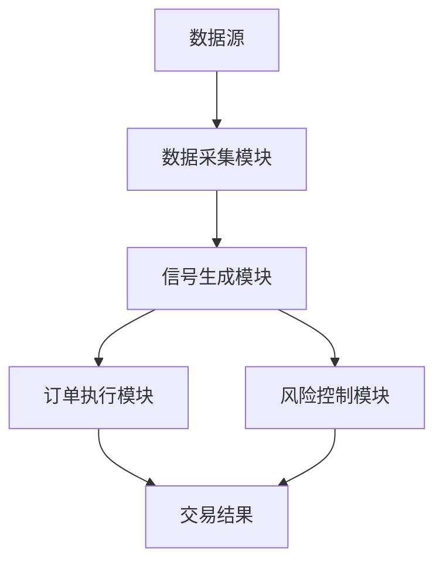

                 


# 彼得林奇的"慢牛"投资在算法交易时代的重要性

> 关键词：算法交易、彼得林奇、慢牛投资、时间序列分析、风险管理、系统架构

> 摘要：本文探讨了彼得林奇的“慢牛”投资理念在现代算法交易环境下的重要性。通过分析传统投资与算法交易的对比，详细阐述了“慢牛”策略的核心概念及其在算法交易中的应用。结合时间序列分析和机器学习模型，本文展示了如何将“慢牛”策略融入算法交易系统，并通过实际案例分析，强调了系统架构设计和风险管理的重要性，为投资者提供了实践指导。

---

## 第一部分：彼得林奇的“慢牛”投资与算法交易时代的背景

### 第1章：投资策略概述

#### 1.1 传统投资与算法交易的对比
- **传统投资**：以彼得林奇为代表的传统投资策略注重长期持有、价值投资和基本面分析。这种策略强调对企业内在价值的深入研究，避免短期市场波动的干扰。
- **算法交易**：基于数学模型和算法，利用高频交易、大数据分析和机器学习等技术，快速捕捉市场机会。算法交易追求短期收益，强调交易的自动化和高效性。
- **对比分析**：虽然传统投资与算法交易在策略和目标上有显著差异，但两者并非完全对立。通过结合“慢牛”策略和算法交易的优势，投资者可以在不同市场环境下灵活应对。

### 第2章：彼得林奇“慢牛”投资策略的核心概念

#### 2.1 “慢牛”投资的定义与特点
- **长期持有**：彼得林奇强调长期投资，认为市场的短期波动不应影响长期价值判断。
- **价值投资**：通过基本面分析，选择具有持续增长潜力的企业进行投资。
- **分散投资**：通过投资于多个行业和企业，降低单一投资的风险。
- **低频交易**：较少的买卖交易次数，避免因短期波动带来的交易成本和税务负担。

#### 2.2 “慢牛”策略与算法交易的结合
- **结合优势**：算法交易可以提供实时数据支持和快速决策，而“慢牛”策略则为算法交易提供长期价值判断的依据。
- **动态调整**：通过算法实时监控市场变化，结合“慢牛”策略的长期目标，动态调整投资组合。

---

## 第二部分：算法交易的基本原理与实现

### 第3章：算法交易的数学模型与公式

#### 3.1 时间序列分析的数学模型
- **ARIMA模型**：自回归积分滑动模型，用于预测未来的市场走势。
  $$ ARIMA(p, d, q) $$
- **GARCH模型**：广义自回归条件异方差模型，用于估计市场波动性。
  $$ GARCH(p, q) $$
- **回归分析**：通过回归模型预测资产价格与相关因素的关系。

#### 3.2 信号生成模型
- **统计套利模型**：利用资产价格差异进行套利。
- **机器学习模型**：使用随机森林、神经网络等算法预测市场走势。
- **多因子模型**：结合多个因子（如市值、收益等）进行综合评估。

### 第4章：系统架构与设计

#### 4.1 系统功能模块划分
- **数据采集模块**：实时获取市场数据，包括价格、成交量等。
- **信号生成模块**：基于算法模型生成买入或卖出信号。
- **订单执行模块**：根据信号执行交易指令。
- **风险控制模块**：监控和管理投资组合的风险。

#### 4.2 系统架构图（Mermaid）



---

## 第三部分：项目实战与最佳实践

### 第5章：项目实战

#### 5.1 环境安装与配置
- **数据源获取**：使用Yahoo Finance获取股票数据。
- **工具安装**：安装Python、Pandas、Matplotlib、Scikit-learn等工具。

#### 5.2 核心代码实现
- **数据预处理**：清洗和转换数据。
- **信号生成**：基于ARIMA模型生成买入信号。
- **订单执行**：根据信号执行交易指令。

#### 5.3 代码解读与分析
```python
# 数据预处理
import pandas as pd
data = pd.read_csv('stock_data.csv')
data = data.sort_values('date')

# ARIMA模型训练
from statsmodels.tsa.arima_model import ARIMA
model = ARIMA(data['price'], order=(5, 1, 0))
model_fit = model.fit()

# 生成信号
signal = []
for i in range(len(data)):
    if i < len(data):
        forecast = model_fit.forecast(steps=1)[0]
        if data['price'].iloc[i] < forecast:
            signal.append(1)  # 买入信号
        else:
            signal.append(0)  # 不操作
    else:
        signal.append(0)
```

### 第6章：最佳实践与注意事项

#### 6.1 “慢牛”策略的优势
- **长期稳定收益**：通过长期持有优质资产，避免短期波动带来的损失。
- **降低交易成本**：减少交易次数，降低佣金和滑点成本。

#### 6.2 算法交易中的注意事项
- **风险管理**：设置止损和止盈点，避免过度杠杆。
- **模型优化**：定期更新模型，避免过拟合和失效。

#### 6.3 风险控制策略
- **分散投资**：通过投资多个资产降低风险。
- **动态调整**：根据市场变化及时调整投资组合。

#### 6.4 拓展阅读
- 推荐书籍：《彼得·林奇的投资艺术》、《算法交易： hype, reality, architecture and implementation》
- 推荐博客：QuantInstinet、Algorithmic Trading

---

## 结语

彼得林奇的“慢牛”投资策略在算法交易时代依然具有重要意义。通过结合传统投资的长期价值判断和算法交易的高效执行，投资者可以在复杂多变的市场环境中实现稳定收益。然而，这需要在系统架构设计、风险管理、模型优化等方面进行深入研究和实践。希望本文能为投资者提供有益的指导和启示。

