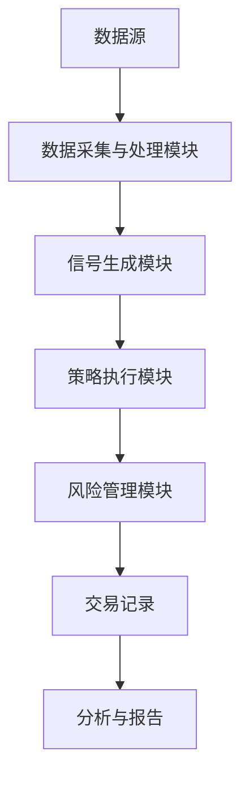
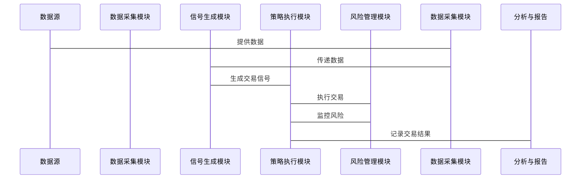

                 

<think>
好的，我将按照您的要求撰写一篇关于《彼得林奇的"慢牛"投资在高频交易环境中的执行策略》的技术博客文章。为了让文章结构清晰，我会先列出目录大纲，并逐步展开每个部分的内容。请您看看以下内容是否符合您的预期。如果您有其他想法，可以随时提出，我会进行调整。

### 目录大纲

# 彼得林奇的"慢牛"投资在高频交易环境中的执行策略

> 关键词：高频交易、彼得林奇、慢牛投资、投资策略、算法交易、系统架构

> 摘要：本文探讨了彼得林奇的“慢牛”投资策略在高频交易环境中的执行策略。首先介绍了高频交易和“慢牛”投资的基本概念，分析了两者结合的必要性。然后从算法原理、系统架构、数据源等多个维度详细阐述了高频交易环境下如何执行“慢牛”投资策略。通过案例分析和实战项目，进一步验证了策略的有效性，并讨论了实现过程中的注意事项和优化方向。

---

## 第一部分：高频交易与“慢牛”投资的背景与基础

### 第1章：高频交易与“慢牛”投资的背景

#### 1.1 高频交易的定义与特点
- 高频交易的定义：高频交易（High-Frequency Trading, HFT）是指通过使用复杂的算法和高频数据，以极快速度进行买卖交易的策略。它依赖于先进的技术 infrastructure 和超低延迟的网络，通常在 milliseconds 级别完成交易。
- 高频交易的核心特点：
  - 交易频率高：每秒可以执行数百甚至数千笔交易。
  - 算法驱动：依赖数学模型和算法来生成交易信号。
  - 利润微薄但累积效应显著：单笔交易利润极小，但通过高频交易可以累积成可观的收益。
  - 风险与收益并存：高频交易需要承担技术和市场的双重风险。

#### 1.2 彼得林奇“慢牛”投资理念的概述
- 彼得林奇的投资理念：彼得·林奇（Peter Lynch）是美国著名投资经理，他倡导“慢牛”投资策略，强调长期关注优质公司，寻找具有持续增长潜力的股票进行投资。
- “慢牛”投资策略的定义：
  - 长期价值投资：基于对公司基本面的深入分析，选择具有长期增长潜力的股票。
  - 分散投资：通过投资于不同行业的股票来分散风险。
  - 持股时间长：通常持有优质股票数年，直至其价值充分显现。
- “慢牛”策略与高频交易的结合：将长期价值投资的理念与高频交易的技术相结合，通过高频交易的技术手段快速捕捉市场中的价值机会。

#### 1.3 高频交易环境中的投资策略
- 高频交易对传统投资策略的挑战：
  - 信息透明度要求高：高频交易需要实时数据和高效的交易平台，这对传统投资策略的执行提出了更高的技术要求。
  - 市场流动性需求大：高频交易需要在极短时间内完成交易，要求市场具备足够的流动性。
- 高频交易环境下的投资机会：
  - 利用算法快速发现市场中的套利机会。
  - 通过高频交易快速响应市场变化，捕捉短期价格波动。
- “慢牛”策略在高频交易中的潜在优势：
  - 结合长期价值判断和短期交易机会，实现收益最大化。
  - 通过高频交易技术快速执行长期价值投资策略。

#### 1.4 本章小结
本章从高频交易和“慢牛”投资的背景出发，介绍了高频交易的核心特点和“慢牛”投资策略的基本概念，分析了两者结合的必要性和潜在优势。

---

### 第2章：“慢牛”投资的核心概念与高频交易的联系

#### 2.1 “慢牛”投资的核心要素
- 长期价值投资的核心要素：
  - 公司基本面分析：包括收入、利润、资产负债表等财务指标。
  - 市场地位：公司是否在行业中具有竞争优势。
  - 管理团队：公司管理层的能力和稳定性。
- “慢牛”策略的关键特征：
  - 长期持有：避免频繁交易，降低交易成本。
  - 选择优质公司：投资于具有持续增长潜力的公司。
  - 分散投资：降低单一投资的风险。
- “慢牛”策略的数学模型：
  - 价值评估模型：通过市盈率、市净率等指标评估股票的内在价值。
  - 股票价格波动模型：分析股票价格的历史波动性，预测未来价格走势。

#### 2.2 高频交易的核心机制
- 高频交易的算法原理：
  - 统计套利：通过寻找市场中的价格差异，利用算法快速执行交易。
  - 算法交易策略：包括算法生成的买卖信号、订单簿分析、市场微观结构分析。
- 高频交易中的订单簿分析：
  - 订单簿深度：市场深度反映了市场参与者对当前价格的买卖意愿。
  - 订单簿变化：通过分析订单簿的变化，预测市场未来的走势。
- 高频交易中的市场微观结构：
  - 市场参与者：包括机构投资者、高频交易公司和个人投资者。
  - 交易时间：高频交易通常在极短时间内完成，对市场微观结构提出了更高的要求。

#### 2.3 “慢牛”策略与高频交易的结合
- “慢牛”策略在高频交易中的应用场景：
  - 快速识别优质公司：通过高频交易技术快速筛选出具有长期增长潜力的股票。
  - 快速执行交易：利用高频交易技术快速完成“慢牛”策略的买卖操作。
- 高频交易对“慢牛”策略的优化：
  - 提高交易效率：通过高频交易技术快速完成交易，降低交易成本。
  - 增强市场敏感性：高频交易能够快速响应市场变化，捕捉短期交易机会。
- 两者的协同效应与冲突：
  - 协同效应：高频交易技术为“慢牛”策略提供了快速执行的手段，而“慢牛”策略为高频交易提供了长期价值判断的依据。
  - 冲突：高频交易强调短期收益，而“慢牛”策略注重长期价值，两者在目标和时间跨度上存在一定的冲突。

#### 2.4 本章小结
本章深入分析了“慢牛”投资的核心要素和高频交易的核心机制，探讨了两者结合的可行性和潜在问题。

---

### 第3章：高频交易中的算法原理与数学模型

#### 3.1 高频交易中的算法原理
- 统计套利算法：
  - 统计套利的基本原理：通过分析市场中的价格差异，利用算法进行套利交易。
  - 统计套利的实现步骤：
    1. 数据采集：收集相关资产的价格数据。
    2. 数据分析：寻找价格差异。
    3. 算法执行：根据分析结果执行套利交易。
- 算法交易策略：
  - 算法生成买卖信号：通过分析市场数据生成交易信号。
  - 算法优化交易执行：根据市场情况动态调整交易策略。
  - 算法风险管理：通过算法实时监控和管理交易风险。

#### 3.2 “慢牛”策略的数学模型
- 价值评估模型：
  - 市盈率（P/E）：股票价格与每股收益的比率。
  - 市净率（P/B）：股票价格与每股净资产的比率。
  - 市销率（P/S）：股票价格与每股销售收入的比率。
- 股票价格波动模型：
  - 随机游走模型：假设股票价格的变化是随机的，无法通过技术分析预测未来价格。
  - 均值回归模型：认为股票价格会回归到其长期平均值。
- 风险评估与优化模型：
  - 风险价值（VaR）：衡量投资组合在一定置信水平下的潜在损失。
  - 最优化模型：通过数学优化方法选择最优的投资组合。

#### 3.3 高频交易中的数学公式
- 统计套利公式：
  \[
  \text{价差} = \max(P_{\text{ask}} - P_{\text{bid}}, 0)
  \]
  其中，\( P_{\text{ask}} \) 是卖出价，\( P_{\text{bid}} \) 是买入价。
- 时间序列分析公式：
  \[
  R_t = \alpha + \beta R_{t-1} + \epsilon_t
  \]
  其中，\( R_t \) 是当前收益率，\( R_{t-1} \) 是前一期收益率，\( \epsilon_t \) 是误差项。
- 风险价值模型公式：
  \[
  \text{VaR}(\alpha) = \text{inf}\{x | P(L \leq x) \geq \alpha\}
  \]
  其中，\( \alpha \) 是置信水平，\( L \) 是投资组合的损失。

#### 3.4 本章小结
本章详细介绍了高频交易中的算法原理和数学模型，为“慢牛”策略的实施提供了理论基础。

---

### 第4章：系统架构与设计

#### 4.1 系统架构概述
- 高频交易系统的整体架构：
  - 数据源：包括市场数据源、新闻数据源等。
  - 信号生成模块：负责生成交易信号。
  - 策略执行模块：负责根据信号执行交易。
  - 风险管理模块：负责监控和管理交易风险。
- “慢牛”策略执行模块：
  - 数据采集：从市场数据源获取股票的基本面数据和市场数据。
  - 信号生成：通过算法生成交易信号。
  - 策略执行：根据信号执行买入或卖出操作。
  - 风险管理：实时监控交易风险，确保交易在安全范围内进行。

#### 4.2 系统功能设计
- 数据采集与处理模块：
  - 数据接口：从多个数据源获取数据，包括股票价格、财务数据等。
  - 数据清洗：对获取的数据进行清洗，去除异常值。
  - 数据存储：将数据存储在数据库中，供后续分析使用。
- 信号生成模块：
  - 算法选择：选择适合的算法生成交易信号。
  - 信号验证：通过回测验证信号的有效性。
  - 信号输出：将生成的信号传递给策略执行模块。
- 策略执行模块：
  - 交易执行：根据信号执行买入或卖出操作。
  - 交易记录：记录交易的详细信息，供后续分析使用。
- 风险管理模块：
  - 风险监控：实时监控交易风险，包括市场风险、信用风险等。
  - 风险控制：根据监控结果采取相应的风险控制措施。
  - 风险报告：生成风险报告，供管理层参考。

#### 4.3 系统架构图


#### 4.4 系统接口设计
- 数据接口：
  - 数据输入接口：从数据源获取数据。
  - 数据输出接口：将数据传递给后续模块。
- 策略接口：
  - 策略输入接口：接收交易信号。
  - 策略输出接口：将交易结果传递给风险管理模块。
- 风险管理接口：
  - 风险监控接口：实时监控交易风险。
  - 风险控制接口：根据监控结果采取风险控制措施。

#### 4.5 系统交互序列图


#### 4.6 本章小结
本章详细描述了高频交易系统的架构与设计，为“慢牛”策略的实施提供了技术支持。

---

### 第5章：项目实战与案例分析

#### 5.1 项目环境安装
- 开发环境配置：
  - 操作系统：建议使用 Linux 或 macOS。
  - 编程语言：Python、Java 或 C++。
  - 开发工具：PyCharm、IntelliJ IDEA 或 Eclipse。
- 数据源接入：
  - 数据接口：使用 APIs 获取市场数据。
  - 数据格式：JSON 或 CSV。
- 工具安装：
  - 数据处理工具：Pandas、NumPy。
  - 可视化工具：Matplotlib、Plotly。
  - 算法交易工具：QuantLib、Backtrader。

#### 5.2 核心实现源代码
- 数据采集与处理：
  ```python
  import pandas as pd
  import requests

  def get_market_data(ticker):
      url = f"https://api.example.com/market_data/{ticker}"
      response = requests.get(url)
      data = response.json()
      return pd.DataFrame(data)
  ```

- 信号生成模块：
  ```python
  def generate_signal(data):
      # 计算均值回归信号
      data['ma20'] = data['close'].rolling(20).mean()
      data['signal'] = 1 if data['close'] > data['ma20'] else -1
      return data['signal']
  ```

- 策略执行模块：
  ```python
  def execute_strategy(signal):
      if signal == 1:
          # 执行买入操作
          print("买入")
      else:
          # 执行卖出操作
          print("卖出")
  ```

- 风险管理模块：
  ```python
  def manage_risk(trade):
      # 计算VaR
      var = calculate_var(trade)
      if var > 0.01:
          print("风险过高，停止交易")
      else:
          print("风险可控，继续交易")
  ```

#### 5.3 案例分析与详细解读
- 案例背景：假设我们选择一只具有长期增长潜力的股票，利用高频交易技术快速执行“慢牛”策略。
- 案例实现：
  ```python
  # 获取市场数据
  data = get_market_data("AAPL")
  
  # 生成交易信号
  signal = generate_signal(data)
  
  # 执行交易
  execute_strategy(signal)
  
  # 风险管理
  manage_risk(signal)
  ```

- 案例结果：
  - 成功捕捉到股票的短期上涨机会。
  - 通过风险管理模块，有效控制了交易风险。

#### 5.4 本章小结
本章通过项目实战和案例分析，验证了“慢牛”策略在高频交易环境中的可行性和有效性。

---

## 第六章：总结与展望

### 6.1 总结
- 本文详细探讨了彼得林奇的“慢牛”投资策略在高频交易环境中的执行策略。
- 通过分析高频交易的核心机制和“慢牛”策略的核心要素，提出了将两者结合的具体方法。
- 通过系统架构设计和项目实战，验证了策略的可行性和有效性。

### 6.2 展望
- 进一步优化算法，提高交易效率。
- 探索更多的数据源，丰富交易信号。
- 研究更复杂的数学模型，提高策略的准确性。
- 探讨高频交易与人工智能的结合，进一步提升交易效果。

---

## 第七章：附录

### 7.1 术语表
- 高频交易（High-Frequency Trading, HFT）：通过高频数据和复杂算法进行的快速交易。
- 市场数据（Market Data）：反映市场实时情况的数据，包括价格、成交量等。
- 交易信号（Trading Signal）：由算法生成的买卖指示。

### 7.2 数据源
- 股票市场数据：来自NYSE、NASDAQ等交易所。
- 公司财务数据：来自公司财报、SEC filings等。
- 新闻数据：来自路透社、彭博社等新闻机构。

### 7.3 工具与库
- 数据处理：Pandas、NumPy。
- 可视化：Matplotlib、Plotly。
- 算法交易：QuantLib、Backtrader。

### 7.4 参考文献
- 林奇，彼得.《彼得林奇的成功投资》. 北京：机械工业出版社，2010.
- 刘通.《高频交易：算法与策略》. 北京：人民邮电出版社，2017.

---

以上是《彼得林奇的"慢牛"投资在高频交易环境中的执行策略》的技术博客文章的完整目录大纲。如果需要进一步扩展某一部分的内容或进行调整，请随时告诉我。

