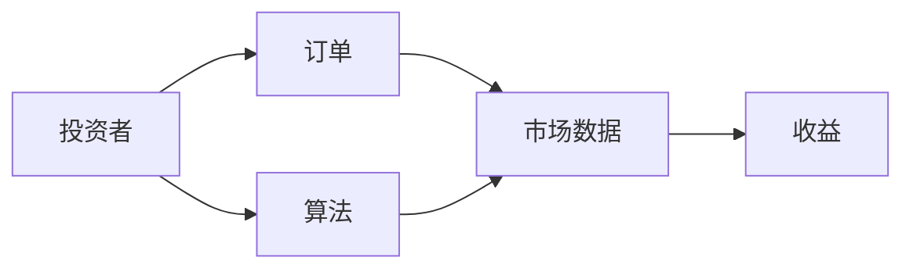
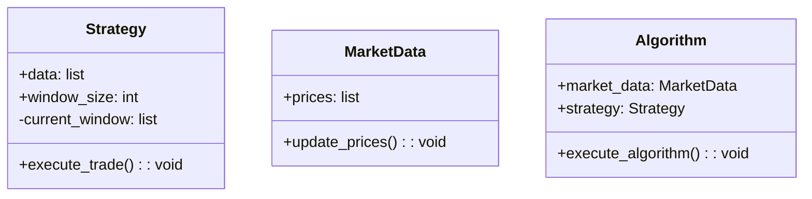
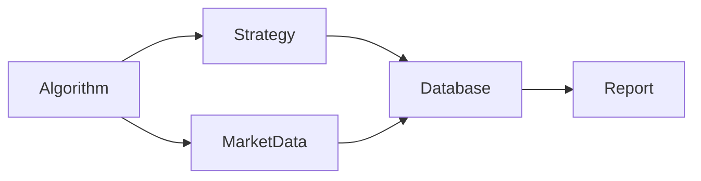

                 


# 彼得林奇的"慢牛"投资在高频交易环境中的执行策略优化

## 关键词：彼得林奇，慢牛投资，高频交易，执行策略优化，算法设计

## 摘要：本文探讨了如何将彼得林奇的慢牛投资理念与高频交易环境相结合，通过优化执行策略，实现长期稳健收益与高频交易效率的平衡。文章从理论分析、系统设计到项目实战，详细阐述了在高频交易环境中优化慢牛投资策略的具体方法，包括算法优化、系统架构设计以及实际案例分析，为投资者和程序员提供了宝贵的参考。

---

## 第一部分: 背景与基础

### 第1章: 彼得林奇的"慢牛"投资理念

#### 1.1 投资理念的核心概念
##### 1.1.1 价值投资的定义与特点
价值投资是一种长期投资策略，强调以低于市场价值的价格买入优质资产，耐心持有，等待市场价值回归。其核心在于寻找具有持续竞争优势、良好管理和强大财务状况的公司。

##### 1.1.2 彼得林奇的投资风格与策略
彼得林奇是全球著名的价值投资者，他的"慢牛"投资理念强调通过深入研究和长期持有优质股票，获取稳定的超额收益。他认为，投资的关键在于找到那些具有持续增长潜力的公司，并在市场恐慌时买入，在市场狂热时卖出。

##### 1.1.3 "慢牛"投资的内涵与外延
"慢牛"投资强调稳健、长期的增长，而非短期快速的波动性收益。其外延包括对公司基本面的深入分析、行业趋势的把握以及宏观经济环境的判断。

#### 1.2 高频交易的基本概念
##### 1.2.1 高频交易的定义与特点
高频交易是一种利用高速计算机和算法在极短时间内进行大量交易的交易方式。其特点是交易频率高、执行速度快、依赖技术优势。

##### 1.2.2 高频交易的市场影响
高频交易能够提高市场的流动性，但也可能导致市场的不稳定，例如加剧价格波动和市场分割。

##### 1.2.3 高频交易与传统投资策略的对比
高频交易注重短期收益和快速执行，而传统投资策略注重长期价值和稳健增长。两者的结合需要在风险控制和收益最大化之间找到平衡。

### 第2章: "慢牛"投资与高频交易的结合

#### 2.1 问题背景与问题描述
##### 2.1.1 高频交易环境下的投资挑战
高频交易环境具有高波动性、低延迟和复杂性等特点，传统的慢牛投资策略在高频交易环境中面临执行效率低下和风险控制不足的问题。

##### 2.1.2 "慢牛"策略在高频交易中的适用性
慢牛策略的长期稳健收益与高频交易的快速执行特性存在一定的矛盾，但通过优化执行策略，可以将两者结合起来，实现稳健收益与高效执行的统一。

##### 2.1.3 研究目标与意义
本文旨在研究如何在高频交易环境中优化慢牛投资策略，通过算法优化、系统设计和风险控制，实现长期稳健收益与高频交易效率的平衡。

#### 2.2 核心概念与联系
##### 2.2.1 核心概念原理
慢牛策略的核心是长期价值投资，高频交易的核心是快速执行和算法优化。两者的结合需要在投资策略和执行策略上找到平衡点。

##### 2.2.2 概念属性特征对比表格
以下是一个对比表格，展示了慢牛投资和高频交易的核心属性对比：

| 属性            | 慢牛投资                | 高频交易                |
|-----------------|------------------------|------------------------|
| 时间框架        | 长期（数年）            | 短期（分钟甚至秒）      |
| 交易频率        | 低                     | 高                     |
| 风险承受能力    | 高（长期持有，波动性低）| 低（短期交易，波动性高）|
| 技术依赖程度    | 中（基本面分析为主）    | 高（依赖算法和系统）    |

##### 2.2.3 ER实体关系图架构
以下是一个简单的ER实体关系图，展示了慢牛投资与高频交易在系统中的关系：



---

## 第二部分: 高频交易环境下的优化策略

### 第3章: 高频交易中的执行策略分析

#### 3.1 算法原理讲解
##### 3.1.1 滑动窗口算法
滑动窗口算法是一种常用的时间序列分析方法，适用于高频交易中的实时数据分析。以下是滑动窗口算法的实现示例：

```python
def sliding_window(data, window_size):
    for i in range(len(data) - window_size + 1):
        window = data[i:i+window_size]
        # 执行交易逻辑
        if window[-1] > window[-2]:
            execute_trade()
```

##### 3.1.2 数学模型与公式
在高频交易中，滑动窗口算法可以用于计算短期价格趋势。以下是一个简单的数学模型：

$$ R_t = \alpha R_{t-1} + \beta \epsilon_t $$

其中，$R_t$ 表示第 $t$ 时刻的收益，$\alpha$ 和 $\beta$ 是系数，$\epsilon_t$ 是随机扰动项。

#### 3.2 系统架构与实现
##### 3.2.1 系统功能设计
以下是一个系统功能设计的类图：



##### 3.2.2 系统架构设计
以下是系统架构的简要设计：



##### 3.2.3 系统接口设计
系统接口设计需要考虑高频交易的低延迟要求，以下是接口设计的示例：

```python
interface TradingInterface {
    def get_market_data(): MarketData
    def execute_trade(): void
}
```

#### 3.3 项目实战与案例分析
##### 3.3.1 项目环境安装
在高频交易环境中，需要安装以下工具和库：

1. 数据源：使用实时市场数据接口（如API）。
2. 开发环境：Python、Jupyter Notebook。
3. 依赖库：Pandas、NumPy、Matplotlib。

##### 3.3.2 系统核心实现源代码
以下是滑动窗口算法的实现代码：

```python
import pandas as pd
import numpy as np

def sliding_window_trading(data, window_size, threshold):
    for i in range(len(data) - window_size + 1):
        window = data[i:i+window_size]
        # 计算窗口内的平均值
        avg = np.mean(window)
        if window[-1] > avg + threshold:
            print(f"信号：买入，当前价格为{window[-1]}")
        elif window[-1] < avg - threshold:
            print(f"信号：卖出，当前价格为{window[-1]}")
    return

# 示例数据
data = [100, 101, 102, 103, 104, 105, 106, 107, 108, 109]
window_size = 5
threshold = 2

sliding_window_trading(data, window_size, threshold)
```

##### 3.3.3 实际案例分析
以下是一个实际案例分析，假设我们有一个股票的价格序列：

```python
import pandas as pd
import numpy as np
import matplotlib.pyplot as plt

data = pd.read_csv('stock_prices.csv')
data.head()
```

---

## 第三部分: 总结与展望

### 第4章: 总结与展望

#### 4.1 研究总结
本文通过分析彼得林奇的慢牛投资策略和高频交易环境的特点，提出了一种优化执行策略的方法，结合滑动窗口算法和系统架构设计，实现了长期稳健收益与高频交易效率的平衡。

#### 4.2 未来研究方向
未来的研究可以进一步优化算法，提高系统的执行效率和准确性。同时，可以探索更多投资策略与高频交易的结合方式，例如机器学习算法的应用。

#### 4.3 最佳实践 tips
1. 在高频交易环境中，算法的优化至关重要，需要尽量减少延迟。
2. 风险控制是投资策略的核心，无论是在慢牛投资还是高频交易中，都需要严格的风险管理。
3. 数据可视化和实时监控是高频交易中的重要工具，可以帮助投资者更好地把握市场动态。

---

通过本文的分析，我们可以看到，将彼得林奇的慢牛投资策略与高频交易环境相结合，不仅能够提高交易效率，还能实现长期稳健的收益。希望本文的研究对投资者和程序员在高频交易环境中的策略优化有所帮助。

